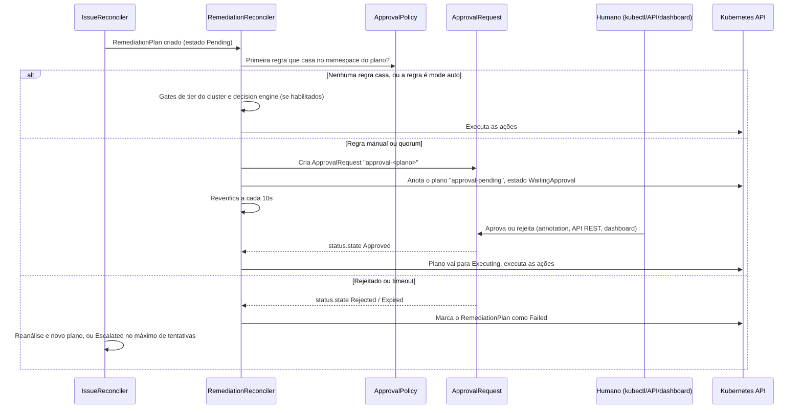
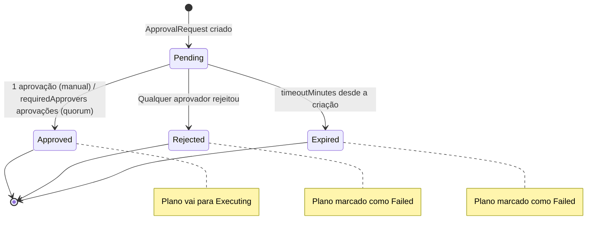
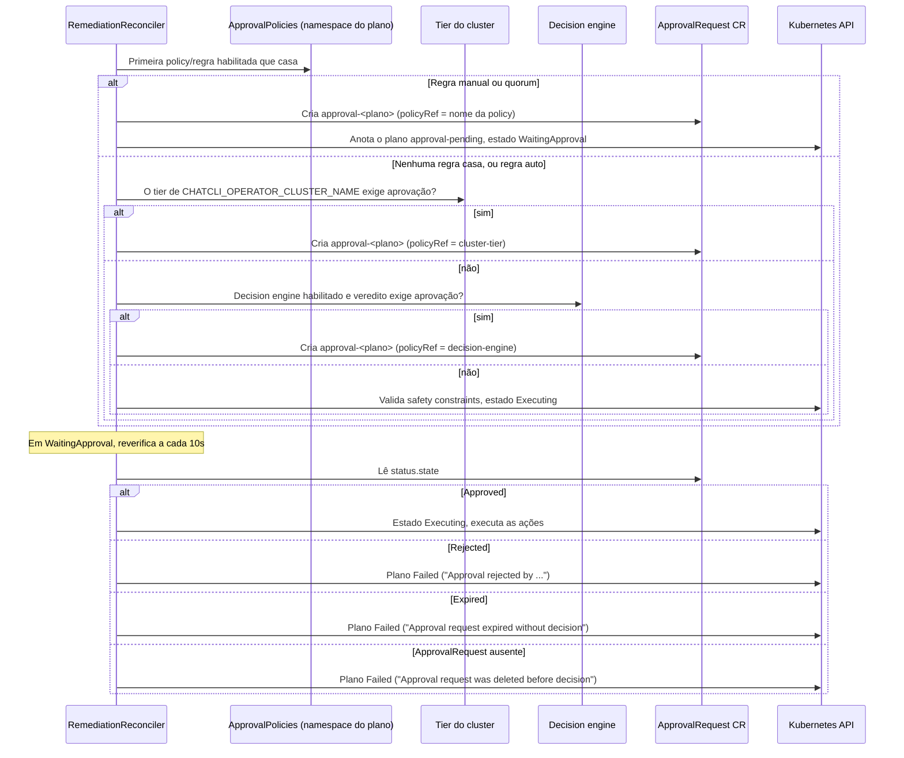

Em ambientes de produção, nem toda remediação automática deve ser executada sem supervisão humana. O **Approval Workflow** do ChatCLI permite definir políticas que controlam quais planos de remediação precisam esperar por um humano, quantas aprovações eles exigem e em quais janelas de mudança (change windows) uma decisão pode ser aplicada.


## Por que Approval Workflows são Essenciais

<CardGroup cols={3}>
  <Card title="Segurança" icon="shield">
    Previne que remediação automática cause impacto maior que o problema original (ex: rollback acidental em produção)
  </Card>
  <Card title="Compliance" icon="file-certificate">
    Cada requisição, decisão e expiração fica registrada no CR `ApprovalRequest` e como `AuditEvent`.
  </Card>
  <Card title="Confiança" icon="handshake">
    Equipes adotam AIOps mais facilmente quando sabem que ações críticas requerem aprovação humana.
  </Card>
</CardGroup>

Sem approval workflows, uma IA que detecta um falso positivo pode executar um rollback desnecessário, afetando um deployment saudável. Com approval policies, planos de alto impacto ficam parados até que um humano valide a análise e o blast radius.


## Visão Geral do Fluxo



<Note>
O operator **não** envia notificação quando um ApprovalRequest é criado. As NotificationPolicies são disparadas por mudanças de estado do Issue, não por requisições de aprovação. Acompanhe com `kubectl get approvalrequests -A`, pelo dashboard web, ou crie alertas com as métricas abaixo para saber que há uma requisição esperando.
</Note>


## ApprovalPolicy CRD

A `ApprovalPolicy` (short name `ap`) define **regras** que decidem quais planos de remediação precisam de aprovação e como essa aprovação é obtida. Ela só vale para planos **do próprio namespace**: o operator lista as ApprovalPolicies habilitadas no namespace do RemediationPlan (o namespace do Issue), nunca entre namespaces.

```yaml
apiVersion: platform.chatcli.io/v1alpha1
kind: ApprovalPolicy
metadata:
  name: production-approval-policy
  namespace: production
spec:
  enabled: true
  rules:
    - name: quorum-critical-production
      match:
        severities: [critical, high]
        resourceKinds: [Deployment, StatefulSet]
      mode: quorum
      requiredApprovers: 2
      timeoutMinutes: 15

    - name: manual-approve-rollback
      match:
        actionTypes: [RollbackDeployment, HelmRollback]
      mode: manual
      timeoutMinutes: 30
      changeWindow:
        timezone: "America/Sao_Paulo"
        allowedDays: [Monday, Tuesday, Wednesday, Thursday, Friday]
        startHour: 9
        endHour: 18

    - name: restarts-without-approval
      match:
        severities: [low, medium]
        actionTypes: [RestartDeployment, ScaleDeployment]
      mode: auto
```

### Campos do Spec

| Campo | Tipo | Obrigatório | Descrição |
|-------|------|:-----------:|-----------|
| `rules` | []ApprovalRule | **Sim** | Avaliadas de cima para baixo; vale a primeira regra que casar |
| `enabled` | bool | Não (padrão `true`) | Policies desabilitadas são ignoradas |
| `defaultMode` | string | Não (padrão `manual`) | Aparece no `kubectl get ap`, mas **não é lido pelo operator**: quando nenhuma regra casa, a policy não segura o plano |

#### ApprovalRule

Cada regra define um par **match + mode** com configurações específicas.

| Campo | Tipo | Obrigatório | Descrição |
|-------|------|:-----------:|-----------|
| `name` | string | **Sim** | Nome da regra, copiado para a requisição em `spec.ruleName` |
| `match` | ApprovalMatch | **Sim** | Critérios de matching |
| `mode` | string | **Sim** (padrão `manual`) | `auto`, `manual`, `quorum` |
| `requiredApprovers` | int | Não (padrão `1`) | Aprovações necessárias no modo `quorum` (ignorado no `manual`) |
| `timeoutMinutes` | int | Não (padrão `30`) | Minutos desde a criação da requisição até ela expirar |
| `changeWindow` | ChangeWindowSpec | Não | Quando uma decisão sobre as requisições desta regra pode ser aplicada |
| `autoApproveConditions` | AutoApproveConditions | Não | Veja a aba `auto` abaixo: hoje não tem efeito em planos criados pelo operator |

#### ApprovalMatch

Define quais remediações são cobertas por esta regra. A lógica é **AND** entre campos e **OR** dentro de cada campo. Campo vazio casa com tudo, então uma regra com `match` vazio casa com qualquer plano.

| Campo | Tipo | Comparado com |
|-------|------|---------------|
| `severities` | []string | `spec.severity` do Issue: `critical`, `high`, `medium`, `low` |
| `actionTypes` | []string | Casa se **qualquer** ação do plano tiver um desses tipos. Qualquer valor do enum de ações do RemediationPlan, ex.: `ScaleDeployment`, `RestartDeployment`, `RollbackDeployment`, `PatchConfig`, `AdjustResources`, `DeletePod`, `HelmRollback`, `ArgoSyncApp`, `DrainNode`, `ApplyManifest`, `RestartStatefulSet`, `RetryJob`, `SuspendCronJob`, `Custom` (lista completa na página do [K8s Operator](/pt/features/k8s-operator)) |
| `namespaces` | []string | `spec.resource.namespace` do Issue |
| `resourceKinds` | []string | `spec.resource.kind` do Issue, sem diferenciar maiúsculas (ex.: `Deployment`, `StatefulSet`, `DaemonSet`, `Job`, `CronJob`) |

<Note>
Não existe combinação do tipo "a regra mais restritiva prevalece". Dentro de uma policy vale a **primeira regra que casar** e as demais são ignoradas, então coloque as regras mais rígidas primeiro. Se houver várias ApprovalPolicies habilitadas no mesmo namespace, a ordem em que elas são avaliadas não é garantida; mantenha uma policy por namespace, ou faça os matches não se sobreporem.
</Note>

#### Três Modos de Aprovação

<Tabs>
  <Tab title="auto">
    **Auto**: uma regra `auto` que casa significa "este plano não precisa de aprovação desta policy". Nenhum ApprovalRequest é criado e o plano segue (o tier do cluster e o decision engine, quando habilitados, ainda o avaliam).

    Como vale a primeira regra que casar, uma regra `auto` também encobre todas as regras abaixo dela para os planos que ela casa.

    O CRD aceita `autoApproveConditions`:

    | Condição | Tipo | Descrição |
    |----------|------|-----------|
    | `minConfidence` | float64 | Confiança mínima do AIInsight (0.0-1.0) |
    | `maxSeverity` | string | Severidade máxima |
    | `historicalSuccessRate` | float64 | Taxa mínima de sucesso dos mesmos tipos de ação neste namespace (0.0-1.0) |

    <Warning>
    As `autoApproveConditions` só são avaliadas pelo controller de aprovação sobre um ApprovalRequest já existente cuja regra seja `auto`, e o operator nunca cria uma requisição assim: a regra `auto` libera o plano antes de existir qualquer requisição. Na prática, hoje as condições **não têm efeito**; uma regra `auto` sempre deixa os planos que casam rodarem. Quando chegam a ser avaliadas, `maxSeverity` também não é respeitado (a comparação nunca enxerga a severidade do Issue). Use regras `manual`/`quorum`, ou o [decision engine](/pt/features/aiops/decision-engine), quando precisar de um gate baseado em confiança.
    </Warning>
  </Tab>
  <Tab title="manual">
    **Manual**: o plano espera até que **um** humano aprove ou rejeite, ou até a requisição expirar. `requiredApprovers` é ignorado neste modo: a primeira aprovação já aprova a requisição.

    ```yaml
    mode: manual
    timeoutMinutes: 30
    ```
  </Tab>
  <Tab title="quorum">
    **Quorum**: exige `requiredApprovers` aprovações. Uma única rejeição já rejeita a requisição.

    ```yaml
    mode: quorum
    requiredApprovers: 2
    timeoutMinutes: 15
    ```

    Neste exemplo, são necessárias duas decisões de aprovação para o plano rodar.

    <Warning>
    Aprovadores não são deduplicados: toda decisão `approved` conta, mesmo duas com o mesmo nome. O nome na annotation é texto livre e não é conferido com o usuário do Kubernetes que a escreveu, então o controle real é quem tem RBAC para atualizar `approvalrequests`. Além disso, uma única aprovação pela API REST ou pelo dashboard já aprova uma requisição de quorum (veja [Via REST API](#via-rest-api)).
    </Warning>
  </Tab>
</Tabs>

#### ChangeWindowSpec

A change window é definida **por regra** (`rules[].changeWindow`), não no nível da policy. Ela só afeta as requisições geradas por aquela regra.

| Campo | Tipo | Obrigatório | Descrição |
|-------|------|:-----------:|-----------|
| `timezone` | string | Não (padrão `UTC`) | Timezone IANA (ex: `America/Sao_Paulo`) |
| `allowedDays` | []string | Não (padrão segunda a sexta) | Nomes dos dias em inglês, sem diferenciar maiúsculas: `Monday` ... `Sunday` |
| `startHour` | int | **Sim** | Hora de início da janela (0-23, inclusiva) |
| `endHour` | int | **Sim** | Hora de fim da janela (0-23, **exclusiva**). Se `startHour > endHour`, a janela atravessa a meia-noite (ex.: 22 às 6) |

Não existem datas de blackout nem exceção para severidade crítica.

<Warning>
Fora da janela, o controller de aprovação não processa a requisição: as annotations de aprovar/rejeitar ficam onde estão e são aplicadas quando a janela abrir (ele reverifica a cada minuto). O **timeout continua correndo** e é verificado antes da janela, então uma requisição cujo timeout vence fora da janela expira e o plano falha. Dimensione o `timeoutMinutes` para cobrir o intervalo até a próxima janela. Um `timezone` inválido é registrado no log e a janela é ignorada. Uma decisão tomada pela API REST ou pelo dashboard não é segurada pela janela.
</Warning>


## ApprovalRequest CRD

O `ApprovalRequest` (short name `ar`) é criado pelo `RemediationReconciler` quando um plano precisa esperar. O nome é sempre `approval-<nome-do-plano>`, ele fica no namespace do plano e pertence ao RemediationPlan (apagar o plano apaga a requisição).

```yaml
apiVersion: platform.chatcli.io/v1alpha1
kind: ApprovalRequest
metadata:
  name: approval-api-gateway-oom-kill-1771276354-plan-1
  namespace: production
  labels:
    platform.chatcli.io/issue: api-gateway-oom-kill-1771276354
    platform.chatcli.io/remediation-plan: api-gateway-oom-kill-1771276354-plan-1
    platform.chatcli.io/policy: production-approval-policy
  annotations:
    # Adicionada pelo controller de aprovação (predição consultiva, veja Blast Radius)
    platform.chatcli.io/blast-risk-level: medium
spec:
  issueRef:
    name: api-gateway-oom-kill-1771276354
  remediationPlanRef: api-gateway-oom-kill-1771276354-plan-1
  policyRef: production-approval-policy
  ruleName: manual-approve-rollback
  requester: chatcli-operator
  requestedActions:
    - type: RollbackDeployment
      params:
        toRevision: "previous"
  requiredApprovers: 1
  timeoutMinutes: 30
  blastRadius:
    affectedPods: 5
    affectedServices: 2
    affectedNamespaces: [production]
    riskLevel: medium
    description: "Medium blast radius: 5 pods and 2 services affected"
  evidence:
    aiConfidence: 0.87
    aiAnalysis: "High restart count caused by OOMKilled. Container memory limit (512Mi) insufficient."
    historicalSuccessRate: 0.92
    previousAttempts: 12
status:
  state: Pending            # Pending | Approved | Rejected | Expired
  autoApproved: false
```

### Campos do Spec

#### Raiz

| Campo | Tipo | Descrição |
|-------|------|-----------|
| `issueRef.name` | string | Issue que originou o plano |
| `remediationPlanRef` | string | Nome do RemediationPlan parado |
| `policyRef` | string | Nome da ApprovalPolicy, ou `decision-engine` / `cluster-tier` para [requisições sintéticas](#requisicoes-sem-approvalpolicy) |
| `ruleName` | string | Regra que casou |
| `requestedActions` | []RemediationAction | Todas as ações do plano (`type`, `params`) |
| `requester` | string | Sempre `chatcli-operator` nas requisições criadas pelo operator |
| `requiredApprovers` | int | Copiado da regra (padrão `1`) |
| `timeoutMinutes` | int | Copiado da regra (padrão `30`) |
| `blastRadius` | BlastRadiusAssessment | Avaliação de impacto calculada na criação |
| `evidence` | ApprovalEvidence | Evidências para a decisão |

#### BlastRadiusAssessment

| Campo | Tipo | Descrição |
|-------|------|-----------|
| `affectedPods` | int | Pods do workload alvo |
| `affectedServices` | int | Quantidade de Services cujo selector casa com o pod template |
| `affectedNamespaces` | []string | O namespace do alvo |
| `riskLevel` | string | `low`, `medium`, `high`, `critical` (ou `unknown` se o cálculo falhou) |
| `description` | string | Resumo legível |

#### ApprovalEvidence

| Campo | Tipo | Descrição |
|-------|------|-----------|
| `aiConfidence` | float64 | Confiança do AIInsight do Issue (0.0-1.0); `0` se o insight não foi encontrado |
| `aiAnalysis` | string | Texto da análise do AIInsight |
| `historicalSuccessRate` | float64 | Fração dos planos finalizados neste namespace, com algum tipo de ação em comum com este plano, que terminaram `Completed` (contra `Failed`/`RolledBack`); `0` quando não há histórico |
| `previousAttempts` | int | Tamanho da amostra dessa taxa (planos finalizados com tipo de ação em comum, contados uma vez por ação que casa), não o número da tentativa deste Issue |
| `preflightSnapshot` | string | Definido no CRD, não é preenchido pelo operator |

#### Status

| Campo | Descrição |
|-------|-----------|
| `state` | `Pending`, `Approved`, `Rejected`, `Expired` |
| `decisions[]` | `approver`, `decision` (`approved`/`rejected`), `reason`, `timestamp`, registrados nas decisões por annotation |
| `approvedAt`, `rejectedAt`, `expiredAt` | Momentos das transições |
| `autoApproved` | `true` só quando as condições de uma regra `auto` aprovaram |

#### Estados do ApprovalRequest



<Info>
Uma única rejeição basta para bloquear o plano, independentemente do número de aprovações. Um plano rejeitado ou expirado conta como tentativa de remediação falha: o Issue volta para `Analyzing` para gerar um novo plano enquanto houver tentativas (o que pode abrir um novo ApprovalRequest) e passa a `Escalated` ao atingir o máximo. Apagar o ApprovalRequest antes da decisão também faz o plano falhar; nunca o libera para rodar.
</Info>


## Blast Radius Calculator

Rodam dois cálculos, ambos informativos: nenhum deles bloqueia um plano sozinho.

### Como Funciona

<Steps>
  <Step title="Avaliação gravada no spec (na criação da requisição)">
    Para um alvo `Deployment`, o calculador conta os pods que casam com o selector do Deployment (usando `spec.replicas` se nenhum for encontrado) e os Services do namespace cujo selector casa com as labels do pod template. Para outros kinds, ele conta os pods do namespace que têm owner reference com o nome do alvo e informa `0` services.
  </Step>
  <Step title="Nível de risco pela contagem de pods">
    ```text
    if affectedPods > 10:  riskLevel = "critical"
    elif affectedPods > 5: riskLevel = "high"
    elif affectedPods > 2: riskLevel = "medium"
    else:                  riskLevel = "low"
    ```
  </Step>
  <Step title="Ajuste pelo tipo de ação">
    Uma ação `RollbackDeployment` sobe `low` para `medium`. Uma ação `Custom` sobe `low` ou `medium` para `high`. Os demais tipos não mudam o nível. Ingresses e downtime estimado não são calculados.
  </Step>
  <Step title="Annotations de predição (controller de aprovação)">
    Enquanto a requisição está `Pending`, o controller de aprovação roda o preditor de blast radius sobre a **primeira** ação do plano (checagens de PodDisruptionBudget, ResourceQuota, capacidade dos nodes e Services afetados) e grava o resultado em duas annotations do ApprovalRequest: `platform.chatcli.io/blast-radius` (resumo em texto) e `platform.chatcli.io/blast-risk-level`. Isso acontece uma vez por requisição.
  </Step>
</Steps>


## Integração com RemediationReconciler

### Fluxo Completo

Quando um RemediationPlan está `Pending`, o RemediationReconciler passa por três gates, nesta ordem. O primeiro que parar o plano vence; os seguintes não rodam.



O gate **falha fechado** quando não consegue abrir a requisição: se a criação do ApprovalRequest ou a anotação do plano falhar, o plano continua `Pending` e é tentado de novo; ele nunca roda porque o gate deu erro. Um ApprovalRequest que já existe com o mesmo nome é reaproveitado, não ignorado.

<Warning>
Dois caminhos ainda deixam o plano passar sem aprovação: se a listagem das ApprovalPolicies falhar, o erro vai para o log e o plano segue para os gates de tier e decision engine; e se o Issue pai não puder ser lido, os três gates são pulados. Um nome de cluster desconhecido ou um erro do decision engine também cai para "só as policies".
</Warning>

### Requisições sem ApprovalPolicy

O [tier do cluster](/pt/features/aiops/federation#politica-de-remediacao-por-tier) e o [decision engine](/pt/features/aiops/decision-engine) podem parar um plano mesmo sem nenhuma ApprovalPolicy. As requisições deles têm um `policyRef` sintético (`cluster-tier` ou `decision-engine`) e seguem sempre a mesma regra embutida: modo `manual`, um aprovador, timeout de 30 minutos, sem change window. Elas são aprovadas ou rejeitadas exatamente como qualquer outra requisição.

| Gate | Habilitado por | Para o plano quando |
|------|----------------|---------------------|
| Tier do cluster | Env do operator `CHATCLI_OPERATOR_CLUSTER_NAME` (chart `clusterName`) apontando para um ClusterRegistration (pelo nome ou `displayName`) | tier `critical`: qualquer severidade; `standard`: `critical` e `high`; `non-critical`: nunca |
| Decision engine | `CHATCLI_OPERATOR_DECISION_ENGINE=true` (chart `decisionEngine.enabled`) | Circuit breaker aberto (3 ou mais planos falhos ou revertidos no namespace na última hora), ou o veredito de confiança ajustada/severidade é `approval` ou `manual` |

O decision engine também deixa o veredito no plano como annotations: `platform.chatcli.io/decision-mode`, `platform.chatcli.io/confidence`, `platform.chatcli.io/risk` e `platform.chatcli.io/decision-reason`. Os limiares estão na página do [Decision Engine](/pt/features/aiops/decision-engine).

### Annotation de Controle

Quando um plano é parado, o reconciler grava `platform.chatcli.io/approval-pending` no RemediationPlan com o nome do ApprovalRequest:

```yaml
metadata:
  annotations:
    platform.chatcli.io/approval-pending: "approval-api-gateway-oom-kill-1771276354-plan-1"
```

A annotation é informativa. O gate é o estado `WaitingApproval` do plano mais o status do ApprovalRequest, que o reconciler sempre lê diretamente, então apagar a annotation não pula a aprovação. Na aprovação ou rejeição o controller de aprovação a remove; na rejeição ele também grava `platform.chatcli.io/rejection-reason` no plano.


## Como Aprovar

### Via kubectl

A forma recomendada de decidir é uma annotation no ApprovalRequest:

```bash
# Aprovar
kubectl annotate approvalrequest approval-api-gateway-oom-kill-1771276354-plan-1 \
  -n production \
  platform.chatcli.io/approve="alice:LGTM, blast radius aceitável"

# Rejeitar
kubectl annotate approvalrequest approval-api-gateway-oom-kill-1771276354-plan-1 \
  -n production \
  platform.chatcli.io/reject="bob:Risco alto demais, investigar memory leak primeiro"
```

**Formato da annotation:**

```text
platform.chatcli.io/approve="<aprovador>:<motivo>"
platform.chatcli.io/reject="<aprovador>:<motivo>"
```

O controller de aprovação (que consulta as requisições pendentes a cada 15 segundos) registra a decisão em `status.decisions`, atualiza `status.state` e remove a annotation. Num quorum, cada aprovador adiciona a annotation depois que a anterior foi consumida; se duas pessoas anotarem antes de o controller rodar, a segunda precisa de `--overwrite` e substitui a primeira.

<Note>
O `<aprovador>` é o texto que for escrito: o operator não o confere com a identidade do usuário do Kubernetes. Restrinja `update`/`patch` em `approvalrequests` via RBAC às pessoas que podem aprovar.
</Note>

### Via REST API

A API REST do operator (porta `8090`) expõe as requisições. A autenticação é pelo header `X-API-Key`; listar exige o papel `viewer`, aprovar/rejeitar exige `operator`. Passe `?namespace=` para escolher o namespace; sem ele a requisição é procurada pelo nome em todos os namespaces.

<CodeGroup>

```bash Aprovar
curl -X POST \
  "http://localhost:8090/api/v1/approvals/approval-api-gateway-oom-kill-1771276354-plan-1/approve?namespace=production" \
  -H "Content-Type: application/json" \
  -H "X-API-Key: $CHATCLI_API_KEY" \
  -d '{
    "approver": "alice",
    "reason": "LGTM, blast radius aceitável."
  }'
```

```bash Rejeitar
curl -X POST \
  "http://localhost:8090/api/v1/approvals/approval-api-gateway-oom-kill-1771276354-plan-1/reject?namespace=production" \
  -H "Content-Type: application/json" \
  -H "X-API-Key: $CHATCLI_API_KEY" \
  -d '{
    "approver": "bob",
    "reason": "Risco alto demais. Investigar memory leak antes do rollback."
  }'
```

```bash Listar pendentes
curl "http://localhost:8090/api/v1/approvals?state=Pending&namespace=production" \
  -H "X-API-Key: $CHATCLI_API_KEY"
```

```bash Detalhes
curl "http://localhost:8090/api/v1/approvals/approval-api-gateway-oom-kill-1771276354-plan-1?namespace=production" \
  -H "X-API-Key: $CHATCLI_API_KEY"
```

</CodeGroup>

`approver` é obrigatório no corpo (senão, 400). **Resposta da API (exemplo):**

```json
{
  "apiVersion": "v1",
  "kind": "ApprovalRequest",
  "spec": {
    "name": "approval-api-gateway-oom-kill-1771276354-plan-1",
    "namespace": "production",
    "resource": "api-gateway-oom-kill-1771276354",
    "action": "RollbackDeployment",
    "reason": "production-approval-policy",
    "requestedBy": "chatcli-operator",
    "state": "Approved",
    "creationTimestamp": "2026-03-19T14:30:00Z"
  },
  "resourceMeta": {
    "name": "approval-api-gateway-oom-kill-1771276354-plan-1",
    "namespace": "production"
  }
}
```

Nessa representação, `resource` é o nome do Issue, `action` é a primeira ação solicitada e `reason` é o nome da policy.

<Warning>
O approve/reject da API REST (usado também pelo dashboard web, que envia o aprovador `web-ui`) grava `status.state` diretamente. Ele não passa pelo controller de aprovação, então hoje ele:
- aprova uma requisição de **quorum** com uma única chamada e ignora a change window;
- não adiciona entrada em `status.decisions`, e os campos `approvedBy`/`rejectedBy`/`decisionReason` que ele grava não fazem parte do schema do CRD e são descartados pelo API server. Por isso o aprovador e o motivo se perdem: o resultado do plano fica "Approval rejected by unknown";
- não verifica se a requisição ainda está `Pending`;
- não incrementa `chatcli_operator_approvals_total`.

Use a annotation via kubectl quando precisar de quorum, change window ou do aprovador registrado.
</Warning>

### Via Slack

Não existe aprovação interativa pelo Slack. O operator não tem endpoint de callback do Slack e não publica requisições de aprovação em nenhum canal.


## Exemplos YAML Completos

### Sem Aprovação para Ações de Baixo Risco em Staging

```yaml
apiVersion: platform.chatcli.io/v1alpha1
kind: ApprovalPolicy
metadata:
  name: staging-approval
  namespace: staging
spec:
  rules:
    # Rollbacks primeiro: vale a primeira regra que casar
    - name: manual-for-rollback-staging
      match:
        actionTypes: [RollbackDeployment, HelmRollback]
      mode: manual
      timeoutMinutes: 60

    - name: low-risk-without-approval
      match:
        severities: [low, medium]
        actionTypes:
          - RestartDeployment
          - ScaleDeployment
          - AdjustResources
          - DeletePod
      mode: auto
```

Um plano com um rollback e um restart casa com a primeira regra e espera aprovação. Planos que não casam com nenhuma regra não são segurados por esta policy.

### Quorum de 2 Aprovadores para Produção

```yaml
apiVersion: platform.chatcli.io/v1alpha1
kind: ApprovalPolicy
metadata:
  name: production-strict
  namespace: production
spec:
  rules:
    - name: low-severity-restart
      match:
        severities: [low]
        actionTypes: [RestartDeployment]
      mode: auto

    - name: quorum-all-production-actions
      match:
        severities: [critical, high, medium]
      mode: quorum
      requiredApprovers: 2
      timeoutMinutes: 15
```

### Change Window Dias Úteis 9-18 UTC

```yaml
apiVersion: platform.chatcli.io/v1alpha1
kind: ApprovalPolicy
metadata:
  name: change-window-policy
  namespace: production
spec:
  rules:
    - name: all-actions-require-approval
      match: {}                # casa com qualquer plano deste namespace
      mode: manual
      timeoutMinutes: 960      # longo o bastante para atravessar a noite até a janela abrir
      changeWindow:
        timezone: "UTC"
        allowedDays: [Monday, Tuesday, Wednesday, Thursday, Friday]
        startHour: 9
        endHour: 18            # decisões aplicadas das 09:00 às 17:59 UTC
```

<Tip>
Não existe exceção para incidentes críticos: um plano crítico gerado às 3h espera até as 9h como qualquer outro. Se incidentes críticos precisam ser tratados de madrugada, coloque acima da regra com janela uma regra sem `changeWindow` para `severities: [critical]`.
</Tip>

### Proteção de Rollback em Namespace Crítico

```yaml
apiVersion: platform.chatcli.io/v1alpha1
kind: ApprovalPolicy
metadata:
  name: critical-namespace-protection
  namespace: payments
spec:
  rules:
    - name: quorum-rollback-payments
      match:
        actionTypes: [RollbackDeployment, HelmRollback]
      mode: quorum
      requiredApprovers: 2
      timeoutMinutes: 10

    - name: manual-delete-pod-payments
      match:
        actionTypes: [DeletePod]
      mode: manual
      timeoutMinutes: 15
      changeWindow:
        timezone: "America/Sao_Paulo"
        allowedDays: [Monday, Tuesday, Wednesday, Thursday]   # sem mudanças na sexta
        startHour: 10
        endHour: 16

    - name: scale-without-approval
      match:
        actionTypes: [ScaleDeployment]
      mode: auto
```

Como uma policy só cobre o próprio namespace, crie uma para cada namespace que quiser proteger (`payments`, `auth`, `billing`, ...).


## Auditoria e Compliance

As decisões feitas por annotation ficam registradas no status do `ApprovalRequest`:

```bash
# Ver histórico de aprovações
kubectl get approvalrequests -n production \
  -o custom-columns=NAME:.metadata.name,STATE:.status.state,APPROVER:.status.decisions[0].approver,REASON:.status.decisions[0].reason,TIME:.status.decisions[0].timestamp

# Output:
# NAME                              STATE      APPROVER   REASON          TIME
# approval-api-gw-oom-plan-1        Approved   alice      LGTM            2026-03-19T14:35:00Z
# approval-payment-restart-plan-2   Rejected   bob        Risk too high   2026-03-19T15:30:00Z
# approval-auth-rollback-plan-1     Expired    <none>     <none>          <none>
```

As colunas padrão do `kubectl get ar` são `Issue`, `Plan`, `State`, `Rule`, `Age`.

O RemediationReconciler também grava CRs `AuditEvent` do ciclo de vida: `approval_requested` quando um plano é parado, e `approval_approved`, `approval_rejected` ou `approval_expired` quando ele age sobre o resultado (`correlationId` = nome do Issue). Veja [Auditoria e Compliance](/pt/features/aiops/audit-compliance).

Os ApprovalRequests pertencem ao seu RemediationPlan e são apagados junto com ele, então exporte-os periodicamente se precisar de registros de longo prazo:

```bash
kubectl get approvalrequests -A -o json | jq '.items[] | {
  name: .metadata.name,
  namespace: .metadata.namespace,
  policy: .spec.policyRef,
  rule: .spec.ruleName,
  actions: [.spec.requestedActions[].type],
  state: .status.state,
  decisions: .status.decisions,
  blastRadius: .spec.blastRadius.riskLevel,
  created: .metadata.creationTimestamp
}' > approval-audit-$(date +%Y%m%d).json
```

O status da ApprovalPolicy mantém `totalApproved`, `totalRejected`, `totalExpired` e `totalAutoApproved` (não mantidos para requisições sintéticas). Esses contadores são incrementados toda vez que o controller de aprovação reconcilia uma requisição finalizada, inclusive depois de um restart do operator, então podem contar a mais; use as métricas do Prometheus para taxas confiáveis.


## Métricas Prometheus

O sistema de aprovação expõe estas métricas no endpoint de métricas do operator (porta `8080`):

| Métrica | Tipo | Labels | Descrição |
|---------|------|--------|-----------|
| `chatcli_operator_approvals_total` | Counter | `mode` (`auto`/`manual`/`quorum`), `result` (`approved`/`rejected`/`expired`) | Decisões aplicadas pelo controller de aprovação (decisões via REST não entram) |
| `chatcli_operator_approval_duration_seconds` | Histogram | `mode` | Tempo da criação da requisição até a decisão ou expiração |
| `chatcli_operator_decision_engine_evaluations_total` | Counter | `mode` (`auto`/`auto-notify`/`approval`/`manual`/`blocked`) | Vereditos do decision engine |
| `chatcli_operator_decision_engine_circuit_breaker_state` | Gauge | `namespace` | `1` quando o circuit breaker do decision engine está aberto |

Não existe gauge de requisições pendentes; conte-as com `kubectl get ar -A` ou pela API REST (`?state=Pending`).

**Alertas Prometheus recomendados:**

```yaml
groups:
  - name: chatcli-approvals
    rules:
      - alert: HighRejectionRate
        expr: |
          sum(rate(chatcli_operator_approvals_total{result="rejected"}[1h]))
            / sum(rate(chatcli_operator_approvals_total[1h])) > 0.3
        for: 30m
        labels:
          severity: warning
        annotations:
          summary: "Taxa de rejeição de aprovações acima de 30%"
          description: "Pode indicar falsos positivos na análise da IA ou uma policy permissiva demais"

      - alert: ApprovalTimeoutRate
        expr: sum(increase(chatcli_operator_approvals_total{result="expired"}[1h])) > 0
        for: 1h
        labels:
          severity: warning
        annotations:
          summary: "Aprovações expirando por timeout"
          description: "Ninguém está acompanhando os ApprovalRequests pendentes, ou os timeouts são curtos demais para a change window"

      - alert: DecisionEngineCircuitBreakerOpen
        expr: max by (namespace) (chatcli_operator_decision_engine_circuit_breaker_state) == 1
        for: 5m
        labels:
          severity: warning
        annotations:
          summary: "Circuit breaker do decision engine aberto em {{ $labels.namespace }}"
          description: "Todo plano deste namespace agora espera aprovação"
```


## Próximo Passo

<CardGroup cols={2}>
  <Card title="Notificações e Escalação" icon="bell" href="/pt/features/aiops/notifications">
    Sistema de notificações multi-canal e políticas de escalação
  </Card>
  <Card title="SLOs e SLAs" icon="gauge-high" href="/pt/features/aiops/slo-sla">
    Gestão de Service Level Objectives com burn rate alerting
  </Card>
  <Card title="AIOps Platform" icon="brain" href="/pt/features/aiops-platform">
    Deep-dive na arquitetura AIOps completa
  </Card>
  <Card title="K8s Operator" icon="dharmachakra" href="/pt/features/k8s-operator">
    Configuração e CRDs do operator
  </Card>
</CardGroup>
