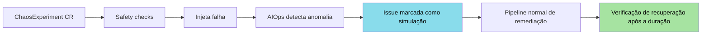
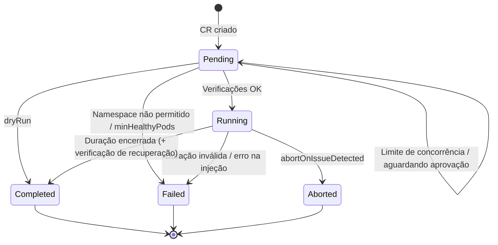

O módulo de **Chaos Engineering** permite injetar falhas em workloads Kubernetes e observar como a plataforma AIOps reage. Diferente de ferramentas de chaos standalone, os experimentos aqui são integrados ao pipeline de AIOps: Issues abertas enquanto um experimento roda são marcadas como simulações de chaos, então não acionam ninguém e não poluem o histograma de MTTR de produção.

<Info>
  Cada experimento é um custom resource `ChaosExperiment` reconciliado pelo
  controller de chaos do operator. As proteções (listas de namespaces
  permitidos/bloqueados, mínimo de pods saudáveis, limite de concorrência,
  abortar ao surgir uma nova Issue) são campos declarativos do CR. Nada vem
  protegido por padrão: toda proteção é opt-in.
</Info>

<Warning>
  **O que funciona sem ajustes.** Com o RBAC distribuído pelo Helm chart do operator e por
  `operator/config/rbac/role.yaml`, o operator só pode fazer `get`, `list`, `watch` e `delete` em pods. Isso basta para
  `pod_kill` e `pod_failure`. Os demais tipos precisam de mais:

  - `cpu_stress`, `memory_stress` e `disk_stress` criam um pod de stress e precisam de `create` em pods. Sem isso o experimento vai para `Failed` (`execution failed: creating ... stress pod: ... forbidden`).
  - `network_delay` e `network_loss` apenas **anotam** os pods do alvo (precisam de `update` em pods). Nada no ChatCLI lê essas anotações, então nenhuma latência ou perda de pacotes é injetada, mesmo quando a anotação é gravada. Sem a permissão, os erros de anotação só vão para o log e o experimento termina `Completed` mesmo assim.

  Veja [Concedendo permissões em pods](#concedendo-permissões-em-pods) abaixo.
</Warning>


## Chaos Engineering no Contexto AIOps



<CardGroup cols={2}>
  <Card title="Validação de Remediações" icon="flask-vial">
    Depois de corrigir um incidente, recrie a falha com um novo experimento e
    veja se a plataforma detecta e remedia de novo.
  </Card>
  <Card title="Testes de Resiliência" icon="shield-halved">
    Confira se os workloads voltam à prontidão total depois que pods são
    derrubados.
  </Card>
  <Card title="Game Days" icon="calendar-check">
    Rode experimentos sob demanda. O campo `schedule` ainda não foi
    implementado; use um agendador externo para criar experimentos
    periodicamente.
  </Card>
  <Card title="Analytics que Reconhece Simulações" icon="stopwatch">
    Issues induzidas por chaos são contadas à parte, então simulações não
    inflam os números de incidentes de produção.
  </Card>
</CardGroup>


## Correlação Automática com Issues

Quando o controller de anomalias cria uma Issue, ele procura um `ChaosExperiment` **no mesmo namespace do recurso afetado** cujo `spec.target` tenha o mesmo `kind`, `name` e `namespace`, e que esteja `Running` ou tenha terminado (`Completed`/`Aborted`) há menos de **2 minutos**. Se encontrar, a Issue recebe dois labels:

```yaml
metadata:
  labels:
    platform.chatcli.io/source: chaos-experiment
    platform.chatcli.io/chaos-experiment: <nome-do-experimento>
```

A Issue então segue o pipeline normal de AIOps, com estas diferenças:

| Comportamento | Issue de produção | Issue induzida por chaos |
|---------------|-------------------|--------------------------|
| Pipeline AIOps (análise, remediação, PostMortem) | Sim | Sim |
| Regras de NotificationPolicy | Sim | Sim (não são suprimidas) |
| Escalação quando a Issue chega a `Escalated` | Sim | Ignorada |
| Histograma `chatcli_operator_issue_resolution_duration_seconds` | Registrado | Não registrado |
| Labels do PostMortem | - | Os mesmos dois labels são copiados |
| Itens de `incidents` / `postmortems` na REST | - | `chaosInduced: true`, `chaosExperiment: <nome>` |
| `analytics/summary` na REST | - | Contada em `chaosInducedIssues` |
| Listas de incidentes do dashboard | Visível | Oculta por padrão (filtro "Ocultar simulações de chaos") |

<Note>
  Os endpoints REST `analytics/mttd` e `analytics/mttr` **não** filtram as
  simulações de chaos; só o histograma de resolução do Prometheus faz isso. As
  regras de NotificationPolicy não conseguem casar por label, então as
  simulações ainda chegam a todo canal cuja regra case com a severidade,
  namespace, kind ou estado da Issue. Rode as simulações num namespace
  dedicado se quiser roteá-las separadamente.
</Note>

<Tip>
  Crie o `ChaosExperiment` **no mesmo namespace do alvo**. A busca de
  correlação só olha o namespace do alvo, enquanto `linkedIssueRef` e o pedido
  de aprovação são resolvidos no namespace do experimento.
</Tip>


## ChaosExperiment CRD

Short name: `chaos`. Colunas do `kubectl get`: `Type`, `Target`, `State`, `Duration`, `Age`.

```bash
kubectl get chaos -n staging
kubectl get chaos validate-api-server-recovery -n staging -o jsonpath='{.status.result}'
```

### Especificação Completa

```yaml
apiVersion: platform.chatcli.io/v1alpha1
kind: ChaosExperiment
metadata:
  name: validate-api-server-recovery
  namespace: staging
spec:
  # Tipo do experimento (obrigatório)
  experimentType: pod_kill

  # Alvo (obrigatório). kind, name e namespace são todos obrigatórios.
  # Só Deployment e StatefulSet são suportados.
  target:
    kind: Deployment
    name: api-server
    namespace: staging

  # Parâmetros específicos do tipo. O campo é map[string]string:
  # os valores PRECISAM ser strings entre aspas.
  parameters:
    count: "2"

  # Obrigatório. Sintaxe de duração do Go: 30s, 5m, 1h30m (sem "d").
  duration: 5m

  # Só roda os safety checks e registra o que aconteceria
  dryRun: false

  # Aceito, mas NÃO implementado: o controller ignora
  schedule: ""

  # Link opcional para uma Issue no namespace do experimento (só o nome)
  linkedIssueRef:
    name: issue-api-server-crashloop

  # Proteções (todas opcionais)
  safetyChecks:
    minHealthyPods: 2
    maxConcurrentExperiments: 1   # padrão 1
    abortOnIssueDetected: true
    requireApproval: false
    allowedNamespaces:
      - staging
      - chaos-testing
    blockedNamespaces:
      - production
      - kube-system
      - chatcli-system

  # Verificação pós-experimento
  postExperiment:
    verifyRecovery: true
    recoveryTimeout: 3m           # padrão 5m
    runRemediationTest: false

  # Padrão true. Experimentos desabilitados são ignorados pelo controller.
  enabled: true

status:
  state: Completed               # Pending | Running | Completed | Failed | Aborted
  startedAt: "2026-03-19T03:00:00Z"
  completedAt: "2026-03-19T03:05:02Z"
  result: "completed: pod_kill experiment finished; recovery verified in 4ms"
  podsAffected: 2
  recoveryVerified: true
  recoveryTime: "4ms"
  preExperimentSnapshot: "Deployment staging/api-server: replicas=5, ready=5, available=5, updated=5"
  postExperimentSnapshot: "Deployment staging/api-server: replicas=5, ready=5, available=5, updated=5"
```

<Note>
  O controller nunca preenche `status.conditions`. Acompanhe o experimento por
  `status.state` e `status.result` (um resumo legível).
</Note>


## 7 Tipos de Experimento

A falha é injetada **uma única vez**, no primeiro reconcile depois que o experimento entra em `Running`. `duration` é a janela de observação: o controller espera ela passar (verificando a cada 10 segundos no máximo) e então executa os passos pós-experimento. Os pods do alvo são os pods do Deployment (via seus ReplicaSets) ou do StatefulSet. Qualquer outro `target.kind` faz o experimento falhar.

Parâmetros ausentes ou que não são inteiros válidos caem no padrão sem aviso.

### 1. Pod Kill

Deleta pods do alvo escolhidos aleatoriamente, com `gracePeriodSeconds: 0`. A seleção aleatória é um embaralhamento Fisher-Yates com `crypto/rand`.

| Parâmetro | Tipo | Padrão | Descrição |
|-----------|------|--------|-----------|
| `count` | string (inteiro) | `"1"` | Número de pods a deletar. Se for maior ou igual ao número de pods, **todos** os pods do alvo são deletados. |

<Warning>
  Pod kill simula uma falha abrupta (ex.: queda de node). Use
  `safetyChecks.minHealthyPods` para não derrubar todas as réplicas.
</Warning>

### 2. Pod Failure

Mesma seleção do `pod_kill`, mas deleta com um grace period definido no experimento (ele sobrepõe o `terminationGracePeriodSeconds` do próprio pod).

| Parâmetro | Tipo | Padrão | Descrição |
|-----------|------|--------|-----------|
| `count` | string (inteiro) | `"1"` | Número de pods a deletar |
| `gracePeriodSeconds` | string (inteiro) | `"30"` | Grace period usado na deleção |

```yaml
spec:
  experimentType: pod_failure
  target:
    kind: Deployment
    name: payment-service
    namespace: staging
  parameters:
    count: "1"
    gracePeriodSeconds: "10"
  duration: 2m
```

### 3. CPU Stress

Cria um pod `stress-ng` fixado no **node** do primeiro pod do alvo. Ele estressa o node, não o container do alvo.

```yaml
spec:
  experimentType: cpu_stress
  target:
    kind: Deployment
    name: api-server
    namespace: staging
  parameters:
    cores: "2"
    loadPercent: "80"
  duration: 2m
```

**Pod de stress gerado** (mesmo formato para os três tipos de stress; só mudam o prefixo do nome e o comando):

```yaml
apiVersion: v1
kind: Pod
metadata:
  name: chaos-cpu-<nome-do-experimento>     # chaos-mem-… / chaos-disk-…
  namespace: <namespace do alvo>
  labels:
    platform.chatcli.io/chaos-experiment: <nome-do-experimento>
    platform.chatcli.io/chaos-role: stress
spec:
  nodeName: <node do primeiro pod do alvo>  # não passa pelo scheduler
  restartPolicy: Never
  tolerations:
    - operator: Exists                      # tolera qualquer taint
  containers:
    - name: stress
      image: alexeiled/stress-ng:latest
      command: ["stress-ng", "--cpu", "2", "--cpu-load", "80", "--timeout", "2m"]
      resources:
        requests: { cpu: 100m, memory: 64Mi }
        limits:   { cpu: 500m, memory: 512Mi }
```

| Parâmetro | Tipo | Padrão | Descrição |
|-----------|------|--------|-----------|
| `cores` | string | `"1"` | Workers de CPU do stress-ng (`--cpu`) |
| `loadPercent` | string | `"80"` | Carga por worker (`--cpu-load`) |

<Warning>
  Os recursos do pod de stress são fixos: ele usa no máximo **500m de CPU e
  512Mi de memória**, não importa o que `cores`, `loadPercent` ou `bytes`
  digam. A imagem (`alexeiled/stress-ng:latest`, do Docker Hub) não pode ser
  trocada, e o pod não tem `securityContext`, então namespaces que aplicam o
  Pod Security Standard `restricted` o rejeitam.
</Warning>

### 4. Memory Stress

Cria um pod `stress-ng` que aloca memória no node do alvo: `stress-ng --vm <workers> --vm-bytes <bytes> --timeout <duration>`.

```yaml
spec:
  experimentType: memory_stress
  target:
    kind: Deployment
    name: cache-service
    namespace: staging
  parameters:
    bytes: "256M"
    workers: "1"
  duration: 3m
```

| Parâmetro | Tipo | Padrão | Descrição |
|-----------|------|--------|-----------|
| `bytes` | string | `"256M"` | Memória por worker, repassada como está para `--vm-bytes` (use a sintaxe do stress-ng, como `256M`, `1G`) |
| `workers` | string | `"1"` | Workers de VM do stress-ng (`--vm`) |

Por causa do limite de 512Mi, pedir mais memória faz o container de stress ser morto por OOM em vez de pressionar o node.

### 5. Network Delay

Adiciona uma anotação em **todos** os pods do alvo. Nenhuma latência é injetada: o ChatCLI não traz sidecar nem integração com CNI que leia essa anotação. Ela é só um marcador que ferramentas próprias poderiam usar.

```yaml
spec:
  experimentType: network_delay
  target:
    kind: Deployment
    name: api-gateway
    namespace: staging
  parameters:
    latencyMs: "500"
    jitterMs: "50"
  duration: 5m
```

**Anotação aplicada:**

```yaml
metadata:
  annotations:
    platform.chatcli.io/chaos-network-delay: "500ms jitter=50ms experiment=<nome-do-experimento>"
```

| Parâmetro | Tipo | Padrão | Descrição |
|-----------|------|--------|-----------|
| `latencyMs` | string | `"100"` | Latência escrita na anotação |
| `jitterMs` | string | `"10"` | Jitter escrito na anotação |

A anotação é removida quando o experimento termina ou é abortado. `podsAffected` conta todos os pods do alvo, mesmo quando a gravação da anotação falhou.

### 6. Network Loss

Mesmo mecanismo do `network_delay`, com a anotação `platform.chatcli.io/chaos-network-loss: "<percent>% correlation=<correlation>% experiment=<nome>"`. Nenhum pacote é descartado.

```yaml
spec:
  experimentType: network_loss
  target:
    kind: Deployment
    name: api-gateway
    namespace: staging
  parameters:
    percent: "30"
  duration: 2m
```

| Parâmetro | Tipo | Padrão | Descrição |
|-----------|------|--------|-----------|
| `percent` | string | `"10"` | Percentual de perda escrito na anotação |
| `correlation` | string | `"25"` | Percentual de correlação escrito na anotação |

### 7. Disk Stress

Cria um pod `stress-ng` que gera I/O de disco no node do alvo: `stress-ng --hdd <workers> --hdd-bytes <size> --timeout <duration>`. O I/O vai para o filesystem do próprio container de stress.

```yaml
spec:
  experimentType: disk_stress
  target:
    kind: Deployment
    name: database-proxy
    namespace: staging
  parameters:
    workers: "2"
    size: "1G"
  duration: 3m
```

| Parâmetro | Tipo | Padrão | Descrição |
|-----------|------|--------|-----------|
| `workers` | string | `"1"` | Workers de HDD do stress-ng (`--hdd`) |
| `size` | string | `"1G"` | Bytes por worker (`--hdd-bytes`) |

### Resumo dos Tipos

| Tipo | Mecanismo | Permissão em pods necessária | Limpeza |
|------|-----------|------------------------------|---------|
| `pod_kill` | Deleção com grace period 0 | `delete` (concedida) | ReplicaSet/StatefulSet recria os pods |
| `pod_failure` | Deleção com `gracePeriodSeconds` | `delete` (concedida) | ReplicaSet/StatefulSet recria os pods |
| `cpu_stress` | Pod stress-ng no node do alvo | `create` (não concedida) | O stress-ng sai no `--timeout`; o pod é deletado no fim |
| `memory_stress` | Pod stress-ng no node do alvo | `create` (não concedida) | Igual ao anterior |
| `disk_stress` | Pod stress-ng no node do alvo | `create` (não concedida) | Igual ao anterior |
| `network_delay` | Só anotação (sem efeito) | `update` (não concedida) | Anotação removida no fim |
| `network_loss` | Só anotação (sem efeito) | `update` (não concedida) | Anotação removida no fim |

### Concedendo Permissões em Pods

Para usar os tipos de stress (e para que as anotações de rede sejam gravadas), dê à ServiceAccount do operator os verbos que faltam. Por exemplo, no cluster inteiro:

```yaml
apiVersion: rbac.authorization.k8s.io/v1
kind: ClusterRole
metadata:
  name: chatcli-operator-chaos-pods
rules:
  - apiGroups: [""]
    resources: ["pods"]
    verbs: ["create", "update"]
---
apiVersion: rbac.authorization.k8s.io/v1
kind: ClusterRoleBinding
metadata:
  name: chatcli-operator-chaos-pods
roleRef:
  apiGroup: rbac.authorization.k8s.io
  kind: ClusterRole
  name: chatcli-operator-chaos-pods
subjects:
  - kind: ServiceAccount
    name: chatcli-operator        # a ServiceAccount do seu operator
    namespace: chatcli-system
```

Para limitar o raio de impacto, aplique as mesmas regras com `Role`/`RoleBinding` só nos namespaces onde você roda experimentos.


## Safety Checks

Os safety checks rodam nesta ordem enquanto o experimento está `Pending`. Todos são avaliados uma única vez, antes da injeção da falha, exceto `abortOnIssueDetected`, que é verificado durante a execução.

### AllowedNamespaces / BlockedNamespaces

Comparados com `spec.target.namespace`. Um namespace bloqueado, ou ausente de uma lista de permitidos não vazia, leva o experimento a `Failed` (`namespace "<ns>" is not allowed by safety checks`).

<Tabs>
  <Tab title="AllowedNamespaces">
    Lista de permitidos. Se estiver definida, **somente** esses namespaces
    podem ser alvo. Se estiver vazia, todo namespace não bloqueado é
    permitido.

    ```yaml
    safetyChecks:
      allowedNamespaces:
        - staging
        - chaos-testing
        - development
    ```
  </Tab>
  <Tab title="BlockedNamespaces">
    Lista de bloqueados. Experimentos **nunca** são executados nesses
    namespaces, mesmo que também estejam na lista de permitidos.

    ```yaml
    safetyChecks:
      blockedNamespaces:
        - production
        - kube-system
        - chatcli-system
        - monitoring
    ```
  </Tab>
</Tabs>

<Warning>
  `blockedNamespaces` tem precedência sobre `allowedNamespaces`. **Não existem
  namespaces bloqueados por padrão**: `kube-system` e `chatcli-system` só
  ficam protegidos se você os listar.
</Warning>

### MaxConcurrentExperiments

Conta os experimentos em estado `Running` **em todos os namespaces** e compara com o `maxConcurrentExperiments` do próprio experimento (padrão `1`; `0` ou menos é tratado como `1`). Quando o limite é atingido, o experimento continua `Pending` e é tentado de novo a cada 15 segundos. Ele não falha.

### MinHealthyPods

Se for maior que `0`, o controller conta os pods do alvo com condição `Ready` igual a `True`, subtrai o parâmetro `count` (padrão 1, seja qual for o tipo do experimento) e leva o experimento a `Failed` quando o resultado fica abaixo de `minHealthyPods`:

```
safety check failed: killing 2 pods would leave 1 healthy (min required: 2, total: 3)
```

Essa verificação roda uma vez, antes da injeção. Ela não acompanha a saúde dos pods durante o experimento.

### RequireApproval

Quando `true`, o controller procura um `ApprovalRequest` chamado `chaos-<nome-do-experimento>` no namespace do experimento, cria se não existir e verifica de novo a cada 30 segundos. O experimento só começa quando o `status.state` desse pedido for `Approved`.

O pedido que o controller monta é este:

```yaml
apiVersion: platform.chatcli.io/v1alpha1
kind: ApprovalRequest
metadata:
  name: chaos-validate-api-server-recovery
  namespace: staging
  labels:
    platform.chatcli.io/chaos-experiment: validate-api-server-recovery
spec:
  issueRef:
    name: chaos-experiment-validate-api-server-recovery   # ou spec.linkedIssueRef
  remediationPlanRef: validate-api-server-recovery        # o nome do experimento
  policyRef: chaos-safety
  ruleName: chaos-experiment-approval
  requester: chaos-controller
  timeoutMinutes: 30
  requiredApprovers: 1
```

<Warning>
  **Limitações conhecidas do `requireApproval` (deduzidas do código):**

  - O controller não preenche `spec.requestedActions`, que o CRD de ApprovalRequest marca como obrigatório. O API server rejeita a criação, então o experimento fica em `Pending` e o operator registra `checking approval: creating approval request: ...` a cada nova tentativa.
  - `policyRef: chaos-safety` não aponta para nenhuma policy embutida. A menos que você crie uma ApprovalPolicy com esse nome e uma regra chamada `chaos-experiment-approval` no mesmo namespace, o controller de aprovações nunca processa o pedido: não o expira depois de 30 minutos e não reage às anotações de aprovar/rejeitar.
  - Se o pedido ficar `Rejected` ou `Expired`, o experimento **não** vai para `Failed`. Ele continua `Pending` e o controller segue tentando com backoff. Delete o experimento para pará-lo.

  Contorno: crie o pedido você mesmo antes do experimento (mesmo nome, com `requestedActions: []`) e aprove-o gravando o status diretamente:

  ```bash
  kubectl patch approvalrequest chaos-validate-api-server-recovery -n staging \
    --subresource=status --type=merge \
    -p '{"status":{"state":"Approved","autoApproved":false}}'
  ```
</Warning>

### AbortOnIssueDetected

Enquanto o experimento está `Running` e a `duration` ainda não passou, cada reconcile (a cada 10 segundos no máximo) lista as Issues do namespace do alvo. Se alguma Issue tiver exatamente o mesmo kind, nome e namespace em `spec.resource` que o alvo e tiver sido criada depois de `status.startedAt`, o experimento vai para `Aborted` com `result: "aborted: new issue detected: <issue>"`. Em seguida os pods de stress são deletados e as anotações de rede removidas.

<Warning>
  A verificação não distingue Issues causadas pelo próprio experimento. Se o
  AIOps detectar a falha que você injetou (o objetivo habitual de uma
  simulação), o experimento é abortado. Deixe `abortOnIssueDetected: false`
  quando você espera que o AIOps abra uma Issue para o alvo.
</Warning>


## Verificação Pós-Experimento

Quando a `duration` passa, o controller deleta os pods de stress, remove as anotações de rede, grava o `postExperimentSnapshot` e executa os passos abaixo. A partir daqui o experimento sempre termina em `Completed`, mesmo que a recuperação não tenha sido verificada.

### VerifyRecovery

O alvo é considerado saudável quando um Deployment tem `readyReplicas` e `availableReplicas` pelo menos iguais a `spec.replicas`, ou quando um StatefulSet tem `readyReplicas` pelo menos igual a `spec.replicas`. Se ainda não estiver saudável, o controller verifica de novo a cada 5 segundos.

### RecoveryTimeout

Por quanto tempo continuar verificando depois que a `duration` passou. Padrão `5m`. Um valor inválido cai em `5m` sem aviso. Quando o prazo estoura, o experimento é marcado `Completed` com `recoveryVerified: false`, `recoveryTime: "timeout"` e um result terminando em `recovery NOT verified (timeout)`. Ele não é marcado `Failed`.

<Warning>
  **`recoveryTime` não mede a recuperação.** O cronômetro começa logo antes da
  verificação de saúde final que dá certo, então o valor (e o histograma
  `chatcli_operator_chaos_recovery_time_seconds`) é sempre de alguns
  milissegundos. Use `recoveryVerified` como sinal de passou/falhou e compare
  `status.startedAt`/`status.completedAt` se precisar de um limite superior
  para o tempo de recuperação.
</Warning>

### RunRemediationTest

Esta opção **não** reinjeta a falha. Ao concluir, o controller lê a Issue indicada em `linkedIssueRef` (no namespace do experimento) e só verifica se o `status.state` dela é `Resolved`:

- `Resolved`: `result: "completed: <type> experiment finished; remediation validation passed"`
- qualquer outro estado, ou sem `linkedIssueRef`: `result: "completed: <type> experiment finished; no remediation was applied during experiment"`

Se a Issue vinculada já estava `Resolved` antes do experimento começar, a verificação passa independentemente do que aconteceu durante o experimento. Com `runRemediationTest: true`, o texto do result não fala da recuperação; consulte `recoveryVerified` para isso.

```yaml
spec:
  linkedIssueRef:
    name: issue-api-server-crashloop
  postExperiment:
    verifyRecovery: true
    recoveryTimeout: 3m
    runRemediationTest: true   # verifica se a Issue vinculada está Resolved
```


## Máquina de Estados



| Estado | Descrição | Transições |
|--------|-----------|------------|
| **Pending** | Safety checks, limite de concorrência e aprovação são avaliados | Running, Failed, Completed (dry run) |
| **Running** | Falha injetada uma vez; o controller espera a `duration` | Completed, Failed, Aborted |
| **Completed** | Duração encerrada e passos pós-experimento feitos (a recuperação pode não ter sido verificada), ou dry run concluído | Terminal |
| **Failed** | Namespace bloqueado, `minHealthyPods` violado, `duration` inválida, nenhum pod no alvo (tipos de pod e de stress), `target.kind` não suportado ou erro na injeção | Terminal |
| **Aborted** | Uma nova Issue para o alvo foi detectada (`abortOnIssueDetected`) | Terminal |

Experimentos em estado terminal nunca rodam de novo. Para repetir um experimento, delete e crie de novo (redefinir o status manualmente não reinjeta a falha, porque o controller pula a injeção quando `podsAffected` já está preenchido).

Não existe campo para abortar um experimento em execução. Deletar o CR ou definir `enabled: false` faz o controller parar de tratá-lo, mas sem limpeza: os pods de stress continuam rodando até o `--timeout` do stress-ng, e as anotações de rede ficam nos pods.

<Note>
  A `duration` só é interpretada quando o experimento já está `Running`, então
  um valor inválido (por exemplo `1d`) só é detectado depois que os safety
  checks e a aprovação já passaram.
</Note>


## DryRun Mode

Com `dryRun: true`, o controller roda as verificações de `Pending` (namespaces, concorrência, `minHealthyPods` e aprovação, se exigida) e leva o experimento direto para `Completed`, sem tocar em nenhum pod. Ele não seleciona pods nem planeja ações individuais.

```yaml
spec:
  experimentType: pod_kill
  dryRun: true
  target:
    kind: Deployment
    name: api-server
    namespace: staging
  parameters:
    count: "3"
  duration: 5m
```

**Resultado de um DryRun:**

```yaml
status:
  state: Completed
  startedAt: "2026-03-19T03:00:00Z"
  completedAt: "2026-03-19T03:00:00Z"
  result: "dry-run: would execute pod_kill on staging/api-server for 5m"
  podsAffected: 0
  recoveryVerified: false
  preExperimentSnapshot: "Deployment staging/api-server: replicas=5, ready=5, available=5, updated=5"
  postExperimentSnapshot: "Deployment staging/api-server: replicas=5, ready=5, available=5, updated=5"
```

Um dry run incrementa `chatcli_operator_chaos_experiments_total{result="dry_run"}`.

<Tip>
  Rode um dry run primeiro para confirmar que as listas de namespaces e o
  `minHealthyPods` aceitam o alvo. Se um safety check falhar, o dry run
  termina em `Failed` com a mesma mensagem que uma execução real teria.
</Tip>


## Schedule (Experimentos Recorrentes)

<Warning>
  O campo `schedule` existe no CRD, mas **não está implementado**: o
  controller de chaos nunca o lê. Um experimento com `schedule` roda uma vez,
  como qualquer outro, e nunca se repete.
</Warning>

Para game days recorrentes, crie um `ChaosExperiment` novo de forma agendada, fora do operator, por exemplo com um CronJob do Kubernetes que rode `kubectl create -f` num manifesto com `metadata.generateName` (assim cada execução ganha um nome e um status novos). Limpe os experimentos antigos por conta própria; o operator não os remove.


## LinkedIssueRef

`linkedIssueRef` aceita só um `name`; a Issue é buscada no namespace do experimento. Ele é usado em dois lugares:

1. **Aprovação:** quando `requireApproval` é `true`, vira o `spec.issueRef` do ApprovalRequest gerado.
2. **`runRemediationTest`:** ao concluir, o controller verifica se essa Issue está `Resolved` e grava o resultado em `status.result`.

O controller não altera a Issue nem o RemediationPlan dela, e não registra o vínculo em nenhum outro lugar do status do experimento.

```yaml
spec:
  linkedIssueRef:
    name: issue-api-server-crashloop
  experimentType: pod_kill
  parameters:
    count: "2"
  postExperiment:
    verifyRecovery: true
    recoveryTimeout: 3m
    runRemediationTest: true
```


## Exemplos YAML Completos

<Accordion title="Pod Kill com Safety Checks">
```yaml
apiVersion: platform.chatcli.io/v1alpha1
kind: ChaosExperiment
metadata:
  name: validate-api-server-pod-kill
  namespace: staging
  labels:
    team: platform
    experiment-type: resilience
spec:
  experimentType: pod_kill
  target:
    kind: Deployment
    name: api-server
    namespace: staging
  parameters:
    count: "2"
  duration: 5m
  dryRun: false
  safetyChecks:
    minHealthyPods: 2
    maxConcurrentExperiments: 1
    abortOnIssueDetected: false
    requireApproval: false
    allowedNamespaces: [staging, chaos-testing]
    blockedNamespaces: [production, kube-system]
  postExperiment:
    verifyRecovery: true
    recoveryTimeout: 2m
    runRemediationTest: false
```
</Accordion>

<Accordion title="CPU Stress (exige permissão de create em pods)">
```yaml
apiVersion: platform.chatcli.io/v1alpha1
kind: ChaosExperiment
metadata:
  name: cpu-stress-api
  namespace: staging
spec:
  experimentType: cpu_stress
  target:
    kind: Deployment
    name: api-server
    namespace: staging
  parameters:
    cores: "2"
    loadPercent: "90"
  duration: 10m
  safetyChecks:
    maxConcurrentExperiments: 1
    abortOnIssueDetected: true
    blockedNamespaces: [production, kube-system]
  postExperiment:
    verifyRecovery: true
    recoveryTimeout: 5m
```
</Accordion>

<Accordion title="Validação Pós-Remediação">
```yaml
apiVersion: platform.chatcli.io/v1alpha1
kind: ChaosExperiment
metadata:
  name: validate-crashloop-fix
  namespace: staging
spec:
  experimentType: pod_kill
  target:
    kind: Deployment
    name: payment-service
    namespace: staging
  parameters:
    count: "1"
  duration: 3m
  linkedIssueRef:
    name: issue-payment-crashloop
  safetyChecks:
    minHealthyPods: 1
    abortOnIssueDetected: false   # esperamos que o AIOps detecte a falha
  postExperiment:
    verifyRecovery: true
    recoveryTimeout: 3m
    runRemediationTest: true      # verifica se a Issue vinculada está Resolved
```
</Accordion>

<Accordion title="DryRun para Validação de Configuração">
```yaml
apiVersion: platform.chatcli.io/v1alpha1
kind: ChaosExperiment
metadata:
  name: dryrun-memory-stress
  namespace: staging
spec:
  experimentType: memory_stress
  dryRun: true
  target:
    kind: Deployment
    name: cache-service
    namespace: staging
  parameters:
    bytes: "256M"
  duration: 5m
  safetyChecks:
    minHealthyPods: 2
    maxConcurrentExperiments: 1
    blockedNamespaces: [production]
```
</Accordion>


## Métricas

O controller de chaos registra três métricas no endpoint de métricas do operator (porta 8080 por padrão):

| Métrica | Tipo | Labels | Descrição |
|---------|------|--------|-----------|
| `chatcli_operator_chaos_experiments_total` | Counter | `type`, `result` | Experimentos por tipo e desfecho. `result` é `completed`, `failed`, `aborted` ou `dry_run` |
| `chatcli_operator_chaos_recovery_time_seconds` | Histogram | `type` | Só é registrado quando a recuperação é verificada. Veja o aviso sobre `recoveryTime` acima: os valores ficam perto de zero |
| `chatcli_operator_chaos_pods_affected_total` | Counter | `type` | Pods deletados, pods de stress criados (1 por experimento) ou pods anotados |

`result="failed"` significa que um safety check ou a injeção falhou. Um alvo que não se recuperou a tempo ainda conta como `completed`.

### Exemplo de Alertas

```yaml
groups:
  - name: chaos-engineering
    rules:
      - alert: ChaosExperimentFailed
        expr: increase(chatcli_operator_chaos_experiments_total{result="failed"}[1h]) > 0
        labels:
          severity: warning
        annotations:
          summary: "Experimento de chaos falhou"
          description: >
            Um experimento {{ $labels.type }} falhou num safety check ou não
            conseguiu injetar a falha. Veja o status.result do ChaosExperiment.

      - alert: ChaosExperimentAborted
        expr: increase(chatcli_operator_chaos_experiments_total{result="aborted"}[1h]) > 0
        labels:
          severity: info
        annotations:
          summary: "Experimento de chaos abortado"
          description: >
            Um experimento {{ $labels.type }} foi abortado porque uma nova
            Issue foi aberta para o alvo.
```

Para alertar sobre recuperação não verificada, consulte os CRs (`status.recoveryVerified: false` em experimentos `Completed`); não existe métrica para isso.


## Boas Práticas

<Steps>
  <Step title="Comece com DryRun">
    Confirme que as listas de namespaces e o `minHealthyPods` aceitam o alvo
    antes de rodar um experimento de verdade.
  </Step>
  <Step title="Staging Primeiro">
    Rode experimentos em staging antes de ambientes de tier mais alto. Defina
    `allowedNamespaces` e `blockedNamespaces` explicitamente; nada é
    bloqueado por padrão.
  </Step>
  <Step title="Safety Checks Conservadores">
    Configure `minHealthyPods` com margem. Se o deployment tem 5 réplicas e
    precisa de 3 para operar, use `minHealthyPods: 3` e mantenha `count`
    baixo: um `count` igual ou maior que o número de réplicas deleta todos os
    pods.
  </Step>
  <Step title="Escolha o abortOnIssueDetected com Intenção">
    Ligue para parar a simulação assim que o AIOps reagir; desligue quando o
    objetivo da simulação é deixar o AIOps detectar e remediar.
  </Step>
  <Step title="Recrie a Cada Execução">
    Experimentos rodam uma vez. Use um agendador externo que crie um CR novo
    (com `generateName`) para game days recorrentes.
  </Step>
</Steps>


## Próximos Passos

<CardGroup cols={2}>
  <Card title="Fluxo de Aprovação" icon="user-check" href="/pt/features/aiops/approval-workflow">
    Como os ApprovalRequests são decididos, usados pelo `requireApproval`.
  </Card>
  <Card title="Ciclo de Vida de Incidentes" icon="arrows-spin" href="/pt/features/aiops/incident-lifecycle">
    O pipeline de Issues pelo qual as Issues induzidas por chaos passam.
  </Card>
  <Card title="Dashboard Web" icon="gauge" href="/pt/features/aiops/web-dashboard">
    Mostre ou oculte simulações de chaos nas telas de incidentes.
  </Card>
  <Card title="Plataforma AIOps" icon="brain" href="/pt/features/aiops-platform">
    Retorne à visão geral da plataforma AIOps.
  </Card>
</CardGroup>
