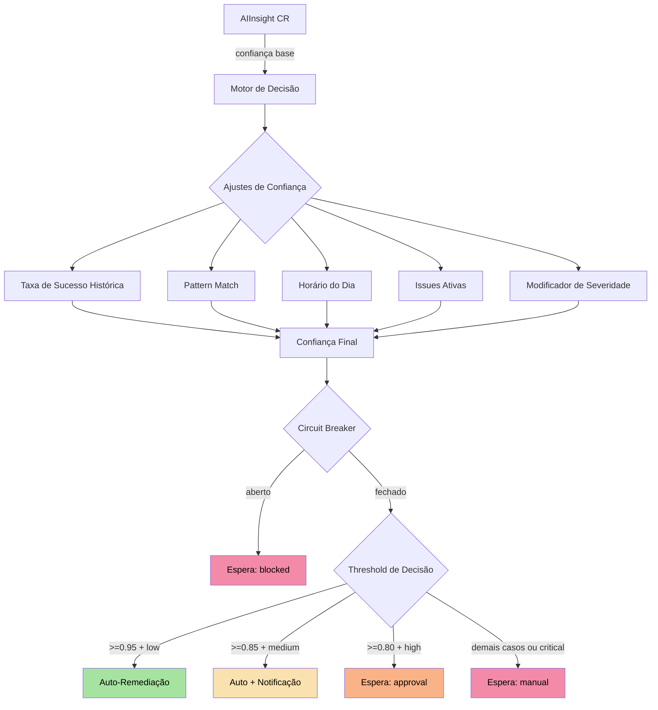
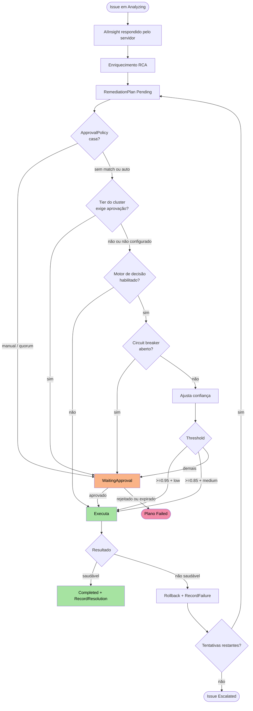

O **Motor de Decisão** é o componente central que determina _quando_ e _como_ a plataforma AIOps deve agir autonomamente. Ele combina confiança calculada, histórico de padrões, enriquecimento de causa raiz e detecção de convergência para tomar decisões seguras em produção.

<Info>
  O Motor de Decisão nunca age às cegas. Cada decisão passa por um pipeline de
  ajustes de confiança, verificações de circuit breaker e validação de padrões
  antes de qualquer ação ser executada.
</Info>


## Visão Geral da Arquitetura



### Habilitando o motor

O motor vem **desligado por padrão**: as ApprovalPolicies são então a única barreira. Ligue por operator:

```yaml
# Helm values (chatcli-operator)
decisionEngine:
  enabled: true
```

ou defina `CHATCLI_OPERATOR_DECISION_ENGINE=true` no Deployment do operator. O RemediationReconciler passa a avaliar todo plano que chega a `Pending`, depois de as ApprovalPolicies e o [tier do cluster](/pt/features/aiops/federation#politica-de-remediacao-por-tier) darem sua palavra: um plano que uma ApprovalPolicy já segurou não é reavaliado; um que uma regra `auto` liberou ainda é.

Toda avaliação deixa o veredito no plano, tenha ele rodado ou esperado:

```yaml
metadata:
  annotations:
    platform.chatcli.io/decision-mode: "auto-notify"   # auto | auto-notify | approval | manual | blocked
    platform.chatcli.io/confidence: "0.91"             # confiança final após os ajustes
    platform.chatcli.io/risk: "medium"                 # low | medium | high | critical
    platform.chatcli.io/decision-reason: "Auto-approved with notification: confidence 0.91 + medium severity"
```

Um plano que precisa esperar fica em `WaitingApproval` sob a política sintética `decision-engine`: um ApprovalRequest com `policyRef: decision-engine`, um aprovador exigido e timeout de 30 minutos, decidido como qualquer outro (dashboard, annotation `platform.chatcli.io/approve` ou API REST). Nenhum objeto ApprovalPolicy é necessário.


## Confiança Base (AIInsight)

Todo o processo começa com o campo `confidence` do `AIInsight` CR, que é gerado pelo provedor LLM durante a análise de causa raiz. Esse valor representa a certeza da IA sobre o diagnóstico e as ações sugeridas.

<CardGroup cols={2}>
  <Card title="Confiança Alta" icon="circle-check">
    **0.90 - 1.00** — A IA identificou o problema com alta precisão. Cenários bem
    conhecidos como OOMKilled, CrashLoopBackOff com imagem inválida.
  </Card>
  <Card title="Confiança Média" icon="circle-half-stroke">
    **0.70 - 0.89** — Diagnóstico provável mas com incerteza. Problemas de
    performance, resource pressure, dependências intermitentes.
  </Card>
  <Card title="Confiança Baixa" icon="circle-xmark">
    **0.50 - 0.69** — A IA não tem certeza suficiente. Problemas complexos com
    múltiplas causas possíveis.
  </Card>
  <Card title="Confiança Muito Baixa" icon="triangle-exclamation">
    **&lt; 0.50** — Cenário desconhecido ou dados insuficientes. Sempre requer
    intervenção humana.
  </Card>
</CardGroup>


## Fatores de Ajuste de Confiança

A confiança base do AIInsight é ajustada por cinco fatores e depois limitada a `0.0`–`1.0`. Todos os números abaixo são os que o operator aplica.

### 1. Taxa de Sucesso Histórica

O motor conta os RemediationPlans dos últimos 30 dias no namespace da Issue cujas ações incluem o primeiro tipo de ação do plano, e precisa de pelo menos **3** concluídos (Completed, Failed ou RolledBack) antes de ajustar:

| Taxa de sucesso | Ajuste |
|-----------------|--------|
| ≥ 90% | **+0,10** |
| ≥ 70% | **+0,05** |
| 50%–70% | 0,00 |
| < 50% | **−0,10** |
| menos de 3 planos concluídos | 0,00 |

Planos agênticos não carregam ações pré-planejadas, então este fator não se aplica a eles.

### 2. Pattern Match (Correspondência de Padrão)

Quando o [Pattern Store](#pattern-store) guarda um padrão resolvido com o mesmo tipo de sinal, tipo de recurso e severidade, o `ConfidenceBoost` armazenado dele é somado. O boost é aprendido por padrão a partir de resoluções passadas; não há valor fixo.

### 3. Horário do Dia (Time of Day)

| Condição | Ajuste |
|----------|--------|
| 09:00–17:59 **UTC** | 0,00 |
| qualquer outra hora | **−0,05** |

O relógio é UTC de propósito: o operator não sabe o horário comercial do time.

### 4. Issues Ativas Simultâneas

Issues não terminais no mesmo namespace, incluída a que está sendo avaliada:

| Condição | Ajuste |
|----------|--------|
| até 3 issues ativas | 0,00 |
| cada issue além de 3 | **−0,02**, limitado a **−0,10** |

### 5. Severidade do Incidente

| Severidade | Ajuste |
|------------|--------|
| `critical` | **−0,10** |
| `high` | **−0,05** |
| `medium` | 0,00 |
| `low` | **+0,05** |

## Exemplo Prático de Cálculo

```text
Issue: error_rate no Deployment checkout (medium), namespace production, 03:10 UTC
Confiança do AIInsight (base):                     0,88
1. Histórico: 5 planos ScaleDeployment concluídos,
   4 completados (80%)  → ≥ 70%                    +0,05
2. Pattern Store: padrão correspondente, boost      +0,10
3. Horário: 03:10 UTC                               −0,05
4. Issues ativas no namespace: 2                    0,00
5. Severidade medium                                0,00
Confiança final                                    0,98  → o limite mantém 0,98
Veredito: 0,98 ≥ 0,85 e severidade medium → auto-notify (executa, operadores notificados)
```

A mesma Issue com severidade `critical` terminaria em 0,88 e ficaria em espera como `manual`: critical nunca roda sem alguém.


## Thresholds de Decisão

A confiança final e a severidade decidem juntas quanta autonomia o plano recebe.

<Tabs>
  <Tab title="Auto-Remediação">
    **Requisitos:** confiança ≥ 0,95 **e** severidade `low`

    O plano executa imediatamente. O veredito fica no plano:

    ```yaml
    metadata:
      annotations:
        platform.chatcli.io/decision-mode: "auto"
        platform.chatcli.io/confidence: "0.97"
        platform.chatcli.io/risk: "low"
    ```
  </Tab>
  <Tab title="Auto com Notificação">
    **Requisitos:** confiança ≥ 0,85 **e** severidade `medium`

    O plano executa; as mudanças de estado da Issue chegam às NotificationPolicies como sempre, então os operadores são avisados.

    ```yaml
    metadata:
      annotations:
        platform.chatcli.io/decision-mode: "auto-notify"
        platform.chatcli.io/confidence: "0.89"
        platform.chatcli.io/risk: "medium"
    ```
  </Tab>
  <Tab title="Requer Aprovação">
    **Requisitos:** confiança ≥ 0,80 **e** severidade `high`

    O plano espera em `WaitingApproval`. O ApprovalRequest aponta para a política sintética:

    ```yaml
    apiVersion: platform.chatcli.io/v1alpha1
    kind: ApprovalRequest
    metadata:
      name: approval-checkout-error-rate-plan-1
    spec:
      remediationPlanRef: checkout-error-rate-plan-1
      policyRef: decision-engine
      ruleName: decision-engine
      requiredApprovers: 1
      timeoutMinutes: 30
    status:
      state: Pending
    ```

    O plano carrega `decision-mode: approval`. Aprove ou rejeite como qualquer requisição; após 30 minutos sem decisão ela expira e o plano falha.
  </Tab>
  <Tab title="Manual">
    **Requisitos:** severidade `critical`, ou qualquer severidade abaixo do seu threshold

    Mesmo mecanismo, com `decision-mode: manual` e o motivo por extenso, por exemplo `Manual approval required: critical severity (confidence 0.88)`. Nada roda até alguém decidir.
  </Tab>
</Tabs>

<Note>
  Um plano que uma ApprovalPolicy já segurou não é avaliado de novo. Um plano que uma regra `auto` liberou ainda é: o motor só pode adicionar cautela, nunca remover a barreira de uma política.
</Note>

## Circuit Breaker

O circuit breaker bloqueia todo plano novo num namespace quando as remediações ali continuam falhando, para a plataforma parar de acumular dano.

<Steps>
  <Step title="Janela de falhas">
    A cada avaliação o motor conta os RemediationPlans do namespace que terminaram `Failed` ou `RolledBack` na última **1 hora**. O momento da falha é `completedAt`, ou `startedAt` quando o caminho de falha não o carimbou, ou a criação do plano.
  </Step>
  <Step title="Abre">
    **3 ou mais** falhas na janela abrem o breaker: o plano fica em espera como `decision-mode: blocked` com o motivo `Circuit breaker open: 3 remediations failed in last hour`, e `chatcli_operator_decision_engine_circuit_breaker_state{namespace}` marca `1`.
  </Step>
  <Step title="Fecha">
    O breaker fecha sozinho quando as falhas saem da janela de uma hora. Não há reset manual: aprove as requisições em espera que quiser rodar, ou corrija a causa e aguarde.
  </Step>
</Steps>

O estado é derivado dos planos a cada avaliação, não guardado em memória, então um restart do operator não o perde.


## Pattern Store

O Pattern Store é o sistema de aprendizado de padrões da plataforma. Ele permite que a AIOps "lembre" de incidentes passados e use essa memória para tomar decisões mais informadas.

### Fingerprinting SHA256

Cada padrão é identificado por uma fingerprint única calculada como:

```
SHA256(signalType | resourceKind | severity)
```

**Exemplos de fingerprints:**

| Signal Type | Resource Kind | Severity | Fingerprint (truncada) |
|------------|--------------|----------|----------------------|
| `CrashLoopBackOff` | `Deployment` | `high` | `a3f8c2...` |
| `OOMKilled` | `Pod` | `medium` | `7b1d9e...` |
| `FailedScheduling` | `Pod` | `low` | `c4e6a1...` |
| `ImagePullBackOff` | `Deployment` | `high` | `2d8f5b...` |

### Armazenamento em ConfigMap

Os padrões são persistidos em um `ConfigMap` dedicado no namespace do operator:

```yaml
apiVersion: v1
kind: ConfigMap
metadata:
  name: chatcli-pattern-store
  namespace: chatcli-system
  labels:
    app.kubernetes.io/component: pattern-store
    platform.chatcli.io/managed-by: decision-engine
data:
  patterns.json: |
    {
      "a3f8c2...": {
        "signalType": "CrashLoopBackOff",
        "resourceKind": "Deployment",
        "severity": "high",
        "totalOccurrences": 12,
        "successfulResolutions": 10,
        "lastResolution": {
          "action": "Rollback",
          "timestamp": "2026-03-18T14:30:00Z",
          "durationSeconds": 45
        },
        "averageResolutionTime": "38s"
      }
    }
```

### RecordResolution e RecordFailure

<CodeGroup>
```go RecordResolution
func (ps *PatternStore) RecordResolution(fingerprint string, action string) {
    ps.mu.Lock()
    defer ps.mu.Unlock()

    pattern, exists := ps.patterns[fingerprint]
    if !exists {
        pattern = &Pattern{Fingerprint: fingerprint}
        ps.patterns[fingerprint] = pattern
    }

    pattern.TotalOccurrences++
    pattern.SuccessfulResolutions++
    pattern.LastResolution = &Resolution{
        Action:    action,
        Timestamp: time.Now(),
    }

    ps.persistToConfigMap()
}
```

```go RecordFailure
func (ps *PatternStore) RecordFailure(fingerprint string, reason string) {
    ps.mu.Lock()
    defer ps.mu.Unlock()

    pattern, exists := ps.patterns[fingerprint]
    if !exists {
        pattern = &Pattern{Fingerprint: fingerprint}
        ps.patterns[fingerprint] = pattern
    }

    pattern.TotalOccurrences++
    pattern.LastFailureReason = reason

    ps.persistToConfigMap()
}
```
</CodeGroup>

### Cálculo do Confidence Boost

O boost de confiança derivado do Pattern Store é calculado diretamente a partir da taxa de sucesso:

```
ConfidenceBoost = successRate * 0.15
```

| Taxa de Sucesso | Confidence Boost | Exemplo |
|----------------|------------------|---------|
| 100% (10/10) | +0.150 | Todos os rollbacks bem-sucedidos |
| 80% (8/10) | +0.120 | Maioria dos ajustes de recursos funcionou |
| 50% (5/10) | +0.075 | Resultados mistos |
| 20% (2/10) | +0.030 | A maioria falhou |

### Cenário: Incidente Similar Recente

<Accordion title="'Incidente similar resolvido 3 dias atrás com rollback'">
  Quando o Pattern Store encontra uma correspondência, o motor adiciona contexto
  ao `AIInsight` e ao `RemediationPlan`:

  ```yaml
  status:
    patternMatch:
      found: true
      fingerprint: "a3f8c2..."
      previousResolution:
        action: "Rollback"
        daysAgo: 3
        wasSuccessful: true
        message: "Incidente similar resolvido 3 dias atrás com rollback"
      confidenceBoost: 0.15
      successRate: 0.83
  ```

  Essa informação é exibida no `Issue` CR para que operadores possam ver
  rapidamente que o problema já foi resolvido antes e como.
</Accordion>


## Enriquecimento de Causa Raiz (RCA)

Antes de tomar qualquer decisão, o motor enriquece o contexto do incidente com dados adicionais do cluster. Esse enriquecimento alimenta tanto o LLM (para melhor diagnóstico) quanto o motor de decisão (para ajustes mais precisos).

### DeploymentChange Detection

O motor verifica se houve uma mudança de deploy recente comparando revisões de ReplicaSets:

```go
func (r *RCAEnricher) DetectDeploymentChange(ctx context.Context,
    deployment *appsv1.Deployment) (*DeploymentChange, error) {

    // Lista ReplicaSets do deployment
    rsList, _ := r.client.AppsV1().ReplicaSets(deployment.Namespace).List(ctx,
        metav1.ListOptions{
            LabelSelector: labels.SelectorFromSet(deployment.Spec.Selector.MatchLabels).String(),
        })

    // Compara revisões (annotation deployment.kubernetes.io/revision)
    current, previous := findCurrentAndPrevious(rsList.Items)

    if current != nil && previous != nil {
        return &DeploymentChange{
            RevisionBefore: previous.Annotations["deployment.kubernetes.io/revision"],
            RevisionAfter:  current.Annotations["deployment.kubernetes.io/revision"],
            ImageBefore:    previous.Spec.Template.Spec.Containers[0].Image,
            ImageAfter:     current.Spec.Template.Spec.Containers[0].Image,
            Timestamp:      current.CreationTimestamp.Time,
        }, nil
    }
    return nil, nil
}
```

**Resultado do enriquecimento:**

```yaml
rcaEnrichment:
  deploymentChange:
    detected: true
    revisionBefore: "5"
    revisionAfter: "6"
    imageBefore: "api-server:v2.3.1"
    imageAfter: "api-server:v2.4.0"
    timestamp: "2026-03-19T10:15:00Z"
```

### ConfigChange Detection

O motor busca eventos do Kubernetes relacionados a atualizações de ConfigMaps e Secrets:

```yaml
rcaEnrichment:
  configChanges:
    - resource: "ConfigMap/api-config"
      field: "database.maxConnections"
      timestamp: "2026-03-19T10:12:00Z"
      reason: "Updated via kubectl"
```

### Related Issues

Lista issues ativas no mesmo namespace que podem estar correlacionadas:

```yaml
rcaEnrichment:
  relatedIssues:
    - name: issue-high-latency-redis
      severity: medium
      signalType: HighLatency
      resource: deployment/redis-cache
    - name: issue-memory-pressure-node2
      severity: high
      signalType: MemoryPressure
      resource: node/worker-2
```

### Dependency Status

Verifica a saúde dos Services e Endpoints dos quais o recurso afetado depende:

```yaml
rcaEnrichment:
  dependencyStatus:
    - service: database-svc
      endpointsReady: 3
      endpointsTotal: 3
      healthy: true
    - service: redis-svc
      endpointsReady: 0
      endpointsTotal: 2
      healthy: false
      reason: "Nenhum endpoint pronto"
```

### Time Correlation

O motor calcula a correlação temporal entre mudanças detectadas e o início do incidente:

```yaml
rcaEnrichment:
  timeCorrelation:
    deploymentChange:
      minutesBefore: 3
      message: "Deploy mudou 3 min antes do incidente"
      correlationStrength: "strong"
    configChange:
      minutesBefore: 12
      message: "ConfigMap atualizado 12 min antes do incidente"
      correlationStrength: "moderate"
```

<Note>
  Correlação temporal forte (&lt; 5 min) eleva automaticamente a causa para o topo
  da lista de `PossibleCauses`, pois a probabilidade de relação causal é alta.
</Note>

### PossibleCauses Ranking

Todas as causas possíveis são ranqueadas por probabilidade com base nos dados de enriquecimento:

```yaml
rcaEnrichment:
  possibleCauses:
    - rank: 1
      cause: "Nova versão da imagem (v2.4.0) introduziu memory leak"
      confidence: 0.85
      evidence:
        - "Deploy ocorreu 3 min antes do primeiro OOMKilled"
        - "Imagem mudou de v2.3.1 para v2.4.0"
        - "Padrão similar resolvido com rollback há 5 dias"
    - rank: 2
      cause: "Memory limit insuficiente para carga atual"
      confidence: 0.45
      evidence:
        - "Uso de memória crescente nas últimas 2 horas"
        - "Sem mudança recente nos limits"
    - rank: 3
      cause: "Dependência redis-svc degradada causando retry storm"
      confidence: 0.30
      evidence:
        - "redis-svc com 0/2 endpoints prontos"
        - "Correlação temporal fraca"
```


## Detector de Convergência

O Detector de Convergência é projetado para o **loop agêntico** de remediação. Ele monitora as observações do agente para determinar se a situação está melhorando, estagnada ou piorando.

### IsConverged

Verifica se as últimas **3 observações** são idênticas, indicando que o sistema atingiu um estado estável (para melhor ou pior).

```go
func (cd *ConvergenceDetector) IsConverged(observations []string) bool {
    if len(observations) < 3 {
        return false
    }
    last3 := observations[len(observations)-3:]
    return last3[0] == last3[1] && last3[1] == last3[2]
}
```

### IsOscillating

Detecta padrões de oscilação **A-B-A-B** onde o sistema alterna entre dois estados sem progresso real.

```go
func (cd *ConvergenceDetector) IsOscillating(observations []string) bool {
    if len(observations) < 4 {
        return false
    }
    last4 := observations[len(observations)-4:]
    // Padrão A→B→A→B
    return last4[0] == last4[2] && last4[1] == last4[3] && last4[0] != last4[1]
}
```

<Warning>
  Oscilação é um sinal forte de que a ação de remediação está criando o problema
  que tenta resolver. Quando detectada, o loop agêntico é interrompido
  imediatamente e o incidente é escalado para intervenção humana.
</Warning>

### ShouldStop

O RemediationReconciler chama o detector antes de cada passo agêntico, depois dos limites rígidos (máximo de passos, timeout de 10 minutos):

```go
func (cd *ConvergenceDetector) ShouldStop(history []AgenticStep, elapsed time.Duration) (bool, string)
```

| Critério | Condição | Motivo registrado |
|----------|----------|-------------------|
| Convergência | as últimas 3 observações são idênticas | `Converged: Last 3 observations identical: …` |
| Oscilação | as últimas 4 ações alternam A, B, A, B | `Oscillating: between A and B` |
| Perto do timeout | mais de 8 minutos decorridos (limite 10) | `Approaching timeout: 8m12s elapsed (limit: 10m)` |
| Falha repetida | as últimas 5 ações observaram `FAILED:` | `Last 5 actions all failed` |

Uma parada falha o plano com `status.result` igual a `Agentic loop stopped: <motivo> (estimated progress NN%)` e incrementa `chatcli_operator_agentic_convergence_stops_total{reason}` com `converged`, `oscillating`, `timeout` ou `failures`. A Issue então tenta de novo com a próxima tentativa ou escalona, exatamente como após qualquer plano falho.

### EstimateProgress

Estima o progresso do loop agêntico de 0.0 a 1.0, usado para feedback visual e logging:

```go
func (cd *ConvergenceDetector) EstimateProgress(
    currentStep int,
    maxSteps int,
    lastObservation string,
    targetState string,
) float64 {
    // Progresso base pelo número de steps
    stepProgress := float64(currentStep) / float64(maxSteps)

    // Ajuste se a observação indica melhoria
    if strings.Contains(lastObservation, "healthy") ||
       strings.Contains(lastObservation, "running") {
        return math.Min(1.0, stepProgress + 0.2)
    }

    return stepProgress
}
```


## Fluxo Completo de Decisão



## Métricas do Motor de Decisão

| Métrica | Tipo | Labels | Descrição |
|---------|------|--------|-----------|
| `chatcli_operator_decision_engine_evaluations_total` | Counter | `mode` | Avaliações pelo modo concedido: `auto`, `auto-notify`, `approval`, `manual`, `blocked` |
| `chatcli_operator_decision_engine_circuit_breaker_state` | Gauge | `namespace` | `1` enquanto o breaker do namespace está aberto, `0` caso contrário |
| `chatcli_operator_agentic_convergence_stops_total` | Counter | `reason` | Loops agênticos parados pelo detector: `converged`, `oscillating`, `timeout`, `failures` |

```yaml
# Exemplo de alerta Prometheus
groups:
  - name: decision-engine
    rules:
      - alert: CircuitBreakerOpen
        expr: chatcli_operator_decision_engine_circuit_breaker_state == 1
        for: 5m
        labels:
          severity: warning
        annotations:
          summary: "Circuit breaker do motor de decisão aberto em {{ $labels.namespace }}"
          description: "3+ falhas de remediação na última hora. Planos novos esperam por um humano."
      - alert: MostPlansWaitForHumans
        expr: >
          sum(rate(chatcli_operator_decision_engine_evaluations_total{mode=~"approval|manual"}[6h]))
          / sum(rate(chatcli_operator_decision_engine_evaluations_total[6h])) > 0.8
        for: 6h
        labels:
          severity: info
        annotations:
          summary: "Mais de 80% dos planos ficam em espera por aprovação"
          description: "A confiança raramente ultrapassa os thresholds. Revise runbooks e o Pattern Store."
```

## Próximos Passos

<CardGroup cols={2}>
  <Card title="Federação Multi-Cluster" icon="network-wired" href="/pt/features/aiops/federation">
    Veja como o motor de decisão opera em ambientes multi-cluster com políticas
    por tier.
  </Card>
  <Card title="Chaos Engineering" icon="explosion" href="/pt/features/aiops/chaos-engineering">
    Valide as decisões do motor com experimentos de chaos controlados.
  </Card>
  <Card title="Auditoria e Compliance" icon="clipboard-check" href="/pt/features/aiops/audit-compliance">
    Cada decisão gera um AuditEvent imutável para rastreabilidade.
  </Card>
  <Card title="AIOps Platform" icon="brain" href="/pt/features/aiops-platform">
    Retorne à visão geral completa da plataforma AIOps.
  </Card>
</CardGroup>
