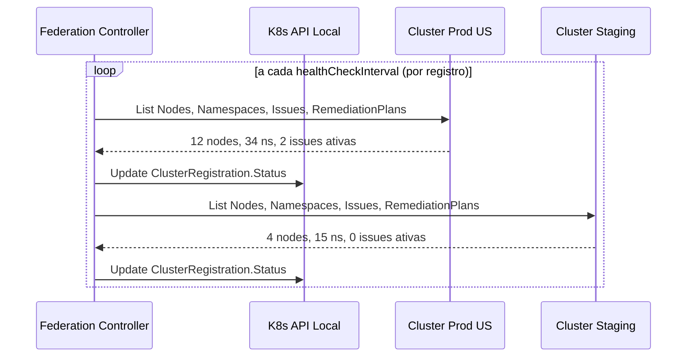
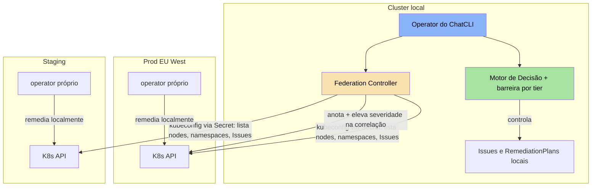

A **Federação Multi-Cluster** permite que um operator do ChatCLI enxergue além do próprio cluster. Você registra os outros clusters com uma `ClusterRegistration`; o operator verifica a saúde deles, correlaciona Issues novas com as Issues que estão rodando lá, marca cascatas de staging para produção e aplica uma política de remediação baseada no tier do seu próprio cluster.

<Info>
  A federação não requer um service mesh ou ferramentas externas. O operator
  se conecta diretamente a cada cluster registrado com um kubeconfig guardado num Secret.
</Info>

<Warning>
  A federação lê outros clusters; ela não os remedia. Detecção e remediação
  continuam locais: cada cluster que deve se curar sozinho roda o próprio
  operator (e a própria Instance do ChatCLI; só uma Instance por cluster dirige
  o AIOps). Pelo kubeconfig registrado o operator apenas lista nodes,
  namespaces, Issues e RemediationPlans, e atualiza Issues remotas quando as
  correlaciona.
</Warning>


## Por que Federação Multi-Cluster?

Em ambientes de produção modernos, a infraestrutura raramente se limita a um único cluster:

<CardGroup cols={3}>
  <Card title="Multi-Região" icon="globe">
    Clusters em us-east-1, eu-west-1 e ap-southeast-1 para latência e
    compliance regionais.
  </Card>
  <Card title="Multi-Ambiente" icon="layer-group">
    Staging, production e DR em clusters separados com diferentes políticas de
    segurança.
  </Card>
  <Card title="Multi-Tenant" icon="building">
    Clusters dedicados por equipe ou produto com isolamento forte de workloads.
  </Card>
</CardGroup>

Sem federação, cada cluster é um silo. A AIOps perde a capacidade de:

- Detectar que o mesmo problema afeta 5 clusters simultaneamente
- Correlacionar um deploy em staging com uma falha em produção
- Aplicar políticas de remediação diferenciadas por importância do cluster
- Agregar a saúde dos clusters em uma visão global


## ClusterRegistration CRD

A CRD `ClusterRegistration` é o ponto de entrada para adicionar clusters à federação. Crie-a no cluster onde o operator roda, em qualquer namespace; o Secret do kubeconfig precisa estar no mesmo namespace.

### Especificação Completa

```yaml
apiVersion: platform.chatcli.io/v1alpha1
kind: ClusterRegistration
metadata:
  name: prod-us-east-1
  namespace: chatcli-system
spec:
  displayName: prod-us-east-1
  # Secret no mesmo namespace; o kubeconfig precisa estar na chave "kubeconfig"
  kubeconfigSecretRef:
    name: cluster-prod-us-east-1-kubeconfig

  # Metadados do cluster
  region: us-east-1
  environment: prod       # prod | staging | dev
  tier: critical          # critical | standard | non-critical

  # Configuração de monitoramento
  healthCheckInterval: 30s

  # Informativos (armazenados, não aplicados)
  capabilities:
    - metrics-server
    - prometheus
  maxConcurrentRemediations: 2

status:
  # Preenchido pelo controller
  connected: true
  lastHealthCheck: "2026-03-19T14:30:00Z"
  kubernetesVersion: "v1.29.2"
  nodeCount: 12
  namespaceCount: 34
  activeIssues: 2
  activeRemediations: 1
```

### Campos do Spec

| Campo | Tipo | Obrigatório | Descrição |
|-------|------|-------------|-----------|
| `displayName` | string | Sim | Nome legível; também aceito por `clusterName` na [barreira por tier](#politica-de-remediacao-por-tier) |
| `kubeconfigSecretRef.name` | string | Sim | Secret no mesmo namespace com o kubeconfig na chave fixa `kubeconfig` |
| `region` | string | Não | Região geográfica do cluster (informativo) |
| `environment` | string | Sim (padrão `dev`) | `prod`, `staging` ou `dev`. A [detecção de cascata](#deteccao-de-cascata) usa `staging` e `prod` |
| `tier` | string | Sim (padrão `standard`) | `critical`, `standard` ou `non-critical` |
| `labels` | map | Não | Metadados livres (informativo) |
| `healthCheckInterval` | duration | Não | Intervalo do health check (padrão `30s`; um valor inválido volta para `30s`) |
| `capabilities` | []string | Não | Lista livre de recursos do cluster, por exemplo `metrics-server`, `prometheus`, `istio`. Só é armazenada; nenhum código a lê |
| `maxConcurrentRemediations` | int | Não | Padrão `3`. Só é armazenado; o operator não o aplica nas versões atuais |

### Campos do Status

| Campo | Tipo | Descrição |
|-------|------|-----------|
| `connected` | bool | Se o último health check teve sucesso |
| `lastHealthCheck` | timestamp | Horário do último health check, com sucesso ou não |
| `kubernetesVersion` | string | Versão do kubelet do primeiro node do cluster remoto |
| `nodeCount` | int | Número de nodes |
| `namespaceCount` | int | Número de namespaces |
| `activeIssues` | int | Issues não terminais no cluster remoto (0 quando as CRDs não estão instaladas lá) |
| `activeRemediations` | int | RemediationPlans em `Pending`, `Executing` ou `Verifying` no cluster remoto |
| `conditions` | []Condition | Definido no schema; o controller não preenche nenhuma |


## Como a Federação Funciona

### Kubeconfig e cache de clients

A cada reconcile o FederationReconciler lê `data.kubeconfig` do Secret indicado em `kubeconfigSecretRef`, no namespace da ClusterRegistration, monta um client do controller-runtime com ele e guarda esse client em cache pelo nome do registro. O cache é descartado quando um health check falha ou o registro é apagado, então um kubeconfig rotacionado é assumido depois do próximo health check com falha (ou de um restart do operator).

A identidade do kubeconfig precisa, no cluster remoto: `list` em nodes e namespaces para o health check; `list` em `issues` e `remediationplans` (grupo `platform.chatcli.io`) para os contadores e a correlação; e `update` em `issues` para a correlação anotá-las.

### Loop de Health Check

<Steps>
  <Step title="Listar Nodes">
    Lista os nodes remotos para verificar a conectividade, contá-los e ler a versão do kubelet do primeiro node.
  </Step>
  <Step title="Listar Namespaces">
    Lista os namespaces remotos e os conta.
  </Step>
  <Step title="Contar o trabalho de AIOps">
    Lista Issues e RemediationPlans remotos, quando essas CRDs existem lá, para preencher `activeIssues` e `activeRemediations`.
  </Step>
  <Step title="Atualizar Status">
    Grava `connected`, `lastHealthCheck`, `kubernetesVersion`, `nodeCount`, `namespaceCount`, `activeIssues` e `activeRemediations` e agenda o próximo ciclo após `healthCheckInterval`. Uma falha em qualquer passo anterior define `connected: false` e só atualiza `lastHealthCheck`.
  </Step>
</Steps>




## Correlação Cross-Cluster

Quando uma Issue é detectada, o IssueReconciler pede ao controller de federação que procure o mesmo problema em outros lugares. As duas verificações abaixo rodam só contra ClusterRegistrations `connected` cujo client do kubeconfig está em cache; sem registros elas custam duas listagens em cache e não mudam nada.

### Elevação Automática de Severidade

O controller lista as Issues ativas (não terminais) com o **mesmo `signalType`** no cluster local e em cada cluster conectado. Quando elas abrangem **3 ou mais clusters** (o local conta como um), toda Issue correspondente, local e remota, é anotada e elevada a `critical`:

```yaml
apiVersion: platform.chatcli.io/v1alpha1
kind: Issue
metadata:
  name: api-gateway-error-rate-1790368432
  namespace: production
  annotations:
    platform.chatcli.io/cross-cluster-correlation: "xcluster-7f8a2b3c"
    platform.chatcli.io/affected-clusters: "3"
spec:
  severity: critical   # elevada de medium
  signalType: error_rate
```

O contador `chatcli_operator_federation_cross_cluster_issues_total` incrementa uma vez por correlação. Uma Issue que mudou por baixo do update (conflito) é pulada e não há nova tentativa; uma correlação posterior, disparada por outra Issue nova com o mesmo sinal, a anota de novo com um novo id.

<Note>
  O id de correlação é uma annotation, então encontre as Issues relacionadas com:

  ```bash
  kubectl get issues -A -o json \
    | jq -r '.items[] | select(.metadata.annotations["platform.chatcli.io/cross-cluster-correlation"]=="xcluster-7f8a2b3c") | "\(.metadata.namespace)/\(.metadata.name)"'
  ```
</Note>

<Warning>
  `GET /api/v1/federation/correlations` não mostra essas correlações nas versões atuais: ele lê as annotations `platform.chatcli.io/correlation-id`, `correlated-clusters` e `elevated-severity`, que nada escreve, e pula Issues sem `correlation-id`, então devolve uma lista vazia. Use a consulta `kubectl` acima até as chaves serem alinhadas.
</Warning>

## Detecção de Cascata

A detecção de cascata marca uma Issue recém-detectada cujo recurso (mesmo nome) já falhou antes num cluster de staging: o mesmo problema está rolando pelos ambientes.

### Staging para Produção

A verificação precisa de pelo menos um registro conectado com `environment: staging` e um com `environment: prod`. Ela roda para toda Issue que o operator local detecta (o environment do próprio cluster local não é consultado); para essa Issue, o controller lista as Issues de cada cluster de staging e procura uma num recurso com o **mesmo nome** cujo `detectedAt` seja **anterior** ao da Issue local. A primeira correspondência anota a Issue local:

```yaml
metadata:
  annotations:
    platform.chatcli.io/cascade-detected: "true"
    platform.chatcli.io/cascade-source-cluster: "staging-us-east-1"
    platform.chatcli.io/cascade-source-issue: "checkout-crashloop-1790360001"
```

e incrementa `chatcli_operator_federation_cascade_detected_total`.

<Note>
  A annotation é todo o efeito: severidade, notificações e o prompt da IA não mudam por causa de uma cascata. Roteie a partir dela numa NotificationPolicy ou num filtro do dashboard se uma cascata deve acionar diferente.
</Note>

## Agregação de Status Global

Não existe CRD de status da federação. A visão agregada é calculada sob demanda pela API REST do operator a partir das ClusterRegistrations e das Issues locais:

| Endpoint | Retorna |
|----------|---------|
| `GET /api/v1/federation/status` (também `GET /api/v1/federation`) | `totalClusters`, `connectedClusters`, `disconnectedClusters` e `totalActiveIssues` (Issues locais que não estão `Resolved` nem `Failed`) |
| `GET /api/v1/federation/clusters?tier=critical` | Os registros, opcionalmente filtrados por tier |
| `GET /api/v1/clusters/global-status` | `totalClusters`, `healthyClusters` (conectados), `offlineClusters`, `degradedClusters` (sempre `0` nas versões atuais) e a lista de clusters |
| `GET /api/v1/federation/correlations` | Correlações cross-cluster (veja o aviso acima: vazio nas versões atuais) |

```json
{
  "apiVersion": "v1",
  "kind": "FederationStatus",
  "spec": {
    "totalClusters": 5,
    "connectedClusters": 4,
    "disconnectedClusters": 1,
    "totalActiveIssues": 12
  }
}
```

<Tabs>
  <Tab title="kubectl">
    ```bash
    # Listar todos os clusters registrados (a coluna CONNECTED vem de status.connected)
    kubectl get clusterregistrations -A

    # Ver clusters desconectados
    kubectl get clusterregistrations -A \
      -o jsonpath='{range .items[?(@.status.connected==false)]}{.metadata.namespace}/{.metadata.name}{"\n"}{end}'
    ```
  </Tab>
  <Tab title="API REST">
    ```bash
    # A API é servida pelo operator (Service chatcli-operator, porta 8090)
    kubectl -n chatcli-system port-forward svc/chatcli-operator 8090:8090 &

    # Status global
    curl -s -H "X-API-Key: $CHATCLI_API_KEY" http://localhost:8090/api/v1/federation/status | jq .

    # Listar clusters filtrados por tier
    curl -s -H "X-API-Key: $CHATCLI_API_KEY" "http://localhost:8090/api/v1/federation/clusters?tier=critical" | jq .
    ```
    Veja a [visão geral da API](/pt/reference/api/overview) para API keys e roles (`viewer` basta para esses endpoints).
  </Tab>
</Tabs>


## Política de Remediação por Tier

Cada cluster tem uma política de remediação baseada no `tier` da sua ClusterRegistration, que controla quanta autonomia o operator rodando **naquele cluster** concede antes de o [Motor de Decisão](/pt/features/aiops/decision-engine) avaliar a confiança.

### Definição de Políticas

| Tier | Severidade | Política | Justificativa |
|------|------------|----------|---------------|
| **critical** | Qualquer | Manual com aprovação | Zero risco de ação automática em infra crítica |
| **standard** | critical/high | Manual com aprovação | Conservadorismo para severidades altas |
| **standard** | medium/low | Auto-remediação | Automação para problemas de menor impacto |
| **non-critical** | Qualquer | Auto-remediação | Máxima automação em dev/test |
| qualquer outro valor | Qualquer | Manual com aprovação | Fallback seguro (o enum da CRD normalmente impede; o tier é comparado sem diferenciar maiúsculas) |

### Fiação

Diga ao operator qual registro é o seu próprio cluster:

```yaml
# Helm values (chatcli-operator)
clusterName: prod-us-east-1      # nome ou displayName da ClusterRegistration
```

ou `CHATCLI_OPERATOR_CLUSTER_NAME` no Deployment. O operator procura esse valor entre as ClusterRegistrations do **seu próprio cluster** (qualquer namespace), comparando com `metadata.name` ou `spec.displayName`, então registre também o cluster local; só o `tier` é lido, então a barreira funciona mesmo enquanto esse registro não está `connected`. Se nenhum registro corresponder, o erro é logado e os planos seguem só com as ApprovalPolicies. Vazio (o padrão) desliga a barreira por tier. Com ele definido, todo plano que chega a `Pending` e não foi segurado por uma ApprovalPolicy é comparado com a tabela: quando o tier diz "manual", o plano espera em `WaitingApproval` sob a política sintética `cluster-tier` (um aprovador, timeout de 30 minutos, decidido como qualquer ApprovalRequest) e suas annotations carregam `decision-mode: approval` e o motivo, por exemplo `Cluster prod-us-east-1 tier policy "manual" requires approval for high severity`.

<Note>
  A barreira por tier roda **antes** do Motor de Decisão e independe dele: um plano que o tier segura não é avaliado por confiança, e um plano que o tier libera ainda passa pelo motor quando ele está habilitado.
</Note>

## Exemplos YAML

### Registrar um Cluster de Produção

<CodeGroup>
```bash Secret (kubeconfig)
kubectl -n chatcli-system create secret generic cluster-prod-us-east-1-kubeconfig \
  --from-file=kubeconfig=./prod-us-east-1.kubeconfig
```

```yaml ClusterRegistration
apiVersion: platform.chatcli.io/v1alpha1
kind: ClusterRegistration
metadata:
  name: prod-us-east-1
  namespace: chatcli-system
  labels:
    environment: prod
    region: us-east-1
spec:
  displayName: prod-us-east-1
  kubeconfigSecretRef:
    name: cluster-prod-us-east-1-kubeconfig
  region: us-east-1
  environment: prod
  tier: critical
  healthCheckInterval: 30s
```
</CodeGroup>

### Registrar um Cluster de Staging

```yaml
apiVersion: platform.chatcli.io/v1alpha1
kind: ClusterRegistration
metadata:
  name: staging-us-east-1
  namespace: chatcli-system
  labels:
    environment: staging
    region: us-east-1
spec:
  displayName: staging-us-east-1
  kubeconfigSecretRef:
    name: cluster-staging-us-east-1-kubeconfig
  region: us-east-1
  environment: staging
  tier: non-critical
  healthCheckInterval: 60s
```

### Setup Multi-Região Completo

```yaml
# Produção US
apiVersion: platform.chatcli.io/v1alpha1
kind: ClusterRegistration
metadata:
  name: prod-us-east-1
  namespace: chatcli-system
spec:
  displayName: prod-us-east-1
  kubeconfigSecretRef:
    name: kubeconfig-prod-us
  region: us-east-1
  environment: prod
  tier: critical
  healthCheckInterval: 15s
---
# Produção EU
apiVersion: platform.chatcli.io/v1alpha1
kind: ClusterRegistration
metadata:
  name: prod-eu-west-1
  namespace: chatcli-system
spec:
  displayName: prod-eu-west-1
  kubeconfigSecretRef:
    name: kubeconfig-prod-eu
  region: eu-west-1
  environment: prod
  tier: critical
  healthCheckInterval: 15s
---
# Produção APAC
apiVersion: platform.chatcli.io/v1alpha1
kind: ClusterRegistration
metadata:
  name: prod-ap-southeast-1
  namespace: chatcli-system
spec:
  displayName: prod-ap-southeast-1
  kubeconfigSecretRef:
    name: kubeconfig-prod-ap
  region: ap-southeast-1
  environment: prod
  tier: critical
  healthCheckInterval: 15s
---
# Staging (compartilhado)
apiVersion: platform.chatcli.io/v1alpha1
kind: ClusterRegistration
metadata:
  name: staging-global
  namespace: chatcli-system
spec:
  displayName: staging-global
  kubeconfigSecretRef:
    name: kubeconfig-staging
  region: us-east-1
  environment: staging
  tier: non-critical
  healthCheckInterval: 60s
---
# DR (Disaster Recovery): o enum de environment não tem o valor "dr"
apiVersion: platform.chatcli.io/v1alpha1
kind: ClusterRegistration
metadata:
  name: dr-us-west-2
  namespace: chatcli-system
  labels:
    role: dr
spec:
  displayName: dr-us-west-2
  kubeconfigSecretRef:
    name: kubeconfig-dr
  region: us-west-2
  environment: prod
  tier: standard
  healthCheckInterval: 60s
```


## Monitoramento da Federação

### Métricas Prometheus

Servidas na porta de métricas do operator (8080, `/metrics`):

| Métrica | Tipo | Labels | Descrição |
|--------|------|--------|-------------|
| `chatcli_operator_federation_clusters_total` | Gauge | `status` (`connected`, `disconnected`) | Incrementada uma vez por resultado de health check |
| `chatcli_operator_federation_cross_cluster_issues_total` | Counter | - | Correlações cross-cluster levantadas |
| `chatcli_operator_federation_cascade_detected_total` | Counter | - | Cascatas de staging para produção detectadas |

<Warning>
  `chatcli_operator_federation_clusters_total` é declarada como gauge, mas o controller só a incrementa (uma vez por health check, por resultado) e nunca a define nem zera, então ela cresce a cada verificação em vez de informar o número atual de clusters. Trate-a como um contador de resultados de health check e use `rate()`/`increase()` sobre ela, ou leia `status.connected` das ClusterRegistrations para o estado atual.
</Warning>

### Dashboards Recomendados

<Accordion title="Grafana Dashboard: Federation Overview">
  ```json
  {
    "panels": [
      {
        "title": "Health Checks com Falha (5m)",
        "type": "stat",
        "targets": [{
          "expr": "increase(chatcli_operator_federation_clusters_total{status='disconnected'}[5m])"
        }]
      },
      {
        "title": "Correlações Cross-Cluster (24h)",
        "type": "stat",
        "targets": [{
          "expr": "increase(chatcli_operator_federation_cross_cluster_issues_total[24h])"
        }]
      },
      {
        "title": "Cascatas Detectadas (24h)",
        "type": "stat",
        "targets": [{
          "expr": "increase(chatcli_operator_federation_cascade_detected_total[24h])"
        }]
      }
    ]
  }
  ```
</Accordion>

### Alertas Recomendados

```yaml
groups:
  - name: federation
    rules:
      - alert: ClusterHealthCheckFailing
        expr: increase(chatcli_operator_federation_clusters_total{status="disconnected"}[5m]) > 0
        for: 5m
        labels:
          severity: critical
        annotations:
          summary: "Health checks de cluster federado falhando"
          description: >
            Pelo menos uma ClusterRegistration falhou no health check nos
            últimos 5 minutos. Verifique a conectividade de rede e o Secret do kubeconfig.

      - alert: CrossClusterIncident
        expr: increase(chatcli_operator_federation_cross_cluster_issues_total[10m]) > 0
        labels:
          severity: critical
        annotations:
          summary: "Incidente correlacionado cross-cluster"
          description: >
            O mesmo sinal está ativo em 3+ clusters; as Issues correspondentes
            foram elevadas a critical.

      - alert: CascadeDetected
        expr: increase(chatcli_operator_federation_cascade_detected_total[1h]) > 0
        labels:
          severity: warning
        annotations:
          summary: "Cascata de staging para produção detectada"
          description: >
            Um recurso que falhou em staging agora está falhando aqui.
            Verifique se o mesmo deploy foi aplicado nos dois ambientes.
```


## Arquitetura de Rede



<Tip>
  O operator precisa de conectividade de rede para o API server de cada cluster
  registrado. Em ambientes com rede restrita, considere usar um bastion host ou
  VPN dedicada para o tráfego de gerenciamento.
</Tip>


## Próximos Passos

<CardGroup cols={2}>
  <Card title="Motor de Decisão" icon="brain-circuit" href="/pt/features/aiops/decision-engine">
    Entenda como a confiança é calculada e como ela se combina com a barreira por tier.
  </Card>
  <Card title="Chaos Engineering" icon="explosion" href="/pt/features/aiops/chaos-engineering">
    Execute experimentos de chaos controlados para validar a remediação.
  </Card>
  <Card title="Auditoria e Compliance" icon="clipboard-check" href="/pt/features/aiops/audit-compliance">
    Audit trail de Issues, aprovações e remediações.
  </Card>
  <Card title="AIOps Platform" icon="brain" href="/pt/features/aiops-platform">
    Retorne à visão geral da plataforma AIOps.
  </Card>
</CardGroup>
