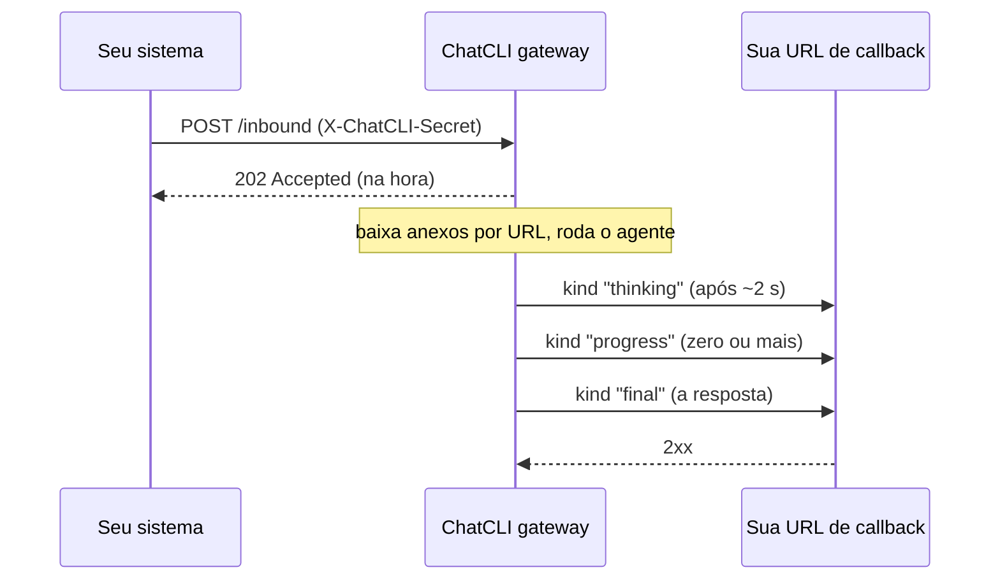

O webhook genérico é o canal para todo o resto: um chat interno, um sistema de tickets, um job de CI ou um script. O seu sistema **posta uma mensagem JSON** no gateway, e o gateway **posta as respostas de volta** numa URL de callback que você escolhe. Os dois sentidos levam o mesmo segredo compartilhado.

| | Webhook |
| --- | --- |
| Transporte | Um endpoint HTTP que o gateway serve, mais uma URL de callback para onde ele posta |
| Quem pode falar com o agente | Quem envia o segredo compartilhado |
| Voz recebida | Sim, como base64 ou URL na requisição |
| Respostas em voz | Não (só texto) |
| Imagens recebidas | Sim, como base64 ou URL na requisição |
| Imagens enviadas | Sim, como base64 no callback |
| Sinal de "trabalhando" | Um aviso curto (`kind: "thinking"`) se a resposta passar de uns 2 segundos |
| Entrega da resposta | Com retry e `X-ChatCLI-Delivery-ID` para descartar duplicatas |

## Como funciona



A requisição é respondida com `202` **antes** de qualquer trabalho: download de anexo e execução do agente acontecem depois. Tudo o que o agente produz chega na sua URL de callback, e o campo `kind` diz o que é cada post.

## Configuração

<Steps>
  <Step title="Configure o ChatCLI">
    ```bash
    export CHATCLI_WEBHOOK_ADDR=":8083"
    export CHATCLI_WEBHOOK_SECRET="um-texto-longo-e-aleatorio"
    export CHATCLI_WEBHOOK_CALLBACK_URL="https://seu-app.example.com/chatcli/respostas"
    # export CHATCLI_WEBHOOK_PATH="/inbound"   # o padrão
    ```

    Gere o segredo com algo como `openssl rand -hex 32` e coloque as mesmas linhas no seu `.env`.
  </Step>
  <Step title="Inicie o gateway">
    ```text
    /gateway start
    /gateway status     # webhook deve aparecer
    ```

    Para um gerenciador de serviços ou container, `chatcli gateway` roda o mesmo daemon em primeiro plano.
  </Step>
  <Step title="Suba um receptor de callback">
    Qualquer endpoint que aceite `POST` com JSON serve. Há um [receptor mínimo](#receptor-minimo) pronto mais abaixo.
  </Step>
  <Step title="Mande uma mensagem">
    ```bash
    curl -X POST http://localhost:8083/inbound \
      -H "Content-Type: application/json" \
      -H "X-ChatCLI-Secret: um-texto-longo-e-aleatorio" \
      -d '{"chat_id": "ticket-42", "user_id": "alice", "text": "resuma o log do último deploy"}'
    ```

    O gateway responde `202 Accepted` na hora; o aviso, o progresso e a resposta chegam na sua URL de callback.
  </Step>
</Steps>

## Variáveis de ambiente

| Variável | Obrigatória | Padrão | O que faz |
| --- | --- | --- | --- |
| `CHATCLI_WEBHOOK_ADDR` | sim | — | Endereço do endpoint, por exemplo `:8083`. O adaptador liga quando ela está definida. |
| `CHATCLI_WEBHOOK_SECRET` | sim, na prática | — | Segredo compartilhado conferido em toda requisição no `X-ChatCLI-Secret` e reenviado em todo callback. Sem ele **toda requisição é recusada** com `401`, e um aviso é registrado no start. |
| `CHATCLI_WEBHOOK_CALLBACK_URL` | sim, para receber respostas | — | Para onde o gateway posta o aviso, o progresso e a resposta. Sem ela as requisições continuam aceitas e rodam, mas **as respostas não são entregues a lugar nenhum**, um aviso é registrado no start e o `@send webhook` falha dizendo o que falta. |
| `CHATCLI_WEBHOOK_PATH` | não | `/inbound` | Caminho do endpoint. |
| `CHATCLI_WEBHOOK_HOME_CHANNEL` | não | — | `chat_id` usado nas [mensagens proativas](/pt/gateway/proactive-messaging) enviadas com `@send webhook`. |

As configurações compartilhadas (transcrição de voz, limites de mídia, Conversation Hub) estão na página do [Chat gateway](/pt/gateway/chat-gateway).

## A requisição

`POST` em `CHATCLI_WEBHOOK_PATH` com o header `X-ChatCLI-Secret` e um corpo JSON:

| Campo | Obrigatório | Significado |
| --- | --- | --- |
| `chat_id` | sim | Para onde as respostas desta mensagem são endereçadas: volta em todo callback. |
| `user_id` | não | Quem mandou. Sem ele, o remetente é o próprio `chat_id`. Veja [conversas e identidade](#conversas-e-identidade). |
| `text` | um entre texto, áudio ou imagem | A mensagem. |
| `audio_b64` ou `audio_url` | não | Uma mensagem de voz, em base64 ou como URL que o gateway baixa. É transcrita antes de o agente rodar. |
| `audio_mime` | não | O tipo MIME do áudio, por exemplo `audio/ogg`. |
| `image_b64` ou `image_url` | não | Uma imagem, em base64 ou como URL que o gateway baixa. |
| `image_mime` | não | O tipo MIME da imagem, por exemplo `image/png`. |

### Respostas

Toda recusa traz o motivo num corpo JSON, por exemplo `{"error": "missing_chat_id"}`:

| Status | `error` | Quando |
| --- | --- | --- |
| `202 Accepted` | — | A mensagem entrou na fila da conversa. |
| `400 Bad Request` | `invalid_json` | O corpo não é JSON válido. |
| `400 Bad Request` | `missing_chat_id` | Falta `chat_id`, ou ele está vazio. |
| `400 Bad Request` | `invalid_audio_b64` / `invalid_image_b64` | O base64 não decodifica. |
| `400 Bad Request` | `empty_message` | Não há texto, áudio nem imagem. |
| `401 Unauthorized` | `unauthorized` | O segredo está ausente ou errado, ou `CHATCLI_WEBHOOK_SECRET` não está definido. |
| `405 Method Not Allowed` | `method_not_allowed` | Qualquer coisa que não seja `POST` (a resposta traz `Allow: POST`). |
| `413 Request Entity Too Large` | `payload_too_large` | O corpo passou do teto (veja [limites](#limites)). |
| `429 Too Many Requests` | `queue_full` | Já há 32 mensagens esperando nesta conversa. Tente de novo depois. |
| `503 Service Unavailable` | `shutting_down` | O gateway está desligando. |

As mensagens de um mesmo `chat_id` chegam ao agente **na ordem em que foram aceitas**, mesmo quando uma delas espera o download de um anexo; conversas diferentes não esperam umas pelas outras.

## Os callbacks

Para cada mensagem o gateway posta JSON em `CHATCLI_WEBHOOK_CALLBACK_URL`:

```json
{
  "chat_id": "ticket-42",
  "kind": "final",
  "text": "O último deploy terminou em 4m12s; dois avisos, nenhum erro."
}
```

| `kind` | O que é | Tentativas |
| --- | --- | --- |
| `thinking` | O aviso de "trabalhando", quando a resposta passa de uns 2 segundos. | 1 |
| `progress` | Uma atualização enquanto o agente trabalha (plano, ferramenta em execução). Pode vir zero ou mais vezes. | 1 |
| `final` | A resposta. É sempre o último post de uma mensagem. | até 3 |
| `proactive` | Uma mensagem iniciada pelo agente com [`@send`](#mensagens-proativas), sem requisição de origem. | até 3 |

Quando a resposta traz uma imagem, o corpo também tem `image_b64`, e `image_mime` e `image_filename` quando são conhecidos.

Todo callback traz estes headers:

| Header | Valor |
| --- | --- |
| `Content-Type` | `application/json` |
| `X-ChatCLI-Secret` | O mesmo segredo da requisição. Confira antes de confiar no corpo. |
| `X-ChatCLI-Delivery-ID` | Um id aleatório, **igual em todas as tentativas** do mesmo post. |
| `X-ChatCLI-Delivery-Attempt` | `1`, `2` ou `3`. |

### Entrega e retries

Qualquer resposta `2xx` conta como entregue. Uma resposta `final` ou `proactive` é tentada de novo quando o seu endpoint falha de forma transitória: erro de rede, `408`, `429` ou `5xx`, com esperas de 1 s e 3 s. Um `4xx` qualquer outro é tratado como resposta do seu endpoint e não é repetido. O aviso e o progresso têm uma tentativa só, para que um receptor lento nunca segure o agente.

<Tip>
Como uma tentativa pode chegar ao seu endpoint e mesmo assim falhar no caminho de volta, guarde os `X-ChatCLI-Delivery-ID` já processados e ignore os repetidos.
</Tip>

### Receptor mínimo

<Tabs>
  <Tab title="Python">
    ```python
    import hmac, json, os
    from http.server import BaseHTTPRequestHandler, ThreadingHTTPServer

    SECRET = os.environ["CHATCLI_WEBHOOK_SECRET"].encode()
    seen = set()  # use um armazenamento com expiração em produção

    class Callback(BaseHTTPRequestHandler):
        def do_POST(self):
            if not hmac.compare_digest(self.headers.get("X-ChatCLI-Secret", "").encode(), SECRET):
                self.send_response(401); self.end_headers(); return
            body = json.loads(self.rfile.read(int(self.headers["Content-Length"])))
            delivery = self.headers.get("X-ChatCLI-Delivery-ID")
            if delivery not in seen:
                seen.add(delivery)
                if body.get("kind") == "final":
                    print(f"[{body['chat_id']}] resposta: {body['text']}")
                else:
                    print(f"[{body['chat_id']}] {body.get('kind')}: {body['text']}")
            self.send_response(200); self.end_headers()

    ThreadingHTTPServer(("0.0.0.0", 8090), Callback).serve_forever()
    ```
  </Tab>
  <Tab title="Node.js">
    ```javascript
    import { createServer } from "node:http";
    import { timingSafeEqual } from "node:crypto";

    const secret = Buffer.from(process.env.CHATCLI_WEBHOOK_SECRET);
    const seen = new Set(); // use um armazenamento com expiração em produção

    createServer((req, res) => {
      const got = Buffer.from(req.headers["x-chatcli-secret"] ?? "");
      if (got.length !== secret.length || !timingSafeEqual(got, secret)) {
        res.writeHead(401).end();
        return;
      }
      let raw = "";
      req.on("data", (chunk) => (raw += chunk));
      req.on("end", () => {
        const body = JSON.parse(raw);
        const delivery = req.headers["x-chatcli-delivery-id"];
        if (!seen.has(delivery)) {
          seen.add(delivery);
          console.log(`[${body.chat_id}] ${body.kind}: ${body.text}`);
        }
        res.writeHead(200).end();
      });
    }).listen(8090);
    ```
  </Tab>
</Tabs>

## Conversas e identidade

O `chat_id` diz **para onde** a resposta vai. **Qual conversa** o agente continua é decidida pelo [Conversation Hub](/pt/gateway/conversation-hub), a partir do remetente:

<Tabs>
  <Tab title="Padrão (single-user)">
    Todos os remetentes compartilham **uma conversa só**, a mesma do ChatCLI no seu terminal e dos outros canais. Uma pergunta feita no `ticket-42` aparece como contexto numa mensagem do `ticket-99`.

    Isso é o que você quer quando o webhook é só mais um jeito de **você** falar com o seu agente.
  </Tab>
  <Tab title="Multi-usuário (CHATCLI_HUB_ISOLATE=true)">
    Cada remetente tem a sua própria conversa, identificada por `user_id`. A mesma pessoa em dois `chat_id` diferentes continua a mesma conversa; pessoas diferentes nunca veem o contexto umas das outras. A memória de longo prazo também fica separada por remetente.

    Uma requisição sem `user_id` é atribuída ao `chat_id`, então cada conversa anônima fica isolada das outras.

    ```bash
    export CHATCLI_HUB_ISOLATE=true
    ```
  </Tab>
</Tabs>

<Warning>
Se várias pessoas falam com o agente por este canal, como num sistema de tickets, **defina `CHATCLI_HUB_ISOLATE=true`** e mande o `user_id` de cada uma. No padrão, todo mundo divide a mesma conversa.
</Warning>

Para juntar identidades de propósito (você no webhook e no Telegram, por exemplo), use os bindings do [Conversation Hub](/pt/gateway/conversation-hub).

## Anexos

- `audio_b64` e `image_b64` são decodificados na hora: base64 inválido é recusado com `400`.
- `audio_url` e `image_url` são baixados **depois** do `202`, pelo próprio gateway, até os tetos `CHATCLI_GATEWAY_MAX_AUDIO_BYTES` e `CHATCLI_GATEWAY_MAX_IMAGE_BYTES` (20 MB cada, por padrão).
- Se um download falhar, a mensagem roda assim mesmo e o agente é avisado, então a resposta diz que o anexo não chegou em vez de responder como se nada tivesse sido enviado.

## Mensagens proativas

Com `@send`, o agente posta no seu callback por conta própria, com `kind: "proactive"`:

```text
<tool_call name="@send" args='{"cmd":"send","args":{"to":"webhook:ticket-42","message":"Deploy concluído ✅"}}' />
```

`to: "webhook"` usa o `CHATCLI_WEBHOOK_HOME_CHANNEL`; `webhook:<chat_id>` endereça qualquer conversa, e tudo depois do primeiro `:` vira o `chat_id`. Sem `CHATCLI_WEBHOOK_CALLBACK_URL`, o envio falha dizendo o que falta. Detalhes em [Mensagens proativas](/pt/gateway/proactive-messaging).

## Segurança

<Warning>
Cada mensagem roda o agente com suas tools e o shell, sem confirmações. Trate o segredo como uma credencial de acesso à máquina e endureça com o [modo de segurança](/pt/security/overview).
</Warning>

- **Use um segredo longo e aleatório**, e sirva o endpoint e o callback por HTTPS quando forem acessíveis de outras máquinas.
- **Confira o `X-ChatCLI-Secret` no seu receptor**, com comparação em tempo constante, antes de confiar no corpo.
- `audio_url` e `image_url` são baixados pelo próprio gateway, então quem tem o segredo consegue fazer o gateway buscar uma URL da rede dele.

## Limites

- Uma resposta é cortada em **3500 caracteres** e termina com `…`.
- O corpo da requisição comporta o maior áudio e a maior imagem aceitos, os dois em base64, mais 1 MB: cerca de 57 MB com os tetos padrão. Acima disso, `413`.
- Até 32 mensagens esperando por conversa; acima disso, `429`.
- Só texto e imagens voltam no callback; respostas em voz não são enviadas neste canal.

## Veja também

<CardGroup cols={2}>
  <Card title="Chat gateway" icon="comments" href="/pt/gateway/chat-gateway">
    Como as mensagens rodam, voz, imagens, continuidade e os outros canais.
  </Card>
  <Card title="Conversation Hub" icon="share-nodes" href="/pt/gateway/conversation-hub">
    Conversa compartilhada, isolamento por remetente e bindings.
  </Card>
  <Card title="Mensagens proativas" icon="paper-plane" href="/pt/gateway/proactive-messaging">
    Deixe o agente postar no seu callback por conta própria com `@send`.
  </Card>
  <Card title="Modo de segurança" icon="shield-halved" href="/pt/security/overview">
    Limite o que um agente sem confirmações pode fazer.
  </Card>
</CardGroup>
