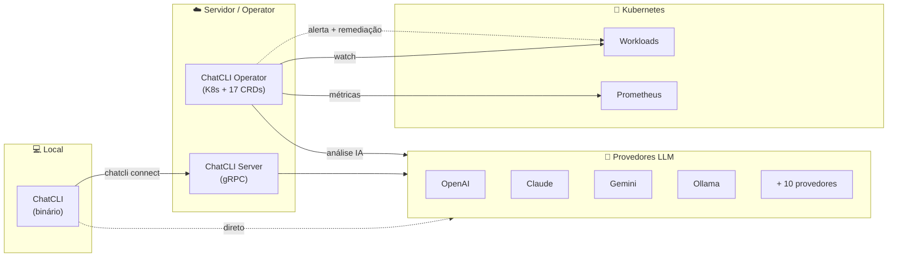

<div data-chatcli-banner="" className="chatcli-banner">
  <svg role="img" aria-label="ChatCLI" viewBox="-1.5 -1.5 321 63" className="chatcli-banner-art">
    <g className="cb-edges">
      <path d="M42 3.5 L46 3.5 L46 10" />
      <path d="M42 6.5 L44 6.5 L44 10" />
      <path d="M66 3.5 L70 3.5 L70 10" />
      <path d="M66 6.5 L68 6.5 L68 10" />
      <path d="M96 3.5 L100 3.5 L100 10" />
      <path d="M96 6.5 L98 6.5 L98 10" />
      <path d="M138 3.5 L142 3.5 L142 10" />
      <path d="M138 6.5 L140 6.5 L140 10" />
      <path d="M198 3.5 L202 3.5 L202 10" />
      <path d="M198 6.5 L200 6.5 L200 10" />
      <path d="M246 3.5 L250 3.5 L250 10" />
      <path d="M246 6.5 L248 6.5 L248 10" />
      <path d="M264 3.5 L268 3.5 L268 10" />
      <path d="M264 6.5 L266 6.5 L266 10" />
      <path d="M312 3.5 L316 3.5 L316 10" />
      <path d="M312 6.5 L314 6.5 L314 10" />
      <path d="M14 20 L14 13.5 L18 13.5" />
      <path d="M16 20 L16 16.5 L18 16.5" />
      <path d="M18 13.5 L24 13.5" />
      <path d="M18 16.5 L24 16.5" />
      <path d="M24 13.5 L30 13.5" />
      <path d="M24 16.5 L30 16.5" />
      <path d="M30 13.5 L36 13.5" />
      <path d="M30 16.5 L36 16.5" />
      <path d="M36 13.5 L42 13.5" />
      <path d="M36 16.5 L42 16.5" />
      <path d="M42 16.5 L46 16.5 L46 10" />
      <path d="M42 13.5 L44 13.5 L44 10" />
      <path d="M68 10 L68 20" />
      <path d="M70 10 L70 20" />
      <path d="M98 10 L98 20" />
      <path d="M100 10 L100 20" />
      <path d="M116 20 L116 13.5 L120 13.5" />
      <path d="M118 20 L118 16.5 L120 16.5" />
      <path d="M120 13.5 L126 13.5" />
      <path d="M120 16.5 L126 16.5" />
      <path d="M126 13.5 L132 13.5" />
      <path d="M126 16.5 L132 16.5" />
      <path d="M144 13.5 L148 13.5 L148 20" />
      <path d="M144 16.5 L146 16.5 L146 20" />
      <path d="M152 10 L152 16.5 L156 16.5" />
      <path d="M154 10 L154 13.5 L156 13.5" />
      <path d="M156 13.5 L162 13.5" />
      <path d="M156 16.5 L162 16.5" />
      <path d="M162 13.5 L168 13.5" />
      <path d="M162 16.5 L168 16.5" />
      <path d="M182 20 L182 13.5 L186 13.5" />
      <path d="M184 20 L184 16.5 L186 16.5" />
      <path d="M186 13.5 L192 13.5" />
      <path d="M186 16.5 L192 16.5" />
      <path d="M192 13.5 L198 13.5" />
      <path d="M192 16.5 L198 16.5" />
      <path d="M198 16.5 L202 16.5 L202 10" />
      <path d="M198 13.5 L200 13.5 L200 10" />
      <path d="M218 20 L218 13.5 L222 13.5" />
      <path d="M220 20 L220 16.5 L222 16.5" />
      <path d="M222 13.5 L228 13.5" />
      <path d="M222 16.5 L228 16.5" />
      <path d="M228 13.5 L234 13.5" />
      <path d="M228 16.5 L234 16.5" />
      <path d="M234 13.5 L240 13.5" />
      <path d="M234 16.5 L240 16.5" />
      <path d="M240 13.5 L246 13.5" />
      <path d="M240 16.5 L246 16.5" />
      <path d="M246 16.5 L250 16.5 L250 10" />
      <path d="M246 13.5 L248 13.5 L248 10" />
      <path d="M266 10 L266 20" />
      <path d="M268 10 L268 20" />
      <path d="M314 10 L314 20" />
      <path d="M316 10 L316 20" />
      <path d="M14 20 L14 30" />
      <path d="M16 20 L16 30" />
      <path d="M98 20 L98 30" />
      <path d="M100 20 L100 30" />
      <path d="M146 20 L146 30" />
      <path d="M148 20 L148 30" />
      <path d="M182 20 L182 30" />
      <path d="M184 20 L184 30" />
      <path d="M218 20 L218 30" />
      <path d="M220 20 L220 30" />
      <path d="M266 20 L266 30" />
      <path d="M268 20 L268 30" />
      <path d="M314 20 L314 30" />
      <path d="M316 20 L316 30" />
      <path d="M14 30 L14 40" />
      <path d="M16 30 L16 40" />
      <path d="M68 40 L68 33.5 L72 33.5" />
      <path d="M70 40 L70 36.5 L72 36.5" />
      <path d="M72 33.5 L78 33.5" />
      <path d="M72 36.5 L78 36.5" />
      <path d="M78 33.5 L84 33.5" />
      <path d="M78 36.5 L84 36.5" />
      <path d="M98 30 L98 40" />
      <path d="M100 30 L100 40" />
      <path d="M116 40 L116 33.5 L120 33.5" />
      <path d="M118 40 L118 36.5 L120 36.5" />
      <path d="M120 33.5 L126 33.5" />
      <path d="M120 36.5 L126 36.5" />
      <path d="M126 33.5 L132 33.5" />
      <path d="M126 36.5 L132 36.5" />
      <path d="M146 30 L146 40" />
      <path d="M148 30 L148 40" />
      <path d="M182 30 L182 40" />
      <path d="M184 30 L184 40" />
      <path d="M218 30 L218 40" />
      <path d="M220 30 L220 40" />
      <path d="M266 30 L266 40" />
      <path d="M268 30 L268 40" />
      <path d="M314 30 L314 40" />
      <path d="M316 30 L316 40" />
      <path d="M2 40 L2 46.5 L6 46.5" />
      <path d="M4 40 L4 43.5 L6 43.5" />
      <path d="M42 43.5 L46 43.5 L46 50" />
      <path d="M42 46.5 L44 46.5 L44 50" />
      <path d="M68 40 L68 50" />
      <path d="M70 40 L70 50" />
      <path d="M98 40 L98 50" />
      <path d="M100 40 L100 50" />
      <path d="M116 40 L116 50" />
      <path d="M118 40 L118 50" />
      <path d="M146 40 L146 50" />
      <path d="M148 40 L148 50" />
      <path d="M182 40 L182 50" />
      <path d="M184 40 L184 50" />
      <path d="M206 40 L206 46.5 L210 46.5" />
      <path d="M208 40 L208 43.5 L210 43.5" />
      <path d="M246 43.5 L250 43.5 L250 50" />
      <path d="M246 46.5 L248 46.5 L248 50" />
      <path d="M294 43.5 L298 43.5 L298 50" />
      <path d="M294 46.5 L296 46.5 L296 50" />
      <path d="M314 40 L314 50" />
      <path d="M316 40 L316 50" />
      <path d="M8 50 L8 56.5 L12 56.5" />
      <path d="M10 50 L10 53.5 L12 53.5" />
      <path d="M12 53.5 L18 53.5" />
      <path d="M12 56.5 L18 56.5" />
      <path d="M18 53.5 L24 53.5" />
      <path d="M18 56.5 L24 56.5" />
      <path d="M24 53.5 L30 53.5" />
      <path d="M24 56.5 L30 56.5" />
      <path d="M30 53.5 L36 53.5" />
      <path d="M30 56.5 L36 56.5" />
      <path d="M36 53.5 L42 53.5" />
      <path d="M36 56.5 L42 56.5" />
      <path d="M42 56.5 L46 56.5 L46 50" />
      <path d="M42 53.5 L44 53.5 L44 50" />
      <path d="M56 50 L56 56.5 L60 56.5" />
      <path d="M58 50 L58 53.5 L60 53.5" />
      <path d="M60 53.5 L66 53.5" />
      <path d="M60 56.5 L66 56.5" />
      <path d="M66 56.5 L70 56.5 L70 50" />
      <path d="M66 53.5 L68 53.5 L68 50" />
      <path d="M86 50 L86 56.5 L90 56.5" />
      <path d="M88 50 L88 53.5 L90 53.5" />
      <path d="M90 53.5 L96 53.5" />
      <path d="M90 56.5 L96 56.5" />
      <path d="M96 56.5 L100 56.5 L100 50" />
      <path d="M96 53.5 L98 53.5 L98 50" />
      <path d="M104 50 L104 56.5 L108 56.5" />
      <path d="M106 50 L106 53.5 L108 53.5" />
      <path d="M108 53.5 L114 53.5" />
      <path d="M108 56.5 L114 56.5" />
      <path d="M114 56.5 L118 56.5 L118 50" />
      <path d="M114 53.5 L116 53.5 L116 50" />
      <path d="M134 50 L134 56.5 L138 56.5" />
      <path d="M136 50 L136 53.5 L138 53.5" />
      <path d="M138 53.5 L144 53.5" />
      <path d="M138 56.5 L144 56.5" />
      <path d="M144 56.5 L148 56.5 L148 50" />
      <path d="M144 53.5 L146 53.5 L146 50" />
      <path d="M170 50 L170 56.5 L174 56.5" />
      <path d="M172 50 L172 53.5 L174 53.5" />
      <path d="M174 53.5 L180 53.5" />
      <path d="M174 56.5 L180 56.5" />
      <path d="M180 56.5 L184 56.5 L184 50" />
      <path d="M180 53.5 L182 53.5 L182 50" />
      <path d="M212 50 L212 56.5 L216 56.5" />
      <path d="M214 50 L214 53.5 L216 53.5" />
      <path d="M216 53.5 L222 53.5" />
      <path d="M216 56.5 L222 56.5" />
      <path d="M222 53.5 L228 53.5" />
      <path d="M222 56.5 L228 56.5" />
      <path d="M228 53.5 L234 53.5" />
      <path d="M228 56.5 L234 56.5" />
      <path d="M234 53.5 L240 53.5" />
      <path d="M234 56.5 L240 56.5" />
      <path d="M240 53.5 L246 53.5" />
      <path d="M240 56.5 L246 56.5" />
      <path d="M246 56.5 L250 56.5 L250 50" />
      <path d="M246 53.5 L248 53.5 L248 50" />
      <path d="M254 50 L254 56.5 L258 56.5" />
      <path d="M256 50 L256 53.5 L258 53.5" />
      <path d="M258 53.5 L264 53.5" />
      <path d="M258 56.5 L264 56.5" />
      <path d="M264 53.5 L270 53.5" />
      <path d="M264 56.5 L270 56.5" />
      <path d="M270 53.5 L276 53.5" />
      <path d="M270 56.5 L276 56.5" />
      <path d="M276 53.5 L282 53.5" />
      <path d="M276 56.5 L282 56.5" />
      <path d="M282 53.5 L288 53.5" />
      <path d="M282 56.5 L288 56.5" />
      <path d="M288 53.5 L294 53.5" />
      <path d="M288 56.5 L294 56.5" />
      <path d="M294 56.5 L298 56.5 L298 50" />
      <path d="M294 53.5 L296 53.5 L296 50" />
      <path d="M302 50 L302 56.5 L306 56.5" />
      <path d="M304 50 L304 53.5 L306 53.5" />
      <path d="M306 53.5 L312 53.5" />
      <path d="M306 56.5 L312 56.5" />
      <path d="M312 56.5 L316 56.5 L316 50" />
      <path d="M312 53.5 L314 53.5 L314 50" />
    </g>
    <g className="cb-fills">
      <rect x="5.95" y="-0.05" width="6.1" height="10.1" style={{fill: "color-mix(in oklch, var(--cb-a) 97%, var(--cb-b))"}} />
      <rect x="11.95" y="-0.05" width="6.1" height="10.1" style={{fill: "color-mix(in oklch, var(--cb-a) 93%, var(--cb-b))"}} />
      <rect x="17.95" y="-0.05" width="6.1" height="10.1" style={{fill: "color-mix(in oklch, var(--cb-a) 90%, var(--cb-b))"}} />
      <rect x="23.95" y="-0.05" width="6.1" height="10.1" style={{fill: "color-mix(in oklch, var(--cb-a) 86%, var(--cb-b))"}} />
      <rect x="29.95" y="-0.05" width="6.1" height="10.1" style={{fill: "color-mix(in oklch, var(--cb-a) 83%, var(--cb-b))"}} />
      <rect x="35.95" y="-0.05" width="6.1" height="10.1" style={{fill: "color-mix(in oklch, var(--cb-a) 79%, var(--cb-b))"}} />
      <rect x="53.95" y="-0.05" width="6.1" height="10.1" style={{fill: "color-mix(in oklch, var(--cb-a) 69%, var(--cb-b))"}} />
      <rect x="59.95" y="-0.05" width="6.1" height="10.1" style={{fill: "color-mix(in oklch, var(--cb-a) 65%, var(--cb-b))"}} />
      <rect x="83.95" y="-0.05" width="6.1" height="10.1" style={{fill: "color-mix(in oklch, var(--cb-a) 51%, var(--cb-b))"}} />
      <rect x="89.95" y="-0.05" width="6.1" height="10.1" style={{fill: "color-mix(in oklch, var(--cb-a) 48%, var(--cb-b))"}} />
      <rect x="107.95" y="-0.05" width="6.1" height="10.1" style={{fill: "color-mix(in oklch, var(--cb-a) 37%, var(--cb-b))"}} />
      <rect x="113.95" y="-0.05" width="6.1" height="10.1" style={{fill: "color-mix(in oklch, var(--cb-a) 34%, var(--cb-b))"}} />
      <rect x="119.95" y="-0.05" width="6.1" height="10.1" style={{fill: "color-mix(in oklch, var(--cb-a) 30%, var(--cb-b))"}} />
      <rect x="125.95" y="-0.05" width="6.1" height="10.1" style={{fill: "color-mix(in oklch, var(--cb-a) 27%, var(--cb-b))"}} />
      <rect x="131.95" y="-0.05" width="6.1" height="10.1" style={{fill: "color-mix(in oklch, var(--cb-a) 23%, var(--cb-b))"}} />
      <rect x="149.95" y="-0.05" width="6.1" height="10.1" style={{fill: "color-mix(in oklch, var(--cb-a) 13%, var(--cb-b))"}} />
      <rect x="155.95" y="-0.05" width="6.1" height="10.1" style={{fill: "color-mix(in oklch, var(--cb-a) 9%, var(--cb-b))"}} />
      <rect x="161.95" y="-0.05" width="6.1" height="10.1" style={{fill: "color-mix(in oklch, var(--cb-a) 6%, var(--cb-b))"}} />
      <rect x="167.95" y="-0.05" width="6.1" height="10.1" style={{fill: "color-mix(in oklch, var(--cb-a) 2%, var(--cb-b))"}} />
      <rect x="173.95" y="-0.05" width="6.1" height="10.1" style={{fill: "color-mix(in oklch, var(--cb-b) 98%, var(--cb-c))"}} />
      <rect x="179.95" y="-0.05" width="6.1" height="10.1" style={{fill: "color-mix(in oklch, var(--cb-b) 94%, var(--cb-c))"}} />
      <rect x="185.95" y="-0.05" width="6.1" height="10.1" style={{fill: "color-mix(in oklch, var(--cb-b) 90%, var(--cb-c))"}} />
      <rect x="191.95" y="-0.05" width="6.1" height="10.1" style={{fill: "color-mix(in oklch, var(--cb-b) 85%, var(--cb-c))"}} />
      <rect x="209.95" y="-0.05" width="6.1" height="10.1" style={{fill: "color-mix(in oklch, var(--cb-b) 73%, var(--cb-c))"}} />
      <rect x="215.95" y="-0.05" width="6.1" height="10.1" style={{fill: "color-mix(in oklch, var(--cb-b) 68%, var(--cb-c))"}} />
      <rect x="221.95" y="-0.05" width="6.1" height="10.1" style={{fill: "color-mix(in oklch, var(--cb-b) 64%, var(--cb-c))"}} />
      <rect x="227.95" y="-0.05" width="6.1" height="10.1" style={{fill: "color-mix(in oklch, var(--cb-b) 60%, var(--cb-c))"}} />
      <rect x="233.95" y="-0.05" width="6.1" height="10.1" style={{fill: "color-mix(in oklch, var(--cb-b) 56%, var(--cb-c))"}} />
      <rect x="239.95" y="-0.05" width="6.1" height="10.1" style={{fill: "color-mix(in oklch, var(--cb-b) 51%, var(--cb-c))"}} />
      <rect x="251.95" y="-0.05" width="6.1" height="10.1" style={{fill: "color-mix(in oklch, var(--cb-b) 43%, var(--cb-c))"}} />
      <rect x="257.95" y="-0.05" width="6.1" height="10.1" style={{fill: "color-mix(in oklch, var(--cb-b) 38%, var(--cb-c))"}} />
      <rect x="299.95" y="-0.05" width="6.1" height="10.1" style={{fill: "color-mix(in oklch, var(--cb-b) 9%, var(--cb-c))"}} />
      <rect x="305.95" y="-0.05" width="6.1" height="10.1" style={{fill: "color-mix(in oklch, var(--cb-b) 4%, var(--cb-c))"}} />
      <rect x="-0.05" y="9.95" width="6.1" height="10.1" style={{fill: "color-mix(in oklch, var(--cb-a) 100%, var(--cb-b))"}} />
      <rect x="5.95" y="9.95" width="6.1" height="10.1" style={{fill: "color-mix(in oklch, var(--cb-a) 97%, var(--cb-b))"}} />
      <rect x="53.95" y="9.95" width="6.1" height="10.1" style={{fill: "color-mix(in oklch, var(--cb-a) 69%, var(--cb-b))"}} />
      <rect x="59.95" y="9.95" width="6.1" height="10.1" style={{fill: "color-mix(in oklch, var(--cb-a) 65%, var(--cb-b))"}} />
      <rect x="83.95" y="9.95" width="6.1" height="10.1" style={{fill: "color-mix(in oklch, var(--cb-a) 51%, var(--cb-b))"}} />
      <rect x="89.95" y="9.95" width="6.1" height="10.1" style={{fill: "color-mix(in oklch, var(--cb-a) 48%, var(--cb-b))"}} />
      <rect x="101.95" y="9.95" width="6.1" height="10.1" style={{fill: "color-mix(in oklch, var(--cb-a) 41%, var(--cb-b))"}} />
      <rect x="107.95" y="9.95" width="6.1" height="10.1" style={{fill: "color-mix(in oklch, var(--cb-a) 37%, var(--cb-b))"}} />
      <rect x="131.95" y="9.95" width="6.1" height="10.1" style={{fill: "color-mix(in oklch, var(--cb-a) 23%, var(--cb-b))"}} />
      <rect x="137.95" y="9.95" width="6.1" height="10.1" style={{fill: "color-mix(in oklch, var(--cb-a) 20%, var(--cb-b))"}} />
      <rect x="167.95" y="9.95" width="6.1" height="10.1" style={{fill: "color-mix(in oklch, var(--cb-a) 2%, var(--cb-b))"}} />
      <rect x="173.95" y="9.95" width="6.1" height="10.1" style={{fill: "color-mix(in oklch, var(--cb-b) 98%, var(--cb-c))"}} />
      <rect x="203.95" y="9.95" width="6.1" height="10.1" style={{fill: "color-mix(in oklch, var(--cb-b) 77%, var(--cb-c))"}} />
      <rect x="209.95" y="9.95" width="6.1" height="10.1" style={{fill: "color-mix(in oklch, var(--cb-b) 73%, var(--cb-c))"}} />
      <rect x="251.95" y="9.95" width="6.1" height="10.1" style={{fill: "color-mix(in oklch, var(--cb-b) 43%, var(--cb-c))"}} />
      <rect x="257.95" y="9.95" width="6.1" height="10.1" style={{fill: "color-mix(in oklch, var(--cb-b) 38%, var(--cb-c))"}} />
      <rect x="299.95" y="9.95" width="6.1" height="10.1" style={{fill: "color-mix(in oklch, var(--cb-b) 9%, var(--cb-c))"}} />
      <rect x="305.95" y="9.95" width="6.1" height="10.1" style={{fill: "color-mix(in oklch, var(--cb-b) 4%, var(--cb-c))"}} />
      <rect x="-0.05" y="19.95" width="6.1" height="10.1" style={{fill: "color-mix(in oklch, var(--cb-a) 100%, var(--cb-b))"}} />
      <rect x="5.95" y="19.95" width="6.1" height="10.1" style={{fill: "color-mix(in oklch, var(--cb-a) 97%, var(--cb-b))"}} />
      <rect x="53.95" y="19.95" width="6.1" height="10.1" style={{fill: "color-mix(in oklch, var(--cb-a) 69%, var(--cb-b))"}} />
      <rect x="59.95" y="19.95" width="6.1" height="10.1" style={{fill: "color-mix(in oklch, var(--cb-a) 65%, var(--cb-b))"}} />
      <rect x="65.95" y="19.95" width="6.1" height="10.1" style={{fill: "color-mix(in oklch, var(--cb-a) 62%, var(--cb-b))"}} />
      <rect x="71.95" y="19.95" width="6.1" height="10.1" style={{fill: "color-mix(in oklch, var(--cb-a) 58%, var(--cb-b))"}} />
      <rect x="77.95" y="19.95" width="6.1" height="10.1" style={{fill: "color-mix(in oklch, var(--cb-a) 55%, var(--cb-b))"}} />
      <rect x="83.95" y="19.95" width="6.1" height="10.1" style={{fill: "color-mix(in oklch, var(--cb-a) 51%, var(--cb-b))"}} />
      <rect x="89.95" y="19.95" width="6.1" height="10.1" style={{fill: "color-mix(in oklch, var(--cb-a) 48%, var(--cb-b))"}} />
      <rect x="101.95" y="19.95" width="6.1" height="10.1" style={{fill: "color-mix(in oklch, var(--cb-a) 41%, var(--cb-b))"}} />
      <rect x="107.95" y="19.95" width="6.1" height="10.1" style={{fill: "color-mix(in oklch, var(--cb-a) 37%, var(--cb-b))"}} />
      <rect x="113.95" y="19.95" width="6.1" height="10.1" style={{fill: "color-mix(in oklch, var(--cb-a) 34%, var(--cb-b))"}} />
      <rect x="119.95" y="19.95" width="6.1" height="10.1" style={{fill: "color-mix(in oklch, var(--cb-a) 30%, var(--cb-b))"}} />
      <rect x="125.95" y="19.95" width="6.1" height="10.1" style={{fill: "color-mix(in oklch, var(--cb-a) 27%, var(--cb-b))"}} />
      <rect x="131.95" y="19.95" width="6.1" height="10.1" style={{fill: "color-mix(in oklch, var(--cb-a) 23%, var(--cb-b))"}} />
      <rect x="137.95" y="19.95" width="6.1" height="10.1" style={{fill: "color-mix(in oklch, var(--cb-a) 20%, var(--cb-b))"}} />
      <rect x="167.95" y="19.95" width="6.1" height="10.1" style={{fill: "color-mix(in oklch, var(--cb-a) 2%, var(--cb-b))"}} />
      <rect x="173.95" y="19.95" width="6.1" height="10.1" style={{fill: "color-mix(in oklch, var(--cb-b) 98%, var(--cb-c))"}} />
      <rect x="203.95" y="19.95" width="6.1" height="10.1" style={{fill: "color-mix(in oklch, var(--cb-b) 77%, var(--cb-c))"}} />
      <rect x="209.95" y="19.95" width="6.1" height="10.1" style={{fill: "color-mix(in oklch, var(--cb-b) 73%, var(--cb-c))"}} />
      <rect x="251.95" y="19.95" width="6.1" height="10.1" style={{fill: "color-mix(in oklch, var(--cb-b) 43%, var(--cb-c))"}} />
      <rect x="257.95" y="19.95" width="6.1" height="10.1" style={{fill: "color-mix(in oklch, var(--cb-b) 38%, var(--cb-c))"}} />
      <rect x="299.95" y="19.95" width="6.1" height="10.1" style={{fill: "color-mix(in oklch, var(--cb-b) 9%, var(--cb-c))"}} />
      <rect x="305.95" y="19.95" width="6.1" height="10.1" style={{fill: "color-mix(in oklch, var(--cb-b) 4%, var(--cb-c))"}} />
      <rect x="-0.05" y="29.95" width="6.1" height="10.1" style={{fill: "color-mix(in oklch, var(--cb-a) 100%, var(--cb-b))"}} />
      <rect x="5.95" y="29.95" width="6.1" height="10.1" style={{fill: "color-mix(in oklch, var(--cb-a) 97%, var(--cb-b))"}} />
      <rect x="53.95" y="29.95" width="6.1" height="10.1" style={{fill: "color-mix(in oklch, var(--cb-a) 69%, var(--cb-b))"}} />
      <rect x="59.95" y="29.95" width="6.1" height="10.1" style={{fill: "color-mix(in oklch, var(--cb-a) 65%, var(--cb-b))"}} />
      <rect x="83.95" y="29.95" width="6.1" height="10.1" style={{fill: "color-mix(in oklch, var(--cb-a) 51%, var(--cb-b))"}} />
      <rect x="89.95" y="29.95" width="6.1" height="10.1" style={{fill: "color-mix(in oklch, var(--cb-a) 48%, var(--cb-b))"}} />
      <rect x="101.95" y="29.95" width="6.1" height="10.1" style={{fill: "color-mix(in oklch, var(--cb-a) 41%, var(--cb-b))"}} />
      <rect x="107.95" y="29.95" width="6.1" height="10.1" style={{fill: "color-mix(in oklch, var(--cb-a) 37%, var(--cb-b))"}} />
      <rect x="131.95" y="29.95" width="6.1" height="10.1" style={{fill: "color-mix(in oklch, var(--cb-a) 23%, var(--cb-b))"}} />
      <rect x="137.95" y="29.95" width="6.1" height="10.1" style={{fill: "color-mix(in oklch, var(--cb-a) 20%, var(--cb-b))"}} />
      <rect x="167.95" y="29.95" width="6.1" height="10.1" style={{fill: "color-mix(in oklch, var(--cb-a) 2%, var(--cb-b))"}} />
      <rect x="173.95" y="29.95" width="6.1" height="10.1" style={{fill: "color-mix(in oklch, var(--cb-b) 98%, var(--cb-c))"}} />
      <rect x="203.95" y="29.95" width="6.1" height="10.1" style={{fill: "color-mix(in oklch, var(--cb-b) 77%, var(--cb-c))"}} />
      <rect x="209.95" y="29.95" width="6.1" height="10.1" style={{fill: "color-mix(in oklch, var(--cb-b) 73%, var(--cb-c))"}} />
      <rect x="251.95" y="29.95" width="6.1" height="10.1" style={{fill: "color-mix(in oklch, var(--cb-b) 43%, var(--cb-c))"}} />
      <rect x="257.95" y="29.95" width="6.1" height="10.1" style={{fill: "color-mix(in oklch, var(--cb-b) 38%, var(--cb-c))"}} />
      <rect x="299.95" y="29.95" width="6.1" height="10.1" style={{fill: "color-mix(in oklch, var(--cb-b) 9%, var(--cb-c))"}} />
      <rect x="305.95" y="29.95" width="6.1" height="10.1" style={{fill: "color-mix(in oklch, var(--cb-b) 4%, var(--cb-c))"}} />
      <rect x="5.95" y="39.95" width="6.1" height="10.1" style={{fill: "color-mix(in oklch, var(--cb-a) 97%, var(--cb-b))"}} />
      <rect x="11.95" y="39.95" width="6.1" height="10.1" style={{fill: "color-mix(in oklch, var(--cb-a) 93%, var(--cb-b))"}} />
      <rect x="17.95" y="39.95" width="6.1" height="10.1" style={{fill: "color-mix(in oklch, var(--cb-a) 90%, var(--cb-b))"}} />
      <rect x="23.95" y="39.95" width="6.1" height="10.1" style={{fill: "color-mix(in oklch, var(--cb-a) 86%, var(--cb-b))"}} />
      <rect x="29.95" y="39.95" width="6.1" height="10.1" style={{fill: "color-mix(in oklch, var(--cb-a) 83%, var(--cb-b))"}} />
      <rect x="35.95" y="39.95" width="6.1" height="10.1" style={{fill: "color-mix(in oklch, var(--cb-a) 79%, var(--cb-b))"}} />
      <rect x="53.95" y="39.95" width="6.1" height="10.1" style={{fill: "color-mix(in oklch, var(--cb-a) 69%, var(--cb-b))"}} />
      <rect x="59.95" y="39.95" width="6.1" height="10.1" style={{fill: "color-mix(in oklch, var(--cb-a) 65%, var(--cb-b))"}} />
      <rect x="83.95" y="39.95" width="6.1" height="10.1" style={{fill: "color-mix(in oklch, var(--cb-a) 51%, var(--cb-b))"}} />
      <rect x="89.95" y="39.95" width="6.1" height="10.1" style={{fill: "color-mix(in oklch, var(--cb-a) 48%, var(--cb-b))"}} />
      <rect x="101.95" y="39.95" width="6.1" height="10.1" style={{fill: "color-mix(in oklch, var(--cb-a) 41%, var(--cb-b))"}} />
      <rect x="107.95" y="39.95" width="6.1" height="10.1" style={{fill: "color-mix(in oklch, var(--cb-a) 37%, var(--cb-b))"}} />
      <rect x="131.95" y="39.95" width="6.1" height="10.1" style={{fill: "color-mix(in oklch, var(--cb-a) 23%, var(--cb-b))"}} />
      <rect x="137.95" y="39.95" width="6.1" height="10.1" style={{fill: "color-mix(in oklch, var(--cb-a) 20%, var(--cb-b))"}} />
      <rect x="167.95" y="39.95" width="6.1" height="10.1" style={{fill: "color-mix(in oklch, var(--cb-a) 2%, var(--cb-b))"}} />
      <rect x="173.95" y="39.95" width="6.1" height="10.1" style={{fill: "color-mix(in oklch, var(--cb-b) 98%, var(--cb-c))"}} />
      <rect x="209.95" y="39.95" width="6.1" height="10.1" style={{fill: "color-mix(in oklch, var(--cb-b) 73%, var(--cb-c))"}} />
      <rect x="215.95" y="39.95" width="6.1" height="10.1" style={{fill: "color-mix(in oklch, var(--cb-b) 68%, var(--cb-c))"}} />
      <rect x="221.95" y="39.95" width="6.1" height="10.1" style={{fill: "color-mix(in oklch, var(--cb-b) 64%, var(--cb-c))"}} />
      <rect x="227.95" y="39.95" width="6.1" height="10.1" style={{fill: "color-mix(in oklch, var(--cb-b) 60%, var(--cb-c))"}} />
      <rect x="233.95" y="39.95" width="6.1" height="10.1" style={{fill: "color-mix(in oklch, var(--cb-b) 56%, var(--cb-c))"}} />
      <rect x="239.95" y="39.95" width="6.1" height="10.1" style={{fill: "color-mix(in oklch, var(--cb-b) 51%, var(--cb-c))"}} />
      <rect x="251.95" y="39.95" width="6.1" height="10.1" style={{fill: "color-mix(in oklch, var(--cb-b) 43%, var(--cb-c))"}} />
      <rect x="257.95" y="39.95" width="6.1" height="10.1" style={{fill: "color-mix(in oklch, var(--cb-b) 38%, var(--cb-c))"}} />
      <rect x="263.95" y="39.95" width="6.1" height="10.1" style={{fill: "color-mix(in oklch, var(--cb-b) 34%, var(--cb-c))"}} />
      <rect x="269.95" y="39.95" width="6.1" height="10.1" style={{fill: "color-mix(in oklch, var(--cb-b) 30%, var(--cb-c))"}} />
      <rect x="275.95" y="39.95" width="6.1" height="10.1" style={{fill: "color-mix(in oklch, var(--cb-b) 26%, var(--cb-c))"}} />
      <rect x="281.95" y="39.95" width="6.1" height="10.1" style={{fill: "color-mix(in oklch, var(--cb-b) 21%, var(--cb-c))"}} />
      <rect x="287.95" y="39.95" width="6.1" height="10.1" style={{fill: "color-mix(in oklch, var(--cb-b) 17%, var(--cb-c))"}} />
      <rect x="299.95" y="39.95" width="6.1" height="10.1" style={{fill: "color-mix(in oklch, var(--cb-b) 9%, var(--cb-c))"}} />
      <rect x="305.95" y="39.95" width="6.1" height="10.1" style={{fill: "color-mix(in oklch, var(--cb-b) 4%, var(--cb-c))"}} />
    </g>
  </svg>
</div>
<div className="cb-prompt" aria-hidden="true"><span className="cb-prompt-sign">$</span> chatcli<span className="cb-cursor" /></div>

<p className="chatcli-banner-tagline"><strong>O terminal vira um engenheiro de IA.</strong><br />Catorze provedores, coder mode, agentes, um servidor gRPC e um operator Kubernetes: um único binário Go.</p>

{/* release-strip:start */}
<a className="cc-release" href="/pt/releases/1.214.0"><span className="cc-release-label">Nova release</span><span className="cc-release-version">v1.214.0</span><span className="cc-release-summary">chatcli eval, an offline evaluation harness; generate /help and chatcli ‑‑help from one command registry</span><span className="cc-release-cta">Ler as notas →</span></a>
{/* release-strip:end */}

<div className="cc-entry">
<CardGroup cols={4}>
  <Card title="Início rápido" icon="rocket" href="/pt/start/quickstart">
    Instale o ChatCLI, conecte um provedor e converse em menos de cinco minutos.
  </Card>
  <Card title="Coder mode" icon="code" href="/pt/usage/coder-mode">
    O {'/coder'} lê, edita, roda testes e faz rollback, num loop que você aprova.
  </Card>
  <Card title="Agentes e harness" icon="robot" href="/pt/agents/harness/overview">
    Squads multiagente, task graphs e sete padrões de confiabilidade.
  </Card>
  <Card title="Servidor e Kubernetes" icon="dharmachakra" href="/pt/server/server-mode">
    Compartilhe provedores com a equipe via gRPC e rode AIOps nos seus clusters.
  </Card>
</CardGroup>
</div>

## Início rápido

<Steps>
  <Step title="Instale o ChatCLI">
    <Tabs>
      <Tab title="Homebrew">
        ```bash
        brew tap diillson/chatcli && brew install chatcli
        ```
      </Tab>
      <Tab title="go install">
        ```bash
        go install github.com/diillson/chatcli@latest
        ```
      </Tab>
      <Tab title="Docker">
        ```bash
        docker pull ghcr.io/diillson/chatcli:latest
        ```
      </Tab>
      <Tab title="Binário">
        Baixe o binário da sua plataforma em [Releases](https://github.com/diillson/chatcli/releases) e depois:

        ```bash
        chmod +x chatcli && sudo mv chatcli /usr/local/bin/
        ```
      </Tab>
    </Tabs>

    Todas as formas de instalar, incluindo Helm, build a partir do código-fonte e login OAuth, estão na página de [Instalação](/pt/start/installation).
  </Step>
  <Step title="Configure um provedor">
    <CodeGroup>
    ```bash OpenAI
    echo 'LLM_PROVIDER=OPENAI' > .env
    echo 'OPENAI_API_KEY=sk-xxx' >> .env
    ```

    ```bash Claude
    echo 'LLM_PROVIDER=CLAUDEAI' > .env
    echo 'ANTHROPIC_API_KEY=sk-ant-xxx' >> .env
    ```

    ```bash Gemini
    echo 'LLM_PROVIDER=GOOGLEAI' > .env
    echo 'GOOGLEAI_API_KEY=AIza...' >> .env
    ```

    ```bash Ollama (local)
    echo 'LLM_PROVIDER=OLLAMA' > .env
    echo 'OLLAMA_BASE_URL=http://localhost:11434' >> .env
    echo 'OLLAMA_MODEL=llama3.1' >> .env
    ```

    ```bash OpenRouter
    echo 'LLM_PROVIDER=OPENROUTER' > .env
    echo 'OPENROUTER_API_KEY=sk-or-xxx' >> .env
    ```
    </CodeGroup>

    Cada provedor tem um modelo default; defina `<PROVEDOR>_MODEL` para escolher outro, ou use `/switch` em tempo de execução. Tem plano ChatGPT, Claude ou Copilot? Pule a chave e rode `/auth login <provedor>` dentro do ChatCLI. Os catorze provedores estão em [Modelos suportados](/pt/providers/supported-models).
  </Step>
  <Step title="Comece a conversar">
    ```bash
    chatcli
    ```

    Você está conversando com um LLM no terminal, com o contexto do projeto a um `@` de distância. Em seguida, experimente o [coder mode](/pt/usage/coder-mode).
  </Step>
</Steps>

## Veja em ação

<Frame caption="Um prompt, trabalho de verdade: o /coder roda os testes que falham, lê o código, corrige o bug e roda o go test de novo sem cache para provar a correção — ao vivo, no Claude Sonnet 5.5">
  <video autoPlay muted loop playsInline poster="/images/chatcli-demo-poster.png" src="/images/chatcli-demo.mp4" aria-label="Modo coder do ChatCLI corrigindo um teste Go que falhava, de ponta a ponta" />
</Frame>

Na prática, o terminal do dia a dia vira isto:

```console
$ chatcli

› @git  gere a mensagem de commit a partir do diff staged
  ⮑  feat(api): adiciona paginação ao endpoint /users

› /agent  corrija o teste que está falhando em ./cli/plugins
  ⮑  plano: rodar testes → localizar a falha → editar → revalidar ✓

› @diagram gomod root=. output=~/arch.svg
  ⮑  Diagrama renderizado → ~/arch.svg (SVG, 245 KB)
```

## Navegue pela documentação

<CardGroup cols={3}>
  <Card title="Comece aqui" icon="rocket" href="/pt/start/quickstart">
    Início rápido, instalação, Docker e Kubernetes, atualizações.
  </Card>
  <Card title="Usando o ChatCLI" icon="terminal" href="/pt/usage/basic-usage">
    O prompt, contexto com `@`, modos agente e coder, execução one-shot.
  </Card>
  <Card title="Coder" icon="code" href="/pt/coder/coder-plugin">
    O tool `@coder`, tools atômicos, permissões, worktrees, LSP.
  </Card>
  <Card title="Agentes" icon="robot" href="/pt/agents/multi-agent-orchestration">
    Multiagente, squads, task graphs, personas e o harness de qualidade.
  </Card>
  <Card title="Contexto e memória" icon="layer-group" href="/pt/context/persistent-context">
    Contexto persistente, bases de conhecimento, memória, sessões, eficiência de tokens.
  </Card>
  <Card title="Modelos e provedores" icon="shuffle" href="/pt/providers/supported-models">
    Catorze provedores, OAuth, Bedrock, fallback, rate limits e custo.
  </Card>
  <Card title="Ferramentas" icon="toolbox" href="/pt/tools/web-tools">
    Busca web, navegador, API explorer, forges Git, imagens, diagramas, scheduler.
  </Card>
  <Card title="Extensões" icon="plug" href="/pt/extensions/plugin-system">
    Plugins, servidores MCP, skills, slash commands e hooks.
  </Card>
  <Card title="Canais e gateway" icon="comments" href="/pt/gateway/chat-gateway">
    ChatCLI no Telegram, Slack, Discord e WhatsApp, com respostas em voz.
  </Card>
  <Card title="Servidor e IDE" icon="server" href="/pt/server/server-mode">
    O servidor gRPC, conexão remota, servidor MCP e ACP para editores.
  </Card>
  <Card title="Kubernetes e AIOps" icon="dharmachakra" href="/pt/kubernetes/k8s-operator">
    K8s watcher, o operator AIOps, incidentes, SLOs e remediação.
  </Card>
  <Card title="Segurança" icon="shield-halved" href="/pt/security/overview">
    Controles de segurança enterprise e scan de vulnerabilidades em dependências.
  </Card>
  <Card title="Cookbook" icon="kitchen-set" href="/pt/cookbook/agent-refactoring">
    Receitas passo a passo de refatoração, debug, pipelines e AIOps.
  </Card>
  <Card title="Referência" icon="rectangle-list" href="/pt/reference/command-reference">
    Comandos, variáveis de ambiente, configuração e a API REST.
  </Card>
  <Card title="Releases" icon="tag" href="/pt/releases">
    Notas de release de cada versão, com links para as mudanças.
  </Card>
</CardGroup>

## O que é o ChatCLI?

O **ChatCLI** traz os maiores modelos de linguagem (LLMs) direto para o seu shell. Ele entende o contexto do seu projeto, edita código, executa comandos e automatiza tarefas complexas, sem você nunca sair da linha de comando. Um único binário em **Go**: rápido, portátil e self-contained.

<CardGroup cols={4}>
  <Card title="14 provedores" icon="shuffle">
    OpenAI, Claude, Gemini, Grok, Ollama e mais — numa só interface.
  </Card>
  <Card title="350+ modelos" icon="layer-group">
    Um catálogo unificado. Troque de modelo a qualquer momento.
  </Card>
  <Card title="37+ tools nativas" icon="wand-magic-sparkles">
    `@coder`, `@lsp`, `@proc`, `@http`, `@api-explorer`, `@knowledge`, `@memory` e muito mais.
  </Card>
  <Card title="7 padrões de qualidade" icon="sparkles">
    ReAct · Reflexion · CoVe · RAG+HyDE · Self-Refine…
  </Card>
</CardGroup>

<Tip>
A **CLI é o produto principal** — funciona 100% local, sem precisar de servidor. O servidor e o operator são opcionais para cenários de equipe e Kubernetes. Todas as versões são publicadas automaticamente a cada release via GitHub Actions. Confira o histórico completo em [Releases](/pt/releases) ou no [ArtifactHub](https://artifacthub.io/packages/search?ts_query_web=chatcli&sort=relevance&page=1).
</Tip>

**Para quem é?**

- **Desenvolvedores**: depurar código, entender codebases, gerar testes, refatorar e documentar, tudo sem sair do terminal.
- **DevOps e SREs**: analisar logs K8s, automatizar deploys, diagnosticar incidentes com IA e monitorar clusters.
- **Entusiastas de CLI**: turbinar o terminal, criar aliases poderosos e explorar novas formas de trabalhar com IA.
- **DBAs e engenheiros de dados**: automatizar tarefas repetitivas, analisar queries, gerenciar bancos e pipelines de dados.

**O que ele substitui?**

- **Copiar e colar interminável**: chega de `cat arquivo.js`, selecionar, copiar, abrir o navegador e colar. Use `@file` direto no terminal.
- **Commits genéricos**: `@git` mais uma pergunta gera a mensagem de commit a partir do diff real.
- **Análise de logs intimidante**: mande direto para a IA com `cat error.log | chatcli -p "causa raiz?"`.
- **Curva de aprendizagem**: `@file ./src --mode smart` e pergunte "como funciona o auth?", e o onboarding leva minutos.

## Como funciona

O ChatCLI é distribuído em três artefatos que **funcionam isolados ou juntos**: a CLI local, o servidor gRPC e o operator Kubernetes. Você pode usar apenas a CLI no seu terminal, ou montar uma topologia completa com servidor + operator para equipes e ambientes de produção.



## Principais recursos

<CardGroup cols={3}>
  <Card title="Modo agente" icon="robot" href="/pt/usage/agent-mode">
    Delegue tarefas com {'/agent'}: a IA planeja, executa com a sua aprovação e se auto-corrige — com segurança integrada contra ações perigosas.
  </Card>
  <Card title="Modo coder" icon="code" href="/pt/usage/coder-mode">
    Engenharia de software com {'/coder'}: lê, edita, aplica patches e roda testes em loop com rollback automático.
  </Card>
  <Card title="Harness de qualidade" icon="sparkles" href="/pt/agents/harness/overview">
    7 padrões de confiabilidade (ReAct, Reflexion, CoVe, RAG+HyDE, Self-Refine…) opt-in via `/config quality`.
  </Card>
  <Card title="Tools atômicos" icon="wand-magic-sparkles" href="/pt/coder/atomic-tools">
    {'@read'}, {'@search'}, {'@tree'} narrow read-only + {'@todo'} (TodoWrite parity) + {'@coder multipatch'} transacional. Paridade arquitetural com Claude Code.
  </Card>
  <Card title="Contexto inteligente" icon="eye" href="/pt/usage/context-commands">
    Injete contexto com {'@file'}, {'@git'}, {'@command'}, {'@env'} e {'@history'}. Seu ambiente direto no prompt da IA.
  </Card>
  <Card title="Multiagente" icon="network-wired" href="/pt/agents/multi-agent-orchestration">
    14 agents especialistas embarcados (File, Coder, Shell, Git, Search, Planner, Reviewer, Tester...) em paralelo.
  </Card>
  <Card title="Agent Squad" icon="people-group" href="/pt/agents/agent-squad">
    Observabilidade de runs ao vivo, board kanban compartilhado, mensagens agent-a-agent e playbook autônomo de plan → develop → review → deliver.
  </Card>
  <Card title="Agentes customizáveis" icon="user-gear" href="/pt/agents/customizable-agents">
    Crie personas com skills reutilizáveis em Markdown. Versionáveis no Git, compartilháveis entre equipes.
  </Card>
  <Card title="K8s Watcher e AIOps" icon="dharmachakra" href="/pt/kubernetes/k8s-watcher">
    Monitore workloads K8s em tempo real. Operator com 17 CRDs, 54+ ações de remediação, análise de logs e métricas.
  </Card>
  <Card title="Scheduler durável" icon="calendar" href="/pt/tools/scheduler">
    Cron, wait-until, DAG e daemon mode. Jobs sobrevivem ao reiniciar a CLI. Agents agendam os próprios follow-ups.
  </Card>
  <Card title="Controle de conversa" icon="clock-rotate-left" href="/pt/usage/conversation-control">
    {'/compact'} compacta o histórico preservando o essencial. {'/rewind'} e Esc+Esc voltam a qualquer ponto.
  </Card>
  <Card title="Hooks e web tools" icon="webhook" href="/pt/extensions/hooks-system">
    Hooks lifecycle (pre/post tool, session start/end), WebFetch e WebSearch nativos para enriquecer contexto.
  </Card>
</CardGroup>

## Versões atuais

<CardGroup cols={2}>
  <Card title="ChatCLI (cliente)" icon="terminal" href="/pt/start/installation">
    **1.214.0** — O binário que você instala e usa no seu terminal. Modo interativo, agente, coder, contexto inteligente e conexão remota a servidores. <br />
    `brew install chatcli` · `go install` · [binário](https://github.com/diillson/chatcli/releases)
  </Card>
  <Card title="Servidor gRPC" icon="server" href="/pt/server/server-mode">
    **1.214.0** — Deploy centralizado para equipes. Clientes conectam via `chatcli connect` e compartilham provedores LLM, sessões e plugins. <br />
    `ghcr.io/diillson/chatcli:1.214.0`
  </Card>
  <Card title="Operator AIOps" icon="dharmachakra" href="/pt/kubernetes/k8s-operator">
    **1.214.0** — Detecção autônoma de incidentes, análise com IA e remediação automática em clusters Kubernetes. 17 CRDs, 54+ ações. <br />
    `ghcr.io/diillson/chatcli-operator:1.214.0`
  </Card>
  <Card title="Helm Charts" icon="cube" href="/pt/kubernetes/artifacthub">
    **1.214.0** — Distribuídos via ArtifactHub e registro OCI no GHCR. <br />
    `oci://ghcr.io/diillson/charts/chatcli` <br />
    `oci://ghcr.io/diillson/charts/chatcli-operator`
  </Card>
</CardGroup>
