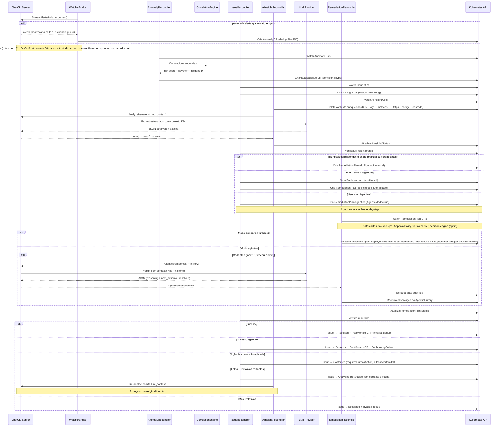
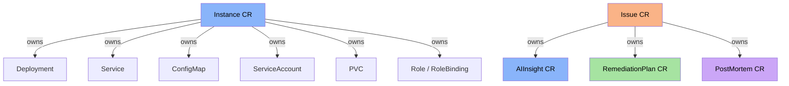

A **Plataforma AIOps** do ChatCLI é um sistema autônomo que detecta problemas no Kubernetes, analisa causas raiz com IA e executa remediações automáticas — tudo orquestrado por CRDs nativos do Kubernetes.

Esta página cobre a arquitetura interna em profundidade. Para configuração e exemplos de uso, veja [K8s Operator](/pt/kubernetes/k8s-operator).


## Componentes da Plataforma v2

<CardGroup cols={3}>
  <Card title="Notificações" icon="bell" href="/pt/kubernetes/aiops/notifications">
    NotificationPolicy e EscalationPolicy
  </Card>
  <Card title="SLO e SLA" icon="bullseye" href="/pt/kubernetes/aiops/slo-sla">
    ServiceLevelObjective e IncidentSLA
  </Card>
  <Card title="Aprovações" icon="check-double" href="/pt/kubernetes/aiops/approval-workflow">
    ApprovalPolicy e ApprovalRequest
  </Card>
  <Card title="Multi-Cluster" icon="globe" href="/pt/kubernetes/aiops/federation">
    ClusterRegistration e federação
  </Card>
  <Card title="Auditoria" icon="scroll" href="/pt/kubernetes/aiops/audit-compliance">
    AuditEvent (trilha imutável)
  </Card>
  <Card title="Chaos Engineering" icon="explosion" href="/pt/kubernetes/aiops/chaos-engineering">
    ChaosExperiment com safety checks
  </Card>
  <Card title="Motor de Decisão" icon="brain-circuit" href="/pt/kubernetes/aiops/decision-engine">
    Gate de confiança e circuit breaker, opt-in
  </Card>
  <Card title="Capacity e Custos" icon="chart-line" href="/pt/kubernetes/aiops/capacity-cost">
    Previsão de capacidade, redução de ruído, custo de LLM por incidente
  </Card>
  <Card title="Web Dashboard" icon="gauge" href="/pt/kubernetes/aiops/web-dashboard">
    UI embutida na porta 8090 do operator
  </Card>
</CardGroup>

### REST API e Dashboard

O operator expõe uma **API REST HTTP** na porta `8090` (valor `api.port` do chart, env `CHATCLI_AIOPS_PORT`), acessada pelo Service `chatcli-operator` no namespace do operator (não pelo Service da Instance). São mais de 40 endpoints cobrindo incidents, AI insights, remediações, runbooks, aprovações, SLOs, post-mortems, analytics (incluindo custo de LLM), clusters, federação, políticas e auditoria. Um **Web Dashboard** embutido é servido em `/` na mesma porta.

- **Autenticação:** header `X-API-Key`. As chaves vêm do Secret `chatcli-operator-secrets`, chave `api-keys` (fallback: ConfigMap `chatcli-operator-config`), no namespace do operator, como uma lista YAML de `{key, role, description}`. Os papéis são `viewer` < `operator` < `admin`; qualquer outro valor de role é negado. Alterações são aplicadas em cerca de 30 segundos; uma entrada `api-keys` que não é YAML válido mantém em vigor o último conjunto de chaves válido, e um Secret sem a entrada cai para o ConfigMap. Crie-o você mesmo, ou deixe o chart do operator renderizá-lo (`apiKeys.create: true` com `apiKeys.entries`). Sem chaves configuradas, toda chamada em `/api/` retorna `401`, a menos que `CHATCLI_OPERATOR_DEV_MODE=true` (admin sem chave, só para desenvolvimento).
- **Rate limit:** 30 requisições por minuto por host de cliente sem API key válida, 600 por minuto por chave válida (`429` com `Retry-After`).
- **CORS:** deny-all, a menos que `CHATCLI_CORS_ALLOWED_ORIGINS` / `CHATCLI_CORS_ORIGIN` estejam definidos. **TLS:** defina `CHATCLI_AIOPS_TLS_CERT` e `CHATCLI_AIOPS_TLS_KEY` para servir HTTPS (TLS 1.3).
- **Preview local:** `make dash-preview` em `operator/` serve o dashboard com dados sintéticos, sem cluster, em `http://127.0.0.1:8085` com a API key `preview`.

<Note>
  Toda réplica do operator serve a API REST e o dashboard na 8090, então `replicaCount > 1` funciona atrás do Service sem fixar as requisições na líder.
</Note>

Para referência completa da API, consulte a [API Reference](/pt/reference/api/overview).

Quatro dashboards Grafana (JSON) estão em `deploy/grafana/`. O `dashboards-configmap.yaml` de lá traz só os dois ServiceMonitors (operator e servidor, este selecionando `app.kubernetes.io/name: chatcli`), não os dashboards: crie o ConfigMap nomeando cada arquivo JSON (veja [Web Dashboard](/pt/kubernetes/aiops/web-dashboard)) ou importe os JSONs manualmente.


## Visão Geral do Pipeline




## Componentes Internos

### 1. WatcherBridge (`watcher_bridge.go`)

O WatcherBridge é o ponto de entrada do pipeline. Implementa a interface `manager.Runnable` do controller-runtime e roda como goroutine gerenciada pelo manager.

**Responsabilidades:**

| Função | Descrição |
|--------|-----------|
| `Start()` | Mantém a bridge ligada a uma Instance pronta: stream primeiro, fallback por polling, context cancelável |
| `consumeStream()` | Mantém o stream StreamAlerts aberto, transforma cada alerta em Anomaly, reabre após 60s de silêncio |
| `poll()` | Consulta GetAlerts uma vez (fallback para servidor sem StreamAlerts, com o stream tentado de novo a cada 10 minutos ou quando esse servidor para de responder, ou `CHATCLI_OPERATOR_ALERT_TRANSPORT=poll`) |
| `discoverAndConnect()` | Descobre servidor via Instance CRs no cluster |
| `createAnomaly()` | Converte alert → Anomaly CR (nome `watcher-<tipo>-<deployment>-<timestamp>`, no namespace do alerta) com labels de referência |
| `alertHash()` | SHA256(type\|deployment\|namespace\|UID do recurso) para dedup |
| `InvalidateDedupForResource()` | Remove entradas de dedup para um deployment+namespace |
| `sanitizeK8sName()` | Garante nomes válidos para objetos K8s (63 chars, lowercase, sem caracteres especiais) |

**Dedup por SHA256:**

```text
hash = SHA256(alertType | deployment | namespace | resourceUID)
```

- **Sem componente temporal**: Um problema contínuo (e.g. CrashLoopBackOff) gera apenas uma Anomaly
- **UID do recurso**: um workload apagado e recriado ganha outro UID, então seus alertas não são engolidos pela entrada antiga
- **TTL**: 30 minutos por padrão (Instance `spec.aiops.dedupTTLMinutes`, 5–1440) — hashes expirados são podados automaticamente
- **Invalidação**: Quando um Issue é resolvido, contido ou escalado, as entradas de dedup para o recurso afetado são invalidadas, permitindo detecção imediata de recorrências
- **Resultado**: Evita duplicatas durante problema ativo; detecta recorrência após resolução

**Descoberta do Servidor:**

<Steps>
  <Step title="Lista Instance CRs no cluster inteiro">
  </Step>
  <Step title="Seleciona o primeiro Instance com Status.Ready=true">
    Só uma Instance por cluster conduz o AIOps: a bridge (e os reconcilers de AIInsight e Remediation, que compartilham o mesmo client) falam com a primeira Instance pronta que encontrar.
  </Step>
  <Step title="Conecta via gRPC com TLS 1.3">
    Alvo `dns:///<nome>.<namespace>.svc.cluster.local:<porta>`, com credencial e CA tirados do spec da Instance. O TLS é obrigatório: a Instance precisa de `spec.server.tls.enabled: true` e de um certificado válido para esse nome.
  </Step>
  <Step title="Retry">
    Se a conexão falha, tenta de novo no próximo ciclo de poll (30s). Depois de 3 tentativas de stream sem mensagens, a bridge derruba a conexão e redescobre a Instance.
  </Step>
</Steps>

### 2. AnomalyReconciler (`anomaly_controller.go`)

Observa Anomaly CRs e os correlaciona em Issues.

**Fluxo:**

<Steps>
  <Step title="Recebe Anomaly CR">
    Anomaly recém-criado com `Status.Correlated = false`.
  </Step>
  <Step title="Anexa a um Issue ativo">
    Se já existe um Issue não terminal para o mesmo recurso (kind, nome, namespace), a Anomaly é anexada a ele; o risk score do Issue é recalculado a partir de todas as anomalias que o Issue tem na janela de correlação, incluindo a recém-anexada, e nunca diminui.
  </Step>
  <Step title="Verificações de supressão">
    Ignora a Anomaly quando o mesmo recurso foi resolvido dentro do cooldown de resolução (Instance `spec.aiops.resolutionCooldownMinutes`, padrão 10; `0` desliga o cooldown) ou quando o noise reducer a marca (repetitiva, flapping, sazonal).
  </Step>
  <Step title="Agrupa anomalias e calcula risk score e severidade">
    Chama `CorrelationEngine.FindRelatedAnomalies()` para as anomalias não correlacionadas do mesmo recurso nos últimos 10 minutos.
  </Step>
  <Step title="Cria o Issue CR">
    Nome `<recurso>-<sinal>-<unix time>`, com os labels `platform.chatcli.io/inc-id` (`INC-YYYYMMDD-NNN`), `platform.chatcli.io/resource` e `platform.chatcli.io/signal`.
  </Step>
  <Step title="Marca Anomaly como correlacionada">
    Define `Correlated = true` com referência ao Issue.
  </Step>
</Steps>

### 3. CorrelationEngine (`correlation.go`)

Motor de correlação que agrupa anomalias em incidentes.

**Algoritmo de Correlação:**

```text
Para cada nova anomalia:
  1. Procura um Issue não terminal no mesmo recurso (kind + nome + namespace)
  2. Se existe -> anexa a anomalia (risk score recalculado, nunca reduzido)
  3. Senão -> soma os pesos das anomalias não correlacionadas desse recurso
     nos últimos 10 minutos e cria um novo Issue
  4. O incident ID INC-YYYYMMDD-NNN é uma sequência por namespace e por dia (label, não o nome do Issue)
```

**Risk Scoring** (soma dos pesos, limitada a 100):

| Sinal | Peso |
|-------|------|
| `oom_kill` | 40 |
| `error_rate` | 30 |
| `pod_restart` | 25 |
| `deploy_failing` | 25 |
| `latency` | 20 |
| `pod_not_ready` | 20 |
| `cpu_high` | 15 |
| `memory_high` | 15 |
| qualquer outro sinal | 10 |

**Classificação de Severidade:**

```text
sinal oom_kill   -> Critical (sempre)
risk_score >= 80 -> Critical
risk_score >= 60 -> High
risk_score >= 30 -> Medium
risk_score <  30 -> Low
```

**Exemplo**: um Deployment com `pod_restart` (25) + `memory_high` (15) = risk 40 → **Medium**. Somando `error_rate` (30) = risk 70 → **High**. Um Issue aberto por uma anomalia `oom_kill` é **Critical** qualquer que seja o score.

**Mapeamento de Fonte:** a source do Issue espelha a da Anomaly (`watcher`, `prometheus`, `events`, `logs`, `webhook`); uma source desconhecida vira `prometheus`.

### 4. IssueReconciler (`issue_controller.go`)

Gerencia o ciclo de vida completo de um Issue através de uma máquina de estados.

**Estados e Transições:**

```mermaid
stateDiagram-v2
    [*] --> Detected : Anomaly correlacionada

    state "Detected" as D {
        state "Adiciona finalizer" as D1
        state "Cria AIInsight" as D2
        state "Define detectedAt" as D3
        D1 --> D2
        D2 --> D3
    }

    D --> Analyzing : AIInsight criado

    state "Analyzing" as A {
        state "Aguarda Analysis" as A1
        state "Busca Runbook manual" as A2
        state "Gera Runbook da IA" as A3
        state "Cria plano agêntico" as A4
        A1 --> A2 : Analysis preenchida
        A2 --> A3 : Sem Runbook manual
        A3 --> A4 : Sem AI actions
    }

    A --> Remediating : RemediationPlan criado (via Runbook ou agêntico)

    state "Remediating" as R {
        state "Aguarda execução" as R1
        state "Verifica resultado" as R2
        R1 --> R2
    }

    R --> Resolved : RemediationPlan completed (invalida dedup)
    R --> Contained : Plano concluído aplicou ação de contenção
    R --> A : Retry (re-análise com failure context)
    R --> Escalated : Max attempts (invalida dedup)
    Contained --> Resolved : Humano restaurou o workload
    Escalated --> Resolved : Recurso se recuperou (enableAutoResolve)

    note right of Resolved : Todo plano concluído gera um PostMortem CR;\nplanos agênticos também geram um Runbook

    Resolved --> [*]
    Escalated --> [*]
```



`Contained` significa que o plano silenciou o workload (por exemplo `ScaleDeployment` para 0 com `containment=true`) sem corrigi-lo: o Issue carrega `status.requiresHumanAction: true` e `status.requiredAction`, e só vai para `Resolved` quando o workload é restaurado. Issues `Escalated` são reavaliados a cada 30 segundos e se auto-resolvem quando o recurso volta a ficar saudável, a menos que a Instance defina `spec.aiops.enableAutoResolve: false`. A checagem de saúde entende Deployments, StatefulSets, DaemonSets, Jobs (saudáveis quando `Complete`) e Nodes (saudáveis quando `Ready`); um Issue em qualquer outro kind não é auto-resolvido. `Failed` é terminal.

As configurações de AIOps (`spec.aiops`) vêm da Instance que o WatcherBridge usa: o WatcherBridge marca cada Anomaly com `platform.chatcli.io/instance` e `platform.chatcli.io/instance-namespace`, o Issue herda esses labels e, sem eles, vale a primeira Instance pronta.

<AccordionGroup>
  <Accordion title="handleDetected()">
    1. Define `detectedAt` e `maxRemediationAttempts` (padrão: 5, configurável via Instance `aiops.maxRemediationAttempts`; lido da Instance que o WatcherBridge usa)
    2. Cria AIInsight CR `<issue>-insight` com owner reference (Issue → AIInsight), anotado com os Runbooks candidatos
    3. Transiciona para `Analyzing`
    4. Roda as verificações de federação (detecção de cascata, correlação cross-cluster), em best effort
    5. Requeue após 10 segundos
  </Accordion>
  <Accordion title="handleAnalyzing()">
    1. Verifica se AIInsight tem `Analysis` preenchida
    2. Busca Runbook manual correspondente (`findMatchingRunbook` — tiered matching)
    3. Se encontrou Runbook manual → `createRemediationPlan()` (manual tem precedência)
    4. Se não encontrou Runbook manual mas AIInsight tem `SuggestedActions` → `generateRunbookFromAI()` → `createRemediationPlan()` usando o Runbook auto-gerado
    5. Se nenhum → `createAgenticRemediationPlan()` (AgenticMode=true, sem ações pré-definidas — a IA decide cada passo)
    6. Transiciona para `Remediating`
  </Accordion>
  <Accordion title="findMatchingRunbook() -- Matching em camadas">
    - **Tier 1**: SignalType + Severity + ResourceKind (match exato, preferido)
    - **Tier 2**: Severity + ResourceKind (fallback quando signal não bate)
    - `SignalType` resolvido de: `issue.Spec.SignalType` → fallback `issue.Labels["platform.chatcli.io/signal"]`
    - Os Runbooks são buscados em **todos os namespaces**, não só no do Issue: primeiro o namespace do Issue, depois os demais, cada Runbook uma vez
  </Accordion>
  <Accordion title="generateRunbookFromAI()">
    - Materializa `SuggestedActions` do AI como Runbook CR reutilizável
    - Nome: `auto-{signal}-{severity}-{kind}-{hash}` (sanitizado; `hash` = 6 primeiros caracteres hex do SHA256 da análise, então causas raiz diferentes geram Runbooks diferentes)
    - Labels: `platform.chatcli.io/auto-generated=true`
    - Trigger: SignalType + Severity + ResourceKind (para reutilização futura)
    - Usa `CreateOrUpdate` para idempotência
  </Accordion>
  <Accordion title="handleRemediating()">
    1. Busca RemediationPlan mais recente (`findLatestRemediationPlan`)
    2. Se `Completed` → Issue `Resolved` (ou `Contained` quando o plano aplicou uma ação de contenção) + **PostMortem CR** (timeline, causa raiz, impacto, lições) + invalida dedup do recurso
       - Se plano agêntico: também gera um **Runbook reutilizável** dos passos bem-sucedidos
    3. Se `Failed` e tentativas restantes → **re-análise**: coleta evidência de falha (`collectFailureEvidence`), limpa análise do AIInsight, volta para estado `Analyzing` com failure context
    4. Se `Failed` e max tentativas → `Escalated` + invalida dedup do recurso
  </Accordion>
</AccordionGroup>

**Retry com Escalação de Estratégia:**
- Cada retry dispara re-análise do AI com contexto de falhas anteriores
- O AI recebe `previous_failure_context` com evidência das tentativas que falharam
- O prompt instrui: "Não repita as mesmas ações. Analise por que falharam e sugira uma abordagem fundamentalmente diferente"
- Gera um novo Runbook auto-gerado quando a nova análise é diferente (o nome carrega um hash da análise)

**Prioridade de Remediação:**

```text
1. Runbook existente (match tiered: SignalType+Severity+Kind -> Severity+Kind)
2. Runbook auto-gerado pela IA (materializado como CR reutilizável)
3. Plano agêntico (a IA decide cada passo)
4. Escalonamento depois de maxRemediationAttempts tentativas falhas
```

### 5. AIInsightReconciler (`aiinsight_controller.go`)

Observa AIInsight CRs e chama o `AnalyzeIssue` RPC para preencher a análise.

**Fluxo:**

<Steps>
  <Step title="Verifica análise existente">
    Verifica se `Status.Analysis` já está preenchida (skip se sim).
  </Step>
  <Step title="Verifica conectividade">
    Verifica se servidor está conectado (requeue 15s se não).
  </Step>
  <Step title="Busca contexto">
    Busca Issue pai para contexto.
  </Step>
  <Step title="Coleta contexto K8s">
    Coleta contexto K8s via `KubernetesContextBuilder` (deployment, pods, eventos, revisões).
  </Step>
  <Step title="Lê failure context">
    Lê failure context de annotation `platform.chatcli.io/failure-context` (se re-análise).
  </Step>
  <Step title="Monta request">
    Monta `AnalyzeIssueRequest` com dados do Issue + contexto K8s + failure context.
  </Step>
  <Step title="Chama AnalyzeIssue RPC">
    Chama `AnalyzeIssue` RPC via `ServerClient`.
  </Step>
  <Step title="Preenche status">
    Preenche `Status.Analysis`, `Confidence`, `Recommendations`, `SuggestedActions`. Limpa annotation `failure-context` após re-análise concluída.
  </Step>
</Steps>

**KubernetesContextBuilder (`k8s_context.go`):**

Coleta contexto real do cluster para **Deployments, StatefulSets, DaemonSets, Jobs, CronJobs e HPAs** (max 15000 chars):
- **Resource Status**: replicas, conditions, containers, images + resources (cada tipo tem context builder dedicado)
- **StatefulSet**: replicas, update strategy, partition, PodManagementPolicy, VolumeClaimTemplates
- **DaemonSet**: desired/current/ready/available/unavailable, nodeSelector, tolerations
- **Job/CronJob**: active/succeeded/failed, completions, parallelism, schedule, lastSuccessful
- **HPA**: min/max replicas, current/desired, target utilization, current metrics, maxed-out detection
- **Pod Details** (até 5 pods, unhealthy primeiro): phase, restart count, container states
- **Recent Events** (últimos 15): tipo, reason, message, count
- **Revision History**: Últimas 5 revisões (ReplicaSets) com diff de imagens

**LogAnalyzer (`log_analyzer.go`):**

Análise avançada de logs de aplicação (além do tail básico de 50 linhas):
- **Stack Trace Extraction**: detecta e extrai stack traces de **Java** (Exception/Caused by), **Go** (panic/goroutine), **Python** (Traceback), **Node.js** (Error at)
- **Error Pattern Detection**: 24+ padrões críticos categorizados (crash, connectivity, dns, auth, storage, tls, database, cache, messaging)
- **Structured Log Parsing**: extrai error/warn entries de logs JSON (campos level, msg, error, timestamp, logger)
- **Init Container Logs**: analisa logs de init containers (revela falhas de startup)
- **Sidecar Logs**: analisa logs de sidecars (istio-proxy, envoy, datadog-agent, etc.)
- **Critical Lines**: extrai linhas FATAL/PANIC com 3 linhas de contexto antes/depois
- **Temporal Window**: busca logs por janela temporal (10min antes do incidente), não apenas tail

**MetricsCollector (`metrics_collector.go`):**

Queries ao Prometheus para dados quantitativos durante análise:
- **CPU/Memory**: usage trends 30min antes → durante → 15min depois do incidente
- **Request/Error Rate**: HTTP requests e 5xx por segundo
- **Latency**: P50, P95, P99 histogram percentiles
- **HPA Metrics**: current vs desired replicas, CPU target
- **Network**: receive/transmit bytes/s
- **Trend Analysis**: detecta spikes, drops, sustained_high/low com cálculo de % de mudança
- **Habilitado via**: `PROMETHEUS_URL` env var no operator

**GitOpsDetector (`gitops_detector.go`):**

Detecta e integra com ferramentas GitOps:
- **Helm Releases**: detecta via Secrets type `helm.sh/release.v1`, status (deployed/failed/pending-upgrade), chart version, revisão anterior para rollback
- **ArgoCD Applications**: sync status (Synced/OutOfSync), health (Healthy/Degraded), conditions, last sync result
- **Flux Kustomizations**: ready status, source ref, conditions, last applied

**SourceCodeAnalyzer (`source_controller.go`):**

Diagnóstico code-aware quando `SourceRepository` CRD está configurado:
- **Git Correlation**: encontra commits nos 30min antes do incidente
- **Suspected Commit**: identifica o commit mais provável (score por proximidade temporal + volume de mudanças)
- **Code Extraction**: extrai trechos de código referenciados em stack traces (file path + line number → código fonte)
- **Config Analysis**: lê Dockerfile, values.yaml, Chart.yaml para contexto de deploy
- **Credenciais**: chaves do Secret `token`, `username` + `password`, ou `ssh-key` + `known_hosts`; as credenciais HTTPS passam por um helper `GIT_ASKPASS` e nunca são gravadas no `.git/config`; o SSH confere as chaves do host contra o `known_hosts` (`spec.sshHostKeyPolicy: acceptNew` confia na primeira chave quando o Secret não tem nenhuma). Veja [Repositórios de código](/pt/kubernetes/k8s-operator#repositórios-de-código)

**CascadeAnalyzer (`cascade_analyzer.go`):**

Análise de cascade failures cross-service:
- **Dependency Graph**: descobre dependências via Services + EndpointSlices
- **Temporal Correlation**: encontra issues ativos no mesmo namespace e cross-namespace em janela de 15-20min
- **Cascade Chain**: ordena serviços por tempo de detecção (primeiro = root cause)
- **Root Cause Service**: identifica o serviço origem do cascade

**BlastRadiusPredictor (`blast_radius.go`):**

Predição de impacto antes da execução de ações:
- **PDB Check**: verifica se a ação violaria PodDisruptionBudgets
- **Quota Check**: verifica ResourceQuotas (>90% usado = warning)
- **Node Capacity**: conta pods no node para ações de cordon/drain
- **Affected Services**: descobre quais Services seriam impactados
- **Risk Level**: classifica como low/medium/high/critical

**AnalyzeIssueRequest:**

| Campo | Origem | Descrição |
|-------|--------|-----------|
| `issue_name` | Issue.Name | Nome do Issue |
| `namespace` | Issue.Namespace | Namespace |
| `resource_kind` | Issue.Spec.Resource.Kind | Tipo do recurso (Deployment) |
| `resource_name` | Issue.Spec.Resource.Name | Nome do deployment |
| `signal_type` | Issue.Spec.SignalType / labels | Tipo do sinal |
| `severity` | Issue.Spec.Severity | Severidade |
| `description` | Issue.Spec.Description | Descrição do problema |
| `risk_score` | Issue.Spec.RiskScore | Score de risco |
| `provider` | AIInsight.Spec.Provider | Provedor LLM |
| `model` | AIInsight.Spec.Model | Modelo LLM |
| `kubernetes_context` | 6 enrichers combinados | K8s status (Deploy/STS/DS/Job/CronJob/HPA) + **log analysis** (stack traces, error patterns) + **Prometheus metrics** (trends) + **GitOps** (Helm/ArgoCD/Flux) + **source code** (commits, code snippets) + **cascade analysis** + **RCA enrichment** |
| `previous_failure_context` | Annotation no AIInsight | Evidência de tentativas anteriores (retries) |

### 6. RemediationReconciler (`remediation_controller.go`)

Executa as ações definidas em um RemediationPlan.

**Ações Suportadas (54 tipos, mais `Custom`, que é sempre rejeitado):**

**Deployment / Genérico (19 ações + `Custom`):**

| Categoria | Tipo | O que Faz | Parâmetros Chave |
|-----------|------|-----------|-----------------|
| Workload | `ScaleDeployment` | Ajusta réplicas do Deployment | `replicas` |
| Workload | `RestartDeployment` | Rollout restart via annotation | — |
| Workload | `RollbackDeployment` | Rollback para revisão anterior/saudável/específica (via ReplicaSet) | `toRevision` |
| Workload | `PatchConfig` | Atualiza dados de ConfigMap | `configmap`, `key=value` |
| Workload | `AdjustResources` | Ajusta CPU/memória nos containers do Deployment | `container`, `memory_limit`, `cpu_limit`, etc. |
| Workload | `DeletePod` | Remove pod mais doente (auto-seleciona) | `pod` (opcional) |
| Workload | `RestartStatefulSetPod` | Restart de pod específico ou rolling restart do StatefulSet | `pod` (opcional) |
| GitOps | `HelmRollback` | Rollback de Helm release | `revision` |
| GitOps | `ArgoSyncApp` | Trigger sync ArgoCD | `revision` |
| Autoscaling | `AdjustHPA` | Modifica HPA min/max/target | `minReplicas`, `maxReplicas`, `targetCPUUtilization` |
| Infra | `CordonNode` | Marca node como unschedulable | `node` |
| Infra | `UncordonNode` | Marca node como schedulable de novo | `node` |
| Infra | `DrainNode` | Cordona e evicta pods do node | `node` |
| Storage | `ResizePVC` | Expande PVC (sem encolhimento) | `pvc`, `size` |
| Security | `RotateSecret` | Atualiza Secret ou copia de outra source | `secret`, `sourceSecret` ou `key=value` |
| Networking | `UpdateIngress` | Modifica backend/annotations do Ingress | `ingress`, `backendService`, `backendPort` |
| Networking | `PatchNetworkPolicy` | Adiciona portas em regras de ingress do NetworkPolicy | `networkPolicy`, `allowPort`, `protocol` |
| Advanced | `ApplyManifest` | Aplica manifesto JSON de ConfigMap | `configmap`, `key` |
| Advanced | `ExecDiagnostic` | Executa comando de um allowlist read-only em pod | `command` (ver [allowlist](/pt/kubernetes/k8s-operator#execdiagnostic-allowlist)), `pod`, `container` |
| — | `Custom` | **Bloqueado** — requer aprovação manual | — |

**StatefulSet (9 ações):**

| Tipo | O que Faz | Parâmetros Chave |
|------|-----------|-----------------|
| `ScaleStatefulSet` | Scaling ordenado de réplicas | `replicas` |
| `RestartStatefulSet` | Rolling restart via annotation (ordenado) | — |
| `RollbackStatefulSet` | Rollback via ControllerRevision (não ReplicaSet) | `toRevision` (previous\|N) |
| `AdjustStatefulSetResources` | Ajusta CPU/memória nos containers do StatefulSet | `container`, `memory_limit`, `cpu_limit`, etc. |
| `DeleteStatefulSetPod` | Deleta pod específico ou mais doente (preserva PVC) | `pod` (opcional) |
| `ForceDeleteStatefulSetPod` | Force-delete de pod preso em Terminating (grace=0) | `pod` (OBRIGATÓRIO) |
| `UpdateStatefulSetStrategy` | Altera tipo de updateStrategy | `type` (RollingUpdate\|OnDelete), `maxUnavailable` |
| `RecreateStatefulSetPVC` | Deleta PVC preso para recriação pelo controlador | `pvc`, `confirm=true` (OBRIGATÓRIO) |
| `PartitionStatefulSetUpdate` | Define partition para canary rollout | `partition` |

**DaemonSet (7 ações):**

| Tipo | O que Faz | Parâmetros Chave |
|------|-----------|-----------------|
| `RestartDaemonSet` | Rolling restart de todos os pods do DaemonSet em todos os nodes | — |
| `RollbackDaemonSet` | Rollback via ControllerRevision | `toRevision` (previous\|N) |
| `AdjustDaemonSetResources` | Ajusta CPU/memória nos containers do DaemonSet | `container`, `memory_limit`, `cpu_limit`, etc. |
| `DeleteDaemonSetPod` | Deleta pod (opcionalmente em node específico) | `pod` ou `node` (opcional) |
| `UpdateDaemonSetStrategy` | Altera estratégia de update | `type`, `maxUnavailable`, `maxSurge` |
| `PauseDaemonSetRollout` | Pausa rollout (maxUnavailable=0) | — |
| `CordonAndDeleteDaemonSetPod` | Cordona node + deleta pod do DaemonSet nele | `node` (OBRIGATÓRIO) |

**Job (9 ações):**

| Tipo | O que Faz | Parâmetros Chave |
|------|-----------|-----------------|
| `RetryJob` | Deleta Job falhado + recria a partir do spec | — |
| `AdjustJobResources` | Ajusta CPU/memória no template do Job | `container`, `memory_limit`, `cpu_limit`, etc. |
| `DeleteFailedJob` | Limpa Job falhado e seus pods | — |
| `SuspendJob` | Pausa Job em execução (suspend=true) | — |
| `ResumeJob` | Retoma Job suspenso (suspend=false) | — |
| `AdjustJobParallelism` | Altera paralelismo do Job | `parallelism` |
| `AdjustJobDeadline` | Altera activeDeadlineSeconds | `activeDeadlineSeconds` |
| `AdjustJobBackoffLimit` | Altera backoffLimit | `backoffLimit` |
| `ForceDeleteJobPods` | Force-delete de todos os pods do Job (grace=0) | — |

**CronJob (10 ações):**

| Tipo | O que Faz | Parâmetros Chave |
|------|-----------|-----------------|
| `SuspendCronJob` | Pausa agendamento do CronJob (suspend=true) | — |
| `ResumeCronJob` | Retoma agendamento (suspend=false) | — |
| `TriggerCronJob` | Cria Job a partir do template imediatamente | — |
| `AdjustCronJobResources` | Ajusta CPU/memória no jobTemplate | `container`, `memory_limit`, `cpu_limit`, etc. |
| `AdjustCronJobSchedule` | Altera expressão cron do schedule | `schedule` |
| `AdjustCronJobDeadline` | Altera startingDeadlineSeconds | `startingDeadlineSeconds` |
| `AdjustCronJobHistory` | Altera limites de histórico | `successfulJobsHistoryLimit`, `failedJobsHistoryLimit` |
| `AdjustCronJobConcurrency` | Altera concurrencyPolicy | `concurrencyPolicy` (Allow\|Forbid\|Replace) |
| `DeleteCronJobActiveJobs` | Mata todos os Jobs ativos do CronJob | — |
| `ReplaceCronJobTemplate` | Substitui jobTemplate a partir de JSON em ConfigMap | `configmap`, `key` |

<Warning>
**Safety Checks (pré-execução):** Scale to 0 bloqueado (Deployment e StatefulSet), a menos que a ação traga `containment=true`, que marca um passo deliberado de contenção e leva o Issue para `Contained`. AdjustResources limit não pode ser menor que request (todos os tipos). DeletePod/DeleteStatefulSetPod recusa se só existe 1 pod. ForceDeleteStatefulSetPod exige nome explícito do pod. RecreateStatefulSetPVC exige `confirm=true`. Custom actions bloqueadas. Blast radius prediction verifica violações de PDB, resource quotas e serviços afetados — agora generalizado para todos os workload types via `getPodTemplateLabels`.

**Rollback Automático (pós-falha):** Antes de qualquer ação, um `ResourceSnapshot` estruturado captura o estado completo do recurso. Para Deployments: réplicas, imagens, CPU/memória, HPA. Para StatefulSets: réplicas, containers, updateStrategy, partition. Para DaemonSets: containers, updateStrategy, maxUnavailable. Para Jobs: suspend, parallelism, backoffLimit, activeDeadlineSeconds, containers. Para CronJobs: suspend, schedule, concurrencyPolicy, limites de histórico, containers. Se uma ação falha ou a verificação de saúde expira (90s), o `RollbackEngine` restaura automaticamente o recurso ao estado pré-remediação. Funciona para Deployments, StatefulSets, DaemonSets, Jobs, CronJobs, Nodes e HPAs.
</Warning>

**Fluxo de Execução (Standard):**

```text
Pending -> Snapshot -> Executing -> (checkpoint + ação, para cada ação)
  -> Verifying (90s timeout) -> Completed
  -> Se ação falha -> Rollback automático -> RolledBack
  -> Se verificação falha -> Rollback automático -> RolledBack
  -> Se rollback falha -> Failed
```

**Fluxo de Execução (Agentic):**

```text
Pending -> Executing -> (loop agentico: AI decide -> executa -> observa -> repeat)
  -> Verifying -> Completed | Failed

Cada reconcile = 1 step do loop agentico:
  1. Refresh contexto K8s (KubernetesContextBuilder)
  2. Envia histórico + contexto -> AgenticStep RPC
  3. AI responde: {reasoning, resolved, next_action}
  4. Se resolved=true -> Verifying (+ annotations com dados do PostMortem)
  5. Se next_action -> executa -> registra observação -> requeue 5s
  6. Se observation-only -> registra -> requeue 10s
  7. Se next_action diverge do AIInsight sem divergence_reason
     -> registrado como rejeitado, não executado, a IA é consultada de novo
  Safety: max steps (Instance aiops.agenticMaxSteps, padrão 10), timeout 10 minutos,
  detector de convergência (observações repetidas, oscilação A-B-A-B, 5 falhas seguidas,
  mais de 8 minutos decorridos) falha o plano antes
```

### 7. ServerClient (`grpc_client.go`)

Cliente gRPC compartilhado entre o WatcherBridge, o AIInsightReconciler e o RemediationReconciler.

| Método | Descrição |
|--------|-----------|
| `NewServerClient()` | Cria instância (sem conexão) |
| `Connect(addr, opts)` | Conecta via gRPC com TLS 1.3 (sempre) e a credencial da Instance; keepalive 30s/5s |
| `GetAlerts(ctx)` | Busca os alertas ativos do watcher |
| `StreamAlerts(ctx, includeCurrent)` | Abre o stream de alertas; vive enquanto o ctx viver |
| `AnalyzeIssue(req)` | Envia issue para análise por IA |
| `AgenticStep(req)` | Executa um passo do loop agêntico (context + history → next action) |
| `Health()` / `GetServerInfo()` | Probe e chamada autenticada de informações |
| `IsConnected()` | Verifica se conexão está ativa |
| `Close()` | Fecha conexão gRPC |


## Interação Server e Operator

### RPCs StreamAlerts e GetAlerts

O servidor empurra os alertas do K8s Watcher por `StreamAlerts` (streaming do servidor com heartbeats; veja [Modo Servidor](/pt/server/server-mode#streamalerts)) e continua expondo-os para leituras pontuais via gRPC:

```protobuf
rpc GetAlerts(GetAlertsRequest) returns (GetAlertsResponse);
rpc StreamAlerts(StreamAlertsRequest) returns (stream StreamAlertsResponse);

message WatcherAlert {
  string type = 1;            // HighRestartCount, OOMKilled, PodNotReady, DeploymentFailing, ...
  string severity = 2;        // info, warning, critical
  string message = 3;
  string object = 4;          // ex.: nome do pod
  string namespace = 5;
  string deployment = 6;
  int64 timestamp_unix = 7;
}

message GetAlertsRequest {
  string namespace = 1;       // filtro opcional
  string deployment = 2;      // filtro opcional
}
```

O handler no servidor itera sobre os `ObservabilityStore` de cada target do MultiWatcher, filtra por namespace se especificado, e retorna alertas ativos.

### AnalyzeIssue RPC

O servidor recebe o contexto do Issue e chama o LLM para análise:

```protobuf
rpc AnalyzeIssue(AnalyzeIssueRequest) returns (AnalyzeIssueResponse);

message SuggestedAction {
  string name = 1;
  string action = 2;
  string description = 3;
  map<string, string> params = 4;
}

message AnalyzeIssueResponse {
  string analysis = 1;
  float confidence = 2;
  repeated string recommendations = 3;
  string model = 4;
  string provider = 5;
  repeated SuggestedAction suggested_actions = 6;
  TokenUsage usage = 7;       // alimenta o ledger de custo
}
```

**Prompt Estruturado:**

O servidor constrói um prompt que inclui:

1. Contexto do Issue (nome, namespace, recurso, severidade, risk score, descrição)
2. O catálogo de ações (os 54 tipos de ação, com parâmetros e regras por tipo de recurso)
3. Instruções para retornar JSON estruturado com campos `analysis`, `confidence`, `recommendations` e `actions`

**Parsing da Resposta:**

1. Remove markdown codeblocks (`` ```json ... ``` ``)
2. Parseia JSON em `analysisResult`
3. Clamp confidence entre 0.0 e 1.0
4. Se parsing falhar → usa resposta raw como analysis com confidence 0.5

### AgenticStep RPC

O servidor recebe o contexto do Issue, histórico de passos anteriores e contexto K8s atualizado, e decide a próxima ação:

```protobuf
rpc AgenticStep(AgenticStepRequest) returns (AgenticStepResponse);

message AgenticStepRequest {
  string issue_name = 1;
  string namespace = 2;
  string resource_kind = 3;
  string resource_name = 4;
  string signal_type = 5;
  string severity = 6;
  string description = 7;
  int32 risk_score = 8;
  string provider = 9;
  string model = 10;
  string kubernetes_context = 11;   // refreshado a cada step
  repeated AgenticHistoryEntry history = 12;
  int32 max_steps = 13;
  int32 current_step = 14;
  // Orientação do AIInsight anterior, para o loop não contradizer a própria análise
  string insight_analysis = 15;
  float insight_confidence = 16;
  repeated string insight_recommendations = 17;
  repeated SuggestedAction insight_suggested_actions = 18;
}

message AgenticStepResponse {
  string reasoning = 1;              // raciocínio da IA (registrado no histórico)
  bool resolved = 2;                 // true = problema resolvido
  SuggestedAction next_action = 3;   // null quando resolved=true
  // Campos abaixo só populados quando resolved=true:
  string postmortem_summary = 4;
  string root_cause = 5;
  string impact = 6;
  repeated string lessons_learned = 7;
  repeated string prevention_actions = 8;
  bool diverges_from_insight = 9;     // next_action contradiz o AIInsight
  string divergence_reason = 10;      // justificativa quando diverge de propósito
  TokenUsage usage = 11;
}
```

**Prompt do AgenticStep:**

O servidor constrói um prompt estruturado com:

1. **Role + Issue details**: contexto do incidente (tipo, severidade, recurso)
2. **Kubernetes context**: estado real do cluster (refreshado a cada step via KubernetesContextBuilder)
3. **Tool definitions**: o catálogo de ações + "Observe" (sem ação, espera próximo contexto)
4. **Conversation history**: cada step anterior formatado com reasoning → action → observation
5. **Instructions**: respond JSON, budget (step N of M), regras de segurança

Quando `resolved=true`, a resposta inclui dados para geração do PostMortem (summary, root_cause, impact, lessons_learned, prevention_actions). Quando `diverges_from_insight` é true e `divergence_reason` está vazio, o operator registra o passo como rejeitado e não executa a ação proposta.


## PostMortem Generation

Quando **qualquer plano de remediação é concluído** (standard ou agêntico, incluindo uma contenção que deixa o Issue `Contained`), o `IssueReconciler` gera automaticamente:

### PostMortem CR

Criado via `generatePostMortem()`, com o nome `pm-<issue>` no namespace do Issue:

| Campo | Origem |
|-------|--------|
| `timeline` | evento `detected` + um evento `action_executed`/`action_failed` por ação (passos agênticos ou ações do plano) + evento `resolved` |
| `actionsExecuted` | Passos agênticos com ação, ou as ações do plano (inclui resultado) |
| `summary` | Annotation `platform.chatcli.io/postmortem-summary` (gerado pela IA; na falta, a análise do AIInsight) |
| `rootCause` | Annotation `platform.chatcli.io/root-cause` |
| `impact` | Annotation `platform.chatcli.io/impact` |
| `lessonsLearned` | Annotation `platform.chatcli.io/lessons-learned` |
| `preventionActions` | Annotation `platform.chatcli.io/prevention-actions` |
| `duration` | Calculado: resolvedAt - detectedAt |

Além dos campos acima, o PostMortem é enriquecido automaticamente com:
- **Trending**: detecção de incidentes recorrentes (contagem nos últimos 30 dias, PostMortems relacionados)
- **Cascade Chain**: cadeia de cascade failure se houver issues correlacionados cross-service
- **Git Correlation**: commit suspeito (SHA, autor, arquivos alterados, confiança)
- **GitOps Context**: estado do Helm/ArgoCD/Flux no momento do incidente

O PostMortem CR é owned pelo Issue (cascade delete).

### Runbook Auto-gerado (Agentic)

Criado via `generateAgenticRunbook()`:

- **Nome**: `agentic-{signal}-{severity}-{kind}` (sanitizado)
- **Steps**: apenas os passos com ação bem-sucedida
- **Labels**: `auto-generated=true`, `source=agentic`
- Usa `CreateOrUpdate` (reutilizado para incidentes futuros do mesmo tipo)


## Prometheus Metrics do Operator

O operator expõe métricas Prometheus na porta de métricas (`8080`, HTTP sem TLS, path `/metrics`; `serviceMonitor.enabled` no chart cria um ServiceMonitor). As métricas do pipeline:

| Métrica | Tipo | Descrição |
|---------|------|-----------|
| `chatcli_operator_anomalies_processed_total` | Counter | Anomalias processadas, por resultado (novo Issue, anexada, suprimida) |
| `chatcli_operator_issues_created_by_correlation_total` | Counter | Issues criados pelo motor de correlação |
| `chatcli_operator_issues_total` | Counter | Total de issues por severidade e estado |
| `chatcli_operator_issue_resolution_duration_seconds` | Histogram | Duração da detecção até resolução (Issues de chaos excluídos) |
| `chatcli_operator_active_issues` | Gauge | Número de issues não resolvidos |
| `chatcli_operator_remediations_total` | Counter | Ações de remediação por `action_type` e `result` |
| `chatcli_operator_remediation_duration_seconds` | Histogram | Tempo de execução do plano de remediação |
| `chatcli_operator_decision_engine_evaluations_total` | Counter | Veredictos do decision engine por `mode` (só com o engine habilitado) |
| `chatcli_operator_decision_engine_circuit_breaker_state` | Gauge | `1` enquanto o circuit breaker de um namespace está aberto |
| `chatcli_operator_agentic_convergence_stops_total` | Counter | Loops agênticos parados pelo detector de convergência, por `reason` |

Aprovações, SLA/SLO, notificações, escalação, federação e experimentos de chaos têm suas próprias métricas `chatcli_operator_*`, listadas nas respectivas páginas; o controller-runtime adiciona as métricas padrão de reconcile.


## Testes

Os testes unitários do operator rodam sobre o client fake do controller-runtime e cobrem todos os componentes desta página:

| Componente | Cobertura |
|-----------|-----------|
| InstanceReconciler | CRUD, watcher, persistence, réplicas, RBAC, deletion, pré-checagem de auth, probe do servidor |
| AnomalyReconciler | Criação, correlação, attachment a Issue existente |
| IssueReconciler | Máquina de estados, fallback AI, retry, plano agêntico, contenção, geração PostMortem |
| RemediationReconciler | Todos os 54 tipos de ação (Deployment + StatefulSet + DaemonSet + Job + CronJob), safety constraints, loop agêntico, rollback, verificação, gates do decision engine e do tier |
| AIInsightReconciler | Conectividade, mock RPC, parsing de análise, credenciais |
| PostMortemReconciler | Inicialização de estado, estado terminal |
| WatcherBridge | Mapeamento de alertas, dedup SHA256, pruning, criação de Anomaly, transportes stream e poll, opções de conexão |
| CorrelationEngine | Risk scoring, severidade, incident ID, anomalias relacionadas |
| MapActionType | Todos os mapeamentos string→enum |

### Executar Testes

```bash
cd operator
go test ./... -v          # testes unitários sobre o client fake
make test-integration    # envtest: API server real, CRDs, todos os controllers ligados
```

A suíte de integração (`operator/integration`) prova o que o client fake não consegue: schemas e campos obrigatórios dos CRDs, subresource de status, owner references e controllers reagindo às escritas uns dos outros. Os cenários são uma Instance provisionando seu workload só quando há credencial configurada, uma anomalia percorrendo Anomaly → Issue → AIInsight → RemediationPlan → Deployment escalado → plano concluído → Issue resolvido → PostMortem, uma ApprovalPolicy segurando o plano até um humano aprovar, e um IncidentSLA registrando uma violação de resolução. O CI roda a suíte com `KUBEBUILDER_ASSETS` exportado e a conta na cobertura.


## Diagrama de Ownership (Garbage Collection)



- **Instance** é owner dos recursos namespaced que cria (Deployment, Service, ConfigMaps, SA, PVC, Role/RoleBinding do watcher); um ClusterRoleBinding de watcher entre namespaces é removido pelo finalizer da Instance
- **Issue** é owner de AIInsight, RemediationPlan e PostMortem (cascade delete)
- Anomalies são independentes (não têm owner) para preservar histórico


## Checklist de Implantação AIOps

<Steps>
  <Step title="Instalar Operator via Helm (CRDs + RBAC + Deployment + Dashboard)">
    ```bash
    helm install chatcli-operator \
      oci://ghcr.io/diillson/charts/chatcli-operator \
      --version 1.215.1 \
      --namespace chatcli-system --create-namespace
    ```
  </Step>
  <Step title="Criar os Secrets de que a Instance precisa">
    - as chaves do provedor LLM (por exemplo `ANTHROPIC_API_KEY`), referenciadas por `spec.apiKeys.name`
    - um token do servidor (ou material JWT): um servidor dentro do cluster escuta em `0.0.0.0` e se recusa a rodar sem credencial, e o operator não cria o Deployment sem ela (`AuthenticationConfigured=False`)
    - um Secret TLS (`tls.crt`, `tls.key`, opcionalmente `ca.crt`) válido para `<instance>.<namespace>.svc.cluster.local`: o operator sempre fala com o servidor via TLS 1.3

    ```bash
    kubectl create namespace chatcli
    kubectl -n chatcli create secret generic chatcli-api-keys --from-literal=ANTHROPIC_API_KEY=<sua-chave>
    kubectl -n chatcli create secret generic chatcli-server-token --from-literal=token="$(openssl rand -hex 32)"
    kubectl -n chatcli create secret tls chatcli-tls --cert=tls.crt --key=tls.key
    ```
  </Step>
  <Step title="Criar Instance CR">
    ```yaml
    apiVersion: platform.chatcli.io/v1alpha1
    kind: Instance
    metadata:
      name: chatcli
      namespace: chatcli
    spec:
      provider: CLAUDEAI
      apiKeys:
        name: chatcli-api-keys
      server:
        tls:
          enabled: true
          secretName: chatcli-tls
        token:
          name: chatcli-server-token
          key: token
      watcher:
        enabled: true
        targets:
          - name: my-app
            kind: Deployment
            namespace: production
    ```

    Um target do watcher fora do namespace da Instance usa a ClusterRole pré-provisionada `chatcli-watcher` (criada pelo chart).

    Crie **uma** Instance para o AIOps por cluster: o pipeline se conecta à primeira Instance pronta que encontrar, no cluster inteiro.
  </Step>
  <Step title="Verificar servidor">
    `kubectl get instances -A` -- `READY` precisa estar `true`; confira as conditions `AuthenticationConfigured` e `ServerReachable` com `kubectl describe instance chatcli -n chatcli`.
  </Step>
  <Step title="Verificar pipeline AIOps">
    - `kubectl get anomalies -A` -- anomalias sendo detectadas
    - `kubectl get issues -A` -- issues sendo criados
    - `kubectl get aiinsights -A` -- IA analisando
  </Step>
  <Step title="(Opcional) Habilitar o dashboard e a API REST">
    Crie o Secret `chatcli-operator-secrets` (chave `api-keys`) em `chatcli-system`, depois rode `kubectl -n chatcli-system port-forward svc/chatcli-operator 8090:8090` e abra `http://localhost:8090`.
  </Step>
  <Step title="(Opcional) Criar Runbooks manuais">
    Crie Runbooks manuais para cenários específicos.
  </Step>
  <Step title="Monitorar métricas">
    Monitore métricas do operator via Prometheus (`serviceMonitor.enabled=true` no chart).
  </Step>
</Steps>


## Próximo Passo

<CardGroup cols={2}>
  <Card title="K8s Operator" icon="dharmachakra" href="/pt/kubernetes/k8s-operator">
    Configuração e exemplos
  </Card>
  <Card title="K8s Watcher" icon="binoculars" href="/pt/kubernetes/k8s-watcher">
    Detalhes de coleta e budget
  </Card>
  <Card title="Modo Servidor" icon="server" href="/pt/server/server-mode">
    RPCs StreamAlerts, GetAlerts, AnalyzeIssue e AgenticStep
  </Card>
  <Card title="Monitoramento K8s" icon="book" href="/pt/cookbook/k8s-monitoring">
    Receita: Monitoramento K8s com IA
  </Card>
</CardGroup>
