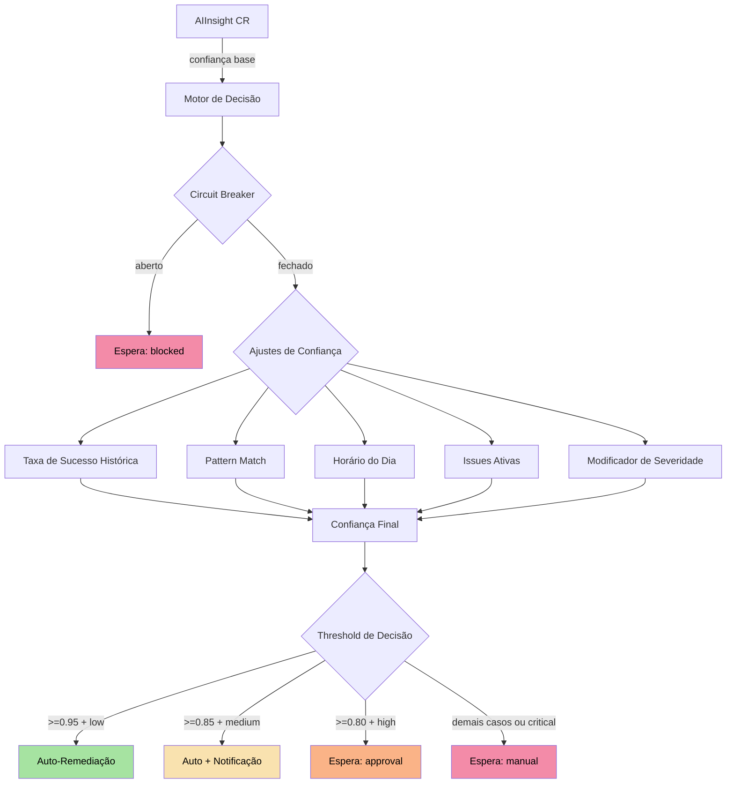
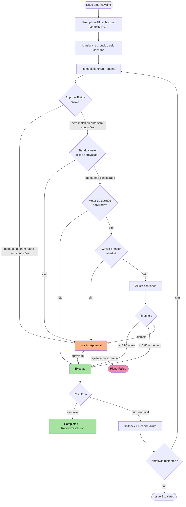

O **Motor de Decisão** é o componente central que determina _quando_ e _como_ a plataforma AIOps deve agir autonomamente. Ele combina confiança calculada, histórico de padrões, enriquecimento de causa raiz e detecção de convergência para tomar decisões seguras em produção.

<Info>
  O Motor de Decisão nunca age às cegas. Cada decisão passa por um pipeline de
  ajustes de confiança, verificações de circuit breaker e validação de padrões
  antes de qualquer ação ser executada.
</Info>


## Visão Geral da Arquitetura



### Habilitando o motor

O motor vem **desligado por padrão**: as ApprovalPolicies são então a única barreira. Ligue por operator:

```yaml
# Helm values (chatcli-operator)
decisionEngine:
  enabled: true
```

ou defina `CHATCLI_OPERATOR_DECISION_ENGINE=true` no Deployment do operator. O RemediationReconciler passa a avaliar todo plano que chega a `Pending`, depois de as ApprovalPolicies e o [tier do cluster](/pt/kubernetes/aiops/federation#politica-de-remediacao-por-tier) darem sua palavra: um plano que uma ApprovalPolicy já segurou (inclusive uma regra `auto` com `autoApproveConditions`) não é reavaliado; um que uma regra `auto` sem condições liberou ainda é.

Toda avaliação deixa o veredito no plano, tenha ele rodado ou esperado:

```yaml
metadata:
  annotations:
    platform.chatcli.io/decision-mode: "auto-notify"   # auto | auto-notify | approval | manual | blocked
    platform.chatcli.io/confidence: "0.91"             # confiança final após os ajustes
    platform.chatcli.io/risk: "medium"                 # low | medium | high | critical
    platform.chatcli.io/decision-reason: "Auto-approved with notification: confidence 0.91 + medium severity"
```

Um plano que precisa esperar fica em `WaitingApproval` sob a política sintética `decision-engine`: um ApprovalRequest com `policyRef: decision-engine`, um aprovador exigido e timeout de 30 minutos, decidido como qualquer outro (dashboard, API REST ou a annotation `platform.chatcli.io/approve` / `platform.chatcli.io/reject` com o valor `<aprovador>:<motivo>`). Nenhum objeto ApprovalPolicy é necessário.

<Note>
  Todo canal registra quem decidiu e por quê em `status.decisions`: a annotation grava o nome que carrega, e a API REST e o dashboard gravam o nome digitado mais a identidade da API key (`<nome> (api-key: <identidade>)`). Se o motor devolver erro, o plano fica `Pending` com um Event de Warning `ApprovalGateUnavailable` e é tentado de novo com backoff; ele nunca roda sem gate.
</Note>

O motor lê a confiança base do AIInsight chamado `<issue>-insight`. Se esse AIInsight não existir, a confiança base é `0` e o plano termina como `manual`; um erro ao lê-lo (que não seja "não encontrado") mantém o plano `Pending` e tenta de novo. O AIInsight vem do servidor ChatCLI ao qual o operator está conectado; só uma Instance por cluster dirige o AIOps (o operator usa a primeira Instance pronta que encontra no cluster inteiro).


## Confiança Base (AIInsight)

Todo o processo começa com o campo `confidence` do `AIInsight` CR, que é gerado pelo provedor LLM durante a análise de causa raiz. Esse valor representa a certeza da IA sobre o diagnóstico e as ações sugeridas.

<CardGroup cols={2}>
  <Card title="Confiança Alta" icon="circle-check">
    **0.90 - 1.00** — A IA identificou o problema com alta precisão. Cenários bem
    conhecidos como OOMKilled, CrashLoopBackOff com imagem inválida.
  </Card>
  <Card title="Confiança Média" icon="circle-half-stroke">
    **0.70 - 0.89** — Diagnóstico provável mas com incerteza. Problemas de
    performance, resource pressure, dependências intermitentes.
  </Card>
  <Card title="Confiança Baixa" icon="circle-xmark">
    **0.50 - 0.69** — A IA não tem certeza suficiente. Problemas complexos com
    múltiplas causas possíveis.
  </Card>
  <Card title="Confiança Muito Baixa" icon="triangle-exclamation">
    **&lt; 0.50** — Cenário desconhecido ou dados insuficientes. Sempre requer
    intervenção humana.
  </Card>
</CardGroup>


## Fatores de Ajuste de Confiança

A confiança base do AIInsight é ajustada por cinco fatores e depois limitada a `0.0`–`1.0`. Todos os números abaixo são os que o operator aplica.

### 1. Taxa de Sucesso Histórica

O motor conta os RemediationPlans dos últimos 30 dias no namespace da Issue cujas ações incluem o primeiro tipo de ação do plano, e precisa de pelo menos **3** concluídos (Completed, Failed ou RolledBack) antes de ajustar:

| Taxa de sucesso | Ajuste |
|-----------------|--------|
| ≥ 90% | **+0,10** |
| ≥ 70% | **+0,05** |
| 50%–70% | 0,00 |
| < 50% | **−0,10** |
| menos de 3 planos concluídos | 0,00 |

Planos agênticos não carregam ações pré-planejadas, então este fator não se aplica a eles.

### 2. Pattern Match (Correspondência de Padrão)

Quando o [Pattern Store](#pattern-store) do namespace da Issue guarda um padrão com o mesmo tipo de sinal, tipo de recurso e severidade que já foi resolvido com sucesso **pelo menos duas vezes**, o `confidenceBoost` armazenado dele é somado. O boost é aprendido por padrão: `successCount / (successCount + failureCount) × 0.15`, então nunca passa de **+0,15**.

### 3. Horário do Dia (Time of Day)

| Condição | Ajuste |
|----------|--------|
| 09:00–17:59 **UTC** | 0,00 |
| qualquer outra hora | **−0,05** |

O relógio é UTC de propósito: o operator não sabe o horário comercial do time.

### 4. Issues Ativas Simultâneas

Issues não terminais no mesmo namespace, incluída a que está sendo avaliada:

| Condição | Ajuste |
|----------|--------|
| até 3 issues ativas | 0,00 |
| cada issue além de 3 | **−0,02**, limitado a **−0,10** |

### 5. Severidade do Incidente

| Severidade | Ajuste |
|------------|--------|
| `critical` | **−0,10** |
| `high` | **−0,05** |
| `medium` | 0,00 |
| `low` | **+0,05** |

## Exemplo Prático de Cálculo

```text
Issue: error_rate no Deployment checkout (medium), namespace production, 03:10 UTC
Confiança do AIInsight (base):                     0,88
1. Histórico: 5 planos ScaleDeployment concluídos,
   4 completados (80%)  → ≥ 70%                    +0,05
2. Pattern Store: padrão correspondente, boost      +0,10
3. Horário: 03:10 UTC                               −0,05
4. Issues ativas no namespace: 2                    0,00
5. Severidade medium                                0,00
Confiança final                                    0,98  → o limite mantém 0,98
Veredito: 0,98 ≥ 0,85 e severidade medium → auto-notify (executa, operadores notificados)
```

A mesma Issue com severidade `critical` terminaria em 0,88 e ficaria em espera como `manual`: critical nunca roda sem alguém.


## Thresholds de Decisão

A confiança final e a severidade decidem juntas quanta autonomia o plano recebe.

<Tabs>
  <Tab title="Auto-Remediação">
    **Requisitos:** confiança ≥ 0,95 **e** severidade `low`

    O plano executa imediatamente. O veredito fica no plano:

    ```yaml
    metadata:
      annotations:
        platform.chatcli.io/decision-mode: "auto"
        platform.chatcli.io/confidence: "0.97"
        platform.chatcli.io/risk: "low"
    ```
  </Tab>
  <Tab title="Auto com Notificação">
    **Requisitos:** confiança ≥ 0,85 **e** severidade `medium`

    O plano executa; as mudanças de estado da Issue chegam às NotificationPolicies como sempre, então os operadores são avisados.

    ```yaml
    metadata:
      annotations:
        platform.chatcli.io/decision-mode: "auto-notify"
        platform.chatcli.io/confidence: "0.89"
        platform.chatcli.io/risk: "medium"
    ```
  </Tab>
  <Tab title="Requer Aprovação">
    **Requisitos:** confiança ≥ 0,80 **e** severidade `high`

    O plano espera em `WaitingApproval`. O ApprovalRequest aponta para a política sintética:

    ```yaml
    apiVersion: platform.chatcli.io/v1alpha1
    kind: ApprovalRequest
    metadata:
      name: approval-checkout-error-rate-plan-1
    spec:
      remediationPlanRef: checkout-error-rate-plan-1
      policyRef: decision-engine
      ruleName: decision-engine
      requiredApprovers: 1
      timeoutMinutes: 30
    status:
      state: Pending
    ```

    O plano carrega `decision-mode: approval`. Aprove ou rejeite como qualquer requisição; após 30 minutos sem decisão ela expira e o plano falha.
  </Tab>
  <Tab title="Manual">
    **Requisitos:** severidade `critical`, ou qualquer severidade abaixo do seu threshold

    Mesmo mecanismo, com `decision-mode: manual` e o motivo por extenso, por exemplo `Manual approval required: critical severity (confidence 0.88)`. Nada roda até alguém decidir.
  </Tab>
</Tabs>

<Note>
  Um plano que uma ApprovalPolicy já segurou não é avaliado de novo. Um plano que uma regra `auto` sem `autoApproveConditions` liberou ainda é: o motor só pode adicionar cautela, nunca remover a barreira de uma política.
</Note>

## Circuit Breaker

O circuit breaker bloqueia todo plano novo num namespace quando as remediações ali continuam falhando, para a plataforma parar de acumular dano.

<Steps>
  <Step title="Janela de falhas">
    A cada avaliação o motor conta os RemediationPlans do namespace que terminaram `Failed` ou `RolledBack` na última **1 hora**. O momento da falha é `completedAt`, ou `startedAt` quando o caminho de falha não o carimbou, ou a criação do plano.
  </Step>
  <Step title="Abre">
    **3 ou mais** falhas na janela abrem o breaker: o plano fica em espera como `decision-mode: blocked` com o motivo `Circuit breaker open: 3 remediations failed in last hour`, e `chatcli_operator_decision_engine_circuit_breaker_state{namespace}` marca `1`.
  </Step>
  <Step title="Fecha">
    O breaker fecha sozinho quando as falhas saem da janela de uma hora. Não há reset manual: aprove as requisições em espera que quiser rodar, ou corrija a causa e aguarde.
  </Step>
</Steps>

O estado é derivado dos planos a cada avaliação, não guardado em memória, então um restart do operator não o perde.


## Pattern Store

O Pattern Store é o sistema de aprendizado de padrões da plataforma. Ele permite que o AIOps "lembre" como incidentes passados terminaram e devolva essa memória ao ajuste de pattern match (fator 2 acima).

### Fingerprint

Cada padrão é identificado por um fingerprint do tipo de sinal, do tipo de recurso e da severidade da Issue, em minúsculas:

```
hex( SHA256( lower(signalType) | lower(resourceKind) | lower(severity) )[:12] )
```

O resultado é uma string hexadecimal de 24 caracteres. Duas Issues compartilham um padrão exatamente quando esses três valores coincidem; o nome do recurso não entra na conta.

### Armazenamento em ConfigMap

Os padrões ficam num ConfigMap chamado `chatcli-pattern-store` **no namespace da Issue** (um por namespace que já teve remediações), criado pelo operator no primeiro uso. Cada chave de `data` é um fingerprint e o valor é o padrão em JSON:

```yaml
apiVersion: v1
kind: ConfigMap
metadata:
  name: chatcli-pattern-store
  namespace: production
  labels:
    app.kubernetes.io/managed-by: chatcli-operator
    app.kubernetes.io/component: pattern-store
data:
  3f9a0c1d2e4b5a6978c0d1e2: |
    {"fingerprint":"3f9a0c1d2e4b5a6978c0d1e2","signalType":"oom_kill","resourceKind":"Deployment","severity":"high","successfulActions":["AdjustResources","RestartDeployment"],"successCount":10,"failureCount":2,"averageResolutionSecs":38,"lastSeenAt":"2026-03-18T14:30:00Z","confidenceBoost":0.125}
```

### Quando os padrões são registrados

O RemediationReconciler atualiza o padrão quando um plano chega a um estado terminal:

| Resultado do plano | Efeito no padrão |
|--------------------|------------------|
| `Completed` | `successCount` +1; os tipos de ação do plano entram em `successfulActions` (em planos agênticos, as ações cuja observação não começou com `FAILED:`); `averageResolutionSecs` é atualizado a partir de `detectedAt` → `resolvedAt` da Issue quando ambos existem |
| `Failed` ou `RolledBack` | `failureCount` +1 |

Os dois caminhos recalculam `confidenceBoost` e atualizam `lastSeenAt`.

### Cálculo do Confidence Boost

```
confidenceBoost = successCount / (successCount + failureCount) × 0.15
```

O boost só é aplicado quando `successCount ≥ 2`.

| Sucessos / total | Confidence Boost |
|------------------|------------------|
| 10 / 10 | +0,150 |
| 8 / 10 | +0,120 |
| 5 / 10 | +0,075 |
| 2 / 10 | +0,030 |
| 1 / 1 | 0 (menos de 2 sucessos) |

<Note>
  Um pattern match só aparece pelo efeito no veredito: o valor final na annotation `platform.chatcli.io/confidence` do plano. O operator não grava detalhes do padrão na Issue, no AIInsight nem no RemediationPlan.
</Note>


## Enriquecimento de Causa Raiz (RCA)

Antes de pedir a análise ao servidor ChatCLI, o controller de AIInsight coleta contexto extra do cluster sobre a Issue e o anexa ao prompt da análise como um bloco de texto (limitado a 4.000 caracteres). Ele alimenta o **diagnóstico do LLM** e, por meio dele, o `confidence` do AIInsight; o motor de decisão não o lê diretamente, e ele não é gravado como campo estruturado em nenhum CR.

O enriquecedor olha **30 minutos** para trás a partir do `detectedAt` da Issue (ou da sua criação):

| Sinal | Como é coletado |
|-------|-----------------|
| Mudanças de deploy | ReplicaSets pertencentes ao Deployment indicado no recurso da Issue, ordenados pela annotation `deployment.kubernetes.io/revision`. Cada revisão criada na janela é reportada com o número, a imagem do primeiro container antes e depois e a annotation `kubernetes.io/change-cause`. |
| Mudanças de configuração | Events do namespace sobre um `ConfigMap` com reason `Updated` ou `Modified` na janela. Só o nome do ConfigMap e o horário são reportados (sem chaves nem valores). Secrets não são verificados. |
| Issues relacionadas | Outras Issues não terminais do mesmo namespace (nome, severidade, recurso, estado). |
| Saúde dos Services | Services do namespace cujo selector casa com os labels do pod template do Deployment, com a contagem de endpoints prontos vinda das EndpointSlices; um Service sem nenhum endpoint pronto é reportado como não saudável. São os Services na frente da carga afetada, não as dependências upstream dela. |
| Correlação temporal | Toda mudança de deploy ou de ConfigMap ocorrida **até 10 minutos** antes da detecção, por exemplo `Deployment revision 6 changed 3m0s before incident (image: api-server:v2.3.1 -> api-server:v2.4.0)`. |

O bloco termina com uma lista fixa de "possíveis causas", nesta ordem e só quando o sinal correspondente existe: mudança de deploy recente, mudança de ConfigMap recente, cada Service não saudável, Issues ativas relacionadas ou, quando nada disso se aplica, `No obvious external cause detected — may be resource exhaustion or application bug`. A lista é uma dica heurística para o LLM, não um ranking pontuado.

```text
## Root Cause Analysis Context

### Temporal Correlations
Deployment revision 6 changed 3m0s before incident (image: api-server:v2.3.1 -> api-server:v2.4.0)

### Possible Causes (ranked)
1. Recent deployment change detected — possible bad release
2. 1 related active issues in same namespace — possible systemic problem

### Recent Deployment Changes
- Revision 6 at 10:15:00: api-server:v2.3.1 → api-server:v2.4.0 (by release pipeline)

### Related Active Issues
- redis-cache-latency [medium] Deployment/redis-cache state=Analyzing
```


## Detector de Convergência

O Detector de Convergência protege o **loop agêntico** de remediação. Ele inspeciona o `spec.agenticHistory` do plano (ação e observação de cada passo) para parar loops travados, oscilando, falhando repetidamente ou prestes a estourar o timeout, em vez de deixá-los queimar os passos restantes.

### IsConverged

Verdadeiro quando os últimos **3 passos** do histórico agêntico têm a mesma observação (comparada sem espaços nas pontas, em minúsculas e não vazia): o loop não está mudando mais nada, para melhor ou para pior.

```go
func (cd *ConvergenceDetector) IsConverged(history []platformv1alpha1.AgenticStep) (bool, string)
```

### IsOscillating

Verdadeiro quando as **ações** dos últimos 4 passos alternam entre dois tipos de ação diferentes, A → B → A → B (por exemplo `ScaleDeployment`, `RestartDeployment`, `ScaleDeployment`, `RestartDeployment`). Passos sem ação quebram o padrão.

```go
func (cd *ConvergenceDetector) IsOscillating(history []platformv1alpha1.AgenticStep) (bool, string)
```

<Warning>
  Oscilação é um sinal forte de que a remediação está desfazendo a si mesma. O loop
  para nesse passo e o plano falha; a Issue segue então o caminho normal de nova
  tentativa ou escalonamento (veja abaixo).
</Warning>

### ShouldStop

O RemediationReconciler chama o detector antes de cada passo agêntico, depois dos limites rígidos (máximo de passos, timeout de 10 minutos):

```go
func (cd *ConvergenceDetector) ShouldStop(history []platformv1alpha1.AgenticStep, elapsed time.Duration) (bool, string)
```

| Critério | Condição | Motivo registrado |
|----------|----------|-------------------|
| Convergência | as últimas 3 observações são idênticas | `Converged: Last 3 observations identical: "<observação, 80 primeiros caracteres>"` |
| Oscilação | as últimas 4 ações alternam A, B, A, B | `Oscillating: Oscillating between <A> and <B>` |
| Timeout se aproximando | mais de 8 minutos decorridos (limite 10) | `Approaching timeout: 8m12s elapsed (limit: 10m)` |
| Falha repetida | os últimos 5 passos tiveram ação e observação começando com `FAILED:` | `Last 5 actions all failed` |

Uma parada falha o plano com `status.result` igual a `Agentic loop stopped: <motivo> (estimated progress NN%)` e incrementa `chatcli_operator_agentic_convergence_stops_total{reason}` com `converged`, `oscillating`, `timeout` ou `failures`. A Issue então tenta de novo na próxima tentativa ou escala, exatamente como depois de qualquer plano que falhou.

### EstimateProgress

Estima o progresso do loop agêntico de 0,0 a 1,0; o valor só aparece na mensagem de parada acima.

```go
func (cd *ConvergenceDetector) EstimateProgress(history []platformv1alpha1.AgenticStep) float64
```

| Parte | Valor |
|-------|-------|
| Base | `0,7 × (passos com ação cuja observação não começa com FAILED:) / (passos com ação)` |
| Bônus | `+0,3` quando a última observação contém `SUCCESS`, `healthy` ou `ready` (diferencia maiúsculas) |
| Nenhuma ação ainda | `0,1` (histórico vazio: `0,0`) |

O resultado é limitado a `1,0`.


## Fluxo Completo de Decisão



## Métricas do Motor de Decisão

| Métrica | Tipo | Labels | Descrição |
|---------|------|--------|-----------|
| `chatcli_operator_decision_engine_evaluations_total` | Counter | `mode` | Avaliações pelo modo concedido: `auto`, `auto-notify`, `approval`, `manual`, `blocked` |
| `chatcli_operator_decision_engine_circuit_breaker_state` | Gauge | `namespace` | `1` enquanto o breaker do namespace está aberto, `0` caso contrário |
| `chatcli_operator_agentic_convergence_stops_total` | Counter | `reason` | Loops agênticos parados pelo detector: `converged`, `oscillating`, `timeout`, `failures` |

```yaml
# Exemplo de alerta Prometheus
groups:
  - name: decision-engine
    rules:
      - alert: CircuitBreakerOpen
        expr: chatcli_operator_decision_engine_circuit_breaker_state == 1
        for: 5m
        labels:
          severity: warning
        annotations:
          summary: "Circuit breaker do motor de decisão aberto em {{ $labels.namespace }}"
          description: "3+ falhas de remediação na última hora. Planos novos esperam por um humano."
      - alert: MostPlansWaitForHumans
        expr: >
          sum(rate(chatcli_operator_decision_engine_evaluations_total{mode=~"approval|manual"}[6h]))
          / sum(rate(chatcli_operator_decision_engine_evaluations_total[6h])) > 0.8
        for: 6h
        labels:
          severity: info
        annotations:
          summary: "Mais de 80% dos planos ficam em espera por aprovação"
          description: "A confiança raramente ultrapassa os thresholds. Revise runbooks e o Pattern Store."
```

## Próximos Passos

<CardGroup cols={2}>
  <Card title="Federação Multi-Cluster" icon="network-wired" href="/pt/kubernetes/aiops/federation">
    Veja como o motor de decisão opera em ambientes multi-cluster com políticas
    por tier.
  </Card>
  <Card title="Chaos Engineering" icon="explosion" href="/pt/kubernetes/aiops/chaos-engineering">
    Valide as decisões do motor com experimentos de chaos controlados.
  </Card>
  <Card title="Auditoria e Compliance" icon="clipboard-check" href="/pt/kubernetes/aiops/audit-compliance">
    Planos em espera, decisões de aprovação e início, sucesso e falha de remediações são registrados como AuditEvents.
  </Card>
  <Card title="AIOps Platform" icon="brain" href="/pt/kubernetes/aiops-platform">
    Retorne à visão geral completa da plataforma AIOps.
  </Card>
</CardGroup>
