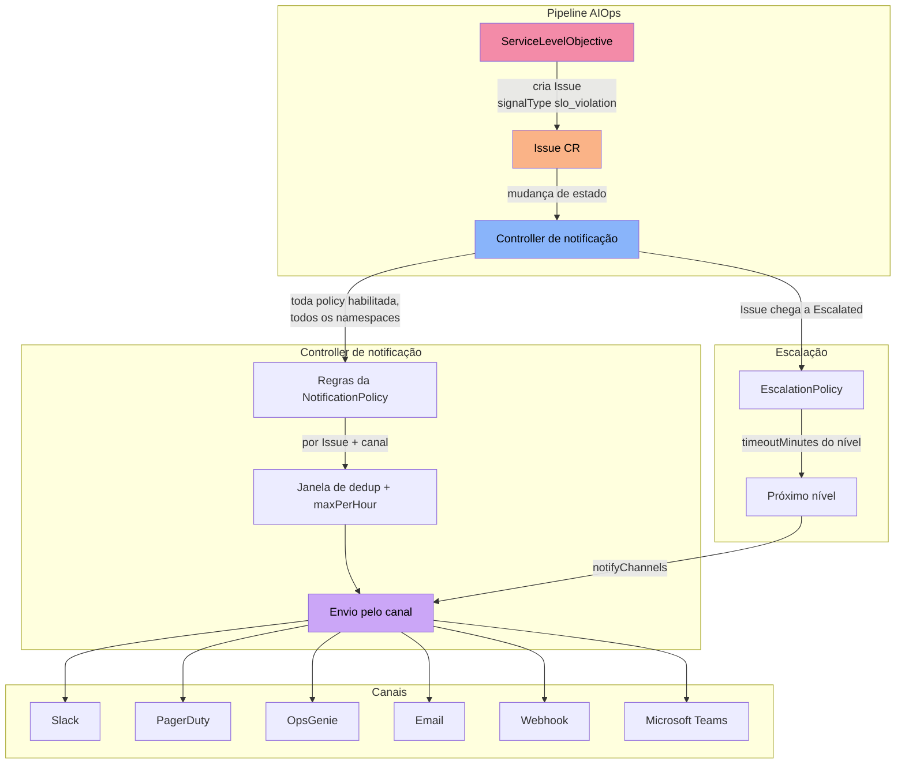
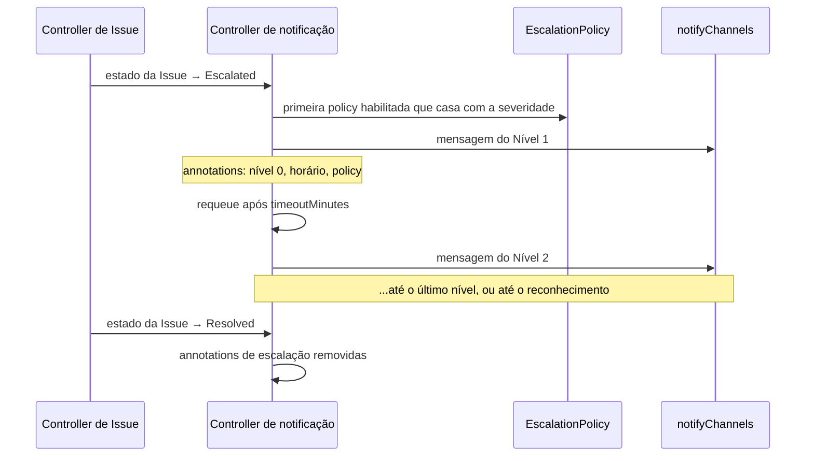

O sistema de notificações da plataforma AIOps envia as mudanças de estado das Issues para as equipes certas, nos canais certos (Slack, PagerDuty, OpsGenie, email, webhooks genéricos e Microsoft Teams). As políticas de escalação acrescentam uma cadeia de níveis temporizada para as Issues que a remediação automática não conseguiu resolver.

Tudo o que esta página descreve é feito por um único controller do operator, o **controller de notificação** (`NotificationReconciler`), que observa os recursos `Issue`. `NotificationPolicy` e `EscalationPolicy` não têm controller próprio: o controller de notificação as lê sempre que uma Issue muda.

## Visão Geral



### O que dispara uma notificação

O único gatilho é uma **mudança de `status.state` em uma Issue**. O controller guarda o último estado tratado na annotation `platform.chatcli.io/last-notified-state` da Issue e avalia as policies uma vez para cada estado novo: `Detected`, `Analyzing`, `Remediating`, `Contained`, `Resolved`, `Escalated`, `Failed`.

Outros eventos só chegam a um canal se virarem uma mudança de estado de Issue:

| Evento | O que acontece de fato |
|--------|------------------------|
| **Alerta de burn rate / budget esgotado de SLO** | O controller de SLO cria uma Issue com `signalType: slo_violation` (veja [SLOs e SLAs](/pt/kubernetes/aiops/slo-sla)). Essa Issue é notificada como qualquer outra. |
| **Violação de SLA** | **Nenhuma notificação.** O controller de SLA registra a violação no status do `IncidentSLA` e na annotation `platform.chatcli.io/sla-violated` da Issue. |
| **Falha de remediação** | Aparece apenas pelos estados de Issue que ela provoca (`Remediating` → `Analyzing` para uma nova tentativa, `Escalated` quando as tentativas acabam). |
| **ApprovalRequest criado** | **Nenhuma notificação.** Aprovações pendentes aparecem no dashboard, na API REST e em `kubectl get approvalrequests`. |

<Warning>
`IncidentSLA.spec.notificationPolicyRef`, `IncidentSLA.spec.escalationPolicyRef` e `ServiceLevelObjective.spec.alertPolicy.notificationPolicyRef` são reservados: os CRDs os aceitam, mas nenhum controller os lê ainda. O roteamento é decidido apenas pelas `rules` das suas NotificationPolicies. Para rotear alertas de SLO, filtre por `signalTypes: [slo_violation]`.
</Warning>

<Note>
Issues criadas por um `ChaosExperiment` (label `platform.chatcli.io/source: chaos-experiment`) continuam gerando as notificações normais de mudança de estado. Elas **nunca iniciam uma escalação**, então um exercício de chaos nunca aciona ninguém por meio de uma EscalationPolicy.
</Note>

## CRD NotificationPolicy

Uma `NotificationPolicy` (short name `np`) declara um conjunto de **canais** nomeados, uma lista de **regras** que escolhem canais pelo nome, **throttling** e **templates** opcionais de mensagem.

```yaml
apiVersion: platform.chatcli.io/v1alpha1
kind: NotificationPolicy
metadata:
  name: production-alerts
  namespace: chatcli-system
spec:
  enabled: true
  channels:
    - name: slack-critical
      type: slack
      config:
        channel: "#incidents-critical"
      secretRef:
        name: slack-webhook            # chave do Secret: webhook_url
    - name: pagerduty-sre
      type: pagerduty
      config: {}
      secretRef:
        name: pagerduty-routing        # chave do Secret: routing_key
    - name: opsgenie-sre
      type: opsgenie
      config:
        tags: "production,aiops"
        responders: '[{"type":"team","name":"platform-sre"}]'
      secretRef:
        name: opsgenie-api             # chave do Secret: api_key
    - name: email-sre
      type: email
      config:
        smtp_host: smtp.example.com
        smtp_port: "587"
        from: "aiops@example.com"
        to: "sre-team@example.com,platform-leads@example.com"
      secretRef:
        name: smtp-credentials         # chaves do Secret: smtp_user, smtp_password
    - name: events-webhook
      type: webhook
      config:
        url: "https://events.example.com/aiops"
        headers: '{"X-Source":"chatcli-aiops","X-Environment":"production"}'
      secretRef:
        name: webhook-hmac             # chave do Secret: secret
    - name: teams-infra
      type: teams
      config: {}
      secretRef:
        name: teams-webhook            # chave do Secret: webhook_url

  rules:
    - name: critical-incidents
      severities: [critical, high]
      signalTypes: [oom_kill, deploy_failing, error_rate]
      namespaces: [production, payments]
      resourceKinds: [Deployment, StatefulSet]
      states: [Detected, Escalated, Resolved]
      channels: [slack-critical, pagerduty-sre, opsgenie-sre]

    - name: low-severity-resolved
      severities: [medium, low]
      states: [Resolved]
      channels: [email-sre]

    - name: all-events-webhook
      channels: [events-webhook]

    - name: teams-infra
      severities: [critical, high]
      namespaces: [infrastructure]
      channels: [teams-infra]

  throttle:
    deduplicationWindow: "5m"
    maxPerHour: 10

  templates:
    issue_created: "{{.Severity}} {{.SignalType}} em {{.Resource}} ({{.Namespace}}): {{.Description}}"
    issue_resolved: "{{.Resource}} em {{.Namespace}} voltou ao normal."
```

Os Secrets referenciados acima ficam no **mesmo namespace da policy**:

```bash
kubectl -n chatcli-system create secret generic slack-webhook \
  --from-literal=webhook_url='https://hooks.slack.com/services/T000/B000/XXXX'
kubectl -n chatcli-system create secret generic smtp-credentials \
  --from-literal=smtp_user='aiops@example.com' --from-literal=smtp_password='<senha>'
```

### Como as policies são aplicadas

- **Toda policy habilitada, de qualquer namespace**, é avaliada para **toda Issue** do cluster. O namespace da policy não limita o seu alcance. Para isso, use o filtro `namespaces` da regra.
- Dentro de uma policy, **toda regra que casar** envia para os seus canais. O mesmo canal pode receber a mesma Issue duas vezes se duas regras casarem, mas a janela de dedup (abaixo) normalmente suprime o segundo envio.
- Uma regra que cita um canal ausente em `spec.channels` é ignorada com a linha de log `channel not found in policy`.

### Campos do Spec

#### NotificationPolicySpec

| Campo | Tipo | Obrigatório | Padrão | Descrição |
|-------|------|:-----------:|--------|-----------|
| `channels` | []NotificationChannel | **Sim** | | Canais para os quais a policy pode entregar |
| `rules` | []NotificationRule | **Sim** | | Quando e para onde enviar |
| `throttle` | ThrottleConfig | Não | | Limitação de taxa |
| `templates` | map[string]string | Não | | Corpo de mensagem customizado por chave de evento |
| `enabled` | bool | Não | `true` | Policies desabilitadas são ignoradas |

#### NotificationChannel

| Campo | Tipo | Obrigatório | Descrição |
|-------|------|:-----------:|-----------|
| `name` | string | **Sim** | Nome ao qual as regras (e os níveis de escalação) se referem |
| `type` | enum | **Sim** | `slack`, `pagerduty`, `opsgenie`, `email`, `webhook`, `teams` |
| `config` | map[string]string | **Sim** | Chaves específicas do canal (veja cada canal abaixo). Use `config: {}` quando tudo vier do `secretRef`. |
| `secretRef.name` | string | Não | Secret no namespace da policy. **Todas as chaves** do Secret são mescladas em `config` e sobrescrevem as chaves de mesmo nome. |

<Warning>
`config` é um **mapa de strings**. Números, booleanos, listas e mapas precisam ser escritos como strings: `smtp_port: "587"`, `tls_skip_verify: "true"`, `to: "a@example.com,b@example.com"`, `headers: '{"X-Env":"prod"}'`. Um `587` sem aspas ou uma lista YAML é rejeitado pelo API server.
</Warning>

<Warning>
`GET /api/v1/policies/notification` na API REST do operator devolve o `spec` completo, incluindo `config`, para qualquer chave com a role `viewer`. Mantenha URLs de webhook, routing keys, API keys e senhas no Secret do `secretRef`, e não em `config`.
</Warning>

#### NotificationRule

Os filtros ficam direto na regra (não existe bloco `match`). Um filtro omitido ou vazio casa com tudo. A lógica é **AND** entre filtros e **OR** dentro de cada filtro.

| Campo | Tipo | Descrição |
|-------|------|-----------|
| `name` | string | **Obrigatório.** Nome da regra (usado nos logs) |
| `severities` | []enum | `critical`, `high`, `medium`, `low` |
| `signalTypes` | []string | Comparado com o `spec.signalType` da Issue, por exemplo `oom_kill`, `pod_restart`, `pod_not_ready`, `deploy_failing`, `error_rate`, `crashloop_backoff`, `slo_violation` |
| `namespaces` | []string | Comparado com o namespace do **recurso afetado** (`spec.resource.namespace`), não com o namespace da própria Issue |
| `resourceKinds` | []string | Comparado com `spec.resource.kind`, por exemplo `Deployment`, `StatefulSet`, `DaemonSet` |
| `states` | []enum | `Detected`, `Analyzing`, `Remediating`, `Contained`, `Resolved`, `Escalated`, `Failed` |
| `channels` | []string | **Obrigatório.** Nomes de canais de `spec.channels` |

<Tip>
Sempre defina `states`. Sem ele, toda transição da Issue (`Detected` → `Analyzing` → `Remediating` → ...) é candidata. Inclua também `Resolved` nos canais de PagerDuty e OpsGenie: é isso que resolve ou fecha o alerta do lado deles.
</Tip>

#### ThrottleConfig

| Campo | Tipo | Padrão | O que o código faz |
|-------|------|--------|--------------------|
| `deduplicationWindow` | string de duração | `5m` | Depois de um envio bem-sucedido, novos envios **da mesma Issue para o mesmo nome de canal** são descartados até a janela passar. Interpretado com `time.ParseDuration` do Go (`30s`, `5m`, `2h`). Um valor inválido como `1d` cai silenciosamente para `5m`. |
| `maxPerHour` | int | `10` | No máximo esta quantidade de envios bem-sucedidos **por Issue, por nome de canal, por hora cheia**. `0` ou valor negativo equivale a `10`. |
| `groupingWindow` | string de duração | `1m` | **Reservado.** Aceito pelo CRD e ignorado pelo controller. Não existe agrupamento nem digest: cada mudança de estado que casa é entregue sozinha, sujeita a `deduplicationWindow` e `maxPerHour`. |

```text
Chave do throttle = <namespace da issue>/<nome da issue>/<nome do canal>
```

<Warning>
Notificações barradas pelo throttle são **descartadas, não enfileiradas**, e o estado mesmo assim é marcado como tratado, então ele nunca é enviado depois. Com a janela padrão de `5m`, uma Issue que passa por `Detected` → `Analyzing` → `Remediating` → `Resolved` em menos de cinco minutos envia **apenas o primeiro estado que casar** para canais de Slack, email, webhook e Teams. Para canais que precisam ver toda transição, use uma janela curta, como `30s`.

Uma exceção: uma notificação de `Resolved` para um canal de **PagerDuty ou OpsGenie** nunca é barrada, nem por `deduplicationWindow` nem por `maxPerHour`, porque é ela que resolve o evento ou fecha o alerta do lado deles.

O estado do throttle fica **na memória do operator**: ele é zerado quando o operator reinicia. A janela é contada por **nome** de canal, então duas policies que usam o mesmo nome de canal a compartilham.
</Warning>

#### Templates

`templates` substitui o **corpo da mensagem** (o título e o assunto do email não mudam). A chave é escolhida pelo novo estado:

| Estado da Issue | Chave do template |
|-----------------|-------------------|
| `Detected` (e qualquer estado não listado abaixo, como `Analyzing` ou `Contained`) | `issue_created` |
| `Remediating` | `remediation_started` |
| `Resolved` | `issue_resolved` |
| `Escalated` | `issue_escalated` |
| `Failed` | `remediation_failed` |

A chave `remediation_completed` é aceita, mas nunca usada. Os templates **não** são `text/template` do Go: é uma simples substituição de placeholders, e só estes tokens exatos são trocados: `{{.Name}}` (nome da Issue), `{{.Namespace}}`, `{{.Severity}}`, `{{.State}}`, `{{.Resource}}` (`Kind/nome`), `{{.Description}}`, `{{.Source}}`, `{{.SignalType}}`, `{{.RiskScore}}`. Qualquer outra coisa (condicionais, funções, outros campos) é enviada literalmente.

Sem template, o corpo é o `spec.description` da Issue, ou `Issue <name> on <Kind>/<name> transitioned to <State>.` quando a descrição está vazia.

### Conteúdo da mensagem

Todos os canais recebem a mesma mensagem:

- **Título**: `<emoji da severidade> [<SEVERIDADE>] <namespace>/<nome do recurso> — <Estado>`, por exemplo `🔴 [CRITICAL] production/api-gateway — Detected`.
- **Corpo**: o template ou a descrição (veja acima).
- **Campos**: `Source`, `SignalType`, `RiskScore`, mais `CorrelationID`, `RemediationAttempts` (`n/max`) e `Resolution` quando estão preenchidos.
- **Cor** por severidade: critical `#FF0000`, high `#FF8C00`, medium `#FFD700`, low `#00CC00`.

A mensagem não inclui a análise da IA, o plano de remediação nem link para dashboard. Todo canal HTTP usa timeout de 30 segundos e faz **uma única tentativa**, sem retries.

### Status

| Campo | Descrição |
|-------|-----------|
| `status.totalSent` / `status.failedCount` | Contadores de entregas com sucesso e com falha |
| `status.lastNotifiedAt` | Horário da última entrega com sucesso |
| `status.recentDeliveries` | As últimas 20 tentativas (`channel`, `sentAt`, `success`, `error`) |
| `status.conditions[Ready]` | `True/DeliverySucceeded` ou `False/DeliveryFailed` com o último erro |

Notificações de escalação não entram nesse status. Toda tentativa de entrega, inclusive as de escalação, também é registrada como um `AuditEvent` com `eventType: notification_sent` (veja [Auditoria e Compliance](/pt/kubernetes/aiops/audit-compliance)).

```bash
kubectl get np -A
# NAME                ENABLED   SENT   FAILED   AGE
# production-alerts   true      42     1        3d
kubectl get np production-alerts -n chatcli-system -o jsonpath='{.status.recentDeliveries}'
```

## Canais de Notificação

### 1. Slack

Publica em um **Incoming Webhook** do Slack usando Block Kit.

<Accordion title="Configuração completa do Slack">

| Chave | Obrigatório | Descrição |
|-------|:-----------:|-----------|
| `webhook_url` | **Sim** | URL do Incoming Webhook |
| `channel` | Não | Enviado como `channel` no payload. Webhooks criados por um app do Slack publicam no próprio canal e ignoram este valor. |
| `username` | Não | Enviado como `username` no payload |

Nenhuma outra chave é lida (não existe opção de menção nem de ícone). Para mencionar um grupo, coloque a menção em um template, por exemplo `issue_created: "<!subteam^S0123ABC> {{.Description}}"`.

**Payload enviado:**

```json
{
  "channel": "#incidents-critical",
  "blocks": [
    {"type": "header", "text": {"type": "plain_text", "text": "🔴 [CRITICAL] production/api-gateway — Detected"}},
    {
      "type": "section",
      "text": {"type": "mrkdwn", "text": "OOMKilled: container exceeded its 512Mi memory limit"},
      "fields": [
        {"type": "mrkdwn", "text": "*Severity:* 🔴 critical"},
        {"type": "mrkdwn", "text": "*Resource:* Deployment/api-gateway"},
        {"type": "mrkdwn", "text": "*Namespace:* production"},
        {"type": "mrkdwn", "text": "*State:* Detected"},
        {"type": "mrkdwn", "text": "*SignalType:* oom_kill"},
        {"type": "mrkdwn", "text": "*RiskScore:* 85"},
        {"type": "mrkdwn", "text": "*Source:* watcher"}
      ]
    },
    {"type": "context", "elements": [{"type": "mrkdwn", "text": "Issue: *api-gateway-oom-kill-1771276354* | 2026-03-19T14:30:00Z"}]}
  ],
  "attachments": [{"color": "#FF0000", "blocks": []}]
}
```

Os campos extras (`SignalType`, `RiskScore`, ...) vêm de um mapa, então a ordem pode mudar entre mensagens.

</Accordion>

**Exemplo mínimo:**

```yaml
channels:
  - name: slack
    type: slack
    config:
      webhook_url: "https://hooks.slack.com/services/T000/B000/XXXX"
rules:
  - name: everything-to-slack
    states: [Detected, Escalated, Resolved]
    channels: [slack]
```

### 2. PagerDuty

Envia eventos para a **Events API v2** do PagerDuty (`https://events.pagerduty.com/v2/enqueue`; o endpoint é fixo).

<Accordion title="Configuração completa do PagerDuty">

| Chave | Obrigatório | Descrição |
|-------|:-----------:|-----------|
| `routing_key` | **Sim** | Integration Key de uma integração Events API v2 |

Nenhuma outra chave é lida. O mapeamento de severidade e a dedup key são fixos (a chave `severity_map` citada na descrição do campo no CRD não está implementada):

| ChatCLI | PagerDuty |
|---------|-----------|
| `critical` | `critical` |
| `high` | `error` |
| `medium` | `warning` |
| `low` | `info` |

**Deduplicação:** o `dedup_key` é sempre `chatcli-<namespace do recurso>-<nome da issue>`, então todo estado notificado de uma Issue atualiza o mesmo alerta no PagerDuty.

**Payload enviado:**

```json
{
  "routing_key": "<routing_key>",
  "event_action": "trigger",
  "dedup_key": "chatcli-production-api-gateway-oom-kill-1771276354",
  "payload": {
    "summary": "🔴 [CRITICAL] production/api-gateway — Detected",
    "source": "chatcli/production/Deployment/api-gateway",
    "severity": "critical",
    "timestamp": "2026-03-19T14:30:00Z",
    "component": "Deployment/api-gateway",
    "group": "production",
    "class": "critical",
    "custom_details": {
      "resource": "Deployment/api-gateway",
      "namespace": "production",
      "state": "Detected",
      "severity": "critical",
      "Source": "watcher",
      "SignalType": "oom_kill",
      "RiskScore": "85"
    }
  }
}
```

**Resolução automática:** quando uma notificação é enviada para o estado `Resolved`, o evento usa `event_action: resolve` com o mesmo `dedup_key`. Isso acontece sempre que alguma regra envia `Resolved` para este canal: resolves para o PagerDuty nunca são barrados pelo throttle.

</Accordion>

### 3. OpsGenie

Cria alertas pela Alert API do OpsGenie (`https://api.opsgenie.com/v2/alerts`; o endpoint é fixo, então contas na instância EU não são suportadas).

<Accordion title="Configuração completa do OpsGenie">

| Chave | Obrigatório | Descrição |
|-------|:-----------:|-----------|
| `api_key` | **Sim** | API key, enviada como `Authorization: GenieKey <api_key>` |
| `tags` | Não | String separada por vírgulas, por exemplo `"production,aiops"` |
| `responders` | Não | Uma **string JSON** com uma lista de objetos de responder. JSON inválido é ignorado silenciosamente. |

**Mapeamento de prioridade (fixo):** `critical` → `P1`, `high` → `P2`, `medium` → `P3`, `low` → `P4`.

**Responders:**

```yaml
config:
  responders: '[{"type":"team","name":"platform-sre"},{"type":"user","username":"oncall@example.com"},{"type":"escalation","name":"sre-escalation"},{"type":"schedule","name":"sre-oncall"}]'
```

O `alias` do alerta é `chatcli-<namespace do recurso>-<nome da issue>`, o `source` é `ChatCLI AIOps`, o `entity` é o recurso, e `details` traz `resource`, `namespace`, `severity`, `state` e `issue`.

**Fechamento automático:** para o estado `Resolved`, o canal fecha o alerta pelo alias em vez de criar um novo (mesmas condições do PagerDuty).

</Accordion>

### 4. Email

Envia um email HTML via SMTP.

<Accordion title="Configuração completa do Email">

| Chave | Obrigatório | Descrição |
|-------|:-----------:|-----------|
| `smtp_host` | **Sim** | Host do servidor SMTP |
| `smtp_port` | **Sim** | Porta, como string (`"587"`, `"25"`) |
| `from` | **Sim** | Endereço do remetente |
| `to` | **Sim** | Destinatários separados por vírgula |
| `smtp_user` | Não | Habilita autenticação SMTP `PLAIN` |
| `smtp_password` | Não | Senha do `smtp_user` (mantenha no Secret) |
| `tls_skip_verify` | Não | `"true"` pula a verificação do certificado (STARTTLS ou TLS implícito) |
| `smtp_tls` | Não | `implicit` (também `tls` ou `smtps`) abre uma conexão TLS desde o primeiro byte; `starttls` mantém a conexão em texto puro e a eleva com STARTTLS. Sem ele, a porta `465` usa TLS implícito e qualquer outra porta usa STARTTLS. |
| `smtp_timeout` | Não | Duração Go que limita toda a conversa SMTP, conexão inclusa (padrão `30s`) |

Não existem opções de `cc`, `bcc`, assunto ou template HTML. O assunto é sempre `[<SEVERIDADE>] <título>` e o corpo é um layout HTML fixo com a tabela de campos.

**Comportamento de TLS:**

- **TLS implícito** (SMTPS) é usado na porta `465`, ou em qualquer porta com `smtp_tls: implicit`: a conexão é criptografada desde o primeiro byte.
- Nos demais casos, a conexão começa em texto puro e é elevada com STARTTLS **quando o servidor o anuncia**. `smtp_tls: starttls` força esse modo mesmo na porta `465`.
- Se a conexão não estiver criptografada e `smtp_user` estiver definido, a autenticação falha (o Go se recusa a enviar credenciais `PLAIN` por conexão sem criptografia, exceto para `localhost`).
- Toda a conversa, conexão inclusa, é limitada por `smtp_timeout` (padrão `30s`), então um servidor inacessível ou mudo faz o envio falhar em vez de segurar o reconcile.

**Exemplo:**

```yaml
channels:
  - name: email-sre
    type: email
    config:
      smtp_host: smtp.example.com
      smtp_port: "587"
      from: "aiops@example.com"
      to: "sre-team@example.com,platform-leads@example.com"
    secretRef:
      name: smtp-credentials   # chaves: smtp_user, smtp_password
```

</Accordion>

<Warning>
Nunca coloque credenciais SMTP diretamente no YAML da NotificationPolicy. Coloque `smtp_user` e `smtp_password` em um Secret e referencie-o com `secretRef`.
</Warning>

### 5. Webhook

Envia a mensagem como JSON para qualquer endpoint HTTP, com assinatura HMAC-SHA256 opcional.

<Accordion title="Configuração completa do Webhook">

| Chave | Obrigatório | Descrição |
|-------|:-----------:|-----------|
| `url` | **Sim** | URL de destino |
| `method` | Não | Método HTTP (padrão `POST`) |
| `headers` | Não | Uma **string com objeto JSON** de headers extras, por exemplo `'{"X-Source":"chatcli-aiops"}'`. JSON inválido é ignorado silenciosamente. |
| `secret` | Não | Chave para a assinatura HMAC-SHA256 |

Toda requisição leva `Content-Type: application/json` e `User-Agent: ChatCLI-AIOps/1.0`. O timeout é de 30 segundos e não há retries.

**Assinatura HMAC-SHA256:**

Quando `secret` está definido, a requisição leva o header `X-Signature-256` com o HMAC-SHA256 do body bruto:

```text
X-Signature-256: sha256=<hex(HMAC-SHA256(secret, body))>
```

**Validação no receptor:**

```python
import hmac, hashlib

def verify_signature(payload: bytes, signature: str, secret: str) -> bool:
    expected = hmac.new(
        secret.encode(), payload, hashlib.sha256
    ).hexdigest()
    return hmac.compare_digest(f"sha256={expected}", signature)
```

**Payload JSON enviado:**

```json
{
  "title": "🔴 [CRITICAL] production/api-gateway — Detected",
  "body": "OOMKilled: container exceeded its 512Mi memory limit",
  "severity": "critical",
  "issueName": "api-gateway-oom-kill-1771276354",
  "namespace": "production",
  "resource": "Deployment/api-gateway",
  "state": "Detected",
  "timestamp": "2026-03-19T14:30:00.123456789Z",
  "fields": {
    "Source": "watcher",
    "SignalType": "oom_kill",
    "RiskScore": "85"
  },
  "color": "#FF0000"
}
```

</Accordion>

### 6. Microsoft Teams

Publica um **Adaptive Card** (versão 1.4) em uma URL de webhook do Teams.

<Accordion title="Configuração completa do Microsoft Teams">

| Chave | Obrigatório | Descrição |
|-------|:-----------:|-----------|
| `webhook_url` | **Sim** | URL do webhook do Teams |

Nenhuma outra chave é lida.

**Card gerado:**

- Um título grande em negrito (o título da mensagem)
- O texto do corpo
- Um FactSet com `Severity`, `Resource`, `Namespace`, `State`, `Issue` e os campos extras
- Um rodapé com o horário de geração

A mensagem também leva `themeColor` com a cor da severidade sem `#` (`FF0000`, `FF8C00`, `FFD700`, `00CC00`).

</Accordion>

## CRD EscalationPolicy

Uma `EscalationPolicy` (short name `ep`) é uma cadeia ordenada de níveis. Ela é usada quando uma Issue entra no estado **`Escalated`**, que o controller de Issue define quando a remediação automática desiste (por exemplo, quando todas as tentativas de remediação falharam).

```yaml
apiVersion: platform.chatcli.io/v1alpha1
kind: EscalationPolicy
metadata:
  name: production-escalation
  namespace: chatcli-system
spec:
  enabled: true
  severities: [critical, high]
  levels:
    - name: L1-OnCall
      timeoutMinutes: 5
      targets:
        - type: oncall
          name: sre-primary
      notifyChannels: [slack-critical, pagerduty-sre]

    - name: L2-SeniorSRE
      timeoutMinutes: 15
      targets:
        - type: user
          name: sre-lead@example.com
        - type: team
          name: platform-engineering
      notifyChannels: [opsgenie-sre, email-sre]

    - name: L3-Management
      timeoutMinutes: 30
      targets:
        - type: team
          name: engineering-leadership
      notifyChannels: [email-sre]
```

### Campos do Spec

| Campo | Tipo | Obrigatório | Padrão | Descrição |
|-------|------|:-----------:|--------|-----------|
| `levels` | []EscalationLevel | **Sim** | | Cadeia ordenada, primeiro nível primeiro |
| `severities` | []enum | Não | todas | Severidades de Issue às quais a policy se aplica |
| `defaultPolicy` | bool | Não | `false` | Usada quando nenhuma policy casa pela severidade |
| `enabled` | bool | Não | `true` | Policies desabilitadas são ignoradas |

#### EscalationLevel

| Campo | Tipo | Obrigatório | Padrão | Descrição |
|-------|------|:-----------:|--------|-----------|
| `name` | string | **Sim** | | Nome do nível (aparece na mensagem e no label da métrica) |
| `timeoutMinutes` | int | **Sim** | `15` | Minutos neste nível antes de passar para o próximo |
| `targets` | []EscalationTarget | **Sim** | | Quem é responsável neste nível |
| `notifyChannels` | []string | Não | | **Nomes** de canais das NotificationPolicies. É a única forma de um nível entregar alguma coisa. |
| `repeatIntervalMinutes` | int | Não | `0` | Reenvia a mensagem deste nível neste intervalo até a Issue ser reconhecida, passar para o próximo nível ou ser resolvida. O último nível continua repetindo depois do timeout. Uma Issue em snooze não repete. `0` = sem repetição. |

#### EscalationTarget

| Campo | Tipo | Descrição |
|-------|------|-----------|
| `type` | enum | `channel`, `user`, `team`, `oncall` |
| `name` | string | Email do usuário, nome do time, nome do canal ou nome da escala de plantão |

<Warning>
**Os targets são apenas informativos.** O operator não contata usuários, times nem escalas de plantão. Ele escreve a lista (por exemplo `oncall:sre-primary, user:sre-lead@example.com`) na mensagem de escalação e envia essa mensagem para os `notifyChannels` do nível. Um nível sem `notifyChannels` não notifica ninguém.
</Warning>

### Como a Escalação Funciona

1. **Início.** Quando uma Issue muda para `Escalated` (e não foi induzida por chaos), o controller escolhe uma policy: a **primeira policy habilitada, de qualquer namespace**, cujo `severities` contém a severidade da Issue, ou que não tem `severities`. Uma policy com `defaultPolicy: true` só é usada quando nenhuma casou. Se nada for encontrado, não há escalação (linha de log `no escalation policy found for issue`).
2. **Nível 1** é notificado na hora. A Issue recebe as annotations abaixo e o status da policy ganha uma entrada em `activeEscalations`.
3. **Avanço.** Quando o `timeoutMinutes` do nível atual passa, o próximo nível é notificado com o título `<emoji> ESCALATION [<SEVERIDADE>] <issue> — Level <n>: <nome do nível>`. O novo nível e o horário em que começou ficam salvos na Issue, então a cadeia avança nível a nível (L1 → L2 → L3) e cada nível é notificado uma vez, mais as repetições (`repeatIntervalMinutes`).
4. **Último nível.** A cadeia para ali. O último nível só é reenviado se tiver `repeatIntervalMinutes`.
5. **Fim.** Um **reconhecimento** (acknowledge) congela a cadeia no nível atual: nenhum nível a mais e nenhuma repetição (veja abaixo). A escalação termina quando a Issue chega a `Resolved`: as annotations de escalação são removidas e a entrada da Issue sai de `status.activeEscalations`.

As mensagens de escalação são enviadas para todo canal, em qualquer NotificationPolicy habilitada, cujo nome esteja em `notifyChannels` (os Secrets são lidos do namespace dessa policy). Elas não passam pelas regras, pelo throttle nem pelos templates.



**Annotations da Issue usadas no acompanhamento:**

| Annotation | Descrição |
|------------|-----------|
| `platform.chatcli.io/escalation-level` | Índice do nível atual (`0` = primeiro nível) |
| `platform.chatcli.io/escalation-time` | Horário RFC 3339 em que o nível atual foi atingido |
| `platform.chatcli.io/escalation-policy` | Nome da EscalationPolicy em uso |
| `platform.chatcli.io/escalation-notified-at` | Horário RFC 3339 da última notificação do nível atual; o `repeatIntervalMinutes` conta a partir dele |
| `platform.chatcli.io/escalation-pending-notify` | `true` enquanto uma mensagem de nível está retida por um snooze; ela é enviada quando o snooze termina |

```bash
kubectl get issue <nome> -n <namespace> -o jsonpath='{.metadata.annotations}'
kubectl get escalationpolicies -A
kubectl get escalationpolicies production-escalation -n chatcli-system -o jsonpath='{.status.activeEscalations}'
```

Cada entrada de `status.activeEscalations` traz `issueName`, `currentLevel` (a partir de 0), `escalatedAt` e, depois que a Issue é reconhecida, `acknowledgedAt` e `acknowledgedBy`. A entrada é removida quando a Issue é resolvida; `status.totalEscalations` conta toda escalação iniciada.

### Reconhecimento e como encerrar uma escalação

As duas ações passam pela API REST (role operator, header `X-API-Key`) ou pelo dashboard:

- **Acknowledge.** `POST /api/v1/incidents/{name}/acknowledge` adiciona as annotations `aiops.chatcli.io/acknowledged`, `aiops.chatcli.io/acknowledged-at` e `aiops.chatcli.io/acknowledged-by` (a role de quem chamou). A escalação **para no nível atual**: nenhum nível a mais é alcançado e nenhuma repetição é enviada. O reconhecimento é registrado na entrada de `status.activeEscalations` da policy (`acknowledgedAt`, `acknowledgedBy`). Uma Issue reconhecida antes de chegar a `Escalated` nunca inicia uma escalação. As notificações de mudança de estado continuam saindo.
- **Snooze.** `POST /api/v1/incidents/{name}/snooze` com um corpo como `{"duration": "30m"}` registra `aiops.chatcli.io/snoozed-until` e `aiops.chatcli.io/snoozed-by`. Uma duração zero ou negativa é recusada com `400`. Até o snooze terminar, a Issue **não envia nenhuma notificação exceto `Resolved`** (uma mudança de estado que acontece durante o snooze não é enviada depois), e a escalação segura o nível: sem avanço e sem repetição. Uma mensagem de nível que cai dentro do snooze fica retida (`escalation-pending-notify`) e é enviada quando o snooze termina, e o timer do nível recomeça nesse momento.
- Reconhecer no PagerDuty ou no OpsGenie não tem efeito no cluster: não existe webhook de retorno.

Para encerrar uma escalação, **resolva a Issue**, por exemplo com `POST /api/v1/incidents/{name}/resolve` (role operator) ou pelo dashboard. Isso também envia as notificações de `Resolved` que resolvem o evento no PagerDuty e fecham o alerta no OpsGenie.


## Exemplos Completos

### Notification Policy: Slack + PagerDuty

```yaml
apiVersion: platform.chatcli.io/v1alpha1
kind: NotificationPolicy
metadata:
  name: critical-alerts-multi-channel
  namespace: chatcli-system
spec:
  channels:
    - name: slack-p0
      type: slack
      config: {}
      secretRef: {name: slack-p0-webhook}         # webhook_url
    - name: slack-incidents
      type: slack
      config: {}
      secretRef: {name: slack-incidents-webhook}  # webhook_url
    - name: pagerduty-critical
      type: pagerduty
      config: {}
      secretRef: {name: pagerduty-critical}       # routing_key

  rules:
    - name: critical-to-slack-and-pagerduty
      severities: [critical]
      states: [Detected, Escalated, Resolved]
      channels: [slack-p0, pagerduty-critical]

    - name: high-to-slack
      severities: [high]
      states: [Detected, Remediating, Escalated]
      channels: [slack-incidents]

    - name: resolved-to-slack
      states: [Resolved]
      channels: [slack-incidents]

  throttle:
    deduplicationWindow: "30s"
    maxPerHour: 20
```

A janela curta de `30s` deixa os canais de Slack verem cada transição de uma recuperação rápida. O evento `Resolved` que resolve o incidente no PagerDuty nunca é barrado pelo throttle, qualquer que seja a janela.

### Escalation Policy com dois níveis

```yaml
apiVersion: platform.chatcli.io/v1alpha1
kind: EscalationPolicy
metadata:
  name: p0-escalation
  namespace: chatcli-system
spec:
  severities: [critical]
  levels:
    - name: L1-PrimaryOnCall
      timeoutMinutes: 5
      targets:
        - type: oncall
          name: primary-oncall
      notifyChannels: [pagerduty-critical, slack-p0]

    - name: L2-SecondaryOnCall-and-Manager
      timeoutMinutes: 15
      targets:
        - type: oncall
          name: secondary-oncall
        - type: user
          name: sre-manager@example.com
      notifyChannels: [slack-p0, email-leadership]
---
apiVersion: platform.chatcli.io/v1alpha1
kind: EscalationPolicy
metadata:
  name: catch-all-escalation
  namespace: chatcli-system
spec:
  defaultPolicy: true
  severities: [high, medium, low]
  levels:
    - name: L1-Team
      timeoutMinutes: 30
      targets:
        - type: team
          name: platform-sre
      notifyChannels: [slack-incidents]
```

`email-leadership` precisa ser um canal definido em alguma NotificationPolicy. Depois que o segundo nível é alcançado, nada mais é enviado até a Issue ser resolvida; adicione `repeatIntervalMinutes` ao segundo nível para continuar lembrando até alguém reconhecer.

### Alertas de violação de SLO

Os alertas de burn rate e de budget esgotado de SLO chegam como Issues com `signalType: slo_violation` e `source: watcher`:

```yaml
apiVersion: platform.chatcli.io/v1alpha1
kind: NotificationPolicy
metadata:
  name: slo-notifications
  namespace: chatcli-system
spec:
  channels:
    - name: email-service-owners
      type: email
      config:
        smtp_host: smtp.example.com
        smtp_port: "587"
        from: "slo-alerts@example.com"
        to: "sre-team@example.com,service-owners@example.com"
      secretRef: {name: smtp-credentials}    # smtp_user, smtp_password
    - name: slack-slo
      type: slack
      config:
        channel: "#slo-violations"
      secretRef: {name: slack-slo-webhook}   # webhook_url
  rules:
    - name: slo-violations
      severities: [critical, high]
      signalTypes: [slo_violation]
      states: [Detected, Resolved]
      channels: [email-service-owners, slack-slo]
  throttle:
    deduplicationWindow: "30m"
    maxPerHour: 5
  templates:
    issue_created: "Alerta de SLO: {{.Description}}"
```

## Troubleshooting

<AccordionGroup>
  <Accordion title="Notificações não estão sendo enviadas">
    **Checklist de diagnóstico:**

    1. Verifique se a policy existe e está habilitada (policies de qualquer namespace se aplicam):
    ```bash
    kubectl get np -A
    ```

    2. Veja o status da policy em busca de erros de entrega:
    ```bash
    kubectl get np <policy> -n <namespace> -o jsonpath='{.status.recentDeliveries}'
    ```

    3. Verifique os logs do operator (`rule matched`, `notification sent`, `failed to send notification`, `channel not found in policy`, `failed to resolve channel config`):
    ```bash
    kubectl logs -n chatcli-system deploy/chatcli-operator | grep -i notification
    ```

    4. Compare a Issue com os filtros da regra. Lembre que `namespaces` é comparado com `spec.resource.namespace`:
    ```bash
    kubectl get issue <nome> -n <namespace> \
      -o jsonpath='{.spec.severity} {.spec.signalType} {.spec.resource.kind} {.spec.resource.namespace} {.status.state}{"\n"}'
    ```

    5. Verifique se o throttle descartou o envio (linha de log `notification throttled`). Outro estado da mesma Issue pode ter sido enviado para aquele canal dentro do `deduplicationWindow`.

    6. Se `platform.chatcli.io/last-notified-state` já é igual ao estado atual, esse estado já foi tratado e não é avaliado de novo.
  </Accordion>

  <Accordion title="A policy é rejeitada pelo kubectl apply">
    - Todo valor de `config` precisa ser string: coloque aspas em números (`smtp_port: "587"`) e booleanos (`tls_skip_verify: "true"`), e escreva listas como strings separadas por vírgula.
    - Todo canal precisa de `name`, `type` e `config` (use `config: {}` quando os valores vierem do `secretRef`).
    - Os filtros ficam direto na regra; um bloco `match:` não faz parte do schema.
  </Accordion>

  <Accordion title="Slack retorna erro 404 ou invalid_payload">
    - Confirme que o `webhook_url` está correto e que o app do Slack continua instalado no workspace
    - Teste o webhook manualmente:
    ```bash
    curl -X POST -H 'Content-type: application/json' \
      --data '{"text":"Teste ChatCLI AIOps"}' \
      "https://hooks.slack.com/services/T000/B000/XXXX"
    ```
  </Accordion>

  <Accordion title="PagerDuty não cria ou não resolve incidentes">
    - Confirme que o `routing_key` é uma Integration Key da Events API v2 (não uma chave da REST API)
    - Confirme que o serviço no PagerDuty está ativo e confira o payload no PagerDuty Event Debugger
    - Se os incidentes nunca são resolvidos, garanta que alguma regra envia `Resolved` para o canal (resolves para o PagerDuty nunca são barrados pelo throttle)
  </Accordion>

  <Accordion title="Emails não chegam">
    - Teste a conectividade SMTP de dentro do cluster:
    ```bash
    kubectl run smtp-check -n chatcli-system --rm -it --restart=Never \
      --image=curlimages/curl -- curl -v --max-time 5 telnet://smtp.example.com:587
    ```
    - Na porta `465` o canal usa TLS implícito; na `587` ou na `25` ele eleva com STARTTLS. Defina `smtp_tls` se o seu servidor usa uma porta fora do padrão.
    - Um envio que falha por timeout atingiu o `smtp_timeout` (padrão `30s`)
    - Confirme que o Secret tem as chaves `smtp_user` e `smtp_password` (e não `username`/`password`)
    - Cheque a pasta de spam dos destinatários
  </Accordion>

  <Accordion title="A escalação não começa ou não avança">
    - A escalação só começa quando a Issue entra em `Escalated`. Confira com `kubectl get issue <nome> -o jsonpath='{.status.state}'`.
    - Issues induzidas por chaos nunca escalam.
    - Verifique as annotations `platform.chatcli.io/escalation-level`, `escalation-time` e `escalation-policy`.
    - Garanta que cada nível tenha `notifyChannels` com nomes que existem em uma NotificationPolicy habilitada.
    - Procure `escalation initiated`, `escalation advanced` e `no escalation policy found for issue` nos logs do operator.
    - Uma Issue reconhecida não avança, e uma em snooze segura o nível até `aiops.chatcli.io/snoozed-until`.
  </Accordion>

  <Accordion title="Webhook retorna erro de assinatura">
    - Leia a assinatura do header `X-Signature-256`
    - Confirme que o `secret` no Secret da policy é o mesmo usado pelo receptor
    - Calcule o HMAC sobre o body bruto, antes de fazer o parse do JSON
    - Use `hmac.compare_digest` (ou equivalente) para evitar timing attacks
  </Accordion>
</AccordionGroup>

## Métricas Prometheus

O operator expõe estas métricas no seu endpoint de métricas (porta `8080`, caminho `/metrics`):

| Métrica | Tipo | Labels | Descrição |
|---------|------|--------|-----------|
| `chatcli_operator_notifications_sent_total` | Counter | `channel_type`, `severity`, `result` | Tentativas de envio, com `result` = `success` ou `failure` |
| `chatcli_operator_notifications_failed_total` | Counter | `channel_type`, `reason` | Falhas, com `reason` = `config_resolve` (Secret ilegível), `sender_create` (tipo desconhecido) ou `send` |
| `chatcli_operator_escalation_level_reached` | Counter | `policy`, `level` | Incrementa uma vez a cada nível que uma escalação alcança (repetições não contam); `level` é o **nome** do nível |
| `chatcli_operator_notification_duration_seconds` | Histogram | `channel_type` | Tempo gasto para entregar uma notificação, com sucesso ou não, incluindo envios de escalação |

Não há métrica de notificações barradas pelo throttle. O throttle só aparece nos logs (`notification throttled`).

**Alertas Prometheus recomendados:**

```yaml
groups:
  - name: chatcli-notifications
    rules:
      - alert: NotificationChannelFailing
        expr: sum by (channel_type, reason) (increase(chatcli_operator_notifications_failed_total[10m])) > 0
        for: 5m
        labels:
          severity: warning
        annotations:
          summary: "Canal de notificação {{ $labels.channel_type }} com falhas ({{ $labels.reason }})"
          description: "Pelo menos uma notificação falhou nos últimos 10 minutos"

      - alert: EscalationActive
        expr: sum by (policy, level) (increase(chatcli_operator_escalation_level_reached[15m])) > 0
        labels:
          severity: critical
        annotations:
          summary: "Nível de escalação {{ $labels.level }} notificado na policy {{ $labels.policy }}"
          description: "Uma Issue chegou ao estado Escalated e está percorrendo a cadeia de escalação"
```

## Próximos Passos

<CardGroup cols={2}>
  <Card title="SLOs e SLAs" icon="gauge-high" href="/pt/kubernetes/aiops/slo-sla">
    Gestão de Service Level Objectives com alertas de burn rate
  </Card>
  <Card title="Workflow de Aprovação" icon="shield-check" href="/pt/kubernetes/aiops/approval-workflow">
    Controle de mudanças com approval policies e blast radius
  </Card>
  <Card title="AIOps Platform" icon="brain" href="/pt/kubernetes/aiops-platform">
    Deep-dive na arquitetura AIOps
  </Card>
  <Card title="K8s Operator" icon="dharmachakra" href="/pt/kubernetes/k8s-operator">
    Configuração e CRDs do operator
  </Card>
</CardGroup>
