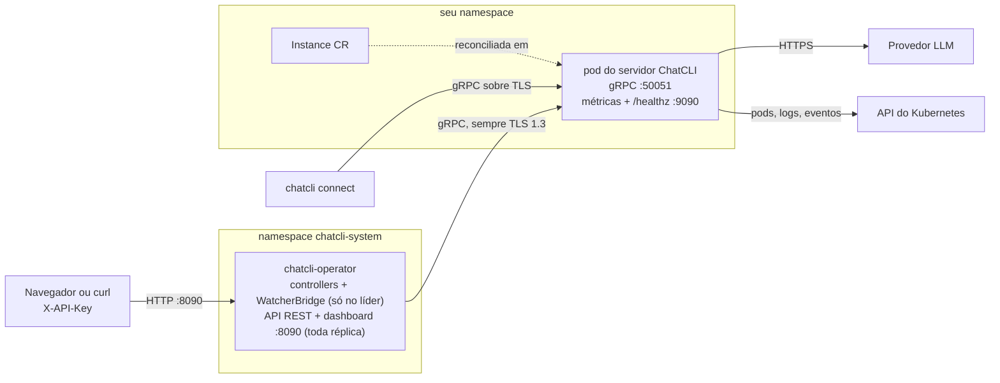

O **ChatCLI Operator** roda servidores ChatCLI no Kubernetes como recursos `Instance` e, em cima deles, um pipeline de AIOps que transforma alertas do watcher em incidentes, pede ao LLM a causa raiz e executa a remediação. Esta página é a jornada de quem opera: instalar, subir a primeira Instance de ponta a ponta, conectar, abrir o dashboard e endurecer tudo para produção.

<Info>
Os detalhes internos do pipeline de AIOps (correlação, análise, ações de remediação, post-mortems) estão em [AIOps Platform](/pt/kubernetes/aiops-platform) e [Ciclo de vida do incidente](/pt/kubernetes/aiops/incident-lifecycle). Esta página cobre tudo o que você precisa para operá-lo.
</Info>

## Como as peças se encaixam



O que você precisa saber antes de começar:

- **Uma `Instance` é um servidor gRPC do ChatCLI** (`chatcli server`) que o operator implanta e mantém em ordem: um Deployment, um Service, ConfigMaps, uma ServiceAccount e, opcionalmente, um PVC e RBAC do watcher.
- **O operator sempre conecta no servidor com TLS 1.3.** Não existe caminho em texto puro do operator até uma Instance. O endereço discado é `<name>.<namespace>.svc.cluster.local:<port>`, então o certificado do servidor precisa valer para esse nome.
- **Toda Instance precisa de uma credencial.** Dentro do cluster o servidor escuta em todas as interfaces e se recusa a subir sem token compartilhado, material JWT ou CA de cliente. O operator confere isso antes e não cria o Deployment quando o spec não tem nenhum.
- **Uma Instance por cluster conduz o AIOps.** O WatcherBridge lista todas as Instances do cluster e se conecta à primeira pronta que encontrar. Você pode rodar outras Instances para chat, mas só uma alimenta o pipeline de incidentes, e qual delas não é algo em que se possa confiar.
- **A API REST e o dashboard web são servidos pelo operator**, não pela Instance: Service `chatcli-operator`, porta `8090`, autenticados por API key.

### API group e CRDs

Todos os recursos são namespaced e ficam em `platform.chatcli.io/v1alpha1`. O operator traz 17 CRDs:

| Kind | Short name | O que é |
|------|-----------|---------|
| **Instance** | `inst` | Um servidor ChatCLI gerenciado pelo operator (esta página) |
| **Anomaly** | `anom` | Um sinal bruto do watcher do servidor |
| **Issue** | `iss` | Um incidente correlacionado que agrupa anomalias |
| **AIInsight** | `ai` | A análise de causa raiz do LLM e as ações sugeridas para uma Issue |
| **RemediationPlan** | `rp` | As ações executadas para uma Issue (runbook, gerado por IA ou agêntico) |
| **Runbook** | `rb` | Um procedimento reutilizável, escrito por você ou gerado a partir de uma remediação bem-sucedida |
| **PostMortem** | `pm` | O relatório do incidente gerado após a resolução |
| **SourceRepository** | `srcrepo` | Liga um workload ao seu repositório git para análise ciente do código |
| **NotificationPolicy** | `np` | Roteamento de notificações para canais |
| **EscalationPolicy** | `ep` | Níveis de escalação e timeouts |
| **ServiceLevelObjective** | `slo` | Um SLO com alerta por burn rate |
| **IncidentSLA** | `sla` | Metas de resposta e resolução por severidade |
| **ApprovalPolicy** | `ap` | Quando uma remediação exige aprovação humana |
| **ApprovalRequest** | `ar` | Uma aprovação pendente para uma remediação |
| **ClusterRegistration** | `cr` | Um cluster numa federação |
| **AuditEvent** | `ae` | Um registro de auditoria que o operator grava sobre as próprias ações |
| **ChaosExperiment** | `chaos` | Um experimento de caos (5 tipos que funcionam; `network_delay`, `network_loss` e `spec.schedule` falham como não suportados) |

Cada kind de AIOps tem sua página em **AIOps Platform** na barra lateral, por exemplo [Notificações e escalação](/pt/kubernetes/aiops/notifications), [SLOs e SLAs](/pt/kubernetes/aiops/slo-sla) e [Fluxo de aprovação](/pt/kubernetes/aiops/approval-workflow).

## Pré-requisitos

| Requisito | Detalhes |
|-----------|----------|
| Kubernetes | 1.30 ou mais novo. O operator é compilado com `k8s.io` v0.37 e controller-runtime v0.25, a suíte de integração roda contra Kubernetes 1.37 (envtest), e 1.30 é a versão mais antiga em que ele sabidamente roda. Ele usa só APIs GA (`apps/v1`, `rbac.authorization.k8s.io/v1`, `networking.k8s.io/v1`, `coordination.k8s.io/v1`, `apiextensions.k8s.io/v1`); o chart não declara restrição de `kubeVersion`, então nada impede a instalação num cluster mais antigo, mas ela não é testada. Prefira uma versão ainda suportada upstream. |
| Permissões | Cluster-admin para a instalação: ela cria CRDs, ClusterRoles e ClusterRoleBindings. |
| Helm | Helm 3.8 ou mais novo (suporte a registry OCI), Helm 4 incluído. O `--reset-then-reuse-values` exige 3.14 ou mais novo. O caminho por manifestos crus precisa só de `kubectl` e `make`. |
| Certificados | `openssl`, ou o [cert-manager](https://cert-manager.io) no cluster, para emitir o certificado TLS da Instance. |
| Credenciais de LLM | Uma API key de pelo menos um provedor (ou IAM, no caso do Bedrock). |
| Opcional | Prometheus Operator (para `ServiceMonitor`), uma URL de Prometheus (métricas na análise de incidentes), um CNI que aplique NetworkPolicy. |

## Instalar o operator


<Tabs>
  <Tab title="Helm (recomendado)">
    O chart é publicado como artefato OCI no GHCR; não é preciso clonar o repositório:

    ```bash
    helm install chatcli-operator oci://ghcr.io/diillson/charts/chatcli-operator \
      --version 1.215.1 \
      -n chatcli-system --create-namespace
    ```

    O que é instalado: os 17 CRDs, o Deployment do operator (imagem `ghcr.io/diillson/chatcli-operator`, tag = `appVersion` do chart), o Service `chatcli-operator` (portas `metrics` 8080, `health` 8081, `api` 8090), a ClusterRole do operator com seu binding e as ClusterRoles pré-provisionadas `chatcli-watcher` e `chatcli-role-{viewer,operator,admin,superadmin}`.

    **CRDs no upgrade.** O Helm só instala os arquivos de `crds/` na primeira instalação e nunca os atualiza. Por isso o chart roda um Job de hook pre-install/pre-upgrade (`crdUpgrade.enabled: true`, imagem `registry.k8s.io/kubectl:v1.31.10`) que reaplica todos os CRDs, mantendo o schema sempre alinhado com o controller. Desligue só se você gerencia CRDs por fora; nesse caso aplique o `crds/` do chart novo antes do upgrade.

    <Note>
    O nome do Service segue o nome do release do Helm: com o release `chatcli-operator` ele é `chatcli-operator`. Outro nome, por exemplo `aiops`, gera `aiops-chatcli-operator`. Os comandos desta página assumem o release `chatcli-operator` em `chatcli-system`.
    </Note>
  </Tab>
  <Tab title="Manifestos crus (make deploy)">
    A partir de um clone do repositório:

    ```bash
    cd operator
    make deploy
    ```

    O `make deploy` roda `kubectl apply` em `config/crd/bases/` (os 17 CRDs), depois em `config/rbac/role.yaml` (cria o Namespace `chatcli-system`, a ServiceAccount, a ClusterRole do operator com binding e as ClusterRoles compartilhadas) e por fim em `config/manager/manager.yaml` (o Service e o Deployment `chatcli-operator`).

    - A imagem do `manager.yaml` é fixada na release (`ghcr.io/diillson/chatcli-operator:1.215.1` nesta release) e o `make deploy` a mantém. Ela só é trocada quando você passa `IMG` explicitamente: `make deploy IMG=registry.example.com/chatcli-operator:dev`.
    - O `manager.yaml` define `CHATCLI_OPERATOR_APP_VERSION` com a mesma release, então Instances sem `spec.image.tag` rodam a imagem de servidor correspondente. Passar `IMG` não altera esse valor.
    - `make deploy-network-policy` aplica a NetworkPolicy opcional de `config/network-policy/` (remova com `make undeploy-network-policy`).
    - `make undeploy` apaga o manager, o RBAC (inclusive o Namespace `chatcli-system` que o `role.yaml` declara) e os CRDs, e com eles todos os recursos customizados.
    - Nada aqui cria o Secret de API keys do dashboard; veja [Dashboard e API REST](#dashboard-e-api-rest).
  </Tab>
</Tabs>

### Verificar a instalação

```bash
kubectl get crd -o name | grep -c 'platform.chatcli.io'   # 17
kubectl -n chatcli-system get deploy,svc,pods
kubectl -n chatcli-system logs deploy/chatcli-operator | grep -E 'starting manager|REST|allowlist'
```

O pod do operator fica Ready quando o `/readyz` (porta 8081) responde. Até você criar API keys, o log mostra `SECURITY: no API keys ConfigMap found and CHATCLI_OPERATOR_DEV_MODE is not set` e toda chamada ao dashboard é recusada: é o esperado.

<Accordion title="Values do chart do operator">
  | Value | Padrão | O que faz |
  |-------|--------|-----------|
  | `replicaCount` | `1` | Réplicas do operator. Com mais de uma, o leader election mantém um único conjunto de controllers ativo |
  | `leaderElect` | `true` | Passa `--leader-elect` (lease `chatcli-operator-lock`). No binário o padrão é desligado |
  | `image.repository` / `image.tag` / `image.pullPolicy` | `ghcr.io/diillson/chatcli-operator` / `appVersion` do chart / `IfNotPresent` | Imagem do operator |
  | `api.port` / `metrics.port` / `health.port` | `8090` / `8080` / `8081` | REST+dashboard, métricas Prometheus, probes |
  | `service.type` | `ClusterIP` | Tipo do Service `chatcli-operator` |
  | `prometheusUrl` | `""` | Prometheus que o operator consulta durante a análise de incidentes (`PROMETHEUS_URL`) |
  | `alertTransport` | `stream` | `stream` (StreamAlerts; um servidor sem essa RPC, anterior à 1.211.0, é consultado por polling, e o stream é tentado de novo a cada 10 minutos ou assim que esse servidor sai) ou `poll` (GetAlerts a cada 30s) |
  | `decisionEngine.enabled` | `false` | Filtro de confiança e circuit breaker antes de um plano executar ([Decision Engine](/pt/kubernetes/aiops/decision-engine)) |
  | `clusterName` | `""` | Nome do ClusterRegistration deste cluster; o tier dele decide quais severidades esperam um humano. Um nome que nenhum registro carrega manda todo plano para aprovação manual |
  | `apiKeys.create` / `apiKeys.entries` | `false` / `[]` | Gera o Secret de keys do dashboard `chatcli-operator-secrets` a partir de entradas `{key, role, description}` |
  | `security.devMode` | `false` | Sem keys configuradas, aceita toda chamada REST como admin. Nunca em produção |
  | `security.apiTLS.certFile` / `keyFile` | `""` | TLS 1.3 para a API REST e o dashboard (caminhos dentro do pod; monte com `extraVolumes`) |
  | `security.grpcTLS.certFile` / `keyFile` / `caFile` | `""` | Certificado de cliente e raiz de confiança globais do operator para discar nas Instances. A configuração por Instance prevalece |
  | `security.allowedResourceTypes` | `""` | Kinds extras que o `ApplyManifest` pode criar ou atualizar, somados aos 16 embutidos |
  | `security.allowedDiagnosticCommands` | `""` | Comandos extras do `ExecDiagnostic` (veja [ExecDiagnostic Allowlist](#execdiagnostic-allowlist)) |
  | `security.logScrubPatterns` | `""` | Regexes extras removidas dos logs antes de chegarem ao LLM |
  | `security.corsAllowedOrigins` / `corsOrigin` / `corsAllowedMethods` / `corsAllowCredentials` | nega tudo | CORS da API REST |
  | `security.auditLogPath` | `""` | Obsoleto e ignorado: o operator registra suas ações como recursos AuditEvent |
  | `networkPolicy.enabled` | `false` | NetworkPolicy opcional para o pod do operator (veja [Políticas de rede](#políticas-de-rede)) |
  | `extraEnv` / `extraVolumes` / `extraVolumeMounts` | `[]` | Ambiente, volumes e mounts extras no container do operator |
  | `tmpVolume.sizeLimit` | `1Gi` | Tamanho do emptyDir gravável `/tmp` (o sistema de arquivos raiz é somente leitura), onde ficam os clones de SourceRepository e os arquivos de credencial git de cada sincronização |
  | `serviceMonitor.enabled` | `false` | ServiceMonitor do Prometheus Operator para as métricas do operator |
  | `crdUpgrade.*` | ligado, `registry.k8s.io/kubectl:v1.31.10` | O hook que reaplica os CRDs |
  | `resources` | requests 100m/128Mi, limits 500m/256Mi | Recursos do container do operator |
</Accordion>

## Sua primeira Instance

O passo a passo cria uma Instance chamada `chatcli` no namespace `chatcli`. O operator vai discar em `chatcli.chatcli.svc.cluster.local:50051`; se escolher outros nomes, troque em todos os lugares, inclusive no certificado.

<Steps>
  <Step title="Crie o namespace">
    ```bash
    kubectl create namespace chatcli
    ```
  </Step>
  <Step title="Guarde a API key do LLM">
    O Secret inteiro é carregado no container do servidor (`envFrom`), então suas chaves são as variáveis do provedor:

    ```bash
    kubectl -n chatcli create secret generic chatcli-api-keys \
      --from-literal=ANTHROPIC_API_KEY='<sua-chave-anthropic>'
    ```

    Os outros provedores leem `OPENAI_API_KEY`, `GOOGLEAI_API_KEY`, `XAI_API_KEY`, `ZAI_API_KEY`, `MINIMAX_API_KEY`, `MOONSHOT_API_KEY`, `OPENROUTER_API_KEY` ou `GITHUB_COPILOT_TOKEN`. O Bedrock usa `AWS_ACCESS_KEY_ID` / `AWS_SECRET_ACCESS_KEY` (e, opcionalmente, `AWS_SESSION_TOKEN`) mais `AWS_REGION` ou `BEDROCK_REGION`, ou nenhuma chave com IRSA (veja `serviceAccount.annotations`). Coloque neste Secret a chave de **todos** os provedores de uma cadeia de fallback.

    <Note>
    Este não é o Secret de keys do dashboard. O `chatcli-api-keys` (qualquer nome, referenciado por `spec.apiKeys.name`) fica ao lado da Instance e guarda chaves de LLM; o `chatcli-operator-secrets` fica no namespace do operator e guarda as API keys do dashboard.
    </Note>
  </Step>
  <Step title="Crie o token do servidor">
    ```bash
    kubectl -n chatcli create secret generic chatcli-server-token \
      --from-literal=token="$(openssl rand -hex 32)"
    ```

    Clientes e o operator o apresentam como `authorization: Bearer <token>`; quem tem o token compartilhado é administrador no servidor. As outras opções de credencial estão em [Opções de autenticação](#opções-de-autenticação).
  </Step>
  <Step title="Emita o certificado TLS">
    O certificado precisa valer para o nome que o operator disca. Inclua os nomes curtos para clientes dentro do cluster e `localhost` / `127.0.0.1` para o `chatcli connect` funcionar via `kubectl port-forward` (a CLI não tem como sobrescrever o nome do servidor). Acrescente seu nome DNS externo se for expor o servidor para fora do cluster.

    <Tabs>
      <Tab title="openssl (CA privada)">
        ```bash
        NAME=chatcli NS=chatcli

        cat > ca.cnf <<EOF
        [req]
        distinguished_name = dn
        prompt = no
        x509_extensions = v3_ca
        [dn]
        CN = chatcli-internal-ca
        [v3_ca]
        basicConstraints = critical, CA:TRUE
        keyUsage = critical, keyCertSign, cRLSign
        subjectKeyIdentifier = hash
        EOF

        cat > server.cnf <<EOF
        [req]
        distinguished_name = dn
        prompt = no
        req_extensions = v3_req
        [dn]
        CN = ${NAME}.${NS}.svc.cluster.local
        [v3_req]
        basicConstraints = critical, CA:FALSE
        keyUsage = critical, digitalSignature, keyEncipherment
        extendedKeyUsage = serverAuth
        subjectAltName = @alt_names
        [alt_names]
        DNS.1 = ${NAME}.${NS}.svc.cluster.local
        DNS.2 = ${NAME}.${NS}.svc
        DNS.3 = ${NAME}.${NS}
        DNS.4 = ${NAME}
        DNS.5 = localhost
        IP.1  = 127.0.0.1
        EOF

        # 1. A CA (guarde bem o ca.key: ele assina todo certificado em que você confia)
        openssl req -x509 -new -nodes -newkey rsa:4096 -sha256 -days 1825 \
          -keyout ca.key -out ca.crt -config ca.cnf

        # 2. Chave, CSR e certificado do servidor assinado pela CA
        openssl req -new -nodes -newkey rsa:2048 \
          -keyout tls.key -out tls.csr -config server.cnf
        openssl x509 -req -in tls.csr -CA ca.crt -CAkey ca.key -CAcreateserial \
          -out tls.crt -days 825 -sha256 -extfile server.cnf -extensions v3_req

        # 3. Confira os SANs
        openssl x509 -in tls.crt -noout -ext subjectAltName

        # 4. O Secret: tls.crt e tls.key para o servidor, ca.crt para o operator
        kubectl -n chatcli create secret generic chatcli-tls \
          --from-file=tls.crt --from-file=tls.key --from-file=ca.crt
        ```

        O `ca.crt` é a raiz de confiança que o operator usa para esta Instance. Sem ele o operator recorre às CAs do sistema (ou a `security.grpcTLS.caFile`), o que só funciona com certificado de uma CA publicamente confiável.
      </Tab>
      <Tab title="cert-manager">
        Um issuer self-signed cria uma CA privada, e o issuer dessa CA assina o certificado do servidor. O cert-manager grava `tls.crt`, `tls.key` e `ca.crt` no Secret e o renova; o operator reinicia os pods quando ele muda.

        ```yaml
        apiVersion: cert-manager.io/v1
        kind: Issuer
        metadata:
          name: chatcli-selfsigned
          namespace: chatcli
        spec:
          selfSigned: {}
        ---
        apiVersion: cert-manager.io/v1
        kind: Certificate
        metadata:
          name: chatcli-ca
          namespace: chatcli
        spec:
          isCA: true
          commonName: chatcli-internal-ca
          secretName: chatcli-ca
          duration: 43800h   # 5 anos
          privateKey:
            algorithm: ECDSA
            size: 256
          issuerRef:
            name: chatcli-selfsigned
            kind: Issuer
        ---
        apiVersion: cert-manager.io/v1
        kind: Issuer
        metadata:
          name: chatcli-ca
          namespace: chatcli
        spec:
          ca:
            secretName: chatcli-ca
        ---
        apiVersion: cert-manager.io/v1
        kind: Certificate
        metadata:
          name: chatcli-tls
          namespace: chatcli
        spec:
          secretName: chatcli-tls
          duration: 2160h     # 90 dias
          renewBefore: 360h   # 15 dias
          usages: ["digital signature", "key encipherment", "server auth"]
          dnsNames:
            - chatcli.chatcli.svc.cluster.local
            - chatcli.chatcli.svc
            - chatcli.chatcli
            - chatcli
            - localhost
          ipAddresses:
            - 127.0.0.1
          issuerRef:
            name: chatcli-ca
            kind: Issuer
        ```

        Extraia a CA para a CLI com `kubectl -n chatcli get secret chatcli-tls -o jsonpath='{.data.ca\.crt}' | base64 -d > ca.crt`.
      </Tab>
    </Tabs>
  </Step>
  <Step title="Crie a Instance">
    ```yaml
    apiVersion: platform.chatcli.io/v1alpha1
    kind: Instance
    metadata:
      name: chatcli
      namespace: chatcli
    spec:
      provider: CLAUDEAI
      model: claude-sonnet-5
      apiKeys:
        name: chatcli-api-keys
      server:
        token:
          name: chatcli-server-token
          key: token
        tls:
          enabled: true
          secretName: chatcli-tls
      resources:            # o operator não aplica nenhum por padrão
        requests:
          cpu: 250m
          memory: 256Mi
        limits:
          cpu: "1"
          memory: 1Gi
    ```

    ```bash
    kubectl apply -f instance.yaml
    ```

    O `spec.image.tag` fica de fora de propósito: o operator roda a imagem de servidor da mesma release que ele (`ghcr.io/diillson/chatcli:1.215.1`).
  </Step>
  <Step title="Confira se subiu e está alcançável">
    ```bash
    kubectl -n chatcli get instance chatcli
    ```

    ```text
    NAME      READY   REPLICAS   PROVIDER   VERSION             AGE
    chatcli   true    1          CLAUDEAI   v1.215.1   2m
    ```

    `READY` significa que o Deployment está com todas as réplicas prontas. `VERSION` é o que o servidor em execução informou à sonda do próprio operator: só aparece depois que o operator alcançou o servidor via TLS com a sua credencial. Leia todas as conditions de uma vez:

    ```bash
    kubectl -n chatcli get instance chatcli \
      -o jsonpath='{range .status.conditions[*]}{.type}={.status} {.reason}: {.message}{"\n"}{end}'
    ```

    ```text
    TLSConfigured=True SecretConfigured: server certificate from Secret chatcli-tls
    AuthenticationConfigured=True CredentialConfigured: server has a credential, or binds loopback only
    OperatorCredentialConfigured=True CredentialAvailable: operator authenticates with spec.server.token
    Available=True DeploymentReady: All replicas are ready
    ServerReachable=True Serving: server v1.215.1 serving (CLAUDEAI/claude-sonnet-5)
    ```
  </Step>
</Steps>

### Condições da Instance

| Condition | Status / reason | Significado | O que fazer |
|-----------|-----------------|-------------|-------------|
| `TLSConfigured` (só enquanto `tls.enabled`) | `True` / `SecretConfigured` | O servidor tem um Secret de certificado | — |
| | `False` / `SecretNameMissing` | `tls.enabled: true` sem `tls.secretName`. **O Deployment não é criado** | Defina `spec.server.tls.secretName`, ou desligue o TLS (e aí o operator não alcança o servidor) |
| `AuthenticationConfigured` | `True` / `CredentialConfigured` | Há credencial configurada, ou o servidor escuta só em loopback | — |
| | `False` / `CredentialMissing` | Bind alcançável sem credencial; o servidor se recusaria a subir. **O Deployment não é criado** | Defina `server.token`, `security.jwtSecretRef`, `security.jwtPublicKeyRef` ou `tls.clientCASecretName` |
| `OperatorCredentialConfigured` | `True` / `CredentialAvailable` | A mensagem diz o que o operator apresenta (`spec.server.token`, `operatorTokenRef`, tokens HS256 emitidos por ele, certificado de cliente, ou `none required`) | — |
| | `False` / `CredentialMissing` | O servidor exige uma credencial que o operator não consegue apresentar (só chave RS256, só CA de cliente, ou credencial passada apenas por `extraEnv`). Informativa: a Instance é provisionada, mas as RPCs de AIOps serão recusadas | Defina `security.operatorTokenRef` ou `security.operatorClientCertSecretName` |
| `Available` | `True` / `DeploymentReady` | Todas as réplicas prontas | — |
| | `False` / `DeploymentNotReady` | `N/M replicas ready` | Olhe os pods (abaixo) |
| `ServerReachable` | `True` / `Serving` | O operator discou o servidor via TLS, o `Health` respondeu e o `GetServerInfo` aceitou a credencial | — |
| | `False` / `ProbeFailed` | A mensagem é o erro: falha de TLS (nome do certificado, autoridade desconhecida, servidor em texto puro), credencial recusada (`server info (credential check): ...`) ou Secret ausente | Veja [Solução de problemas](#solução-de-problemas) |
| | `False` / `NotServing` | O `Health` respondeu `NOT_SERVING` (servidor desligando) | Normalmente passageiro durante um rollout |
| | `Unknown` / `DeploymentNotReady` | Nenhuma réplica pronta, nada foi sondado | Espere os pods, ou investigue-os |

Uma Instance pronta é sondada de novo a cada cinco minutos, então `ServerReachable` e `VERSION` acompanham um servidor que foi atualizado, reiniciado ou perdeu a credencial. O `status.serverProbeTime` muda quando o resultado muda e, fora isso, no máximo uma vez por intervalo (sem loop de escrita de status).

Uma Instance pronta cuja última sondagem falhou é sondada de novo em 30 segundos, então um `False` gravado enquanto os pods eram trocados some logo depois do rollout. Qualquer mudança na Instance, inclusive uma anotação, também dispara a reconciliação e a sondagem na hora, sem reiniciar os pods:

```bash
kubectl -n chatcli annotate instance chatcli chatcli.io/reprobe="$(date +%s)" --overwrite
```

### Logs que valem a leitura

```bash
# O servidor: endereço de bind, TLS, modo de autenticação, recusas na subida
kubectl -n chatcli logs deploy/chatcli

# Os pods: falhas de probe, pull de imagem, volumes de Secret ausentes
kubectl -n chatcli describe pod -l app.kubernetes.io/instance=chatcli

# O operator: "instance not provisioned: ...", "Connected to Instance", estado do stream de alertas
kubectl -n chatcli-system logs deploy/chatcli-operator
```

## Conectar a CLI

O Service da Instance é `ClusterIP` (headless com mais de uma réplica). De uma estação de trabalho, faça o port-forward e conecte com TLS:

```bash
kubectl -n chatcli port-forward svc/chatcli 50051:50051

TOKEN=$(kubectl -n chatcli get secret chatcli-server-token -o jsonpath='{.data.token}' | base64 -d)
chatcli connect localhost:50051 --tls --ca-cert ca.crt --token "$TOKEN"

# One-shot
chatcli connect localhost:50051 --tls --ca-cert ca.crt --token "$TOKEN" -p "resuma o último deploy"
```

| Flag | Env | Significado |
|------|-----|-------------|
| `[address]` ou `--addr` | `CHATCLI_REMOTE_ADDR` | `host:port` do servidor |
| `--token` | `CHATCLI_REMOTE_TOKEN` | Enviado como `authorization: Bearer <token>`: o token compartilhado ou um JWT |
| `--tls` | — | TLS 1.3 até o servidor |
| `--ca-cert` | — | Arquivo de CA que valida o certificado do servidor (o `ca.crt` acima); implica `--tls` |
| `--provider`, `--model` | — | Sobrescreve o provedor e o modelo padrão do servidor |
| `--llm-key`, `--use-local-auth` | `CHATCLI_CLIENT_API_KEY` | Usa a sua própria credencial de LLM em vez da do servidor |
| `-p`, `--raw`, `--max-tokens` | — | Prompt one-shot e opções de saída |

- **Certificado de cliente (mTLS):** não há flag. Defina `CHATCLI_TLS_CLIENT_CERT` e `CHATCLI_TLS_CLIENT_KEY`; elas só são usadas junto com `--tls`.
- **Texto puro:** sem `--tls` a CLI continua discando TLS com as CAs do sistema, a menos que `CHATCLI_ALLOW_INSECURE=true` esteja definida. Servidor em texto puro só serve para desenvolvimento local; o operator não o alcança.
- A referência completa do cliente está em [Remote Connect](/pt/server/remote-connect).

### Expor o servidor fora do cluster

O operator cria só o Service ClusterIP. Para expor uma Instance, coloque um recurso seu na frente e inclua o nome DNS externo nos SANs do certificado:

- **Load balancer L4 (por exemplo um NLB da AWS):** crie um `Service` do tipo `LoadBalancer` selecionando `app.kubernetes.io/name: chatcli` e `app.kubernetes.io/instance: chatcli`, porta 50051 para `targetPort: grpc`, em passthrough TCP. O TLS fica de ponta a ponta, que também é o único jeito de certificados de cliente (mTLS) chegarem ao servidor.
- **ingress-nginx:** o backend fala TLS, então use `nginx.ingress.kubernetes.io/backend-protocol: "GRPCS"`, ou TLS passthrough (`nginx.ingress.kubernetes.io/ssl-passthrough: "true"`, que exige a flag `--enable-ssl-passthrough` no controller). Um ingress que termina o TLS não consegue levar certificados de cliente mTLS até o servidor.
- Os clientes então conectam com `chatcli connect chatcli.example.com:443 --tls --token "$TOKEN"` (acrescente `--ca-cert` para uma CA privada).

## Dashboard e API REST

O operator serve o dashboard web em `/` e a API REST em `/api/v1/` na porta 8090 de toda réplica. A API exige o header `X-API-Key`. As keys são lidas do Secret **`chatcli-operator-secrets`** (chave `api-keys`) no namespace do operator, com o ConfigMap `chatcli-operator-config` (mesma chave) como alternativa, e relidas a cada 30 segundos: incluir, trocar ou remover uma key não exige restart.

<Tabs>
  <Tab title="kubectl">
    ```bash
    KEY=$(openssl rand -hex 32)
    kubectl -n chatcli-system create secret generic chatcli-operator-secrets \
      --from-literal=api-keys="$(printf -- '- key: "%s"\n  role: admin\n  description: time de plataforma\n' "$KEY")"
    ```
  </Tab>
  <Tab title="YAML">
    ```yaml
    apiVersion: v1
    kind: Secret
    metadata:
      name: chatcli-operator-secrets   # nome fixo
      namespace: chatcli-system        # o namespace do operator
    type: Opaque
    stringData:
      api-keys: |
        - key: "<openssl rand -hex 32>"
          role: admin
          description: time de plataforma
        - key: "<openssl rand -hex 32>"
          role: viewer
          description: painel somente leitura
    ```
  </Tab>
  <Tab title="Values do Helm">
    ```yaml
    apiKeys:
      create: true
      entries:
        - key: "<openssl rand -hex 32>"
          role: admin
          description: time de plataforma
    ```

    O chart gera o `chatcli-operator-secrets`. As keys passam a ficar guardadas no release do Helm; deixe `create: false` para gerenciar o Secret por conta própria (External Secrets, Vault). Não faça os dois: o chart seria dono de um Secret que você também edita à mão.
  </Tab>
</Tabs>

Papéis: `viewer` (lê tudo), `operator` (reconhece, adia, resolve, aprova, revisa post-mortems, escreve runbooks), `admin` (tudo, inclusive apagar runbooks). Qualquer outro nome de papel não dá acesso a nada. Um `name` opcional numa entrada é a identidade registrada nas decisões de aprovação tomadas com aquela chave; um quorum conta cada chave uma vez, então dê a cada aprovador a sua própria chave.

Como o operator aplica uma mudança, na inicialização e em cada consulta de 30 segundos igualmente: um Secret sem a entrada `api-keys` cai para o ConfigMap; quando nenhum dos dois objetos a fornece (ambos apagados, ou nenhum tem a entrada), todas as chaves são revogadas em cerca de 30 segundos (`401` a partir daí). Uma entrada `api-keys` que não é YAML válido mantém em vigor o último conjunto de chaves válido e é registrada no log uma vez por versão, para que um erro de digitação não tranque todo mundo do lado de fora; revogue uma chave removendo a entrada dela, não quebrando o YAML. Um erro de leitura que não seja "não encontrado" também mantém as chaves em vigor.

```bash
kubectl -n chatcli-system port-forward svc/chatcli-operator 8090:8090
# Dashboard: http://127.0.0.1:8090/  (cole a key; o navegador a guarda no local storage)
curl -s -H "X-API-Key: $KEY" http://127.0.0.1:8090/api/v1/incidents
```

- **Rate limit:** 30 requisições por minuto por host de cliente para requisições sem key válida (o que limita adivinhação de keys) e 600 por minuto por key válida. Passar disso devolve `429` com `Retry-After`.
- **Publicar:** coloque um Ingress na frente do Service na **raiz de um host só dele**. A página chama `/api/v1/...` com caminho absoluto, então um sub-path (`/chatcli`, com rewrite ou strip-path) carrega a página e quebra todos os painéis. Exemplos e notas por controller: [Web Dashboard: Acessar e publicar](/pt/kubernetes/aiops/web-dashboard#acessar-e-publicar-o-dashboard).
- **TLS:** defina `security.apiTLS.certFile`/`keyFile` e monte o Secret com `extraVolumes`/`extraVolumeMounts`; a API passa a servir HTTPS só com TLS 1.3.
- **Dev mode:** `security.devMode: true` (`CHATCLI_OPERATOR_DEV_MODE`, lida como booleano: `true`, `TRUE`, `1` ou `t`) aceita toda chamada como admin **quando não há keys configuradas**; o log de startup informa o mesmo modo que a API aplica. Existe para experimentos locais; nunca ligue em cluster compartilhado.
- Endpoints, códigos de erro e paginação: [Referência da API REST](/pt/reference/api/overview). Tour do dashboard: [Web Dashboard](/pt/kubernetes/aiops/web-dashboard).

## Ligar o AIOps

O watcher roda dentro do pod da Instance: coleta status dos pods, eventos, logs e, opcionalmente, métricas Prometheus dos alvos que você listar, e gera alertas. O WatcherBridge do operator transforma esses alertas no pipeline de incidentes.

```yaml
spec:
  watcher:
    enabled: true
    interval: "30s"
    window: "2h"
    maxLogLines: 100
    maxContextChars: 32000
    targets:
      - name: api-gateway            # kind padrão: Deployment
        namespace: production
        metricsPort: 9090
        metricsFilter: ["http_requests_*", "http_request_duration_*"]
      - name: postgres
        kind: StatefulSet
        namespace: production
      - name: fluentd
        kind: DaemonSet
        namespace: logging
      - name: nightly-etl
        kind: CronJob
        namespace: data
```

O que acontece em seguida:

1. **Detecção.** O WatcherBridge (no líder do operator) mantém aberto o stream `StreamAlerts` do servidor (heartbeat a cada 15s; um servidor sem essa RPC, anterior à 1.211.0, é consultado com `GetAlerts` a cada 30s, e o stream é tentado de novo a cada 10 minutos ou assim que esse servidor sai; `alertTransport: poll` força o polling) e cria recursos `Anomaly`, deduplicados por `aiops.dedupTTLMinutes` (padrão 30).
2. **Correlação.** Anomalias no mesmo recurso são agrupadas numa `Issue` com risk score e severidade.
3. **Análise.** Um `AIInsight` é criado e a RPC `AnalyzeIssue` do servidor pede ao LLM a causa raiz, enriquecida com contexto do Kubernetes, logs, métricas, estado de GitOps e código-fonte vinculado.
4. **Remediação.** Um `RemediationPlan` executa um Runbook compatível, um runbook gerado pela IA ou um loop agêntico observar-decidir-agir (RPC `AgenticStep`), com 54 ações tipadas (mais `Custom`, que as verificações de segurança rejeitam), snapshot antes das ações e rollback automático. ApprovalPolicies, o decision engine e o tier do cluster podem segurar um plano para um humano.
5. **Resolução.** A Issue é resolvida ou escalada depois de `aiops.maxRemediationAttempts`, e um `PostMortem` é gerado. Notificação e escalação ficam por conta de [NotificationPolicy e EscalationPolicy](/pt/kubernetes/aiops/notifications).

A máquina de estados completa, o catálogo de ações e as regras de rollback estão em [Ciclo de vida do incidente](/pt/kubernetes/aiops/incident-lifecycle) e [AIOps Platform](/pt/kubernetes/aiops-platform). Detalhes da coleta do watcher estão em [K8s Watcher](/pt/kubernetes/k8s-watcher).

<Warning>
Prefira `targets`. A forma legada de alvo único (`watcher.deployment` + `watcher.namespace`) continua funcionando: no namespace da Instance ela recebe a Role namespaced do watcher e, em outro namespace, recebe o mesmo ClusterRoleBinding `<namespace>-<name>-watcher` para a ClusterRole compartilhada `chatcli-watcher` que os `targets` em outros namespaces recebem. `targets` é a única forma que observa vários recursos ou kinds além de Deployment.
</Warning>

### ExecDiagnostic Allowlist

O `ExecDiagnostic` só roda um comando dentro de um pod quando ele bate, caractere por caractere, com uma entrada de um allowlist somente leitura de 100 comandos embutidos (inspeção de processos e sistema de arquivos, arquivos de cgroup v1/v2, `/proc`, introspecção de rede e DNS, `curl`/`wget` contra endpoints de health, métricas e pprof em `localhost` nas portas comuns, `nc -zv` até o API server e o DNS). Qualquer outro é recusado com `command "..." not in approved diagnostic commands whitelist`.

A lista é lida pelo processo do **operator**, então estenda no chart do operator, não na Instance. Vírgulas separam as entradas, então escape-as no `--set`, ou coloque o valor no seu arquivo de values (aqui `operator-values.yaml`):

```bash
helm upgrade chatcli-operator oci://ghcr.io/diillson/charts/chatcli-operator \
  --version 1.215.1 -n chatcli-system -f operator-values.yaml \
  --set security.allowedDiagnosticCommands="curl -s localhost:5678/health\,nc -zv redis.default.svc.cluster.local 6379"

kubectl -n chatcli-system logs deploy/chatcli-operator | grep 'Effective ExecDiagnostic allowlist loaded'
```

A linha de log da subida mostra as contagens de padrão, customizados e total, e cada entrada customizada.

### Repositórios de código

Um `SourceRepository` vincula uma carga ao repositório git dela, para que a análise de incidentes veja os commits recentes e o código em volta dos stack traces. Crie-o, e o Secret dele, no namespace da carga. O operator faz um clone raso no emptyDir gravável `/tmp` dele (valor `tmpVolume.sizeLimit` do chart, padrão `1Gi`) e sincroniza de novo a cada `syncIntervalMinutes` (padrão 30). A imagem do operator traz `git` e `openssh-client`.

| `authType` | Chaves do Secret (`secretRef`) | Como a credencial é usada |
|------------|--------------------------------|---------------------------|
| `none` (padrão) | — | Repositório público |
| `token` | `token` | HTTPS, por um helper `GIT_ASKPASS` |
| `basic` | `username`, `password` | HTTPS, pelo mesmo helper |
| `ssh` | `ssh-key`, `known_hosts` | SSH, chave do host conferida contra o `known_hosts` com `StrictHostKeyChecking=yes` |

As credenciais são entregues ao git a cada comando e nunca gravadas no `.git/config` do clone. Um clone feito por uma versão anterior, que guardava o token na URL do origin, tem o token removido do `origin` e o reflog expirado na próxima sincronização. Sem `known_hosts` uma sincronização por SSH falha, a menos que `spec.sshHostKeyPolicy: acceptNew` confie na chave que o host apresenta no primeiro contato (e rejeite uma chave diferente depois, enquanto durar o pod do operator); o padrão é `strict`.

```bash
ssh-keyscan github.com > known_hosts
kubectl -n production create secret generic api-server-git \
  --from-file=ssh-key=./deploy_key --from-file=known_hosts=./known_hosts
```

Um exemplo completo está em [Setup de AIOps em produção](/pt/cookbook/aiops-production-setup#4-vincular-repositórios-de-código-opcional).

### Acompanhar o pipeline

```bash
kubectl get anomalies -A            # SOURCE  SIGNAL  CORRELATED  AGE
kubectl get issues -A               # SEVERITY  STATE  RISK  AGE
kubectl get aiinsights -A           # ISSUE  PROVIDER  CONFIDENCE  AGE
kubectl get remediationplans -A     # ISSUE  ATTEMPT  STATE  AGE
kubectl get postmortems -A          # ISSUE  SEVERITY  STATE  AGE
kubectl get approvalrequests -A     # ISSUE  PLAN  STATE  RULE  AGE
```

## Opções de autenticação

| Opção | Campos da Instance | O que os clientes apresentam | O que o operator apresenta |
|-------|--------------------|------------------------------|----------------------------|
| Token compartilhado | `server.token` | `--token <token>` (papel admin) | O mesmo token |
| JWT HS256 | `server.security.jwtSecretRef` (+ `jwtIssuer`, `jwtAudience` opcionais) | Um JWT assinado com o segredo | Tokens que ele mesmo emite a partir do segredo |
| JWT RS256 | `server.security.jwtPublicKeyRef` + `operatorTokenRef` **ou** `operatorClientCertSecretName` | Um JWT do seu provedor de identidade | O token de `operatorTokenRef`, ou seu certificado de cliente |
| mTLS | `server.tls.clientCASecretName` (+ `security.mtlsRole`) + `security.operatorClientCertSecretName` | Um certificado de cliente assinado pela CA (`CHATCLI_TLS_CLIENT_CERT/KEY`) | Seu certificado de cliente |

O operator escolhe a própria credencial nesta ordem: `server.token`, depois `security.operatorTokenRef`, depois `security.jwtSecretRef` (tokens emitidos por ele), depois `security.operatorClientCertSecretName`. Um certificado de cliente, quando configurado, é apresentado em toda conexão além de qualquer credencial bearer.

<AccordionGroup>
  <Accordion title="Token compartilhado">
    A opção mais simples, usada no passo a passo. Quem tem o token é `admin` no servidor (subject `legacy-token`), e todos os chamadores por token dividem um único balde de rate limit. Para trocar, atualize o Secret: os pods reiniciam e o operator passa a usar o novo valor.
  </Accordion>
  <Accordion title="JWT HS256 (o operator emite os próprios tokens)">
    ```bash
    kubectl -n chatcli create secret generic chatcli-jwt --from-literal=secret="$(openssl rand -hex 48)"
    ```

    ```yaml
    spec:
      server:
        security:
          jwtSecretRef:
            name: chatcli-jwt
            key: secret
          jwtIssuer: "https://auth.example.com"   # opcional: iss obrigatório
          jwtAudience: "chatcli"                  # opcional: aud obrigatório
    ```

    Os tokens precisam ter `exp` (sem ele o token é recusado), são conferidos com 30 segundos de tolerância de relógio e respeitam `nbf`; `iss` e `aud` são conferidos quando configurados. A claim `role` mapeia `admin` para admin, `operator` e `user` para user, `viewer` e `readonly` para somente leitura; sem a claim, user. O operator emite os próprios tokens (`sub: chatcli-operator`, `role: operator`, uma hora, renovados após 45 minutos) com `jwtIssuer` e `jwtAudience`. Como emitir tokens para pessoas: [autenticação no Server Mode](/pt/server/server-mode#autenticação-do-servidor).
  </Accordion>
  <Accordion title="JWT RS256 (seu provedor de identidade assina)">
    ```yaml
    spec:
      server:
        security:
          jwtPublicKeyRef:            # chave(s) pública(s) PEM que o servidor usa para validar
            name: chatcli-jwt-public
            key: public.pem
          operatorTokenRef:           # um JWT que seu IdP emitiu para o operator
            name: chatcli-operator-jwt
            key: token
    ```

    O operator não consegue assinar tokens RS256, então precisa de `operatorTokenRef` (ou de um certificado de cliente). Esse token também precisa de `exp`, então mantenha o Secret renovado antes de expirar (por exemplo com External Secrets); o operator reconecta quando o Secret muda, sem reiniciar os pods do servidor.
  </Accordion>
  <Accordion title="mTLS (certificados de cliente)">
    ```yaml
    spec:
      server:
        tls:
          enabled: true
          secretName: chatcli-tls
          clientCASecretName: chatcli-client-ca   # Secret com ca.crt
        security:
          mtlsRole: user                          # papel de quem chega só com certificado
          operatorClientCertSecretName: chatcli-operator-client   # tls.crt + tls.key assinados por essa CA
    ```

    O servidor passa a exigir um certificado de cliente válido em **toda** conexão, inclusive dos usuários da CLI. Quem chega só com certificado é identificado pelo CN (ou pelo primeiro SAN URI/DNS) e recebe `mtlsRole` (`viewer`, `readonly`, `user`, `operator` ou `admin`; padrão do servidor `user`); um token bearer enviado junto tem precedência. Emita os certificados de cliente com `extendedKeyUsage = clientAuth` a partir da mesma CA do passo de TLS.
  </Accordion>
</AccordionGroup>

<Warning>
**O JWT falha fechado.** Quando há material JWT configurado mas ele não carrega (uma chave pública que não é um PEM RSA válido, ou um `CHATCLI_JWT_SECRET` que parece material de chave mas não pode ser lido):

- se o JWT é a **única** credencial, o servidor se recusa a subir (`refusing to start: CHATCLI_JWT_PUBLIC_KEY is set but no RSA public key could be loaded: ...`) e o pod entra em crash loop até a chave ser corrigida;
- se há um token compartilhado ou uma CA de cliente ao lado, o servidor sobe, o token e os certificados continuam funcionando e os chamadores JWT são recusados.

Ele nunca cai para servir sem autenticação.
</Warning>

Servidores só em loopback (`security.bindAddress: "127.0.0.1"`) podem rodar sem credencial, mas aí nada fora do pod os alcança, nem o operator: `ServerReachable` fica `False`. Só faz sentido para um servidor acessado a partir de um sidecar.

## Referência do spec da Instance

Só `spec.provider` é obrigatório. O schema do CRD é a única validação: não existe admission webhook.

### Nível raiz

| Campo | Tipo | Padrão | Descrição |
|-------|------|--------|-----------|
| `replicas` | int32 | `1` | Pods do servidor (mínimo 0). Mais de um torna o Service headless |
| `provider` | string | **obrigatório** | `OPENAI`, `OPENAI_ASSISTANT`, `CLAUDEAI`, `BEDROCK`, `GOOGLEAI`, `XAI`, `ZAI`, `MINIMAX`, `MOONSHOT`, `STACKSPOT`, `OLLAMA`, `COPILOT`, `OPENROUTER`. O CRD não valida por enum: um erro de digitação só aparece no log do servidor. `DEVIN` precisa da CLI local do Devin e não está disponível na imagem do servidor |
| `model` | string | — | Modelo padrão (`--model`, `LLM_MODEL`), por exemplo `claude-sonnet-5` ou `gpt-6-sol` |
| `image.repository` | string | `ghcr.io/diillson/chatcli` | Imagem do servidor |
| `image.tag` | string | release do operator | Sem valor: o `CHATCLI_OPERATOR_APP_VERSION` do operator (definido pelo chart e pelo `manager.yaml`), senão `latest` |
| `image.pullPolicy` | string | `IfNotPresent` | Política de pull |
| `apiKeys.name` | string | — | Secret carregado inteiro via `envFrom` (opcional: o pod sobe sem ele) |
| `resources` | ResourceRequirements | **nenhum** | Copiado como está; o operator não define requests nem limits |
| `securityContext` | PodSecurityContext | UID 1000 não root, `fsGroup: 1000` com `fsGroupChangePolicy: OnRootMismatch`, seccomp RuntimeDefault | Quando definido, **substitui** o padrão por inteiro |
| `persistence` | objeto | — | `enabled`, `size` (`1Gi`), `storageClassName`. Quando ligado, a estratégia do Deployment é `Recreate` (veja [Alta disponibilidade](#alta-disponibilidade)) |
| `scheduling` | objeto | — | `nodeSelector`, `tolerations`, `affinity`, `imagePullSecrets`, `priorityClassName`, `podAnnotations` (as anotações de hash do operator prevalecem em conflito) |
| `serviceAccount.annotations` | map | — | Mescladas na ServiceAccount gerenciada (IRSA `eks.amazonaws.com/role-arn`, GKE `iam.gke.io/gcp-service-account`); anotações de outras ferramentas são mantidas |
| `extraEnv` | []EnvVar | — | Variáveis extras. Entram antes dos campos tipados, então o campo tipado vence quando os dois definem o mesmo nome |

### `spec.server`

| Campo | Tipo | Padrão | Descrição |
|-------|------|--------|-----------|
| `port` | int32 | `50051` | Porta gRPC (porta `grpc` do container, porta do Service, alvo do operator) |
| `metricsPort` | int32 | `9090` | HTTP `/metrics` e `/healthz`. Sempre ligado: `0` vira 9090, não desliga, porque as probes dependem dele |
| `token` | `{name, key}` | — | Token compartilhado → `CHATCLI_SERVER_TOKEN` |
| `tls.enabled` | bool | `false` | Serve TLS (`--tls-cert`/`--tls-key` de `/etc/chatcli/tls`) |
| `tls.secretName` | string | — | Secret com `tls.crt`, `tls.key` e, para CA privada, `ca.crt` (a raiz de confiança do operator). Obrigatório quando ligado |
| `tls.clientCASecretName` | string | — | Secret cujo `ca.crt` valida certificados de cliente (mTLS, `/etc/chatcli/client-ca`). Ignorado sem `tls.enabled` |

### `spec.server.security`

| Campo | Tipo | Padrão do servidor | Descrição |
|-------|------|--------------------|-----------|
| `jwtSecretRef` | `{name, key}` | — | Segredo HS256 → `CHATCLI_JWT_SECRET`; o operator emite seus tokens a partir dele |
| `jwtPublicKeyRef` | `{name, key}` | — | Chave(s) pública(s) RSA em PEM → `CHATCLI_JWT_PUBLIC_KEY` (RS256) |
| `jwtIssuer` / `jwtAudience` | string | — | Claims `iss` / `aud` obrigatórias; gravadas nos tokens emitidos |
| `operatorTokenRef` | `{name, key}` | — | Credencial que o operator apresenta (JWT externo ou token dedicado) |
| `operatorClientCertSecretName` | string | — | Secret TLS (`tls.crt`, `tls.key`) que o operator apresenta como certificado de cliente |
| `mtlsRole` | enum | `user` | `viewer`, `readonly`, `user`, `operator`, `admin` para quem chega só com certificado → `CHATCLI_MTLS_ROLE` |
| `rateLimitRps` / `rateLimitBurst` | int32 | `10` / `20` | Token bucket por chamador (chaveado pelo subject autenticado) |
| `maxRecvMsgSize` / `maxSendMsgSize` | int32 | 50 MB | Limites de mensagem gRPC em bytes |
| `maxConcurrentStreams` | int32 | `100` | Streams por conexão |
| `bindAddress` | string | todas as interfaces num pod | `127.0.0.1` deixa o servidor só em loopback (veja acima) |
| `auditLogPath` | string | — | Arquivo de auditoria JSON-lines encadeado por hash. Precisa ser absoluto **e gravável**: o sistema de arquivos raiz é somente leitura, então use um caminho em `/home/chatcli/.chatcli/` (emptyDir) ou `/home/chatcli/.chatcli/sessions/` (o PVC) |
| `debug` | bool | `false` | Log verboso do servidor |
| `enableReflection` | bool | `false` | gRPC server reflection (`CHATCLI_GRPC_REFLECTION=true`). Só para depuração |

### `spec.watcher`

| Campo | Tipo | Padrão | Descrição |
|-------|------|--------|-----------|
| `enabled` | bool | `false` | Roda o watcher no pod do servidor |
| `targets[]` | lista | — | Recursos a observar (abaixo). Quando definido, `deployment`/`namespace` são ignorados |
| `deployment` / `namespace` | string | — | Alvo único legado (só `Deployment`; outro namespace recebe o ClusterRoleBinding de `chatcli-watcher`) |
| `interval` | string | `30s` | Intervalo de coleta |
| `window` | string | `2h` | Janela de observação |
| `maxLogLines` | int32 | `100` | Linhas de log por pod |
| `maxContextChars` | int32 | `32000` | Orçamento de contexto enviado ao LLM (modo multi-alvo) |

`targets[]`: `name` (nome do recurso; `deployment` é o alias obsoleto), `kind` (`Deployment`, `StatefulSet`, `DaemonSet`, `Job`, `CronJob`; padrão `Deployment`), `namespace` (obrigatório), `metricsPort` (0 = sem métricas), `metricsPath` (padrão do servidor `/metrics`), `metricsFilter` (padrões glob).

### `spec.fallback`

| Campo | Tipo | Padrão | Descrição |
|-------|------|--------|-----------|
| `enabled` | bool | **obrigatório** | Gera a cadeia |
| `providers[]` | `{name, model}` | **obrigatório** | Provedores em ordem; `name` é validado por enum (os mesmos valores de `provider`, mais `DEVIN`). Uma entrada sem `model` roda o modelo padrão do próprio provedor (a variável de modelo dele, depois o padrão embutido); só o provedor primário fica com o `spec.model` |
| `maxRetries` | int32 | `2` | Tentativas por provedor (`CHATCLI_FALLBACK_MAX_RETRIES`, sempre gravado). `0` significa nenhuma nova tentativa: passa para o próximo provedor na hora |
| `cooldownBase` / `cooldownMax` | string | `30s` / `5m` | Cooldown exponencial de um provedor que falhou |

O operator coloca `spec.provider` (com `spec.model`) na frente, a menos que a lista já o cite, caso em que a sua ordem é mantida. O servidor só monta a cadeia quando pelo menos dois dos provedores têm credencial, e a usa em requisições que não trazem credencial nem provedor explícito próprios. Coloque a chave de todos os provedores no Secret de `apiKeys`. Detalhes do comportamento: [Provider Fallback](/pt/providers/provider-fallback).

```yaml
spec:
  provider: CLAUDEAI
  model: claude-sonnet-5
  fallback:
    enabled: true
    providers:            # cadeia efetiva: CLAUDEAI, OPENAI, GOOGLEAI
      - name: OPENAI
        model: gpt-6-sol
      - name: GOOGLEAI
        model: gemini-3.8-flash
```

### `spec.aiops`

O pipeline de AIOps lê essas configurações da Instance de onde o WatcherBridge recebe os alertas (labels `platform.chatcli.io/instance` e `platform.chatcli.io/instance-namespace` em cada Anomaly e Issue); na falta delas, vale a primeira Instance pronta.

| Campo | Padrão | Faixa | Descrição |
|-------|--------|-------|-----------|
| `maxRemediationAttempts` | `5` | 1–10 | Tentativas antes de a Issue escalar |
| `resolutionCooldownMinutes` | `10` | 0–120 | Período de silêncio após uma resolução antes que o mesmo recurso abra nova Issue; `0` desliga |
| `dedupTTLMinutes` | `30` | 5–1440 | Por quanto tempo o bridge lembra de um alerta |
| `enableAutoResolve` | `true` | — | Resolve Issues escaladas quando o recurso se recupera (Deployment, StatefulSet, DaemonSet, Job quando `Complete`, Node quando `Ready`) |
| `agenticMaxSteps` | `10` | 3–30 | Passos por tentativa de remediação agêntica (uma chamada ao LLM cada) |

### `spec.features` e `spec.pipeline`

| Campo | Gera | Observações |
|-------|------|-------------|
| `features.memory.enabled` / `.mode` | `CHATCLI_MEMORY_ENABLED`, `CHATCLI_MEMORY_MODE` | `mode`: `index`, `pull` ou `off` |
| `features.knowledge` | `CHATCLI_CHAT_KNOWLEDGE` | Sem valor mantém o padrão do servidor |
| `features.budget.sessionUSD` / `.dailyUSD` / `.hardStop` | `CHATCLI_SESSION_BUDGET_USD`, `CHATCLI_DAILY_BUDGET_USD`, `CHATCLI_BUDGET_HARD_STOP` | Limites de gasto, aplicados nas RPCs de pipeline `ChatTurn`, `RunCoder` e `RunAgent`. `SendPrompt`, `StreamPrompt`, `InteractiveSession` e as chamadas de AIOps (`AnalyzeIssue`, `AgenticStep`) não são contabilizadas neles |
| `features.hub` | `CHATCLI_HUB_ENABLED` | Conversation hub; sem valor mantém o padrão do servidor |
| `features.caBundleSecretName` | `ca.crt` do Secret em `/etc/chatcli/ca`, `CHATCLI_CA_BUNDLE` | CA corporativa para toda conexão TLS de saída |
| `features.allowHTTPProviders` | `CHATCLI_ALLOW_HTTP_PROVIDERS=true` | Permite endpoints de provedor em HTTP puro |
| `features.encryptionKeyRef` | `CHATCLI_ENCRYPTION_KEY` | Chave de criptografia em repouso dos stores do servidor |
| `features.logRotation.*` | `CHATCLI_LOG_MAX_SIZE_MB`, `_MAX_BACKUPS`, `_MAX_AGE_DAYS`, `_COMPRESS` | Rotação do arquivo de log do servidor (padrões 100 MB, 3 backups, 28 dias, compactado); as mesmas entradas vão também para o stderr, então o `kubectl logs` as carrega |
| `pipeline.enabled` | `CHATCLI_SERVER_PIPELINE=true` | Serve as [RPCs de pipeline](/pt/server/server-mode#rpcs-de-pipeline) (as RPCs de execução exigem o papel admin) |

### `spec.mcp`, `spec.agents`, `spec.plugins`

| Campo | Descrição |
|-------|-----------|
| `mcp.enabled` | Monta `/etc/chatcli/mcp/mcp_servers.json` e passa `--mcp-config` |
| `mcp.servers[]` | `name`, `transport` (`stdio` ou `sse`), `command`, `args`, `env`, `url`, `enabled` (padrão `true`), `overrides` (ferramentas embutidas que o servidor substitui). Gerado no ConfigMap `<name>-mcp` |
| `mcp.existingConfigMap` | Seu próprio ConfigMap com a chave `mcp_servers.json`; `servers` passa a ser ignorado |
| `agents.configMapRef` | ConfigMap de arquivos `.md` de agentes, montado somente leitura em `/home/chatcli/.chatcli/agents` |
| `agents.skillsConfigMapRef` | ConfigMap de arquivos `.md` de skills, montado em `/home/chatcli/.chatcli/skills` |
| `plugins.pvcName` | PVC existente com binários de plugin, montado em `/home/chatcli/.chatcli/plugins` (prevalece sobre `image`) |
| `plugins.image` | Imagem cujo `/plugins/*` um init container (`plugin-loader`) copia para um emptyDir de 500Mi |

### Status

| Campo | Descrição |
|-------|-----------|
| `ready` | Réplicas prontas > 0 e ≥ `spec.replicas` |
| `replicas` / `readyReplicas` | Vindos do Deployment |
| `conditions` | Veja [Condições da Instance](#condições-da-instance) |
| `observedGeneration` | Última geração reconciliada |
| `serverVersion` | Versão que o servidor informou na última sonda bem-sucedida (mantida após uma sonda que falhou) |
| `serverProbeTime` | Quando o resultado da sonda foi registrado pela última vez |

## O que o operator cria

Tudo recebe o nome da Instance, os labels `app.kubernetes.io/name: chatcli`, `app.kubernetes.io/instance: <name>`, `app.kubernetes.io/managed-by: chatcli-operator`, e pertence à Instance (é apagado junto com ela).

| Recurso | Nome | Observações |
|---------|------|-------------|
| ServiceAccount | `<name>` | Leva as `serviceAccount.annotations` |
| ConfigMap | `<name>` | Provedor, modelo, porta, cadeia de fallback, ajustes de `security.*`; carregado via `envFrom` |
| ConfigMap | `<name>-watch-config` | Alvos do watcher, quando `targets` está definido |
| ConfigMap | `<name>-mcp` | Servidores MCP, quando `mcp.enabled` sem `existingConfigMap` |
| Service | `<name>` | Portas `grpc` e `metrics`. `ClusterIP`, ou headless (`clusterIP: None`) com `replicas` > 1; o operator apaga e recria o Service na transição |
| Deployment | `<name>` | Veja abaixo |
| PersistentVolumeClaim | `<name>-sessions` | Com `persistence.enabled`: ReadWriteOnce, criado uma vez e nunca redimensionado, montado em `/home/chatcli/.chatcli/sessions` |
| Role + RoleBinding | `<name>-watcher` | Watcher ligado, todos os alvos no namespace da Instance |
| ClusterRoleBinding | `<namespace>-<name>-watcher` | Alvos do watcher (ou um `watcher.namespace` legado) em outros namespaces; vincula a ClusterRole compartilhada `chatcli-watcher`. Removido pelo finalizer da Instance |

**O Deployment** roda `chatcli server --port <port> --metrics-port <metricsPort> --provider ... [--model ...] [--tls-cert ... --tls-key ... [--tls-client-ca ...]] [--mcp-config ...] [--watch-config ... | --watch-deployment ...]` com:

- estratégia `Recreate` quando `persistence.enabled` (o PVC de sessões é ReadWriteOnce, então o pod antigo o libera antes de o novo subir; cada rollout tem uma breve indisponibilidade), senão `RollingUpdate`;
- probes em `GET /healthz` da porta `metrics` (HTTP puro, sem credencial): startup a cada 5s por até 5 minutos, readiness a cada 10s (sai do Service após 30s de falhas), liveness a cada 20s (reinicia após 2 minutos);
- security context do pod `runAsNonRoot`, UID 1000, `fsGroup: 1000` com `fsGroupChangePolicy: OnRootMismatch` (para que um volume de sessões novo seja gravável seja qual for o provisioner), `seccompProfile: RuntimeDefault` (a menos que haja `spec.securityContext`) e, em todo container, inclusive o init container `plugin-loader`, `allowPrivilegeEscalation: false`, `readOnlyRootFilesystem: true` e todas as capabilities removidas: o pod passa no Pod Security Standard `restricted`;
- emptyDirs graváveis `/tmp` (100Mi) e `/home/chatcli/.chatcli` (200Mi); tudo o que estiver fora do PVC de sessões se perde quando o pod reinicia;
- `HOME=/home/chatcli`, o ConfigMap `<name>` e o Secret de `apiKeys` como `envFrom`, depois `extraEnv`, depois as variáveis tipadas de credencial e features. As referências a Secret são opcionais, então um Secret ausente não trava o pod: ele sobe sem o valor.

### Gatilhos de rollout

O pod lê a configuração na subida, então o operator grava hashes no template do pod e qualquer mudança reinicia os pods:

| Anotação | Muda quando |
|----------|-------------|
| `chatcli.io/configmap-hash` | O ConfigMap `<name>` muda (provedor, modelo, porta, fallback, `security.*`) |
| `chatcli.io/watch-config-hash` | Os alvos do watcher mudam |
| `chatcli.io/secret-hash` | Qualquer chave do Secret de `apiKeys` muda, ou o Secret aparece |
| `chatcli.io/tls-hash` | Qualquer chave do Secret de TLS muda (renovação do certificado) |
| `chatcli.io/mounted-configmaps-hash` | O ConfigMap de MCP (`<name>-mcp`, renderizado de `mcp.servers`, ou `mcp.existingConfigMap`) ou os ConfigMaps de `agents.configMapRef` e `agents.skillsConfigMapRef` mudam, aparecem ou somem. O operator observa esses ConfigMaps, então uma edição reconcilia as Instances que os montam |
| `chatcli.io/credentials-hash` | A chave referenciada de `server.token`, `jwtSecretRef`, `jwtPublicKeyRef`, o `ca.crt` de `tls.clientCASecretName` ou `features.caBundleSecretName`, `features.encryptionKeyRef`, ou qualquer `secretKeyRef` de `extraEnv` muda, aparece ou some |

Mudanças no próprio template do pod (imagem, recursos, env, scheduling) reiniciam os pods como em qualquer Deployment. Todo Secret referenciado pela Instance é observado, então criar ou trocar um deles reconcilia a Instance na hora.

**O que atualiza só o operator:** `operatorTokenRef` e `operatorClientCertSecretName` são lidos pelo operator, não pelo pod. Trocá-los não reinicia o servidor; o operator refaz a conexão com o material novo (a sonda de status disca do zero toda vez).

**O que não reinicia os pods:** uma imagem de plugins nova com a mesma tag. Rode `kubectl -n <ns> rollout restart deploy/<name>` depois de publicá-la.

## Rodando em produção

### Checklist

- [ ] O certificado TLS cobre `<name>.<namespace>.svc.cluster.local` (mais os nomes curtos e, se exposto, o nome externo), e o Secret tem `ca.crt` para CA privada.
- [ ] `TLSConfigured`, `AuthenticationConfigured`, `OperatorCredentialConfigured`, `Available` e `ServerReachable` estão todas `True`.
- [ ] Uma credencial por público: token compartilhado só para automações que você confia como admin; JWTs (HS256 ou RS256) ou mTLS para pessoas.
- [ ] `spec.resources` com requests e limits em toda Instance.
- [ ] As API keys do dashboard estão em `chatcli-operator-secrets`, uma por time com o menor papel necessário, e `security.devMode` está desligado.
- [ ] NetworkPolicies restringem os pods da Instance e do operator, inclusive as portas de métricas em HTTP puro.
- [ ] Imagens fixadas (versão do chart do operator; `spec.image.tag` só se quiser desacoplar o servidor da release do operator).
- [ ] Só uma Instance no cluster deve conduzir o AIOps.
- [ ] O allowlist do ExecDiagnostic cobre as portas de health dos seus workloads.
- [ ] Recursos customizados e Secrets referenciados estão no backup.

### TLS e RBAC

- **TLS em tudo que o operator conversa.** O operator disca nas Instances só com TLS 1.3, validando o certificado contra o `ca.crt` da Instance (ou as CAs do sistema, ou `security.grpcTLS.caFile`). O servidor também só aceita TLS 1.3. Faça a rotação com o cert-manager ou trocando o Secret: os pods reiniciam (`chatcli.io/tls-hash`) e o operator confia no novo `ca.crt` na próxima conexão.
- **RBAC do operator.** A ClusterRole do operator é ampla por necessidade: acesso total aos seus 17 CRDs; Deployments, Services, ConfigMaps, ServiceAccounts e PVCs; leitura e escrita de Secrets em todo o cluster (ele lê os Secrets referenciados e executa `RotateSecret`); pods (inclusive create, para os pods de stress do chaos), eviction de pods (o `DrainNode` usa a Eviction API), logs, e eventos do core e de `events.k8s.io`; nodes (cordon/drain); create e update em todo kind que o allowlist do `ApplyManifest` admite (workloads, Jobs, CronJobs, Services, ConfigMaps, HPAs, PDBs, Ingresses e os kinds do Prometheus Operator e do Istio; regras para um API group não instalado ficam inertes), além de NetworkPolicies, para remediação; ReplicaSets só leitura; leases para o leader election.
- **Sem escalada de RBAC em tempo de execução.** O operator nunca cria nem altera ClusterRoles. Ele só pode fazer `bind` das pré-provisionadas `chatcli-watcher` e `chatcli-role-{viewer,operator,admin,superadmin}` (restrito por `resourceNames`), então um operator comprometido não consegue vincular uma ClusterRole mais privilegiada. As ClusterRoles `chatcli-role-*` existem para você vincular a pessoas; o operator não vincula nada a usuários.
- **Barreiras da remediação.** O `ApplyManifest` só cria ou atualiza os 16 kinds permitidos (Deployment, StatefulSet, DaemonSet, Service, ConfigMap, HorizontalPodAutoscaler, PodDisruptionBudget, Ingress, CronJob, Job, ServiceMonitor, PrometheusRule, PodMonitor, ServiceEntry, VirtualService, DestinationRule; estenda com `security.allowedResourceTypes`) no namespace da Issue. O RBAC do operator (chart e kustomize) concede create e update em cada um deles, inclusive os kinds ServiceMonitor, PodMonitor, PrometheusRule, ServiceEntry, VirtualService e DestinationRule; um kind que você acrescenta com `security.allowedResourceTypes` também precisa de uma regra de ClusterRole que você adicione. ReplicaSet não está na lista: o Deployment dono dele reverteria uma escrita direta. O `ExecDiagnostic` fica limitado ao allowlist. Os logs passam por 18 padrões de limpeza (chaves de nuvem e de API, JWTs, tokens bearer, senhas, strings de conexão, chaves privadas, endereços IPv4, e-mails, segredos longos em base64/hex) antes de chegarem ao LLM.

### Credenciais e rotação

| Secret | Efeito da rotação |
|--------|-------------------|
| `apiKeys` (chaves de LLM) | Os pods reiniciam |
| Secret de TLS | Os pods reiniciam; o operator relê o `ca.crt` |
| `server.token`, `jwtSecretRef`, `jwtPublicKeyRef` | Os pods reiniciam; o operator reconecta com o valor novo |
| CA de cliente, CA bundle, chave de criptografia, refs de Secret em `extraEnv` | Os pods reiniciam |
| `operatorTokenRef`, `operatorClientCertSecretName` | Só o operator: reconecta, sem restart |
| `chatcli-operator-secrets` (keys do dashboard) | Relido em até 30 segundos, sem restart |

Trocar o token compartilhado reinicia o servidor e muda o operator ao mesmo tempo, mas todo usuário da CLI precisa do novo valor. Para rotação sem interrupção para usuários, prefira JWTs.

### Recursos

O operator **não** aplica requests nem limits às Instances, o que deixa os pods como BestEffort: os primeiros a serem despejados sob pressão no nó. Comece com `requests: {cpu: 250m, memory: 256Mi}` e `limits: {cpu: "1", memory: 1Gi}` e ajuste ao seu tráfego; watcher, servidores MCP e as RPCs de pipeline aumentam o consumo. O próprio operator vem com requests 100m/128Mi e limits 500m/256Mi; aumente em clusters com muitas Issues.

### Alta disponibilidade

- **Operator:** rode `replicaCount: 2` ou mais com `leaderElect: true`. Os controllers e o WatcherBridge rodam só no líder; a API REST e o dashboard são servidos por todas as réplicas, então o Service continua respondendo durante um failover. O chart não cria PodDisruptionBudget para o operator; crie um se você drena nós com frequência.
- **Instances:** `replicas` > 1 torna o Service headless e o operator balanceia em round-robin entre os pods. Cada pod é um servidor independente (memória, watcher e emptyDir próprios), e o stream de alertas se prende a um pod por vez. Para uma Instance de AIOps, uma réplica costuma ser o certo.
- **Persistência e réplicas:** o PVC de sessões é ReadWriteOnce, então com `persistence.enabled` o Deployment usa a estratégia `Recreate`: o pod antigo para e libera o volume antes de o novo subir, e cada rollout (imagem, configuração ou credencial) tem uma breve indisponibilidade. Sem persistência a estratégia é `RollingUpdate`. Uma segunda réplica agendada em outro nó continua sem conseguir anexar o volume (`Multi-Attach error`): mantenha uma réplica com persistência e fixe-a com `scheduling.affinity` se o storage for zonal, ou rode sem persistência quando escalar horizontalmente.
- O operator não cria PodDisruptionBudget, HorizontalPodAutoscaler nem NetworkPolicy para Instances.

### Políticas de rede

- **Operator:** ligue `networkPolicy.enabled` no chart (ou `make deploy-network-policy` nos manifestos crus). A entrada é liberada na porta da API (restrinja com `networkPolicy.apiIngressFrom`), na de métricas (`metricsIngressFrom`) e na de health. Com `egress: restricted`, a saída fica limitada a DNS, 443, a porta da API do Kubernetes (`kubernetesApiPort`, 6443), a porta gRPC das Instances (`instanceGrpcPort`, 50051) e a porta do Prometheus tirada de `prometheusUrl`; acrescente `egressExtraPorts` para SMTP (587/465), git via SSH (22) ou webhooks em outras portas.
- **Instances:** o operator não cria nenhuma. Um ponto de partida:

  ```yaml
  apiVersion: networking.k8s.io/v1
  kind: NetworkPolicy
  metadata:
    name: chatcli
    namespace: chatcli
  spec:
    podSelector:
      matchLabels:
        app.kubernetes.io/name: chatcli
        app.kubernetes.io/instance: chatcli
    policyTypes: [Ingress, Egress]
    ingress:
      - ports: [{port: 50051, protocol: TCP}]   # gRPC: o operator e seus clientes
        from:
          - namespaceSelector:
              matchLabels:
                kubernetes.io/metadata.name: chatcli-system
      - ports: [{port: 9090, protocol: TCP}]    # métricas + /healthz (probes do kubelet, Prometheus)
    egress:
      - ports: [{port: 53, protocol: UDP}, {port: 53, protocol: TCP}]
      - ports: [{port: 443, protocol: TCP}, {port: 6443, protocol: TCP}]   # APIs de LLM, API do Kubernetes (watcher)
  ```

  Acrescente um `from` para os seus clientes na 50051, e saída para o `metricsPort` dos alvos do watcher quando coletar métricas deles. O tráfego das probes do kubelet fica isento de NetworkPolicy na maioria dos CNIs, mas não em todos, por isso o exemplo deixa a 9090 aberta para qualquer origem.

### Pod Security

Os pods da Instance e do operator atendem ao Pod Security Standard `restricted` com os padrões, então você pode rotular os namespaces com `pod-security.kubernetes.io/enforce: restricted`. Se definir `spec.securityContext`, ele substitui o padrão inteiro: mantenha `runAsNonRoot: true` e `seccompProfile: {type: RuntimeDefault}`. O padrão também define `fsGroup: 1000` com `fsGroupChangePolicy: OnRootMismatch`, para que um volume de sessões novo seja gravável seja qual for o provisioner; mantenha `fsGroup: 1000` no seu próprio contexto quando ligar a persistência.

### Métricas e monitoramento

- O servidor expõe `/metrics` (e `/healthz`) na porta `metrics` do Service da Instance (9090); o operator expõe métricas de controllers e de AIOps (`chatcli_operator_*`) na 8080 (`serviceMonitor.enabled: true` no chart).
- **Os dois são HTTP puro sem autenticação**, e o listener de métricas do servidor escuta em todas as interfaces independentemente de `bindAddress`. Restrinja com NetworkPolicy.
- Para uma Instance, crie seu próprio ServiceMonitor:

  ```yaml
  apiVersion: monitoring.coreos.com/v1
  kind: ServiceMonitor
  metadata:
    name: chatcli
    namespace: chatcli
  spec:
    selector:
      matchLabels:
        app.kubernetes.io/name: chatcli
        app.kubernetes.io/instance: chatcli
    endpoints:
      - port: metrics
        interval: 30s
  ```

- Nomes de métricas, dashboards do Grafana e queries úteis: [Web Dashboard](/pt/kubernetes/aiops/web-dashboard#referência-de-métricas-prometheus). Alerte em `chatcli_operator_instance_ready == 0` e na condition `ServerReachable`.

### Imagens, versões e upgrades

- As imagens do operator e do servidor são publicadas como `ghcr.io/diillson/chatcli-operator:<version>` e `ghcr.io/diillson/chatcli:<version>` (mais `latest`), multi-arch (amd64, arm64), com SBOM e provenance, assinadas keyless com cosign:

  ```bash
  cosign verify ghcr.io/diillson/chatcli-operator:1.215.1 \
    --certificate-oidc-issuer https://token.actions.githubusercontent.com \
    --certificate-identity-regexp '^https://github.com/diillson/chatcli/'
  ```

- **Fixação.** O chart fixa a imagem do operator no seu `appVersion` e passa `CHATCLI_OPERATOR_APP_VERSION`, então uma Instance sem `spec.image.tag` roda a mesma release e um `helm upgrade` do operator atualiza esses servidores também. Defina `spec.image.tag` só para desacoplar uma Instance da release do operator. Evite `latest` em produção.
- **Upgrade e desinstalação:** veja [Upgrade e desinstalação](#upgrade-e-desinstalação).

### Backup

- Recursos customizados, por exemplo `kubectl get instances,runbooks,notificationpolicies,escalationpolicies,approvalpolicies,incidentslas,servicelevelobjectives,sourcerepositories,clusterregistrations -A -o yaml`; acrescente `issues,postmortems,auditevents` se guarda histórico de incidentes no cluster. Ferramentas como o Velero fazem backup de namespaces com seus recursos customizados.
- Os Secrets referenciados pelas Instances, e o `chatcli-operator-secrets`, a partir do seu cofre de segredos.
- O PVC de sessões guarda as sessões do servidor. Ele pertence à Instance: apagar a Instance apaga o claim (o volume segue a reclaim policy da StorageClass).
- O gasto com LLM registrado pelo pipeline fica nos ConfigMaps `chatcli-cost-ledger` dos namespaces onde as Issues acontecem.

### O que não existe

- Nenhum admission ou validating webhook: o schema do CRD é a única validação, e o operator informa o resto como conditions.
- Nenhuma conexão em texto puro do operator até uma Instance.
- Nenhum gRPC reflection, a menos que você defina `spec.server.security.enableReflection`.
- Nenhum PodDisruptionBudget, HPA, NetworkPolicy, ServiceMonitor, Ingress ou LoadBalancer criado para Instances; o Service é sempre ClusterIP ou headless.
- Nenhum TLS ou autenticação nos endpoints de métricas.
- Nenhum SSO/OIDC no dashboard: só API keys.
- Nenhum arquivo de auditoria no operator: as ações dele são recursos AuditEvent. O servidor tem o próprio arquivo de auditoria (`security.auditLogPath`).
- Nenhum RBAC automático para pessoas: vincule as ClusterRoles `chatcli-role-*` você mesmo.

## Upgrade e desinstalação

Um upgrade troca o operator e, em toda Instance que segue a release do operator (sem `spec.image.tag`), o servidor também. Dá para ir direto de qualquer release anterior para esta: o hook de CRDs reaplica o schema completo e o operator novo renderiza de novo cada Instance, então não há versões intermediárias para instalar. Leia [Atravessando estas releases](#atravessando-estas-releases) antes, se você vem de uma release antiga.

### Antes de começar

1. Faça backup dos recursos customizados e dos Secrets (veja [Backup](#backup)).
2. Salve os values com que a release roda e use esse arquivo como fonte das suas configurações daqui em diante:

   ```bash
   helm get values chatcli-operator -n chatcli-system -o yaml > operator-values.yaml
   ```

   Uma release instalada sem overrides, como o comando de instalação desta página, imprime `null`; o arquivo funciona assim mesmo.
3. Confira em [Atravessando estas releases](#atravessando-estas-releases) se algo precisa ser feito antes do upgrade.

### Rodar o upgrade

<Tabs>
  <Tab title="Helm">
    ```bash
    helm upgrade chatcli-operator oci://ghcr.io/diillson/charts/chatcli-operator \
      --version 1.215.1 -n chatcli-system -f operator-values.yaml
    ```

    Sem arquivo de values, o `--reset-then-reuse-values` (Helm 3.14+) parte dos padrões do chart novo e reaplica seus overrides anteriores. Não use o `--reuse-values` puro: ele ignora os padrões das chaves que o chart novo adicionou e pode falhar na renderização (`nil pointer evaluating`).
  </Tab>

  <Tab title="Manifestos crus">
    A partir de um checkout da release nova:

    ```bash
    git checkout v1.215.1
    cd operator
    make deploy
    ```

    O `make deploy` reaplica os CRDs, o RBAC e o manager; o `manager.yaml` traz a imagem do operator da release e o `CHATCLI_OPERATOR_APP_VERSION`.
  </Tab>
</Tabs>

### O que acontece, em ordem

1. **CRDs.** O Job de hook pre-upgrade reaplica os 17 CRDs (`kubectl apply --server-side`) antes de qualquer outra mudança.
2. **Operator.** O Deployment do operator faz rollout: o pod novo fica Ready antes de o antigo parar, então o dashboard e a API REST continuam no ar. Os controllers reiniciam no pod novo.
3. **Instances.** O operator novo renderiza de novo cada Instance. Uma Instance sem `spec.image.tag` recebe a imagem nova do servidor, e qualquer mudança no template do pod reinicia os pods dela. Com `persistence.enabled` a estratégia é `Recreate`: os pods antigos param antes de os novos subirem, então cada Instance assim fica um breve período fora do ar.
4. **Sondagem.** O operator sonda cada servidor de novo. Uma sondagem que cai no meio do rollout pode gravar `ServerReachable=False` / `ProbeFailed` com `DeadlineExceeded ... while waiting for connections to become ready`, `connection refused` ou `i/o timeout`, mesmo que os pods novos já sirvam normalmente logo depois. Uma sondagem que falha é [repetida em 30 segundos](#condições-da-instance), então a condição vira `True` logo depois do rollout.
5. **Alertas.** O WatcherBridge reconecta. Se ele alcança um servidor anterior à 1.211.0, que não tem `StreamAlerts` (tipicamente um pod antigo ainda rodando), ele loga `Server has no StreamAlerts RPC; polling GetAlerts` e faz polling a cada 30 segundos. Quando esse pod antigo sai, o próximo polling falha com `Unavailable`, o bridge loga `Server unavailable while polling; retrying the alert stream on reconnect` e abre o stream no servidor novo. Nenhum alerta se perde nesse meio-tempo.

### Verificar

```bash
helm -n chatcli-system list                                    # CHART chatcli-operator-1.215.1
kubectl get crd -o name | grep -c 'platform.chatcli.io'        # 17
kubectl -n chatcli-system rollout status deploy/chatcli-operator
kubectl get instances -A                                       # READY true, VERSION v1.215.1
kubectl -n chatcli get instance chatcli \
  -o jsonpath='{range .status.conditions[*]}{.type}={.status} {.reason}{"\n"}{end}'
```

As cinco condições devem estar `True`. Se o `ServerReachable` ainda mostra o `False` gravado durante o rollout, espere uns 30 segundos pela nova tentativa.

### Atravessando estas releases

| Vindo de | O que muda | O que fazer |
|----------|------------|-------------|
| Antes da 1.199.0 | O provider `GITHUB_MODELS` foi removido. O CRD o recusa em `spec.fallback.providers[].name`, então, depois que o hook de CRDs roda, uma Instance que o lista ali falha na próxima escrita; em `spec.provider` o CRD ainda o aceita, mas o servidor não tem mais esse provider | Troque o `spec.provider` e toda entrada de fallback por outro provider **antes** do upgrade |
| Antes da 1.211.0 | O servidor ganha o `StreamAlerts` | Nada: o bridge faz polling enquanto um pod antigo responde e passa ao stream quando ele sai (passo 5 acima) |
| 1.211.x ou anterior | O template do pod ganha as probes de startup, readiness e liveness e a anotação `chatcli.io/credentials-hash` | Os pods de toda Instance reiniciam uma vez, mesmo com `spec.image.tag` definido; planeje como um rollout do servidor |

### Desinstalar

Apague as Instances primeiro, com o operator ainda rodando: o finalizer delas (`platform.chatcli.io/finalizer`) é removido pelo operator, e uma Instance apagada depois que o operator já saiu fica em `Terminating` até você removê-lo à mão (`kubectl patch instance <name> -n <ns> --type merge -p '{"metadata":{"finalizers":null}}'`). Depois rode `helm uninstall chatcli-operator -n chatcli-system` (ou `make undeploy` nos manifestos crus, que também apaga os CRDs). O `helm uninstall` mantém os CRDs (o Helm nunca apaga `crds/`); apagá-los apaga todos os recursos customizados.

## Solução de problemas

| Sintoma | Causa | Correção |
|---------|-------|----------|
| `ServerReachable=False`, mensagem com `x509: certificate is valid for ..., not chatcli.chatcli.svc.cluster.local` | O certificado não tem o nome que o operator disca | Emita de novo com `<name>.<namespace>.svc.cluster.local` nos SANs |
| `ServerReachable=False`, `x509: certificate signed by unknown authority` | CA privada, e o Secret de TLS não tem `ca.crt` | Acrescente `ca.crt` ao Secret (ou defina `security.grpcTLS.caFile` no operator) |
| `ServerReachable=False`, `tls: first record does not look like a TLS handshake` | A Instance serve texto puro (`tls.enabled` falso) e o operator sempre usa TLS | Ligue `spec.server.tls` |
| `ServerReachable=False`, `server info (credential check): rpc error: code = Unauthenticated desc = authentication failed` | O transporte funciona, a credencial do operator é recusada: token errado, segredo JWT diferente, `iss`/`aud` divergentes, `operatorTokenRef` expirado | Confira `OperatorCredentialConfigured` e o Secret referenciado |
| `Unauthenticated` `authentication failed` com uma credencial que funciona no resto do tempo; o log do servidor mostra `auth failure rate limit exceeded` | Algo no mesmo host de cliente falhou a autenticação mais de 5 vezes num minuto (o limitador de falhas do servidor permite uma rajada de 5 por host, reposta a uma a cada 12 segundos; só tentativas que falham contam, credenciais válidas nunca são limitadas) | Encontre o chamador com credencial errada ou expirada; o limitador se recupera sozinho |
| `ServerReachable=False`, `reading secret "...": ...` ou `key "..." not found in secret "..."` | Um Secret que o operator lê está ausente ou tem outra chave | Crie-o ou corrija `key` |
| `ServerReachable=False`, `... verifies RS256 tokens (jwtPublicKeyRef) and the operator has no credential to present` | RS256 sem credencial para o operator | Defina `operatorTokenRef` ou `operatorClientCertSecretName` |
| `ServerReachable=False` / `NotServing` | O servidor está desligando | Passageiro em rollouts; fora isso, leia o log do servidor |
| `ServerReachable=False`, `ProbeFailed` com `DeadlineExceeded ... while waiting for connections to become ready`, `connection refused` ou `i/o timeout`, enquanto `Available=True` e `VERSION` já mostra a release nova | A sondagem rodou enquanto os pods eram trocados | Passageiro: uma sondagem que falha é repetida em 30 segundos. Para sondar agora: `kubectl annotate instance <name> -n <ns> chatcli.io/reprobe="$(date +%s)" --overwrite`. Se continuar `False`, os pods novos não estão respondendo: leia o log do servidor |
| Log do operator `Server has no StreamAlerts RPC; polling GetAlerts` logo depois de um upgrade | O WatcherBridge alcançou um servidor anterior à 1.211.0 (um pod antigo ainda rodando) | Nada a fazer: ele passa ao stream assim que esse pod sai. Se o log continuar se repetindo, a Instance ainda roda um servidor antigo: confira `VERSION` e `spec.image.tag` |
| Uma atualização da Instance é recusada com `spec.fallback.providers[0].name: Unsupported value: "GITHUB_MODELS"` depois de um upgrade | O provider foi removido na 1.199.0 e o CRD não o aceita mais na cadeia de fallback | Troque a entrada (e o `spec.provider`, se ele for `GITHUB_MODELS`) por um provider suportado |
| `AuthenticationConfigured=False` / `CredentialMissing`, sem Deployment | Nenhuma credencial num bind alcançável | Defina um dos campos listados na mensagem |
| `TLSConfigured=False` / `SecretNameMissing`, sem Deployment | `tls.enabled` sem `secretName` | Defina `spec.server.tls.secretName` |
| Log do pod `refusing to serve an unauthenticated API on 0.0.0.0: ...` com `AuthenticationConfigured=True` | O Secret ou a chave do token não existe (as refs de Secret são opcionais, então o pod subiu sem ele) | Crie o Secret ou corrija a chave; o valor novo reinicia os pods |
| Log do pod `refusing to start: CHATCLI_JWT_PUBLIC_KEY is set but no RSA public key could be loaded` | O JWT é a única credencial e a chave não pode ser lida | Corrija o PEM no Secret referenciado |
| Log do pod `FATAL: TLS certificate load failed` / `FATAL: mTLS client CA load failed` | O Secret de TLS não tem `tls.crt`/`tls.key`, ou o da CA de cliente não tem `ca.crt` | Corrija as chaves do Secret |
| Pod preso em `ContainerCreating`, evento `MountVolume.SetUp failed ... secret "..." not found` | Um Secret montado (TLS, CA de cliente, CA bundle) não existe | Crie-o |
| Pods não ficam Ready, probe com `connection refused` na 9090 | O servidor sai antes de escutar (veja as recusas acima) ou ainda está subindo | Leia `kubectl logs --previous`; a probe de startup dá 5 minutos |
| Rollout travado com `Multi-Attach error` | PVC de sessões ReadWriteOnce e um pod em outro nó | Veja [Alta disponibilidade](#alta-disponibilidade) |
| `chatcli connect` falha com `x509: certificate is valid for ..., not localhost` | O port-forward chega ao servidor como `localhost` | Acrescente `localhost` e `127.0.0.1` aos SANs, ou conecte por um nome que o certificado tenha |
| `chatcli connect` com erro de handshake contra servidor sem TLS | Sem `--tls` a CLI continua discando TLS, a menos que você diga o contrário | Use TLS, ou `CHATCLI_ALLOW_INSECURE=true` para um servidor local em texto puro |
| Dashboard/API `401` `no API keys configured; set CHATCLI_OPERATOR_DEV_MODE=true for development` | Nenhuma key carregada: o Secret e o ConfigMap não existem, estão em outro namespace ou não têm a entrada `api-keys`, ou a entrada não é YAML válido e nenhum conjunto válido foi carregado antes (uma edição inválida mantém o último conjunto válido, nunca o limpa) | Crie ou corrija o `chatcli-operator-secrets` no namespace do operator; espere até 30s; procure `not valid YAML; keeping the last valid key set in force` no log do operator |
| `401` `missing API key in X-API-Key header` / `invalid API key` | Header ausente ou key errada | Envie `X-API-Key` |
| `403` `insufficient permissions` | O papel da key está abaixo do que o endpoint exige, ou não é `viewer`, `operator` nem `admin` | Use uma key com o papel certo |
| `429` `rate limit exceeded: 30 requests per minute` (ou `600`) | Chamadas demais sem key válida de um mesmo host (ou por key) | Respeite o `Retry-After`; use uma key válida |
| Nenhuma Anomaly ou Issue, embora o watcher rode | O WatcherBridge escolheu outra Instance pronta, ou o operator não alcança esta | O log `Connected to Instance` do operator mostra a que está em uso; mantenha uma única Instance de AIOps com `ServerReachable` True |
| Erros `forbidden` do watcher no log do servidor | A ClusterRole `chatcli-watcher` ausente (`rbac.create=false`), ou uma ClusterRole de um chart antigo sem Jobs e CronJobs | Mantenha o RBAC do chart e atualize-o junto com o operator |
| `ExecDiagnostic` recusado: `command "..." not in approved diagnostic commands whitelist` | A string exata não está no allowlist | Acrescente em `security.allowedDiagnosticCommands` |
| Instance presa em `Terminating` | O operator não está rodando para remover o finalizer | Suba o operator, ou remova o finalizer à mão |
| `helm upgrade` falha com `nil pointer evaluating` numa chave nova | `--reuse-values` sem os padrões do chart novo | Faça o upgrade com seu arquivo de values, ou `--reset-then-reuse-values` |

## Desenvolvimento

```bash
cd operator

make build                 # fmt, vet, go build -o bin/manager main.go
make test                  # testes unitários (fake client)
make test-integration      # envtest: kube-apiserver + etcd de verdade (Kubernetes 1.37.0), os CRDs de
                           # config/crd/bases e os controllers ligados como no main.go;
                           # binários baixados em ./bin; pulado quando KUBEBUILDER_ASSETS não está definido
make dash-preview          # o dashboard web sobre dados sintéticos, sem cluster:
                           # http://127.0.0.1:8085/, API key "preview" (DASHPREVIEW_ADDR sobrescreve)
make run                   # roda o operator localmente contra o kubeconfig atual

# Imagens (o contexto de build é a raiz do repositório)
make docker-build IMG=registry.example.com/chatcli-operator:dev
make docker-push  IMG=registry.example.com/chatcli-operator:dev
# Imagem do servidor; VERSION é o que a coluna VERSION da Instance mostra
docker build -t registry.example.com/chatcli:dev \
  --build-arg VERSION=dev-$(git rev-parse --short HEAD) ..

# Implante o seu build
make deploy IMG=registry.example.com/chatcli-operator:dev
# ou
helm install chatcli-operator ../deploy/helm/chatcli-operator -n chatcli-system --create-namespace \
  --set image.repository=registry.example.com/chatcli-operator --set image.tag=dev
```

O `make manifests` só imprime o comando do `controller-gen`; os CRDs gerados ficam versionados em `config/crd/bases/` e copiados para o `crds/` dos dois charts.

## Próximos passos

<CardGroup cols={2}>
  <Card title="AIOps Platform" icon="brain" href="/pt/kubernetes/aiops-platform">
    Como o pipeline funciona por dentro
  </Card>
  <Card title="Ciclo de vida do incidente" icon="route" href="/pt/kubernetes/aiops/incident-lifecycle">
    Estados, ações de remediação e rollback
  </Card>
  <Card title="Server Mode" icon="server" href="/pt/server/server-mode">
    Flags, autenticação e as RPCs gRPC
  </Card>
  <Card title="Setup de produção" icon="book" href="/pt/cookbook/aiops-production-setup">
    Receita: um setup de AIOps em produção
  </Card>
</CardGroup>
