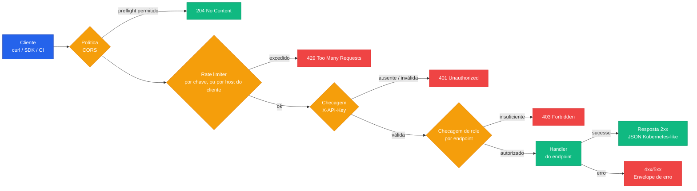

A **API REST** do ChatCLI AIOps Platform é servida pelo operator e dá acesso programático aos recursos de AIOps (Issues, RemediationPlans, AIInsights, Runbooks, ApprovalRequests, SLOs, PostMortems, AuditEvents, ClusterRegistrations e policies). As respostas seguem padrões **Kubernetes-like** (apiVersion + kind + metadata/resourceMeta + spec + status), com autenticação via API key, três roles e rate limit por cliente.

<CardGroup cols={3}>
  <Card title="Incidents" icon="siren-on" href="/pt/reference/api/list-incidents">
    Detecção, ack, snooze, timeline, remediação e resolução
  </Card>
  <Card title="Runbooks" icon="book-open" href="/pt/reference/api/list-runbooks">
    CRUD completo de runbooks
  </Card>
  <Card title="Analytics" icon="chart-line" href="/pt/reference/api/analytics-summary">
    MTTD, MTTR, trends, top resources, capacity, compliance, custo
  </Card>
  <Card title="SLOs" icon="gauge" href="/pt/reference/api/list-slos">
    Targets, error budget e burn rate
  </Card>
  <Card title="Federation" icon="network-wired" href="/pt/reference/api/federation-status">
    Status multi-cluster, correlações entre clusters
  </Card>
  <Card title="Health" icon="heart-pulse" href="/pt/reference/api/health-endpoints">
    Endpoints de liveness e readiness
  </Card>
</CardGroup>

---

## Base URL

```
http://<operator-host>:8090/api/v1
```

A API (e o dashboard web em `/`) escuta no pod do **operator**, porta **8090**, exposta como porta `api` do Service **`chatcli-operator`** no namespace do operator (`chatcli-system` por padrão). Ela **não** é servida pelo Service de uma `Instance` (esse é o servidor gRPC na 50051).

```bash
kubectl -n chatcli-system port-forward svc/chatcli-operator 8090:8090
curl -H "X-API-Key: $KEY" http://localhost:8090/api/v1/incidents
```

<Info>
A porta vem do value `api.port` do chart (padrão `8090`), que define a variável de ambiente `CHATCLI_AIOPS_PORT` do operator. Para servir **HTTPS** (TLS 1.3 no mínimo), defina `CHATCLI_AIOPS_TLS_CERT` e `CHATCLI_AIOPS_TLS_KEY` com arquivos de certificado e chave dentro do container do operator (chart: `security.apiTLS.certFile` / `security.apiTLS.keyFile`). O chart do operator não tem value `extraVolumes`, então os arquivos precisam chegar por outro meio (por exemplo, um patch no Deployment); a alternativa é terminar o TLS em um Ingress ou gateway na frente do Service. Sem as duas variáveis, a API é HTTP puro.
</Info>

<Note>
**Várias réplicas do operator.** Toda réplica serve a API REST e o dashboard na 8090, então um Service com várias réplicas pode mandar a requisição para qualquer pod. Leituras são respondidas por qualquer réplica; um resolve manual aceito por uma réplica que não é a líder é concluído pelo reconciler de Issue da líder.
</Note>

---

## Fluxo de requisição



---

## Autenticação

Toda requisição em `/api/` precisa do header `X-API-Key` com uma chave válida:

<CodeGroup>
```bash curl
curl -H "X-API-Key: $CHATCLI_API_KEY" \
  http://localhost:8090/api/v1/incidents
```

```python Python
import os
import requests

resp = requests.get(
    "http://localhost:8090/api/v1/incidents",
    headers={"X-API-Key": os.environ["CHATCLI_API_KEY"]},
)
incidents = resp.json()["items"]
```

```go Go
req, _ := http.NewRequest("GET", "http://localhost:8090/api/v1/incidents", nil)
req.Header.Set("X-API-Key", os.Getenv("CHATCLI_API_KEY"))
resp, _ := http.DefaultClient.Do(req)
defer resp.Body.Close()
```

```javascript Node.js
const resp = await fetch("http://localhost:8090/api/v1/incidents", {
  headers: { "X-API-Key": process.env.CHATCLI_API_KEY },
});
const { items } = await resp.json();
```
</CodeGroup>

### Roles

As roles seguem a ordem **`viewer` < `operator` < `admin`**; cada endpoint exige uma role mínima (veja a [tabela de endpoints](#endpoints)). Essas três strings são as únicas roles válidas: uma chave com qualquer outra role (por exemplo `superadmin` ou `readonly`) é aceita como chave, mas recebe **403** em todos os endpoints.

<CardGroup cols={3}>
  <Card title="viewer" icon="eye">
    **Somente leitura.** Todos os endpoints GET. Ideal para dashboards e ferramentas de observabilidade.
  </Card>
  <Card title="operator" icon="user-shield">
    **Operação diária.** Tudo o que `viewer` faz, mais as ações POST (acknowledge, snooze, resolve, approve, reject, review/close/feedback de postmortem) e criar/atualizar runbooks.
  </Card>
  <Card title="admin" icon="user-gear">
    **Acesso total.** Tudo o que `operator` faz, mais `DELETE /runbooks/{name}`.
  </Card>
</CardGroup>

### Configurando as API keys

As chaves são lidas do **namespace do operator** (`chatcli-system` por padrão), nesta ordem:

1. Secret **`chatcli-operator-secrets`**, chave **`api-keys`** (recomendado)
2. ConfigMap **`chatcli-operator-config`**, chave **`api-keys`** (fallback, usado só quando o Secret não existe)

O valor é uma lista YAML de entradas `{key, role, name, description}`. O `name` é opcional: é a identidade registrada nas decisões de aprovação tomadas com a chave (na falta dele vale o `description`, e depois uma impressão digital `key-<hash>`), e um quorum conta cada chave uma vez, então dê a cada aprovador a sua própria chave. O chart do operator só gera o Secret com `apiKeys.create: true` (as chaves ficam então guardadas no release do Helm); fora isso, é você quem cria:

```yaml
apiVersion: v1
kind: Secret
metadata:
  name: chatcli-operator-secrets
  namespace: chatcli-system
type: Opaque
stringData:
  api-keys: |
    - key: "<chave-admin-aleatoria>"
      role: admin
      description: "Pipeline de CI/CD"
    - key: "<chave-operator-aleatoria>"
      role: operator
      description: "Time de plantão"
    - key: "<chave-viewer-aleatoria>"
      role: viewer
      description: "Dashboard do Grafana"
```

```bash
# Gerar uma chave
openssl rand -hex 32
```

O operator consulta o Secret e o ConfigMap a cada **30 segundos** e recarrega as chaves sem reiniciar: incluir ou remover uma entrada vale em cerca de 30 s.

<Warning>
**Nenhuma chave configurada = toda chamada em `/api/` retorna `401`.** Se nenhum dos dois objetos tiver uma chave válida, a API fica fechada (fail-closed). Já `CHATCLI_OPERATOR_DEV_MODE=true` no operator (chart: `security.devMode: true`) deixa toda requisição passar **como `admin`, sem chave** — só para desenvolvimento local, **nunca em produção**. Qualquer valor booleano verdadeiro conta (`true`, `TRUE`, `1`, `t`, sem diferenciar maiúsculas), igualmente para a checagem de auth, o rate limiter e o log de startup.

As chaves seguem a origem delas: uma lista vazia não deixa nenhuma chave válida, um Secret sem a entrada `api-keys` cai para o ConfigMap, e apagar o Secret e também o ConfigMap revoga todas as chaves carregadas na próxima consulta (em cerca de 30 s, `401` a partir daí). Uma entrada `api-keys` que não é YAML válido mantém em vigor o último conjunto de chaves válido e é registrada no log uma vez por versão. Um erro de leitura que não seja "não encontrado" também mantém as chaves em vigor, para que nem um erro de digitação nem uma instabilidade do API server tranque todo mundo do lado de fora. A inicialização aplica as mesmas regras da consulta.
</Warning>

<Tip>
**Teste sem cluster.** No diretório `operator/` do repositório, `make dash-preview` serve o dashboard e esta API sobre dados sintéticos em `http://127.0.0.1:8085/`, com a API key `preview` (role admin). Troque o endereço com `DASHPREVIEW_ADDR`.
</Tip>

---

## Rate limiting

A API aceita **30 requisições por minuto por host de cliente** para requisições sem API key válida (token bucket, rajadas de até 30, reposto continuamente a 0,5 req/s), e **600 requisições por minuto por API key válida** (rajadas de até 600, repostas a 10 req/s), com a chave identificada por um digest. O limite roda antes da autenticação; o limite por chave é o mesmo para todas as roles. Headers de forwarding não são honrados, então atrás de um proxy todo chamador sem chave divide o bucket do host do proxy. Buckets ociosos são descartados depois de 10 minutos.

Ao estourar, o operator retorna `429 Too Many Requests` com o envelope de erro padrão (`rate limit exceeded: N requests per minute`) e um header `Retry-After` com os segundos até o bucket voltar a ter um token (2 no limite por host, 1 no limite por chave). Nenhum header `X-RateLimit-*` é enviado. Implemente backoff nos clientes de produção e mantenha dashboards ou coletores que consultam muitos endpoints dentro do orçamento.

---

## CORS

Requisições cross-origin de navegador são **negadas por padrão**: nenhum header CORS é enviado até uma origem ser configurada. Configure com variáveis de ambiente no operator (ou os values equivalentes do chart em `security.*`):

| Variável | Value do chart | Significado |
|:---------|:---------------|:------------|
| `CHATCLI_CORS_ALLOWED_ORIGINS` | `security.corsAllowedOrigins` (lista) | Origens permitidas separadas por vírgula, ou `*` |
| `CHATCLI_CORS_ORIGIN` | `security.corsOrigin` | Uma única origem permitida (somada à lista) |
| `CHATCLI_CORS_ALLOWED_METHODS` | `security.corsAllowedMethods` | Métodos permitidos (padrão `GET, POST, PUT, DELETE, OPTIONS`) |
| `CHATCLI_CORS_ALLOW_CREDENTIALS` | `security.corsAllowCredentials` | `true` para permitir credenciais |

Os headers de requisição permitidos são `Content-Type`, `X-API-Key` e `Authorization`; a resposta de preflight fica em cache por 1 hora. O dashboard servido pelo próprio operator é same-origin e não precisa de configuração de CORS.

---

## Formato de resposta

Todas as respostas seguem um padrão **Kubernetes-like**:

<Tabs>
  <Tab title="Lista">
    ```json
    {
      "apiVersion": "v1",
      "kind": "IncidentList",
      "metadata": {
        "totalCount": 42,
        "page": 1,
        "pageSize": 20
      },
      "items": [
        { "...": "..." }
      ]
    }
    ```
  </Tab>
  <Tab title="Recurso único">
    ```json
    {
      "apiVersion": "v1",
      "kind": "Incident",
      "spec":   { "...": "..." },
      "status": { "...": "..." },
      "resourceMeta": {
        "name": "api-server-oomkilled-8f2c1",
        "namespace": "production",
        "uid": "5b2d7c1e-3f4a-4e8b-9c6d-1a2b3c4d5e6f",
        "creationTimestamp": "2026-03-19T15:20:00Z",
        "labels": {},
        "annotations": {}
      }
    }
    ```
    Quais de `spec`, `status` e `resourceMeta` aparecem depende do endpoint; cada página de endpoint mostra o formato exato. Campos vazios são omitidos.
  </Tab>
  <Tab title="Erro">
    ```json
    {
      "apiVersion": "v1",
      "kind": "Error",
      "error": "Unauthorized",
      "code": 401,
      "message": "missing API key in X-API-Key header"
    }
    ```
    `error` é o texto do status HTTP, `code` o status HTTP e `message` o detalhe.
  </Tab>
</Tabs>

---

## Códigos de erro

| Código | Significado | Quando acontece |
|:-------|:------------|:----------------|
| `400` | Bad Request | Corpo JSON malformado ou campo do corpo inválido/ausente |
| `401` | Unauthorized | `X-API-Key` ausente ou inválida, ou nenhuma chave configurada |
| `403` | Forbidden | Role abaixo da mínima do endpoint, role desconhecida, ou o RBAC do operator não permite criar o runbook |
| `404` | Not Found | Recurso não existe, ou combinação de path/método desconhecida |
| `405` | Method Not Allowed | Requisição não-GET em um grupo somente leitura (`analytics`, `clusters`, `policies`, `audit`, `federation`) |
| `409` | Conflict | Estado inválido para a operação (por exemplo, resolver um incident já resolvido, ou decidir sobre uma solicitação de aprovação que não está mais `Pending` ou que a mesma API key já decidiu), modificação concorrente ou criação de um runbook cujo nome já existe |
| `422` | Unprocessable Entity | O API server do Kubernetes rejeitou um runbook sendo criado (por exemplo, um valor fora dos enums do CRD) |
| `429` | Too Many Requests | Rate limit excedido — veja `Retry-After` |
| `500` | Internal Server Error | Falha na API do Kubernetes — verifique os logs do operator |

---

## Paginação

Os endpoints de lista suportam paginação via query parameters:

<ParamField query="page" type="integer" default="1">
  Número da página (começa em 1)
</ParamField>

<ParamField query="pageSize" type="integer" default="20">
  Itens por página (valores acima de **100** são limitados a 100)
</ParamField>

```bash
curl -H "X-API-Key: $KEY" \
  "http://localhost:8090/api/v1/incidents?page=2&pageSize=50"
```

A resposta inclui `metadata.totalCount` para você calcular o total de páginas. Valores inválidos voltam aos padrões.

A maioria das listas aceita `namespace` (omitido = todos os namespaces). Incidents, postmortems, eventos de auditoria e os endpoints de analytics também aceitam os filtros de tempo `from` / `to` (RFC 3339, por exemplo `2026-03-19T00:00:00Z`), aplicados ao horário de criação do recurso (o horário do evento, na auditoria). Datas que não fazem parse são ignoradas.

---

## Endpoints

Todos os paths são relativos a `/api/v1`.

| Método | Path | Role mínima |
|:-------|:-----|:------------|
| GET | `/incidents`, `/incidents/{name}` | viewer |
| GET | `/incidents/{name}/timeline`, `/incidents/{name}/remediation` | viewer |
| POST | `/incidents/{name}/acknowledge`, `/snooze`, `/resolve` | operator |
| GET | `/aiinsights`, `/aiinsights/{name}` | viewer |
| GET | `/remediations`, `/remediations/{name}` | viewer |
| GET | `/runbooks`, `/runbooks/{name}` | viewer |
| POST | `/runbooks` | operator |
| PUT | `/runbooks/{name}` | operator |
| DELETE | `/runbooks/{name}` | admin |
| GET | `/approvals`, `/approvals/{name}` | viewer |
| POST | `/approvals/{name}/approve`, `/approvals/{name}/reject` | operator |
| GET | `/slos`, `/slos/{name}`, `/slos/{name}/budget` | viewer |
| GET | `/postmortems`, `/postmortems/{name}` | viewer |
| POST | `/postmortems/{name}/review`, `/close`, `/feedback`, `/ack-human-action` | operator |
| GET | `/analytics/summary`, `mttd`, `mttr`, `trends`, `top-resources`, `remediation-stats`, `compliance`, `capacity`, `cost` | viewer |
| GET | `/clusters`, `/clusters/global-status`, `/clusters/{name}` | viewer |
| GET | `/policies/{approval\|notification\|escalation\|sla}`, `/policies/{kind}/{name}` | viewer |
| GET | `/federation`, `/federation/status`, `/federation/clusters`, `/federation/correlations` | viewer |
| GET | `/audit`, `/audit/export` | viewer |

`/healthz` e `/readyz` (fora de `/api/v1`) não exigem chave — veja [Health endpoints](/pt/reference/api/health-endpoints).

---

## Versionamento

A API usa versionamento por path (`/api/v1/`). Hoje só existe a `v1`.

---

## Próximos passos

<CardGroup cols={2}>
  <Card title="Visão geral do AIOps Platform" icon="brain" href="/pt/kubernetes/aiops-platform">
    Como a plataforma detecta, analisa e remedia incidentes
  </Card>
  <Card title="Kubernetes Operator" icon="dharmachakra" href="/pt/kubernetes/k8s-operator">
    Deploy do operator, CRDs e configuração
  </Card>
  <Card title="Ciclo de vida do incidente" icon="siren-on" href="/pt/kubernetes/aiops/incident-lifecycle">
    Fluxo completo: detecção → análise → remediação → resolução
  </Card>
  <Card title="AIOps em produção" icon="rocket" href="/pt/cookbook/aiops-production-setup">
    Cookbook: setup completo com TLS, RBAC, notificações e SLOs
  </Card>
</CardGroup>
