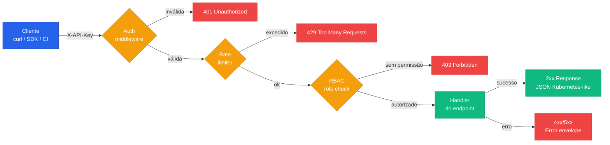

A **API REST** do ChatCLI AIOps Platform fornece acesso programático completo a todas as funcionalidades da plataforma. Construída sobre padrões **Kubernetes-like** (apiVersion + kind + metadata + spec + status), com autenticação via API key e rate limiting por role.

<CardGroup cols={3}>
  <Card title="Incidents" icon="siren-on" href="/reference/api/list-incidents">
    Detecção, ack, snooze, timeline, remediação e resolução
  </Card>
  <Card title="Runbooks" icon="book-open" href="/reference/api/list-runbooks">
    CRUD completo de planos de remediação
  </Card>
  <Card title="Analytics" icon="chart-line" href="/reference/api/analytics-summary">
    MTTD, MTTR, trends, top resources, capacity, compliance
  </Card>
  <Card title="SLOs" icon="gauge" href="/reference/api/list-slos">
    Targets, error budget, burn rate e histórico
  </Card>
  <Card title="Federation" icon="network-wired" href="/reference/api/federation-status">
    Status multi-cluster, correlações cross-tier
  </Card>
  <Card title="Health" icon="heart-pulse" href="/reference/api/health-endpoints">
    Liveness e readiness probes
  </Card>
</CardGroup>

---

## Base URL

```
http://<operator-host>:8090/api/v1
```

<Info>
A porta padrão é **8090** mas pode ser alterada via Helm (`--set apiPort=...`) ou env var `CHATCLI_API_PORT`. Em produção, exponha atrás de um Ingress com TLS.
</Info>

---

## Fluxo de uma requisição



---

## Autenticação

Todas as requisições devem incluir o header `X-API-Key` com uma chave válida:

<CodeGroup>
```bash curl
curl -H "X-API-Key: ck_live_abc123" \
  http://operator:8090/api/v1/incidents
```

```python Python
import requests

resp = requests.get(
    "http://operator:8090/api/v1/incidents",
    headers={"X-API-Key": "ck_live_abc123"},
)
incidents = resp.json()["items"]
```

```go Go
req, _ := http.NewRequest("GET", "http://operator:8090/api/v1/incidents", nil)
req.Header.Set("X-API-Key", "ck_live_abc123")
resp, _ := http.DefaultClient.Do(req)
defer resp.Body.Close()
```

```javascript Node.js
const resp = await fetch("http://operator:8090/api/v1/incidents", {
  headers: { "X-API-Key": "ck_live_abc123" },
});
const { items } = await resp.json();
```
</CodeGroup>

### Roles

<CardGroup cols={3}>
  <Card title="viewer" icon="eye">
    **Somente leitura.** GET em todos os endpoints. Ideal para dashboards e ferramentas de observabilidade.
  </Card>
  <Card title="operator" icon="user-shield">
    **Operação diária.** GET + POST de ações (acknowledge, approve, reject). NOC, SRE e on-call.
  </Card>
  <Card title="admin" icon="user-gear">
    **Acesso total.** GET, POST, PUT, DELETE. CI/CD, automações privilegiadas e ferramentas de gestão.
  </Card>
</CardGroup>

As chaves de API são configuradas no ConfigMap do operator:

```yaml
apiVersion: v1
kind: ConfigMap
metadata:
  name: chatcli-operator-config
  namespace: chatcli-system
data:
  api-keys: |
    - key: "ck_live_abc123..."
      role: admin
      description: "CI/CD Pipeline"
    - key: "ck_live_def456..."
      role: operator
      description: "NOC Team"
    - key: "ck_live_ghi789..."
      role: viewer
      description: "Grafana dashboard"
```

<Tip>
Em ambiente de desenvolvimento, se o ConfigMap `chatcli-api-keys` não existir, o operator roda em **dev mode sem auth** — útil para testes locais, **nunca em produção**.
</Tip>

---

## Rate limiting

| Role | Limite | Janela |
|:-----|:-------|:-------|
| `viewer` | 100 req | por minuto |
| `operator` | 500 req | por minuto |
| `admin` | 1000 req | por minuto |

Headers de rate limit retornados em cada resposta:

```http
X-RateLimit-Limit: 500
X-RateLimit-Remaining: 487
X-RateLimit-Reset: 1710864000
```

<Warning>
Quando o limite é excedido, o operator retorna `429 Too Many Requests` com header `Retry-After` (em segundos). Implemente backoff exponencial em clients de produção.
</Warning>

---

## Formato de resposta

Todas as respostas seguem o padrão **Kubernetes-like**:

<Tabs>
  <Tab title="Lista">
    ```json
    {
      "apiVersion": "v1",
      "kind": "IncidentList",
      "metadata": {
        "totalCount": 42,
        "page": 1,
        "pageSize": 20
      },
      "items": [
        { "..." : "..." }
      ]
    }
    ```
  </Tab>
  <Tab title="Recurso individual">
    ```json
    {
      "apiVersion": "v1",
      "kind": "Incident",
      "metadata": {
        "name": "INC-20260319-001",
        "namespace": "production",
        "createdAt": "2026-03-19T15:20:00Z"
      },
      "spec":   { "...": "..." },
      "status": { "...": "..." }
    }
    ```
  </Tab>
  <Tab title="Erro">
    ```json
    {
      "apiVersion": "v1",
      "kind": "Error",
      "error": {
        "code": 401,
        "message": "API key inválida ou ausente",
        "details": "Inclua o header X-API-Key com uma chave válida"
      }
    }
    ```
  </Tab>
</Tabs>

---

## Códigos de erro

| Código | Significado | Quando acontece |
|:-------|:------------|:----------------|
| `400` | Bad Request | Parâmetros ausentes ou mal formatados |
| `401` | Unauthorized | `X-API-Key` ausente ou inválida |
| `403` | Forbidden | Role insuficiente para a operação |
| `404` | Not Found | Recurso não existe |
| `409` | Conflict | Recurso já existe ou estado inválido para a operação |
| `429` | Too Many Requests | Rate limit excedido — veja `Retry-After` |
| `500` | Internal Server Error | Falha no operator — investigue logs |

---

## Paginação

Endpoints que retornam listas suportam paginação via query parameters:

<ParamField query="page" type="integer" default="1">
  Número da página (começa em 1)
</ParamField>

<ParamField query="pageSize" type="integer" default="20">
  Itens por página (máximo: **100**)
</ParamField>

```bash
curl -H "X-API-Key: $KEY" \
  "http://operator:8090/api/v1/incidents?page=2&pageSize=50"
```

A resposta inclui `metadata.totalCount` para você calcular o número total de páginas.

---

## Versionamento

A API utiliza versionamento via path (`/api/v1/`). Versões futuras serão adicionadas como `/api/v2/` mantendo **compatibilidade retroativa** com v1.

<Info>
Mudanças breaking-change só ocorrem entre versões maiores. Dentro de uma versão, apenas adições compatíveis (novos campos opcionais, novos endpoints) são publicadas.
</Info>

---

## Próximos passos

<CardGroup cols={2}>
  <Card title="AIOps Platform — visão geral" icon="brain" href="/features/aiops-platform">
    Como a plataforma detecta, analisa e remedia incidentes
  </Card>
  <Card title="Operator Kubernetes" icon="dharmachakra" href="/features/k8s-operator">
    Deploy do operator, CRDs e configuração
  </Card>
  <Card title="Incident lifecycle" icon="siren-on" href="/features/aiops/incident-lifecycle">
    Fluxo completo: detecção → análise → remediação → resolução
  </Card>
  <Card title="AIOps em produção" icon="rocket" href="/cookbook/aiops-production-setup">
    Cookbook: setup completo com TLS, RBAC, notificações e SLOs
  </Card>
</CardGroup>
