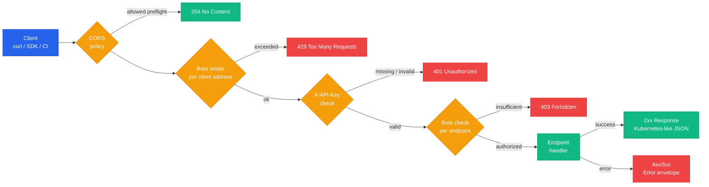

The ChatCLI AIOps Platform **REST API** is served by the operator and gives programmatic access to the AIOps resources (Issues, RemediationPlans, AIInsights, Runbooks, ApprovalRequests, SLOs, PostMortems, AuditEvents, ClusterRegistrations and policies). Responses follow **Kubernetes-like** patterns (apiVersion + kind + metadata/resourceMeta + spec + status), with API key authentication, three roles and a per-client rate limit.

<CardGroup cols={3}>
  <Card title="Incidents" icon="siren-on" href="/reference/api/list-incidents">
    Detection, ack, snooze, timeline, remediation, and resolution
  </Card>
  <Card title="Runbooks" icon="book-open" href="/reference/api/list-runbooks">
    Full CRUD for runbooks
  </Card>
  <Card title="Analytics" icon="chart-line" href="/reference/api/analytics-summary">
    MTTD, MTTR, trends, top resources, capacity, compliance, cost
  </Card>
  <Card title="SLOs" icon="gauge" href="/reference/api/list-slos">
    Targets, error budget, and burn rate
  </Card>
  <Card title="Federation" icon="network-wired" href="/reference/api/federation-status">
    Multi-cluster status, cross-cluster correlations
  </Card>
  <Card title="Health" icon="heart-pulse" href="/reference/api/health-endpoints">
    Liveness and readiness endpoints
  </Card>
</CardGroup>

---

## Base URL

```
http://<operator-host>:8090/api/v1
```

The API (and the web dashboard at `/`) listens on the **operator** pod, port **8090**, exposed as port `api` of the Service **`chatcli-operator`** in the operator namespace (`chatcli-system` by default). It is **not** served by the Service of an `Instance` (that one is the gRPC server on 50051).

```bash
kubectl -n chatcli-system port-forward svc/chatcli-operator 8090:8090
curl -H "X-API-Key: $KEY" http://localhost:8090/api/v1/incidents
```

<Info>
The port comes from the chart value `api.port` (default `8090`), which sets the `CHATCLI_AIOPS_PORT` environment variable of the operator. To serve **HTTPS** (TLS 1.3 minimum), set `CHATCLI_AIOPS_TLS_CERT` and `CHATCLI_AIOPS_TLS_KEY` to certificate and key files inside the operator container (chart: `security.apiTLS.certFile` / `security.apiTLS.keyFile`). The operator chart has no `extraVolumes` value, so the files must be provided by another means (for example a patched Deployment); alternatively terminate TLS at an Ingress or gateway in front of the Service. Without both variables the API is plain HTTP.
</Info>

<Note>
**Multiple operator replicas.** In 1.211.2 and earlier the REST API and dashboard run only on the **leader** replica: the other replicas pass their readiness probe (which is on port 8081) but do not listen on 8090, so a Service with several replicas can route requests to a pod that refuses the connection. Keep `replicaCount: 1` or port-forward to the leader. Starting with the release after 1.211.2, every replica serves the API and the dashboard.
</Note>

---

## Request flow


```mermaid
flowchart LR
  Client[Client<br/>curl / SDK / CI] --> CORS{CORS<br/>policy}
  CORS -->|allowed preflight| P204[204 No Content]
  CORS --> Rate{Rate limiter<br/>per client address}
  Rate -->|exceeded| E429[429 Too Many Requests]
  Rate -->|ok| Auth{X-API-Key<br/>check}
  Auth -->|missing / invalid| E401[401 Unauthorized]
  Auth -->|valid| RBAC{Role check<br/>per endpoint}
  RBAC -->|insufficient| E403[403 Forbidden]
  RBAC -->|authorized| Handler[Endpoint<br/>handler]
  Handler -->|success| Resp[2xx Response<br/>Kubernetes-like JSON]
  Handler -->|error| Err[4xx/5xx<br/>Error envelope]

  classDef ok fill:#10B981,stroke:#059669,color:#fff
  classDef err fill:#EF4444,stroke:#DC2626,color:#fff
  classDef gate fill:#F59E0B,stroke:#D97706,color:#fff
  classDef client fill:#2563EB,stroke:#1E40AF,color:#fff

  class Client client
  class CORS,Auth,Rate,RBAC gate
  class Resp,Handler,P204 ok
  class E401,E429,E403,Err err
```

---

## Authentication

All `/api/` requests must include the `X-API-Key` header with a valid key:

<CodeGroup>
```bash curl
curl -H "X-API-Key: $CHATCLI_API_KEY" \
  http://localhost:8090/api/v1/incidents
```

```python Python
import os
import requests

resp = requests.get(
    "http://localhost:8090/api/v1/incidents",
    headers={"X-API-Key": os.environ["CHATCLI_API_KEY"]},
)
incidents = resp.json()["items"]
```

```go Go
req, _ := http.NewRequest("GET", "http://localhost:8090/api/v1/incidents", nil)
req.Header.Set("X-API-Key", os.Getenv("CHATCLI_API_KEY"))
resp, _ := http.DefaultClient.Do(req)
defer resp.Body.Close()
```

```javascript Node.js
const resp = await fetch("http://localhost:8090/api/v1/incidents", {
  headers: { "X-API-Key": process.env.CHATCLI_API_KEY },
});
const { items } = await resp.json();
```
</CodeGroup>

### Roles

Roles are ordered **`viewer` < `operator` < `admin`**; each endpoint requires a minimum role (see the [endpoint table](#endpoints)). These three strings are the only valid roles: a key with any other role (for example `superadmin` or `readonly`) is accepted as a key but gets **403** on every endpoint.

<CardGroup cols={3}>
  <Card title="viewer" icon="eye">
    **Read-only.** Every GET endpoint. Ideal for dashboards and observability tools.
  </Card>
  <Card title="operator" icon="user-shield">
    **Daily ops.** Everything `viewer` can do, plus the POST actions (acknowledge, snooze, resolve, approve, reject, postmortem review/close/feedback) and runbook create/update.
  </Card>
  <Card title="admin" icon="user-gear">
    **Full access.** Everything `operator` can do, plus `DELETE /runbooks/{name}`.
  </Card>
</CardGroup>

### Configuring API keys

Keys are read from the **operator namespace** (`chatcli-system` by default), in this order:

1. Secret **`chatcli-operator-secrets`**, key **`api-keys`** (recommended)
2. ConfigMap **`chatcli-operator-config`**, key **`api-keys`** (fallback, used only when the Secret does not exist)

The value is a YAML list of `{key, role, description}` entries. **No chart or manifest creates this object** — you create it:

```yaml
apiVersion: v1
kind: Secret
metadata:
  name: chatcli-operator-secrets
  namespace: chatcli-system
type: Opaque
stringData:
  api-keys: |
    - key: "<random-admin-key>"
      role: admin
      description: "CI/CD pipeline"
    - key: "<random-operator-key>"
      role: operator
      description: "On-call team"
    - key: "<random-viewer-key>"
      role: viewer
      description: "Grafana dashboard"
```

```bash
# Generate a key
openssl rand -hex 32
```

The operator polls the Secret and ConfigMap every **30 seconds** and hot-reloads the keys without a restart: adding or removing an entry takes effect within about 30 s.

<Warning>
**No keys configured = every `/api/` call returns `401`.** If neither object holds a valid key, the API is closed (fail-closed). Setting `CHATCLI_OPERATOR_DEV_MODE=true` on the operator (chart: `security.devMode: true`) instead lets every request through **as `admin` without a key** — for local development only, **never in production**.

Deleting both the Secret and the ConfigMap does not clear keys that are already loaded (outside dev mode they stay valid until the operator restarts). To revoke keys, edit the list in place.
</Warning>

<Tip>
**Try it without a cluster.** From the `operator/` directory of the repository, `make dash-preview` serves the dashboard and this API over synthetic data at `http://127.0.0.1:8085/` with the API key `preview` (admin role). Override the address with `DASHPREVIEW_ADDR`.
</Tip>

---

## Rate limiting

The API allows **30 requests per minute per client address** (token bucket, bursts of up to 30, refilled continuously at 0.5 req/s). The limit is the same for every role and every key.

When it is exceeded the operator returns `429 Too Many Requests` with the header `Retry-After: 60` and the standard error envelope. No `X-RateLimit-*` headers are sent. Implement backoff in production clients, and keep dashboards or scrapers that poll many endpoints within the budget.

---

## CORS

Cross-origin browser requests are **denied by default**: no CORS headers are sent until an origin is configured. Configure it with environment variables on the operator (or the matching chart values under `security.*`):

| Variable | Chart value | Meaning |
|:---------|:------------|:--------|
| `CHATCLI_CORS_ALLOWED_ORIGINS` | `security.corsAllowedOrigins` (list) | Comma-separated allowed origins, or `*` |
| `CHATCLI_CORS_ORIGIN` | `security.corsOrigin` | A single allowed origin (added to the list) |
| `CHATCLI_CORS_ALLOWED_METHODS` | `security.corsAllowedMethods` | Allowed methods (default `GET, POST, PUT, DELETE, OPTIONS`) |
| `CHATCLI_CORS_ALLOW_CREDENTIALS` | `security.corsAllowCredentials` | `true` to allow credentials |

Allowed request headers are `Content-Type`, `X-API-Key` and `Authorization`; preflight responses are cached for 1 hour. The dashboard served by the operator itself is same-origin and needs no CORS configuration.

---

## Response format

All responses follow a **Kubernetes-like** pattern:

<Tabs>
  <Tab title="List">
    ```json
    {
      "apiVersion": "v1",
      "kind": "IncidentList",
      "metadata": {
        "totalCount": 42,
        "page": 1,
        "pageSize": 20
      },
      "items": [
        { "...": "..." }
      ]
    }
    ```
  </Tab>
  <Tab title="Single resource">
    ```json
    {
      "apiVersion": "v1",
      "kind": "Incident",
      "spec":   { "...": "..." },
      "status": { "...": "..." },
      "resourceMeta": {
        "name": "api-server-oomkilled-8f2c1",
        "namespace": "production",
        "uid": "5b2d7c1e-3f4a-4e8b-9c6d-1a2b3c4d5e6f",
        "creationTimestamp": "2026-03-19T15:20:00Z",
        "labels": {},
        "annotations": {}
      }
    }
    ```
    Which of `spec`, `status` and `resourceMeta` are present depends on the endpoint; each endpoint page shows its exact shape. Empty fields are omitted.
  </Tab>
  <Tab title="Error">
    ```json
    {
      "apiVersion": "v1",
      "kind": "Error",
      "error": "Unauthorized",
      "code": 401,
      "message": "missing API key in X-API-Key header"
    }
    ```
    `error` is the HTTP status text, `code` the HTTP status, `message` the detail.
  </Tab>
</Tabs>

---

## Error codes

| Code | Meaning | When it happens |
|:-----|:--------|:----------------|
| `400` | Bad Request | Malformed JSON body or invalid/missing body field |
| `401` | Unauthorized | `X-API-Key` missing or invalid, or no keys configured |
| `403` | Forbidden | Role below the endpoint's minimum, or an unknown role |
| `404` | Not Found | Resource does not exist, or unknown path/method combination |
| `405` | Method Not Allowed | Non-GET request to a read-only group (`analytics`, `clusters`, `policies`, `audit`, `federation`) |
| `409` | Conflict | Invalid state for the operation (for example resolving an already resolved incident), a concurrent modification, or runbook creation failure |
| `429` | Too Many Requests | Rate limit exceeded — see `Retry-After` |
| `500` | Internal Server Error | Kubernetes API failure — inspect the operator logs |

---

## Pagination

List endpoints support pagination via query parameters:

<ParamField query="page" type="integer" default="1">
  Page number (starts at 1)
</ParamField>

<ParamField query="pageSize" type="integer" default="20">
  Items per page (values above **100** are capped at 100)
</ParamField>

```bash
curl -H "X-API-Key: $KEY" \
  "http://localhost:8090/api/v1/incidents?page=2&pageSize=50"
```

The response includes `metadata.totalCount` so you can compute the total number of pages. Invalid values fall back to the defaults.

Most lists accept `namespace` (omitted = all namespaces). Incidents, postmortems, audit events and the analytics endpoints also accept the time filters `from` / `to` (RFC 3339, for example `2026-03-19T00:00:00Z`), applied to the resource's creation time (the event time for audit). Unparseable times are ignored.

---

## Endpoints

All paths are relative to `/api/v1`.

| Method | Path | Min role |
|:-------|:-----|:---------|
| GET | `/incidents`, `/incidents/{name}` | viewer |
| GET | `/incidents/{name}/timeline`, `/incidents/{name}/remediation` | viewer |
| POST | `/incidents/{name}/acknowledge`, `/snooze`, `/resolve` | operator |
| GET | `/aiinsights`, `/aiinsights/{name}` | viewer |
| GET | `/remediations`, `/remediations/{name}` | viewer |
| GET | `/runbooks`, `/runbooks/{name}` | viewer |
| POST | `/runbooks` | operator |
| PUT | `/runbooks/{name}` | operator |
| DELETE | `/runbooks/{name}` | admin |
| GET | `/approvals`, `/approvals/{name}` | viewer |
| POST | `/approvals/{name}/approve`, `/approvals/{name}/reject` | operator |
| GET | `/slos`, `/slos/{name}`, `/slos/{name}/budget` | viewer |
| GET | `/postmortems`, `/postmortems/{name}` | viewer |
| POST | `/postmortems/{name}/review`, `/close`, `/feedback`, `/ack-human-action` | operator |
| GET | `/analytics/summary`, `mttd`, `mttr`, `trends`, `top-resources`, `remediation-stats`, `compliance`, `capacity`, `cost` | viewer |
| GET | `/clusters`, `/clusters/global-status`, `/clusters/{name}` | viewer |
| GET | `/policies/{approval\|notification\|escalation\|sla}`, `/policies/{kind}/{name}` | viewer |
| GET | `/federation`, `/federation/status`, `/federation/clusters`, `/federation/correlations` | viewer |
| GET | `/audit`, `/audit/export` | viewer |

`/healthz` and `/readyz` (outside `/api/v1`) need no key — see [Health endpoints](/reference/api/health-endpoints).

---

## Versioning

The API uses path-based versioning (`/api/v1/`). Only `v1` exists today.

---

## Next steps

<CardGroup cols={2}>
  <Card title="AIOps Platform overview" icon="brain" href="/features/aiops-platform">
    How the platform detects, analyzes, and remediates incidents
  </Card>
  <Card title="Kubernetes Operator" icon="dharmachakra" href="/features/k8s-operator">
    Operator deployment, CRDs, and configuration
  </Card>
  <Card title="Incident lifecycle" icon="siren-on" href="/features/aiops/incident-lifecycle">
    Full flow: detection → analysis → remediation → resolution
  </Card>
  <Card title="AIOps in production" icon="rocket" href="/cookbook/aiops-production-setup">
    Cookbook: full setup with TLS, RBAC, notifications, and SLOs
  </Card>
</CardGroup>
