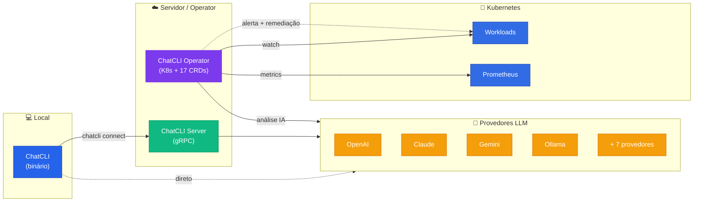

```mermaid
flowchart LR
  subgraph Local["💻 Local"]
    CLI["ChatCLI<br/>(binário)"]
  end
  subgraph Cloud["☁️ Servidor / Operator"]
    SRV["ChatCLI Server<br/>(gRPC)"]
    OP["ChatCLI Operator<br/>(K8s + 17 CRDs)"]
  end
  subgraph Providers["🤖 Provedores LLM"]
    OAI["OpenAI"]
    ANT["Claude"]
    GEM["Gemini"]
    OLL["Ollama"]
    OTH["+ 7 provedores"]
  end
  subgraph K8s["🚢 Kubernetes"]
    APP["Workloads"]
    PROM["Prometheus"]
  end

  CLI -->|chatcli connect| SRV
  CLI -.->|direto| Providers
  SRV --> Providers
  OP -->|watch| APP
  OP -->|metrics| PROM
  OP -->|análise IA| Providers
  OP -.->|alerta + remediação| APP

  classDef cli fill:#2563EB,stroke:#1E40AF,color:#fff
  classDef srv fill:#10B981,stroke:#059669,color:#fff
  classDef op fill:#7C3AED,stroke:#6D28D9,color:#fff
  classDef prov fill:#F59E0B,stroke:#D97706,color:#fff
  classDef k8s fill:#326CE5,stroke:#1E40AF,color:#fff

  class CLI cli
  class SRV srv
  class OP op
  class OAI,ANT,GEM,OLL,OTH prov
  class APP,PROM k8s
```
